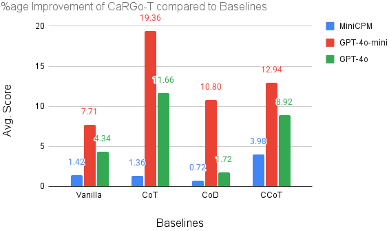
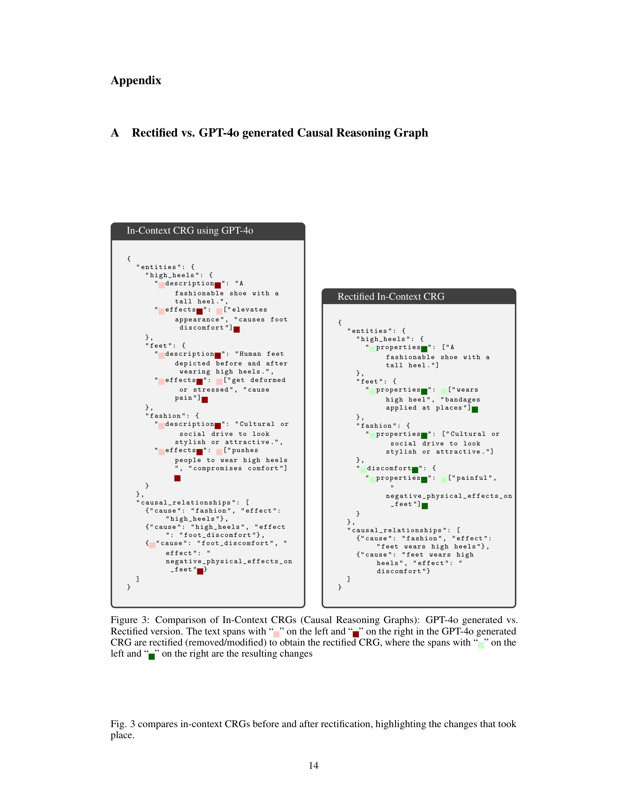
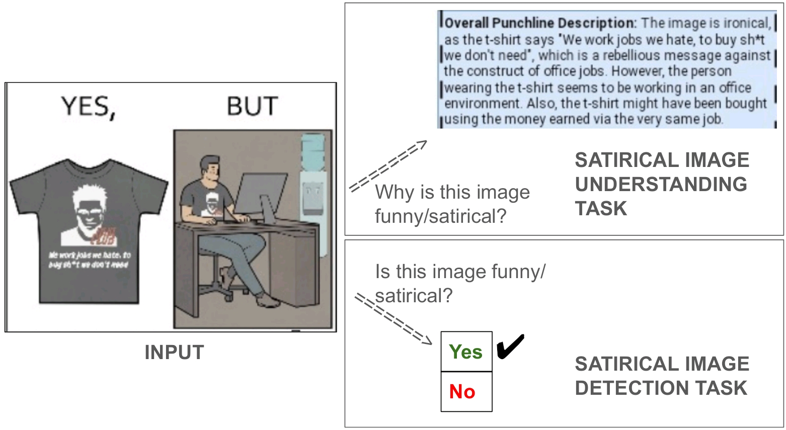
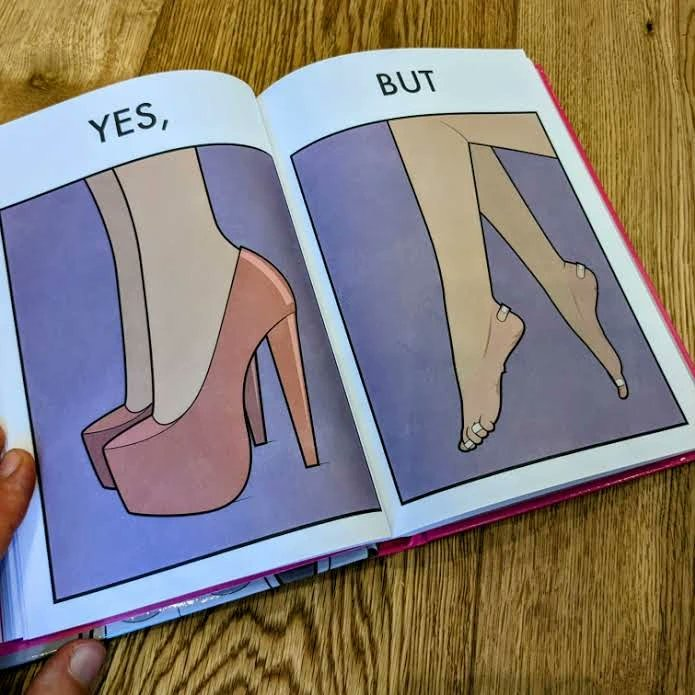

> [paper][git] https://github.com/abhi1nandy2/CaRGo-T.git · https://arxiv.org/abs/2608.23172

# CaRGo-T: Causal Reasoning Graph-of-Thought improves Multimodal Humor Comprehension

## Summary & Outline

본 연구는 비전-언어 모델(Vision-Language Models, VLMs)이 인간의 다중 모달 유머(풍자, 반어/비꼼, 인터넷 밈)를 해석할 때 직면하는 구조적 한계를 극복하기 위해, **인과 추론 사고 그래프(Causal Reasoning Graph-of-Thought, CaRGo-T)** 프레임워크를 제안한다. 시각 및 텍스트 모달리티 전반에 걸친 개체(Entities), 속성(Properties), 사건(Events) 간의 복합적인 인과 관계를 경량 코드(JSON 스키마) 형태의 그래프로 명시화하여 생성한 뒤, 이를 기반으로 최종 유머 설명(Understanding) 또는 유머 유무 판정(Detection)을 수행한다. GPT-4o, GPT-4o-mini, MiniCPM 등 다양한 VLM 백본과 4개 벤치마크(YesBut SIU, MemeCap, YesBut Detection, MMSD 2.0)에 걸친 광범위한 실험을 통해, CaRGo-T는 기존 선형 Chain-of-Thought(CoT), Chain-of-Draft(CoD), Scene-Graph 기반 Compositional CoT(CCoT) 대비 이해 과업에서 약 1~20%, 탐지 과업에서 약 1~3%의 일관된 성능 향상을 입증하였다. 또한 토큰 분포 KL Divergence, 문장 의미 유사도(LSF), LLM-as-a-Judge(INFERSCORE)를 통한 정보이론적 검증을 통해 CaRGo-T가 정답 도출에 필요한 유의미하고 새로운 추론 정보를 훨씬 풍부하게 제공함을 규명하였다.

```
[CaRGo-T 보고서 구조]
├── 1. Problem & Motivation (다중 모달 유머의 비선형성과 기존 프롬프팅/CoT의 붕괴 원인)
├── 2. Contributions (주요 연구 기여 및 차별점)
├── 3. Method: CaRGo-T Framework (인과 그래프 구조, 코드 직렬화, 정제 메커니즘, 파이프라인)
├── 4. Visual Evidence (핵심 아키텍처 다이어그램 및 시각적 예시)
├── 5. Experiments & Results (4대 벤치마크, 0-shot/Few-shot 비교, 정보이론적 분석, 소거 연구)
├── 6. In-Depth Analysis (기술적 강점, 한계점 및 향후 발전 방향)
└── 7. References (관련 코드, 논문 및 데이터셋 링크)
```

---

## Problem & Motivation

### 연구 배경 및 당면 과제
인간의 유머는 단순한 표면적 시각 인식을 넘어, 사회적 상호작용, 문화적 맥락, 인지적 부조화(Incongruity), 기대의 전복(Subversion of Expectation)이 복합적으로 얽힌 고차원 인지 현상이다. 특히 이미지와 텍스트가 결합된 멀티모달 환경(풍자 카툰, 인터넷 밈, 소셜 미디어 비꼼)에서 유머의 핵심 펀치라인은 종종 시각적 단서와 텍스트 사이의 역설적 대비나 원인-결과의 불일치에서 발생한다.

### 풀고자 하는 문제 (Task Formulation)
다중 모달 유머 과업은 크게 두 가지로 정식화된다:
1. **Multimodal Humor Understanding (유머 이해)**: 이미지 `I`와 부가 텍스트 `P`가 주어졌을 때, 해당 콘텐츠가 왜 우스꽝스럽고 풍자적인지를 설명하는 자연어 펀치라인 `Y`를 생성하는 생성 과업 (예: YesBut 풍자 이해, MemeCap 밈 캡션 생성).
2. **Multimodal Humor Detection (유머 탐지)**: 주어진 다중 모달 입력이 유머/풍자/비꼼을 내포하고 있는지 여부를 판별하는 이진 분류 과업 `Y ∈ {"Yes", "No"}` (예: YesBut 풍자 탐지, MMSD 2.0 다중 모달 비꼼 탐지).

```
[다중 모달 유머 추론의 입출력 정식화]
입력: 이미지 I, 과업 텍스트 쿼리 P
VLM 파라미터: θ
출력 생성: F_θ(I, P) = [R, Y_hat]
- R : 중간 추론 성분 (Reasoning Component: CoT 설명 또는 Causal Graph Code)
- Y_hat : 최종 정답 (Final Answer: 펀치라인 텍스트 또는 이진 라벨)
```

### 기존 접근법의 한계
- **Vanilla Zero-Shot / Direct Prompting**: 이미지의 표면적 시각 요소(사물 이름, 색상 등)만을 단순 나열하거나 텍스트를 글자 그대로(Literal) 해석하여, 숨겨진 사회적 맥락이나 역설을 파악하지 못하고 평이한 설명에 그친다.
- **선형 Chain-of-Thought (CoT)**: 정서적이거나 주관적인 유머 맥락에서 CoT는 사전 훈련된 고정 지식(Static Prior)을 장황하게 인출하는 '사후 붕괴(Posterior Collapse)' 현상을 겪는다. 사건들 간의 인과적 매개 관계를 동적으로 추적하지 못하고 무의미한 텍스트 낭비를 유발한다.
- **Chain-of-Draft (CoD)**: 중간 추론 토큰을 극단적으로 축약(스텝당 5단어 이내)함으로써 계산 비용은 줄이나, 유머 생성에 필수적인 다단계 인과 연결 고리가 유실되는 취약점을 노출한다.
- **Scene-Graph 기반 Compositional CoT (CCoT)**: 시각적 사물 간의 공간적/위상적 관계(예: `[고양이, 위에 있음, 소파]`)를 추출하는 데 집중되어 있어, 유머의 본질인 '행동의 사회적 동기', '기대와 결과의 괴리', '추상적 개념(패션, 피로 등)의 개입' 같은 인과적 사건(Causal Events)을 표현할 수 없다.

---

## Contributions

1. **VLM 독립적 인과 추론 그래프 프레임워크 (CaRGo-T) 제안**: 멀티모달 유머의 기저에 존재하는 원인-결과 관계와 개체-속성 결합을 코드(JSON 스키마) 형태의 경량 인과 추론 그래프(CRG)로 정형화하고, 이를 VLM의 추론 단계에 결합하는 새로운 프레임워크를 정립하였다.
2. **비선형 인과 순회 및 합성 추론 실현**: 단순 텍스트 나열을 넘어 개체(Entity) → 속성(Properties) → 사건(Event) → 인과 관계(Cause-Effect Relationship)로 이어지는 체계적 추론 궤적을 강제하여 모달리티 간 상호작용 이해도를 비약적으로 증진시켰다.
3. **4대 벤치마크 및 다양한 VLM 백본 전반의 실증적 우수성 입증**: 풍자(YesBut), 밈(MemeCap), 비꼼(MMSD 2.0)을 망라한 4개 데이터셋과 오픈소스(MiniCPM) 및 상용 SOTA(GPT-4o, GPT-4o-mini) 모델에서 이해 과업 +1~20%, 탐지 과업 +1~3%의 일관된 성능 향상을 달성하였다.
4. **정보이론 및 LLM 판정 기반 추론 품질 검증**: 토큰 분포 기반 KL Divergence, Sentence-BERT 기반 Low Similarity Fraction(LSF), GPT-4 판정기 기반 INFERSCORE(논리적 귀결율 45.11% 달성)를 통해 CaRGo-T가 생성하는 추론 성분이 베이스라인 대비 실제로 더 풍부하고 정답에 직결된 신호를 담고 있음을 정량 규명하였다.

---

## Method

상세 발췌 → [excerpt](../source/paper/CaRGo-T_Causal_Reasoning_Graph-of-Thought_improves_Multimodal_Humor_Comprehension_2026_arxiv.md)  
코드 및 파이프라인 스니펫 → [prompts & pipeline snippet](../source/git/snippets/CaRGo-T_Causal_Reasoning_Graph-of-Thought_improves_Multimodal_Humor_Comprehension_2026_arxiv__prompts_and_pipeline.md)

### 1. CaRGo-T 인과 추론 그래프(CRG)의 개념 및 데이터 구조

CaRGo-T의 핵심 아이디어는 유머가 발생하는 메커니즘을 '원인 사건(Cause Event)이 기대치 않은 결과 사건(Effect Event)을 초래하는 과정'으로 형식화하는 것이다. 이를 위해 VLM이 직접 파싱 및 인터프리팅하기 용이한 코드(JSON) 블록으로 추론 그래프를 생성한다.

```
                    +------------------------------------------+
                    |             Input Multimodal             |
                    |       Image (I) + Text Prompt (P)        |
                    +------------------------------------------+
                                         |
                                         v
                    +------------------------------------------+
                    |   Stage 1: Causal Graph Generation       |
                    |   - Entities & Properties Identification |
                    |   - Event Composition                    |
                    |   - Cause-Effect Relations Structuring   |
                    +------------------------------------------+
                                         |
                                         v
                    +------------------------------------------+
                    |   Serialized Causal Graph Code (R)       |
                    |   ```json                                |
                    |   { "entities": { ... },                 |
                    |     "causal_relationships": [ ... ] }    |
                    |   ```                                    |
                    +------------------------------------------+
                                         |
                                         v
                    +------------------------------------------+
                    |   Stage 2: Graph Interpretation & Output |
                    |   Conditioned on CRG, synthesize:        |
                    |   - Natural Language Punchline (Y_hat)   |
                    |   - Or Classification Label (Y/N)        |
                    +------------------------------------------+
```

#### CRG 스키마 명세
1. **Entities (개체군)**: 사물(Object), 인물(Person), 추상적 개념(Abstract Concept, 예: '패션', '게으름'), 사건(Event)을 포괄하는 노드 집합.
   - 각 개체는 `properties` 리스트를 가지며, 여기에는 개체의 시각적/문맥적 서술어 및 비인과적(Non-causal) 양방향 관계가 포함된다.
   - 비인과적 관계(예: 사람-폭죽의 관계)는 중복을 피하기 위해 관계를 맺는 두 개체 중 **오직 한 개체의 속성 리스트에만** 기록한다.
2. **Causal Relationships (인과 관계군)**: 매크로 노드인 사건(Event) 간의 방향성 아크(Directed Arc) 집합.
   - 사건은 개체와 속성이 결합된 자연어 구문(예: `"X does Y to Z"`)으로 표현된다.
   - `{"cause": EVENT_1, "effect": EVENT_2}` 딕셔너리의 리스트로 직렬화되어, 원인과 결과의 연쇄적 체인을 구성한다.

```json
{
  "entities": {
    "high_heels": {
      "properties": ["A fashionable shoe with a tall heel."]
    },
    "feet": {
      "properties": ["wears high heel", "bandages applied at places"]
    },
    "fashion": {
      "properties": ["Cultural or social drive to look stylish or attractive."]
    },
    "discomfort": {
      "properties": ["painful", "negative_physical_effects_on_feet"]
    }
  },
  "causal_relationships": [
    {"cause": "fashion", "effect": "feet wears high heels"},
    {"cause": "feet wears high heels", "effect": "discomfort"}
  ]
}
```

### 2. 제로샷(Zero-Shot) 추론 메커니즘
제로샷 환경에서는 과업 지시문에 2단계 추론 지시(2-step generation instruction)를 결합한다:
- **1단계**: 이미지 및 텍스트 입력을 분석하여 사물, 사람, 개념 간의 인과 추론 그래프를 코드 형태로 생성하도록 요구.
- **2단계**: 생성된 인과 그래프를 기반으로 최종 정답(`FinalAnswerWithoutCode:`)을 도출하도록 유도.

상용 VLM(GPT-4o, GPT-4o-mini)은 방대한 코드 사전학습 파라미터 지식을 보유하고 있으므로, 이러한 JSON 구조 지시만으로도 우수한 인과 그래프를 자율 합성한다.

### 3. 퓨샷 인컨텍스트 러닝(Few-Shot ICL) 및 수동 정제(Manual Rectification)

소수의 예시(In-Context Examples, ICE)를 프롬프트에 주입할 때, 초기 GPT-4o가 생성한 초안 그래프는 불필요한 개체 분할, `effects` 속성의 중복 기재, 인과 연결의 모호성을 포함하는 경우가 많다. CaRGo-T는 훈련 세트에서 선별된 소수 예시(2-shot 또는 5-shot)의 인과 그래프를 엄격한 표준 스키마로 수동 정제(Manual Rectification)하여 제공한다:
- `entities` 내부의 `effects` 속성을 제거하고 순수 외형/성질인 `properties`로 통일.
- 미시적 묘사들을 의미론적 핵심 원인-결과 쌍으로 압축하여 VLM이 고품질 구조화 템플릿을 모방(In-Context Pattern Matching)하도록 유도.

---

## Visual Evidence

### Figure 1: YesBut 풍자 이미지에 대한 CaRGo-T 인과 추론 그래프 예시

*시각적 겉모습(패셔너블한 하이힐 착용)이라는 원인이 신체적 고통(발의 상처와 붕대)이라는 역설적 결과를 초래하는 인과 구조가 명확한 그래프 코드로 표상된다.*

### Figure 2: 제로샷 풍자 이미지 이해 과업에서 베이스라인 대비 CaRGo-T의 백분율 개선도

*MiniCPM, GPT-4o-mini, GPT-4o 전 모델에서 Vanilla, CoT, CoD, CCoT 대비 괄목할 만한 상대 성능 향상을 기록하였다.*

### Figure 3: GPT-4o 생성 초안과 수동 정제(Rectified) In-Context CRG 비교

*원시 모델 출력이 갖는 개체-효과 혼재를 제거하고 정제된 속성-인과 관계 쌍으로 재구성함으로써 ICL 효율을 극대화한다.*

### Figure 4: 다중 모달 유머 이해(SIU) 및 유머 탐지(Detection) 과업 예시

*YesBut 카툰 이미지 기반의 펀치라인 생성 과업과 이진 풍자 판별 과업의 입출력 구성.*

### Figure 5: YesBut 데이터셋의 대조적 풍자 이미지 구성

*좌측 패널(이상/의도)과 우측 패널(현실/부작용)의 부조화가 인과 추론 그래프 구축의 핵심 타깃이 된다.*

---

## Experiments & Results

평가 메트릭 및 정보이론 알고리즘 스니펫 → [evaluation & metrics snippet](../source/git/snippets/CaRGo-T_Causal_Reasoning_Graph-of-Thought_improves_Multimodal_Humor_Comprehension_2026_arxiv__evaluation_and_metrics.md)

### 1. Benchmark Datasets
- **YesBut SIU (Satirical Image Understanding)**: 1,079개의 풍자 만화 이미지에서 펀치라인 텍스트를 생성 (5개 holdout 예시로 ICL 템플릿 구성).
- **MemeCap (Meme Caption Generation)**: 559개 테스트 밈 이미지와 제목을 입력받아 밈의 유머 포인트를 설명하는 캡션 생성.
- **YesBut Satire Detection**: 2,541개(풍자 1,081개, 비풍자 1,460개) 이미지 대상의 이진 풍자 탐지 분류.
- **MMSD 2.0 (Multimodal Sarcasm Detection)**: 2,409개(비꼼 1,037개, 비-비꼼 1,372개) 이미지-텍스트 쌍 대상의 이진 비꼼 탐지 분류.

### 2. 모델 및 평가 메트릭
- **VLM Backbones**: 상용 대형 모델 GPT-4o, 경량 모델 GPT-4o-mini, 오픈소스 온디바이스 모델 MiniCPM-V 2.6 (2× NVIDIA L40 GPU 환경).
- **Metrics**: 
  - 생성 이해: ROUGE-L(F1), BLEU(Method 1 smoothing), BERTScore(F1), `Avg. Score` (3대 지표 산술 평균).
  - 분류 탐지: Accuracy(%), Macro-F1(%).

---

### 3. 정량 실험 결과

#### (1) 제로샷 유머 이해 성능 (Table 1)

| VLM | Method | SIU ROUGE-L | SIU BLEU | SIU BERTScore | SIU Avg. Score | MC ROUGE-L | MC BLEU | MC BERTScore | MC Avg. Score |
|---|---|---|---|---|---|---|---|---|---|
| **MiniCPM** | Vanilla | 0.1669 | 0.0108 | 0.8589 | 0.3455 | 0.0789 | 0.0073 | 0.8330 | 0.3064 |
| | CoT | 0.1630 | **0.0155** | 0.8586 | 0.3457 | 0.0646 | 0.0033 | 0.8303 | 0.2994 |
| | CoD | 0.1684 | 0.0137 | **0.8616** | 0.3479 | 0.0888 | 0.0059 | 0.8394 | 0.3114 |
| | CCoT | 0.1482 | 0.0086 | 0.8541 | 0.3370 | 0.0744 | 0.0040 | 0.8404 | 0.3063 |
| | **CaRGo-T** | **0.1779** | 0.0139 | 0.8594 | **0.3504** | **0.1260** | **0.0123** | **0.8503** | **0.3295** |
| **GPT-4o-mini** | Vanilla | 0.1493 | 0.0098 | 0.8525 | 0.3372 | 0.0889 | 0.0045 | 0.8450 | 0.3128 |
| | CoT | 0.0880 | 0.0052 | 0.8197 | 0.3043 | 0.1178 | 0.0076 | 0.8453 | 0.3236 |
| | CoD | 0.1388 | 0.0107 | 0.8340 | 0.3278 | 0.1282 | 0.0078 | 0.8459 | 0.3273 |
| | CCoT | 0.1184 | 0.0062 | 0.8402 | 0.3216 | 0.1315 | 0.0069 | **0.8566** | 0.3317 |
| | **CaRGo-T** | **0.2024** | **0.0185** | **0.8687** | **0.3632** | **0.1377** | **0.0080** | 0.8497 | **0.3318** |
| **GPT-4o** | Vanilla | 0.1893 | 0.0152 | 0.8667 | 0.3571 | 0.1092 | 0.0060 | 0.8512 | 0.3221 |
| | CoT | 0.1459 | 0.0082 | 0.8470 | 0.3337 | 0.1183 | 0.0064 | 0.8523 | 0.3257 |
| | CoD | 0.2064 | 0.0200 | **0.8725** | 0.3663 | 0.1264 | 0.0069 | 0.8535 | 0.3289 |
| | CCoT | 0.1605 | 0.0094 | 0.8564 | 0.3421 | 0.1055 | 0.0057 | 0.8535 | 0.3216 |
| | **CaRGo-T** | **0.2219** | **0.0245** | 0.8715 | **0.3726** | **0.1316** | **0.0078** | **0.8569** | **0.3321** |

> **주요 발견**:
> - GPT-4o-mini 환경에서 CoT(0.3043)가 Vanilla(0.3372)보다 심각하게 퇴보하는 전형적인 후향 붕괴를 보인 반면, CaRGo-T(0.3632)는 모든 베이스라인을 큰 폭으로 압도하였다.
> - MiniCPM과 같은 오픈소스 소형 모델에서도 MemeCap 캡셔닝 평균 점수가 0.3114(CoD)에서 0.3295로 대폭 향상되어 일반화 성능을 증명하였다.

---

#### (2) 퓨샷 인컨텍스트 유머 이해 성능 (Table 2)

| VLM & Shots | Method | SIU ROUGE-L | SIU BLEU | SIU BERTScore | SIU Avg. Score | MC ROUGE-L | MC BLEU | MC BERTScore | MC Avg. Score |
|---|---|---|---|---|---|---|---|---|---|
| **MiniCPM (2-shot)** | Vanilla | 0.2187 | 0.0251 | 0.8763 | 0.3734 | 0.0832 | 0.0078 | 0.8365 | 0.3092 |
| | CoT | 0.2198 | 0.0278 | 0.8778 | 0.3751 | 0.1078 | 0.0099 | 0.8463 | 0.3213 |
| | **CaRGo-T** | **0.2274** | **0.0305** | **0.8791** | **0.3790** | **0.1340** | **0.0136** | **0.8541** | **0.3339** |
| **GPT-4o (2-shot)** | Vanilla | 0.2146 | 0.0244 | 0.8415 | 0.3602 | 0.1153 | 0.0065 | 0.8531 | 0.3250 |
| | CoT | 0.1831 | 0.0141 | 0.8681 | 0.3551 | 0.1260 | 0.0083 | 0.8535 | 0.3293 |
| | **CaRGo-T** | **0.2534** | **0.0339** | **0.8860** | **0.3911** | **0.1479** | **0.0095** | **0.8636** | **0.3403** |
| **GPT-4o (5-shot)** | Vanilla | 0.2310 | 0.0266 | 0.8417 | 0.3664 | 0.1188 | 0.0068 | 0.8543 | 0.3266 |
| | CoT | 0.2060 | 0.0198 | 0.8797 | 0.3685 | 0.1315 | 0.0090 | 0.8578 | 0.3328 |
| | **CaRGo-T** | **0.2513** | **0.0318** | **0.8872** | **0.3901** | **0.1624** | **0.0106** | **0.8654** | **0.3461** |

---

#### (3) 유머 탐지 과업 성능 (Tables 3 & 4, GPT-4o)

```
[MMSD 2.0 비꼼 탐지 (Multimodal Sarcasm Detection)]
- 0-shot 정확도: Vanilla 47.42% -> CoT 48.07% -> CaRGo-T 49.48% (+2.93% rel)
- 0-shot Macro-F1: Vanilla 61.05% -> CoT 61.69% -> CaRGo-T 62.20% (+0.83% rel)
- 2-shot 정확도: Vanilla 47.81% -> CoT 48.32% -> CaRGo-T 49.88% (+3.23% rel)
- 6-shot 정확도: Vanilla 47.85% -> CoT 48.61% -> CaRGo-T 49.91% (+2.67% rel)

[YesBut 풍자 탐지 (Satire Detection)]
- 0-shot 정확도: Vanilla 42.60% -> CoT 42.70% -> CaRGo-T 43.18% (+1.12% rel)
- 2-shot 정확도: Vanilla 44.05% -> CoT 44.39% -> CaRGo-T 44.63% (+0.54% rel)
- 6-shot 정확도: Vanilla 44.91% -> CoT 45.38% -> CaRGo-T 45.57% (+1.05% rel)
```

---

### 4. 추론 성분(R)의 정보이론적 해부 및 LLM-as-a-Judge 검증

CaRGo-T가 생성하는 중간 추론 성분 `R_CaRGo-T`가 왜 더 우수한지를 규명하기 위해 세 가지 엄밀한 분석이 수행되었다:

#### (1) 어휘 분포 비대칭성: KL Divergence (Table 5)
두 텍스트 분포 `T_1`, `T_2`에 대해 `KL(T_1 || T_2) > KL(T_2 || T_1)`이면 `T_1`이 `T_2`에 의해 예측되지 않는 새로운 어휘 정보를 더 많이 포함하고 있음을 뜻한다.
- `KL(R_CaRGo-T || R_CoT) = 0.21` vs `KL(R_CoT || R_CaRGo-T) = 0.19` (CaRGo-T 우세)
- `KL(R_CaRGo-T || R_CoD) = 0.21` vs `KL(R_CoD || R_CaRGo-T) = 0.20` (CaRGo-T 우세)
- `KL(R_CaRGo-T || R_CCoT) = 0.25` vs `KL(R_CCoT || R_CaRGo-T) = 0.25` (동등)

#### (2) 의미론적 비중복도: Low Similarity Fraction (LSF, Table 6)
Sentence-BERT 코사인 유사도 0.5 미만인 문장 비율을 측정하는 `LSF(T_1 || T_2)`에서, `LSF(T_1 || T_2) > LSF(T_2 || T_1)`이면 `T_1`의 독자적 의미 정보가 더 크다.
- `LSF(R_CaRGo-T || R_CoT) = 1.00` vs `LSF(R_CoT || R_CaRGo-T) = 0.85`
- `LSF(R_CaRGo-T || R_CoD) = 1.00` vs `LSF(R_CoD || R_CaRGo-T) = 0.84`
- `LSF(R_CaRGo-T || R_CCoT) = 0.98` vs `LSF(R_CCoT || R_CaRGo-T) = 0.94`
→ CaRGo-T의 모든 문장은 CoT나 CoD가 포착하지 못한 새로운 의미론적 맥락을 100% 담고 있음을 실증한다.

#### (3) 논리적 귀결성 평가: INFERSCORE (Table 7)
GPT-4 판정기를 통해 "추론 성분 `R`만 주어졌을 때 정답 펀치라인 `Y`가 논리적으로 연역 가능한가?"를 0/1로 채점한 결과:
- CoT: 40.78%
- CoD: 40.68%
- CCoT: 37.64%
- **CaRGo-T: 45.11%** (베이스라인 대비 +4.33%p ~ +7.47%p 큰 폭의 논리적 충실도 달성)

---

### 5. 소거 연구 (Ablation Analysis, Table 8)

| Shots | 프롬프트/정제 변형 | ROUGE-L | BLEU | BERTScore | Avg. Score |
|---|---|---|---|---|---|
| **0-shot** | WITH DEFN. (CRG 텍스트 가이드라인 장문 주입) | 0.2131 | 0.0211 | 0.8718 | 0.3687 |
| | **CaRGo-T (간결한 구조 요구)** | **0.2219** | **0.0245** | 0.8715 | **0.3726** |
| **2-shot** | WITH DEFN. | 0.2406 | 0.0309 | 0.8816 | 0.3844 |
| | UNRECTIFIED (정제되지 않은 GPT-4o 원본 CRG) | 0.2492 | 0.0327 | 0.8495 | 0.3771 |
| | **CaRGo-T (정제된 CRG 주입)** | **0.2534** | **0.0339** | **0.8860** | **0.3911** |
| **5-shot** | WITH DEFN. | 0.2478 | 0.0308 | 0.8844 | 0.3877 |
| | UNRECTIFIED | 0.2466 | 0.0310 | 0.8497 | 0.3758 |
| | **CaRGo-T** | **0.2513** | **0.0318** | **0.8872** | **0.3901** |

> **소거 분석 시사점**:
> 1. `WITH DEFN.`의 성능 저하는 지나치게 긴 규칙 서술문이 VLM의 인컨텍스트 어텐션을 분산시키고 혼란을 초래함을 시사한다.
> 2. `UNRECTIFIED` 대비 CaRGo-T의 우위는 Few-shot 시드 데이터의 노이즈를 제거하는 '수동 정제(Rectification)'가 VLM의 인과 그래프 합성 품질에 결정적인 가이드 역할을 함을 입증한다.

---

## Analysis

### Strengths & Significance
1. **유머 인지의 본질에 부합하는 인과적 패러다임 전환**: 기존 비전-언어 연구가 객체 인식 및 장면 그래프(Scene Graph)의 정적 위상 관계에 갇혀 있던 한계를 극복하고, 유머와 아이러니의 본질인 '동기 → 행동 → 예기치 못한 부작용'이라는 동적 인과 연쇄를 최초로 모델링하였다.
2. **코드 직렬화를 통한 추론 결정론 및 환각 억제**: 자연어 CoT가 감정적 단어 나열로 흐르며 발생하는 사후 붕괴를 JSON 코드 구조 제약을 통해 엄격히 차단하였다.
3. **훈련이 필요 없는 플러그앤플레이(Training-Free) 범용성**: 가중치 미세조정(Fine-tuning) 없이 프롬프트 조립만으로 오픈소스 소형 모델부터 거대 상용 모델까지 즉각 적용 가능하다.

### Limitations
1. **코드 생성 역량에 대한 의존성**: 온디바이스 초소형 VLM의 경우 복잡한 JSON 구문 규칙을 완벽히 준수하지 못해 파싱 에러나 유효하지 않은 그래프를 방출할 위험이 존재한다.
2. **소수 샷 예시의 수동 정제 오버헤드**: ICL 성능을 극대화하기 위해 훈련 세트에서 선별된 5~6개 시드 예시의 인과 그래프를 인간 전문가가 수동으로 다듬어야 하는 큐레이션 비용이 발생한다.
3. **복합 문화/언어유희(Pun)에 대한 한계**: 시각적/상황적 부조화에는 매우 강력하나, 언어학적 동음이의어(Pun)나 고도의 지역적 밈 문화 맥락에 대한 인과 그래프 추출은 여전히 백본 모델의 내재적 지식 한계에 종속된다.

### Future Work / Improvements
1. **자율 부트스트랩 정제 (Self-Reflective Graph Rectification)**: 인간의 수동 개입 없이도 VLM 판정기나 컴파일러 피드백을 통해 생성된 인과 그래프를 자율 교정(Self-Correction)하는 루프 구축.
2. **트리/그래프 탐색(Graph-of-Thought Search) 결합**: 단일 패스 생성에 그치지 않고, 여러 가능한 원인-결과 가설을 MCTS나 Beam Search 형태로 탐색하여 가장 위트 있는 펀치라인을 선택하는 디코딩 알고리즘 확장.
3. **소셜 로봇 및 체화 에이전트(Embodied AI)로의 확장**: 대화형 로봇이 인간 사용자의 비꼼이나 유머러스한 피드백을 실시간으로 감지하고 공감형 인터랙션을 수행할 수 있는 온디바이스 인과 추론 엔진으로 발전.

---

## References

- Paper: [CaRGo-T: Causal Reasoning Graph-of-Thought improves Multimodal Humor Comprehension (arXiv:2608.23172)](https://arxiv.org/abs/2608.23172)
- Code: [https://github.com/abhi1nandy2/CaRGo-T](https://github.com/abhi1nandy2/CaRGo-T)
- Submodule: [`source/git/CaRGo-T_abhi1nandy2`](../source/git/CaRGo-T_abhi1nandy2)
- Datasets:
  - YesBut Dataset: [https://huggingface.co/datasets/bansalaman18/yesbut](https://huggingface.co/datasets/bansalaman18/yesbut)
  - MemeCap Dataset: [https://github.com/eujhwang/meme-cap](https://github.com/eujhwang/meme-cap)
  - MMSD 2.0 Dataset: [https://huggingface.co/datasets/coderchen01/MMSD2.0](https://huggingface.co/datasets/coderchen01/MMSD2.0)
- Excerpt: [CaRGo-T Paper Excerpt](../source/paper/CaRGo-T_Causal_Reasoning_Graph-of-Thought_improves_Multimodal_Humor_Comprehension_2026_arxiv.md)
- Snippets:
  - [Prompts & Pipeline Snippet](../source/git/snippets/CaRGo-T_Causal_Reasoning_Graph-of-Thought_improves_Multimodal_Humor_Comprehension_2026_arxiv__prompts_and_pipeline.md)
  - [Evaluation & Metrics Snippet](../source/git/snippets/CaRGo-T_Causal_Reasoning_Graph-of-Thought_improves_Multimodal_Humor_Comprehension_2026_arxiv__evaluation_and_metrics.md)
