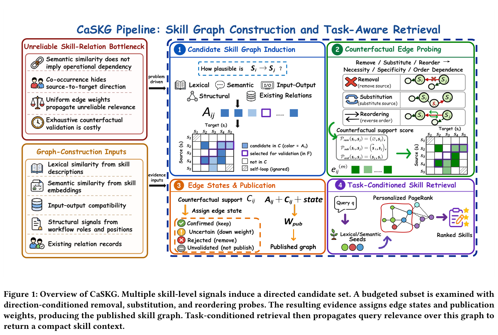
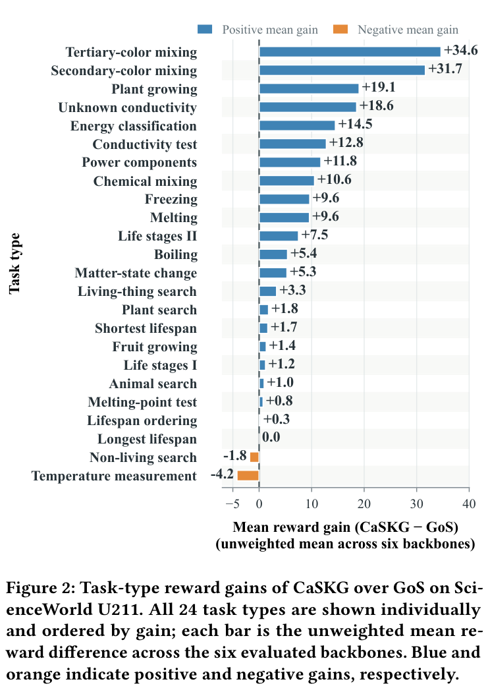
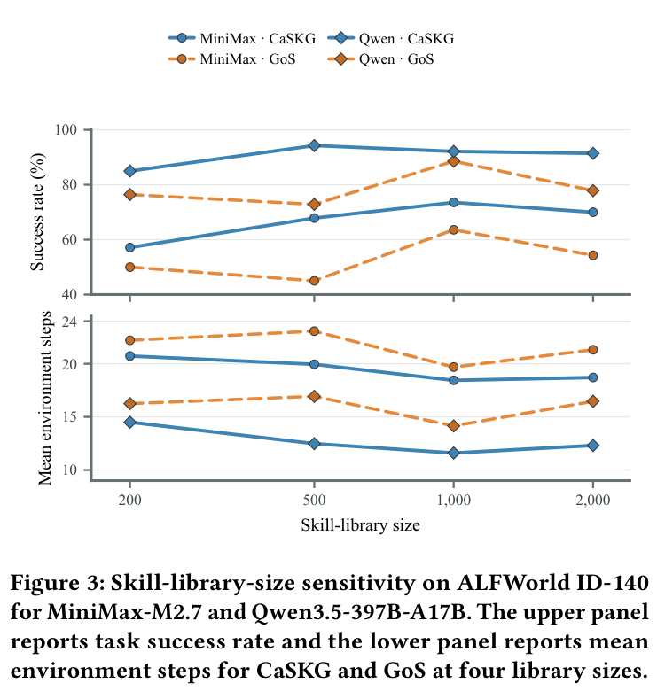

# CaSKG: Counterfactual-Causal Skill Graphs for Scalable Agent Skill Retrieval

> [paper][git] https://github.com/ZhiyuanLi218/Caskg.git · https://arxiv.org/abs/2608.25500

---

## 1. Summary & Outline

### 1.1 Executive Summary
**CaSKG (Counterfactual-Causal Skill Graphs)**는 대규모 재사용 스킬 라이브러리를 보유한 LLM 에이전트가 당면 과제에 필요한 핵심 절차적 지식을 효율적이고 정확하게 인출할 수 있도록 지원하는 **인과 보정형 스킬 그래프 검색 프레임워크**이다.

기존의 단순 벡터 유사도 검색(Vector Retrieval)은 스킬 간의 선행 조건(Prerequisite), 상태 전이(State-changing action), 검증 및 복구 루틴(Verification & Recovery)과 같은 **절차적 의존성(Procedural Dependencies)**을 포착하지 못하며, 기존 그래프 기반 검색(Graph-of-Skills)은 표면적 어휘 유사도나 단순 동시 발생 빈도에 기반한 **비보정된 휴리스틱 엣지(Uncalibrated Edges)**를 통해 거짓 관련성(Spurious Relevance)을 다중 홉(Multi-hop)으로 전파하는 치명적인 한계를 지닌다.

CaSKG는 관계 발견(고재현율 후보 유도)과 신뢰도 보정(반사실적 인과 검증)을 명확히 분리한다:
1. **후보 스킬 그래프 유도 (Candidate Induction)**: 어휘, 의미 임베딩, 입출력 인터페이스, 구조적 워크플로 역할, 복구 증거 등을 통합하여 고재현율(High-recall) 방향성 후보 엣지를 생성한다.
2. **방향 조건부 텍스트 반사실적 프로브 (Counterfactual Probing)**: 소스 스킬의 **제거(Removal: 필요성)**, **대체(Substitution: 특이성)**, **순서 역전(Reordering: 방향성)**에 따른 워크플로 붕괴 여부를 LLM을 통해 평가한다.
3. **베이지안 평활화 및 상태 게이팅 발행 (Bayesian Calibration & Publication)**: 베타 누적기(Beta Accumulator)를 통해 프로브 증거를 평활화하고, 4단계 상태(`confirmed`, `uncertain`, `rejected`, `unvalidated`)에 따라 엣지를 가지치기(Pruning) 및 감쇄(Attenuation)하여 고신뢰도 발행 그래프(`G_pub`)를 완성한다.
4. **개인화된 페이지랭크 확산 검색 (Task-Conditioned Diffusion)**: 태스크 쿼리로부터 초기 시드를 선별한 뒤, 발행된 인과 그래프 위에서 개인화된 페이지랭크(Personalized PageRank, PPR) 확산을 수행하여 다운스트림 에이전트에 작고 실행 가능한 스킬 묶음(Compact Executable Bundle)을 주입한다.

ALFWorld ID-140 및 ScienceWorld U211 벤치마크에서 6개 최신 LLM 백본(MiniMax-M2.7, GLM-5.2, Kimi-K2.6, Qwen3.5-397B, DeepSeek-V4-Flash, GPT-5.6-Luna)을 대상으로 평가한 결과, CaSKG는 **12개 모델-벤치마크 조합 전체에서 최고 성공률을 달성**하였으며, 기존 SOTA인 GoS 대비 ScienceWorld 점수를 72.62 → 80.50 (+7.88점), ALFWorld 성공률을 80.01% → 86.79% (+6.78%p)로 대폭 개선하고 환경 상호작용 스텝 수를 일관되게 단축시켰다.

---

### 1.2 Document Outline
- **§2. Problem & Motivation**: 스킬 라이브러리 스케일업에 따른 3대 패러다임(Full-prompting, Vector RAG, Heuristic Graph)의 딜레마 및 인과성 결여 문제
- **§3. Contributions**: CaSKG의 4대 핵심 기여 및 차별점
- **§4. Method & Architecture**: 4단계 파이프라인(후보 유도, 반사실적 프로빙, 베이지안 캘리브레이션, PPR 확산)의 상세 수식 및 구조도
- **§5. Experiments & Results**: 6개 백본 모델 대상 종합 벤치마크 평가, 24개 태스크 유형별 질적 분석, 라이브러리 스케일 민감도, 컴포넌트 소거 실험
- **§6. In-Depth Analysis**: 강점 및 학술적 의의, 현실적 한계점, 향후 확장 연구 방향
- **§7. References**: 관련 핵심 논문 및 오픈소스 코드 링크

---

## 2. Problem & Motivation

### 2.1 연구 배경: 절차적 메모리(Procedural Memory)의 팽창
최근 LLM 에이전트는 Toolformer, ReAct, Voyager, Gorilla, ToolLLM 등과 결합하여 외부 환경 인터랙션과 도구/스킬 호출을 결합한 복합 태스크를 해결하고 있다. 특히 성공적인 작업 궤적에서 검증된 서브루틴을 스킬(Skill) 형태로 라이브러리에 지속 축적하는 **절차적 메모리(Procedural Memory)** 패러다임이 확산되고 있다. 그러나 스킬 라이브러리의 규모가 수백~수천 개 단위(`Skill1000`)로 확장됨에 따라, "어떤 스킬을 에이전트의 프롬프트 컨텍스트에 노출할 것인가"가 성능과 비용을 좌우하는 핵심 병목으로 부상하였다.

```
+----------------------------------------------------------------------------------------------------+
|                                      Skill Retrieval Dilemmas                                      |
+------------------------------------+----------------------------------+----------------------------+
| 1. Full-Library Prompting          | 2. Vector Semantic Retrieval     | 3. Heuristic Graph (GoS)   |
+------------------------------------+----------------------------------+----------------------------+
| - 모든 스킬을 컨텍스트에 직접 주입 | - 질의와 각 스킬 임베딩 독립 비교 | - 어휘/전이/I-O 그래프 구축|
| - 높은 토큰 비용 & 프롬프트 오염   | - 스킬을 고립된 텍스트 단위로 처리| - 다중 홉(Multi-hop) 확산  |
| - LLM 주의 분산 및 환각 유발       | - 선행 조건·복구 절차 누락       | - 가짜 연관성(Noise) 전파  |
| - 대규모 라이브러리 확장 불가능    | - 비어휘적 워크플로 의존성 실패  | - 비대칭 인과/방향성 무시  |
+------------------------------------+----------------------------------+----------------------------+
```

---

### 2.2 기존 검색 접근법의 구조적 한계와 병목

1. **전체 라이브러리 주입 (Full-Library Prompting)**:
   - 모든 스킬 명세를 프롬프트에 나열하므로 재현율(Recall)은 보존되지만, 컨텍스트 윈도우 한계를 압박하고 관련 없는 스킬들로 인해 LLM의 집중력이 저하된다.

2. **독립적 벡터 검색 (Vector Semantic Retrieval / KNN RAG)**:
   - Dense Passage Retrieval(DPR) 방식으로 쿼리와 유사한 상위 K개 스킬을 인출한다. 그러나 복잡한 과학 실험(ScienceWorld)이나 가사 태스크(ALFWorld)는 "단일 동작 명칭"이 쿼리와 일치하지 않는다.
   - 예: "전도도 측정(test conductivity)" 태스크는 회로 부품 조립(준비) → 시료 연결(동작) → 전류계 눈금 확인(관찰) → 도체/부도체 분류(판정) → 보관함 배치(완료)의 연쇄 절차를 요구하지만, 벡터 검색은 쿼리와 문자열이 겹치는 1~2개 스킬만 반환하여 필수 선행 스킬을 누락한다.

3. **기존 그래프 기반 검색 (Graph-of-Skills, ToolNet 등)의 인과성 결여**:
   - 그래프 확산(Topic-Sensitive PageRank 등)을 통해 이웃 스킬을 포괄적으로 인출하는 시도는 유효하나, **엣지 구성이 휴리스틱(어휘 중복, 공통 엔티티, 단순 동시발생)에 의존**한다.
   - **의미적 유사성이 동작 의존성을 보장하지 않음**: "가열(heating)"과 "냉각(cooling)"은 의미적으로 매우 유사하지만 상호 선행 조건이 아니다.
   - **동시 발생이 방향성을 나타내지 못함**: 스킬 A와 B가 자주 같이 쓰여도 `A → B`인지 `B → A`인지 방향성이 불명확하다.
   - **균일/휴리스틱 가중치로 인한 노이즈 증폭**: 잘못 연결된 거짓 엣지 하나가 그래프 확산 과정에서 전혀 엉뚱한 유틸리티 스킬을 대량으로 컨텍스트에 끌어들여 에이전트가 엉뚱한 루프에 빠지게 만든다.
   - **전수 인과 검증의 비현실적 비용**: N개 스킬에 대해 모든 쌍(`O(N²)`)을 사전에 LLM으로 엄밀 검증하는 것은 계산 비용상 불가능하다.

---

## 3. Contributions

CaSKG는 이러한 문제를 해결하기 위해 다음의 4가지 핵심 기여를 제시한다:

- **후보 발견과 인과 보정의 분리 (Decoupled Discovery & Calibration Architecture)**:
  - 저비용 다중 소스 신호로 넓은 후보 엣지 집합(`C`)을 확보(High Recall)한 뒤, 한정된 검증 예산(`F ⊆ C`) 내에서만 정밀 텍스트 반사실적 검증을 수행함으로써 `O(N²)` 비용 폭발 없이 고신뢰도 그래프를 구축한다.

- **3대 방향 조건부 텍스트 반사실적 프로브 (Direction-Conditioned Counterfactual Probing)**:
  - 소스 제거(Removal: 필요성), 소스 대체(Substitution: 특이성), 순서 역전(Reordering: 방향성)의 3가지 반사실적 개입(Intervention)을 텍스트 수준에서 설계하여, 스킬 간의 진정한 절차적 의존성을 검증한다.

- **베이지안 평활화 및 4단계 상태 게이팅 발행 (Bayesian Smoothing & State-Gated Publication)**:
  - `Beta(1, 1)` 기반의 베이지안 증거 누적기를 통해 프로브 결과를 신뢰도 점수로 평활화하고, `confirmed`, `uncertain`, `rejected`, `unvalidated` 4단계 상태에 따라 가중치를 체계적으로 차등 부여/가지치기한다.

- **다운스트림 무손실 플러그앤플레이 (Zero Downstream Modification)**:
  - 에이전트의 파라미터 미세조정(Fine-tuning)이나 환경 인터페이스 변경 없이, 순수 오프라인 그래프 구축 및 런타임 PPR 검색만으로 6개 최신 LLM 백본 전반에서 SOTA 성능을 갱신하였다.

---

## 4. Method & Architecture

### 4.1 전체 파이프라인 개요

CaSKG는 크게 **(1) 후보 스킬 그래프 유도**, **(2) 반사실적 엣지 프로빙**, **(3) 베이지안 보정 및 그래프 발행**, **(4) 태스크 조건부 스킬 검색**의 4단계로 구성된다.

```
====================================================================================================
                                      CaSKG SYSTEM WORKFLOW
====================================================================================================

[ Stage 1: Candidate Induction ] (Broad Recall)
  - Lexical Similarity (Text Overlap)      ──┐
  - Dense Semantic Similarity (Qwen3-8B)   ──┼──> Weighted Fusion (Eq. 1) ──> Initial Score A_ij
  - Input/Output Interface Compatibility   ──┤    + Structural Role Floor      Candidate Set C
  - Structural Workflow Role Transitions   ──┘                                 Validation Frontier F
                                                                                      │
                                                                                      ▼
[ Stage 2: Counterfactual Probing ] (Causal Validation on Frontier F)
  Candidate Pair (s_i -> s_j)
  ├─ Removal Probe:      P_rem = (∅, s_j)   ──> Impairment Score  e^(rem)_ij  (Necessity)
  ├─ Substitution Probe: P_sub = (s~_i, s_j)──> Degradation Score e^(sub)_ij  (Specificity)
  └─ Reordering Probe:   P_ord = (s_j, s_i) ──> Incoherence Score e^(ord)_ij  (Directionality)
                                                                                      │
                                                                                      ▼
[ Stage 3: Bayesian Calibration & Publication ]
  - Evidence Polarity:  z^(m)_ij = I[e^(m)_ij > 0.5],  Mass: δ^(m)_ij = max(2|e - 0.5|, ε_e)
  - Beta Accumulator:   α_ij = 1 + ∑ z·δ,  β_ij = 1 + ∑ (1-z)·δ  ──> Reliability c_ij = α / (α + β)
  - State Assignment:   σ_ij ∈ { confirmed (ρ=1), uncertain (ρ=ρ_unc), rejected (ρ=0), unvalidated }
  - Published Graph:    G_pub = (S, E_pub, W, Σ),  w^(pub)_ij = clip[ε_w, 1](ρ_ij · max(A_ij, c_ij))
                                                                                      │
                                                                                      ▼
[ Stage 4: Task-Conditioned Retrieval ] (Inference-Time)
  Task Query q ──> Seed Distribution π_q (Lexical/Semantic Inverse-Rank)
  Diffusion on G_pub:  p^(t+1) = γ·π_q + (1 - γ)·T^T · p^(t)  (Personalized PageRank)
  ──> Top-K Ranked Compact Skill Bundle ──> Injected into Agent Context
====================================================================================================
```



---

### 4.2 Stage 1: 후보 스킬 그래프 유도 (Candidate Skill Graph Induction)

스킬 라이브러리 `S = {s_1, ..., s_n}`에서 가능한 순서쌍 `(s_i, s_j)`에 대해 다중 소스 이종 증거 신호를 집계하여 희소 후보 집합 `C ⊆ S × S`를 구성한다.

1. **신호 채널**:
   - 어휘적 신호 `φ_lex(i, j)`: 스킬 설명 텍스트 간 BM25/토큰 중복도.
   - 의미적 신호 `φ_sem(i, j)`: Qwen3-Embedding-8B (4,096차원) 코사인 유사도.
   - 입출력 호환성 `φ_io(i, j)`: `s_i`의 출력 인수와 `s_j`의 입력 인수 간 일치율.
   - 구조적 역할 신호 `φ_struct(i, j)`: 스킬의 워크플로 역할(준비 → 실행 → 관찰 → 완료 → 복구) 간 전이 타당성.
   - 복구 증거 및 선택적 LLM 판정관 신호.

2. **초기 연관 점수 계산 (Initial Association Score)**:
   활성 신호 가중 합산 `A~_ij`를 구한 후, 구조적 신호가 임계값 `τ_str`을 초과할 경우 구조적 하한선(Structural floor)을 적용한다:

```
A~_ij = clip[0, 1]( ( ∑_{k ∈ A_ij} λ_k · φ_k(i, j) ) / ( ∑_{k ∈ A_ij} λ_k ) )

A_ij = max( A~_ij, η_str · φ_struct(i, j) )   [if φ_struct(i, j) > τ_str]
     = A~_ij                                  [otherwise]
```

3. **검증 프론티어 선별**:
   점수 `A_ij`가 높은 상위 후보들로 검증 프론티어 `F ⊆ C` (|F| ≪ |C|)를 구성하여 2단계 프로빙으로 전달하고, 나머지 `C \ F`는 즉시 버리지 않고 미검증 스캐폴드(Scaffold) 후보로 대기시킨다.

상세 파이프라인 구현 스니펫 → [snippets/pipeline_architecture.md](../source/git/snippets/CaSKG_Counterfactual-Causal_Skill_Graphs_for_Scalable_Agent_Skill_Retrieval_2026_arxiv__pipeline_architecture.md)

---

### 4.3 Stage 2: 방향 조건부 텍스트 반사실적 프로브 (Counterfactual Probing)

선별된 후보 엣지 `(s_i, s_j) ∈ F`에 대해 LLM을 인과 판정관으로 활용하여 3가지 텍스트 반사실적 개입을 적용한다:

```
+──────────────────────+─────────────────────────────────────────+──────────────────────────────────+
| 프로브 종류          | 개입 수식 (Intervention Context)        | 측정 대상 및 인과적 의미         |
+──────────────────────+─────────────────────────────────────────+──────────────────────────────────+
| 1. Removal Probe     | P_rem(s_i, s_j) = (∅, s_j)              | 필요성 (Necessity):              |
|                      |                                         | s_i 부재 시 s_j 실행 불가능성    |
+──────────────────────+─────────────────────────────────────────+──────────────────────────────────+
| 2. Substitution Probe| P_sub(s_i, s_j) = (s~_i, s_j)           | 특이성 (Specificity):            |
|                      |                                         | 임의 스킬 s~_i 대체 시 성능 저하 |
+──────────────────────+─────────────────────────────────────────+──────────────────────────────────+
| 3. Reordering Probe  | P_ord(s_i, s_j) = (s_j, s_i)            | 순서 의존성 (Directionality):    |
|                      |                                         | 역순 실행 시 절차적 일관성 상실  |
+──────────────────────+─────────────────────────────────────────+──────────────────────────────────+
```

각 프로브 `m ∈ {rem, sub, ord}`는 LLM 평가를 통해 방향 지지 점수 `e^(m)_ij ∈ [0, 1]`를 산출한다. 점수가 높을수록 해당 개입이 절차를 파괴함을 의미하므로 세 점수는 동일한 지지 극성을 공유한다.

상세 프로브 프롬프트 템플릿 → [snippets/counterfactual_probes.md](../source/git/snippets/CaSKG_Counterfactual-Causal_Skill_Graphs_for_Scalable_Agent_Skill_Retrieval_2026_arxiv__counterfactual_probes.md)

---

### 4.4 Stage 3: 베이지안 엣지 캘리브레이션 및 상태 게이팅 발행

단일 프로브 점수를 엣지 가중치로 직접 쓰는 대신, 베이지안 평활화(Bayesian Smoothing)를 거쳐 신뢰도 점수를 추정한다.

1. **베이지안 증거 누적기 (Beta Accumulator)**:
   기준점 0.5를 중심으로 지지 여부 `z^(m)_ij`와 증거 질량 `δ^(m)_ij`를 분리 계산한다 (바닥값 `ε_e > 0`):

```
z^(m)_ij = I[ e^(m)_ij > 0.5 ]

δ^(m)_ij = max( 2 · |e^(m)_ij - 0.5|, ε_e )

α_ij = 1 + ∑_{m ∈ {rem, sub, ord}} z^(m)_ij · δ^(m)_ij

β_ij = 1 + ∑_{m ∈ {rem, sub, ord}} (1 - z^(m)_ij) · δ^(m)_ij

c_ij = α_ij / (α_ij + β_ij)
```

2. **4단계 상태 게이팅 (State-Gated Publication)**:
   대칭 임계값 `τ_c ∈ (0.5, 1)` (기본값 0.70)를 적용하여 엣지 평가 상태 `σ_ij`를 결정하고, 상태별 감쇄 계수 `ρ_ij`를 곱해 최종 발행 가중치 `w^(pub)_ij`를 도출한다:

```
σ_ij = confirmed    (if (s_i, s_j) ∈ F ∧ c_ij > τ_c)        ──> ρ_ij = 1.0 (완전 보존)
     = rejected     (if (s_i, s_j) ∈ F ∧ c_ij < 1 - τ_c)    ──> ρ_ij = 0.0 (완전 제거)
     = uncertain    (if (s_i, s_j) ∈ F ∧ 1-τ_c ≤ c_ij ≤ τ_c)──> ρ_ij = ρ_unc (가중치 감쇄)
     = unvalidated  (if (s_i, s_j) ∈ C \ F)                 ──> ρ_ij = ρ_scaf (스캐폴드만 약하게 보존)

w^(pub)_ij = clip[ε_w, 1]( ρ_ij · max(A_ij, c_ij) )   [if ρ_ij > 0]
           = 0                                        [if ρ_ij = 0]
```

발행 그래프 `G_pub = (S, E_pub, W, Σ)`는 오프라인에서 동결(Frozen)되어 검색 단계의 인프라로 쓰인다.

---

### 4.5 Stage 4: 태스크 조건부 스킬 검색 (Task-Conditioned Diffusion)

런타임에 사용자 태스크 쿼리 `q`가 인입되면:
1. 어휘 및 의미적 유사도로 시드 스킬을 선별하고 역순위 가중치로 정규화하여 시드 분포 `π_q`를 생성한다.
2. 행 정규화된 전이 행렬 `T`를 이용하여 개인화된 페이지랭크(PPR) 확산을 수행한다 (재시작 계수 `γ ∈ (0, 1)`):

```
p^(t+1) = γ · π_q + (1 - γ) · T^T · p^(t)
```

3. 수렴된 한계 분포 `p`에 따라 상위 스킬들을 인출하여 다운스트림 LLM 에이전트의 컨텍스트로 제공한다.

상세 수식 원문 발췌 → [source/paper/CaSKG excerpt](../source/paper/CaSKG_Counterfactual-Causal_Skill_Graphs_for_Scalable_Agent_Skill_Retrieval_2026_arxiv.md)

---

### 4.6 실험 데이터 기반 4단계 방법론 엔드투엔드 워크스루 (End-to-End Walkthrough)

제안된 CaSKG의 4단계 알고리즘이 실제 벤치마크 태스크에서 어떻게 동작하는지, 논문 실험에 사용된 대표적 에피소드를 통해 구체적으로 살펴본다.

#### 1) ScienceWorld `test-conductivity` (염화나트륨 전도도 검사) 워크스루
- **태스크 목표**: 염화나트륨(NaCl)이 전기를 전도하는지 검사하고, 판정 결과에 따라 올바른 보관 상자(Green/Red box)에 배치하라.
- **필수 절차 체인**: `focus_material`(시료 선택) → `assemble_circuit`(회로 조립) → `test_conductivity`(시료 연결) → `classify_conductive`(전도성 판정) → `place_in_box`(상자 보관)

```
[ ScienceWorld test-conductivity 인과 체인 ]
 focus_material ──> assemble_circuit ──> test_conductivity ──> classify_conductive ──> place_in_box
 (선행 물질 선택)    (선행 물리 준비)     (핵심 동작 실행)      (관찰 기반 판정)        (최종 완료)
```

- **Stage 1 (후보 유도)**:
  - 후보 쌍 `(assemble_circuit, test_conductivity)`: 의미 유사도 `φ_sem = 0.52`, 회로 I/O 일치 `φ_io = 1.0`, 준비→실행 구조 전이 `φ_struct = 0.95` → 초기 연관 점수 `A_ij = 0.81`로 상위 검증 프론티어 `F`(|F|=500)에 진입.
  - 가짜 연관성 후보 `(heat_substance, test_conductivity)`: 의미적 도구 유사성만 존재하여 `A_ij = 0.32` 산출.
- **Stage 2 (반사실적 프로빙)**:
  - **Removal Probe (`P_rem = (∅, test_conductivity)`)**: "회로 조립 없이 전도도를 측정할 수 있는가?" → 회로 부재로 측정 불가 판정, 붕괴 점수 `e^(rem) = 0.95` (필요성 입증).
  - **Substitution Probe (`P_sub = (cool_substance, test_conductivity)`)**: "회로 조립 대신 냉각 스킬을 실행하면 측정이 가능한가?" → 측정과 무관하여 절차 저해 판정, `e^(sub) = 0.90` (특이성 입증).
  - **Reordering Probe (`P_ord = (test_conductivity, assemble_circuit)`)**: "측정을 먼저 수행하고 나중에 회로를 조립하는 순서가 물리적으로 타당한가?" → 순서 모순 판정, `e^(ord) = 0.98` (방향성 입증).
  - 반면 `(heat_substance, test_conductivity)`는 Removal 프로브에서 "가열하지 않아도 전도도 측정 가능(`e^(rem) = 0.10`)" 판정을 받아 기각 증거 획득.
- **Stage 3 (베이지안 평활화 & 게이팅)**:
  - `(assemble_circuit, test_conductivity)`: 지지 증거 누적으로 `α = 3.65, β = 1.0` → 신뢰도 `c_ij = 0.785 > τ_c(0.70)` → **`confirmed` (`ρ = 1.0`, 가중치 0.81 완전 보존)**.
  - `(heat_substance, test_conductivity)`: 기각 증거 누적으로 `α = 1.0, β = 3.80` → 신뢰도 `c_ij = 0.208 < 0.30` → **`rejected` (`ρ = 0.0`, 그래프에서 영구 삭제)**.
- **Stage 4 (PPR 확산 검색)**:
  - 질의 "Determine if sodium chloride conducts electricity" 인입 시 `test_conductivity`가 시드(`π_q`)로 지정됨.
  - 보정된 엣지를 타고 `assemble_circuit`, `classify_conductive`, `place_in_box`로 확률 질량이 확산되어 컴팩트한 실행 가능 스킬 묶음 반환.

#### 2) 검색 방식별 실제 에이전트 실행 궤적 비교

| 검색 방식 | 에이전트 주입 스킬 컨텍스트 | 실제 실행 궤적 및 에이전트 행동 분석 | 최종 점수 / 스텝 |
|---|---|---|---|
| **Vector RAG** | `test_conductivity`, `measure_temperature`, `clean_tool` | 회로 조립 지식이 없어 전선만 반복 조작하다 타임아웃 | **5점 / 30스텝 (실패)** |
| **GoS (Graph-of-Skills)** | `test_conductivity`, `assemble_circuit`, `heat_liquid`, `repair_terminal` | 회로는 구성했으나 유입된 가열/수리 루틴에 빠져 시료 연결 실패 | **55점 / 30스텝 (부분 성공)** |
| **CaSKG (제안 모델)** | `focus_material`, `assemble_circuit`, `test_conductivity`, `classify_conductive`, `place_in_box` | 회로 조립 → 염화나트륨 연결 → 전구 미점등 관찰 → 부도체 판정 → 녹색 상자 배치 완료 | **100점 / 24스텝 (완벽 성공)** |

---

## 5. Experiments & Results

### 5.1 실험 환경 및 벤치마크
- **벤치마크**:
  - **ALFWorld ID-140**: 140개 텍스트 기반 대화형 가사 태스크 (물품 탐색, 세척, 가열, 배치 등).
  - **ScienceWorld U211**: 211개 복합 과학 실험 에피소드 (24개 하위 태스크 유형: 열전도, 전기 전도도, 식물 재배, 상태 변화, 화학 혼합 등).
- **스킬 라이브러리**: `Skill1000` (1,000개 실행 스킬), 확장 민감도 실험에서 200~2,000개로 변경 평가.
- **평가 백본 모델 (6종)**:
  - MiniMax-M2.7, GLM-5.2, Kimi-K2.6, Qwen3.5-397B-A17B, DeepSeek-V4-Flash, GPT-5.6-Luna.
- **비교 기준선**:
  - **Vanilla Skills**: 전체 1,000개 스킬을 프롬프트에 나열.
  - **Vector Skills**: 쿼리 임베딩 기반 상위 K개 근접 스킬 독립 인출 (KNN RAG).
  - **GoS (Graph-of-Skills)**: 비보정된 휴리스틱 그래프 기반 확산 검색 (기존 SOTA).
  - **CaSKG (제안 모델)**: 반사실적 인과 보정 그래프 기반 확산 검색.

---

### 5.2 종합 성능 비교 (Table 1)

CaSKG는 평가된 **12개 모델-벤치마크 설정 전체에서 최고 성능(Best Reward) 및 최저 스텝 수(Fewest Steps)**를 기록하였다.

| 백본 모델 | 방법론 | ALFWorld ID-140 R(%) ↑ | ALFWorld Steps ↓ | ScienceWorld U211 R ↑ | ScienceWorld Steps ↓ |
|---|---|---|---|---|---|
| **MiniMax-M2.7** | Vanilla Skills | 42.90% | 22.54 | 45.90 | 21.73 |
| | Vector Skills | 45.70% | 22.84 | 43.21 | 21.45 |
| | GoS (Graph-of-Skills) | 63.60% | 19.69 | 55.85 | 18.91 |
| | **CaSKG (Ours)** | **73.57%** | **18.44** | **68.33** | **17.45** |
| **GLM-5.2** | Vanilla Skills | 95.00% | 11.05 | 75.50 | 17.03 |
| | Vector Skills | 96.43% | 10.12 | 77.07 | 16.65 |
| | GoS (Graph-of-Skills) | 95.71% | 9.91 | 80.33 | 15.75 |
| | **CaSKG (Ours)** | **97.86%** | **9.69** | **85.11** | **14.52** |
| **Kimi-K2.6** | Vanilla Skills | 77.90% | 16.07 | 72.23 | 18.91 |
| | Vector Skills | 90.00% | 13.49 | 72.58 | 17.55 |
| | GoS (Graph-of-Skills) | 93.60% | 13.08 | 76.82 | 16.15 |
| | **CaSKG (Ours)** | **95.00%** | **12.34** | **83.88** | **15.43** |
| **Qwen3.5-397B-A17B** | Vanilla Skills | 79.30% | 15.60 | 63.72 | 18.34 |
| | Vector Skills | 78.60% | 15.49 | 62.60 | 18.51 |
| | GoS (Graph-of-Skills) | 88.60% | 14.15 | 63.18 | 17.08 |
| | **CaSKG (Ours)** | **92.14%** | **11.60** | **74.97** | **15.56** |
| **DeepSeek-V4-Flash** | Vanilla Skills | 72.86% | 16.91 | 64.84 | 18.49 |
| | Vector Skills | 78.57% | 16.89 | 68.65 | 18.39 |
| | GoS (Graph-of-Skills) | 77.86% | 17.09 | 73.45 | 16.20 |
| | **CaSKG (Ours)** | **86.43%** | **14.41** | **83.40** | **15.61** |
| **GPT-5.6-Luna** | Vanilla Skills | 72.86% | 17.74 | 84.09 | 14.99 |
| | Vector Skills | 55.00% | 22.06 | 84.09 | 14.40 |
| | GoS (Graph-of-Skills) | 60.71% | 21.86 | 86.08 | 14.22 |
| | **CaSKG (Ours)** | **75.71%** | **17.79** | **87.33** | **13.18** |
| **6개 모델 매크로 평균** | GoS | 80.01% | 15.96 | 72.62 | 16.39 |
| | **CaSKG** | **86.79% (+6.78%p)** | **14.05 (-1.91)** | **80.50 (+7.88점)** | **15.29 (-1.10)** |

---

### 5.3 ScienceWorld 24개 세부 태스크 유형별 분석 (Figure 2)



ScienceWorld의 24개 세부 태스크 유형에 대한 6개 백본 평균 성능 차이(CaSKG − GoS)를 분석한 결과:
- **21개 태스크에서 우세, 1개 동률, 2개 열세**:
  - **최대 성능 향상 태스크**: 3차 혼합색 제조(`+34.6점`), 식물 재배(`+31.7점`), 미지의 물질 전도도 판정(`+19.1점`), 2차 혼합색 제조(`+18.6점`), 에너지 형태 분류(`+14.5점`), 전도도 검사(`+12.8점`).
  - **원인 분석**: 해당 과제들은 [재료 준비 → 기구 결합 → 변환 유발 → 상태 관찰 → 결과 판정 → 보관]으로 이어지는 엄격한 다단계 의존성을 지닌다. GoS는 무관한 유틸리티 엣지를 타고 노이즈를 유입시켜 실패했으나, CaSKG는 인과적으로 검증된 스킬 묶음만 인출하여 성공률을 극대화하였다.
  - **열세 태스크**: 온도 측정(`-4.2점`), 무생물 탐색(`-1.8점`). 이들은 단순 단발성 측정/검색 태스크로, 그래프 확산 자체가 불필요하거나 오히려 약간의 주의 분산을 초래할 수 있는 영역이다.

---

### 5.4 스킬 라이브러리 규모별 확장성 분석 (Table 2 & Figure 3)



스킬 라이브러리를 200개, 500개, 1,000개, 2,000개로 점진적 확장했을 때:
- MiniMax-M2.7과 Qwen3.5-397B 모두 **모든 라이브러리 규모에서 CaSKG가 GoS를 압도적인 격차로 능가**.
- 500개 스킬 환경에서 최대 격차 달성 (MiniMax `+22.86%p`, Qwen `+21.43%p`).
- 2,000개 초대형 스킬 환경에서도 CaSKG는 높은 성공률(MiniMax 70.00%, Qwen 91.43%)과 적은 상호작용 스텝 수를 유지하여, 스킬 라이브러리 확장에 따른 높은 확장성과 강건성을 입증하였다.

---

### 5.5 컴포넌트 소거 실험 (Table 3)

MiniMax-M2.7 및 Skill1000 환경(ALFWorld ID-140)에서 각 구성요소의 기여도를 정량적으로 검증하였다:

| 변형 모델 (Variant) | 후보 엣지 \|C\| | 검증 엣지 \|F\| | 발행 엣지 \|E_pub\| | 성공률 R(%) ↑ | 평균 스텝 Steps ↓ |
|---|---|---|---|---|---|
| **Full CaSKG (제안 모델)** | 9,937 | 500 | 3,292 | **73.57%** | **18.44** |
| **Semantic-only 후보 유도** | 3,982 | 500 | 2,698 | 67.14% (-6.43%p) | 19.21 (+0.77) |
| **w/o LLM Judge 후보 정제** | 9,753 | 500 | 3,188 | 71.43% (-2.14%p) | 18.79 (+0.35) |
| **Publish all candidates (미필터링)**| 9,937 | 0 | 9,937 | 71.43% (-2.14%p) | 18.74 (+0.30) |

- **선택적 발행의 중요성**: 모든 후보 엣지(9,937개)를 검증 없이 그대로 발행할 경우 성공률이 71.43%로 하락하며, 인과 검증과 베이지안 게이팅을 거쳐 3,292개로 압축했을 때 최고 성능(73.57%)을 달성한다.
- **다중 소스 후보 유도의 필요성**: 의미 임베딩 신호만으로 후보를 유도할 경우(|C|=3,982) 필수적인 인터페이스/구조적 엣지를 놓쳐 성능이 67.14%로 급락한다.

---

## 6. Analysis

### 6.1 Strengths & Significance

1. **절차적 메모리 검색 패러다임의 패러다임 전환**:
   기존 RAG 연구들이 주로 사실적 지식(Factual Knowledge) 검색에 치중했던 것과 달리, 에이전트의 "실행 가능한 스킬" 검색에서 **인과성(Causality)과 절차적 의존성(Procedural Dependency)**이 핵심임을 규명하고 정형화하였다.

2. **계산 효율적인 분리형 아키텍처 (Decoupled Efficiency)**:
   전체 쌍에 대한 무차별적 인과 검증(`O(N²)`) 대신, 다중 신호 기반의 고재현율 후보 추출과 예산 제약형 반사실적 프로빙(`|F| = 500`)을 결합하여 실용적인 계산 비용 내에서 고품질 그래프를 구축하였다.

3. **다운스트림 에이전트 무수정 호환성 (Zero-Shot Agent Compatibility)**:
   에이전트 정책 네트워크나 프롬프트 생성 파이프라인을 수정할 필요 없이, 오프라인에서 완성된 정적 그래프 `G_pub` 위에서 PPR 확산만 수행하므로 임의의 LLM 에이전트 프레임워크에 즉시 이식 가능하다.

4. **상호작용 스텝 단축을 통한 비용 절감**:
   단순히 과제 성공률만 높이는 것이 아니라, 불필요한 시행착오(Trial-and-error)와 유틸리티 탐색 루프를 제거하여 환경 상호작용 스텝 수를 일관되게 줄임으로써 API 비용과 실행 지연시간을 동시에 개선하였다.

---

### 6.2 Limitations

1. **오프라인 정적 그래프 구축 비용**:
   초기 후보 엣지 500개에 대해 3종의 반사실적 프로브(제거, 대체, 순서 역전)를 LLM으로 평가해야 하므로, 라이브러리 초기 빌드 시 일회성 LLM API 호출 비용이 발생한다.

2. **LLM 판정관의 환각 및 편향 가능성**:
   텍스트 기반 반사실적 프로브는 LLM 자체의 상식 추론 능력에 의존하므로, 극도로 전문적인 도메인(예: 복잡한 로보틱스 모터 제어, 특수 컴파일러 툴체인)에서는 LLM 판정 오류가 엣지 가중치에 왜곡을 줄 수 있다.

3. **단발성 단일 태스크에서의 오버헤드**:
   단순 키워드 검색으로 충분한 단발성 질의나 직관적 단일 측정 태스크(예: 온도 측정)에서는 그래프 확산이 추가적인 이득을 주지 못하거나 미세한 잡음을 유발할 수 있다.

---

### 6.3 Future Work / Improvements

- **온라인 스트리밍 평활화 (Lifelong Streaming Bayesian Updates)**:
  에이전트가 환경에서 실제로 스킬을 실행하며 얻는 성공/실패 궤적(Execution Trace)을 피드백으로 삼아, 오프라인 빌드 이후에도 `c_ij`를 온라인으로 지속 업데이트하는 평생 학습(Lifelong Learning) 체계 구축.
- **다중 에이전트 협업 절차 그래프 (Multi-Agent Procedural Knowledge)**:
  단일 에이전트 스킬 라이브러리를 넘어, 이종 에이전트 간 역할 분담과 핸드오프(Handoff) 의존성을 모델링하는 분산 인과 스킬 그래프로의 확장.
- **물리적 환경 시뮬레이션 인터벤션 (Embodied Environmental Counterfactuals)**:
  텍스트 수준의 상상적 프로브를 넘어, 가상 물리 환경(Isaac Sim, AI2-THOR 등)에서 직접 상태를 개입·롤아웃하여 실제 실행 결과를 바탕으로 인과성을 검증하는 하이브리드 프로빙 연구.

---

## 7. References

- **Paper URL**: https://arxiv.org/abs/2608.25500
- **Official GitHub**: https://github.com/ZhiyuanLi218/Caskg
- **관련 주요 연구**:
  - [Graph-of-Skills (GoS)](https://arxiv.org/abs/2604.05333): Dependency-Aware Structural Retrieval for Massive Agent Skills
  - [Voyager](https://arxiv.org/abs/2305.16291): An Open-Ended Embodied Agent with Large Language Models
  - [Topic-Sensitive PageRank](https://doi.org/10.1145/511446.511513): Query-Biased Random Walk Diffusion
  - [CausalRAG](https://arxiv.org/abs/2406.14809): Integrating Causal Graphs into Retrieval-Augmented Generation
  - [Memora](https://arxiv.org/abs/2602.03315): A Harmonic Memory Representation Balancing Abstraction and Specificity (ICML 2026)
