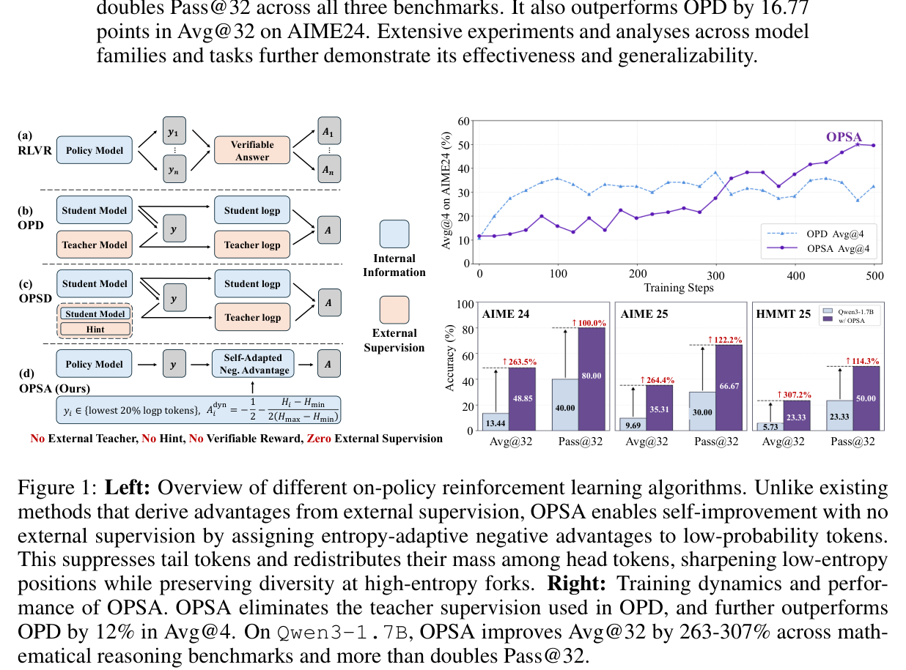
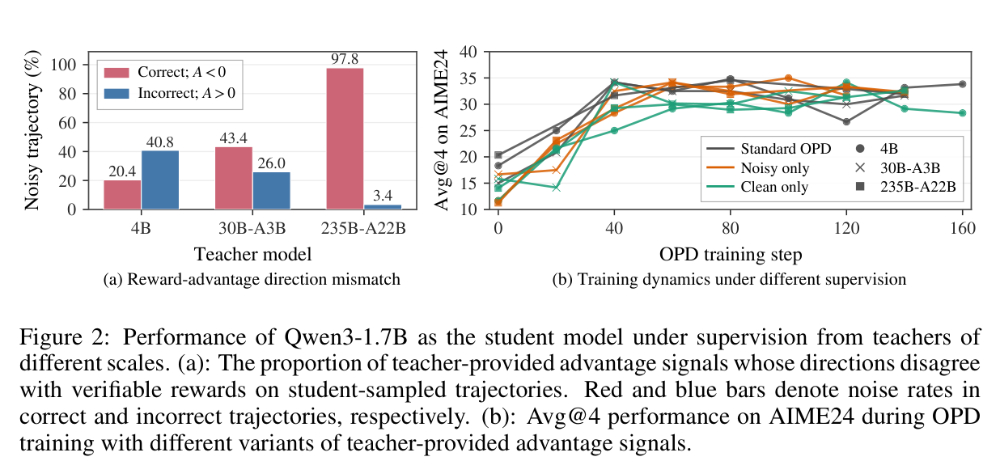
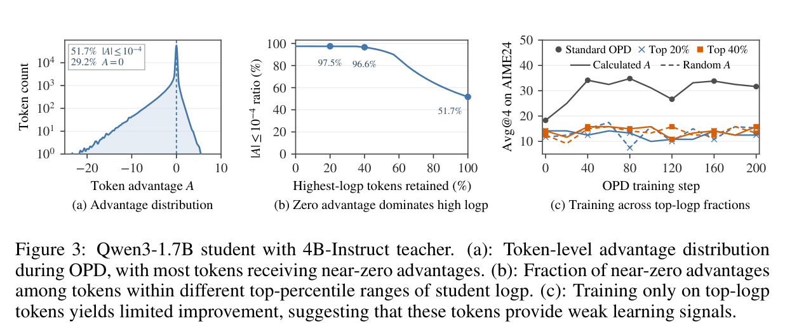
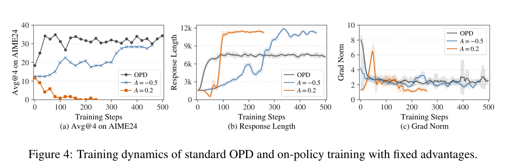
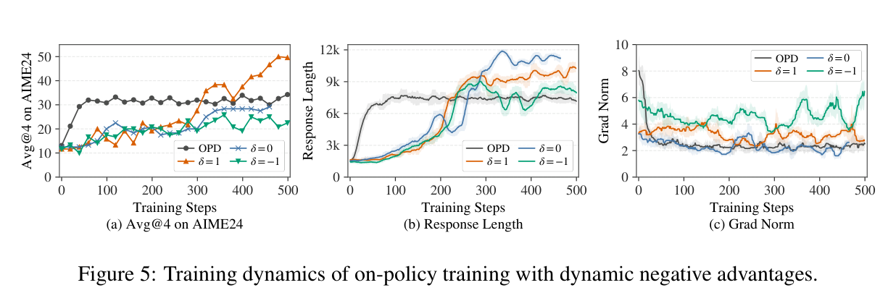
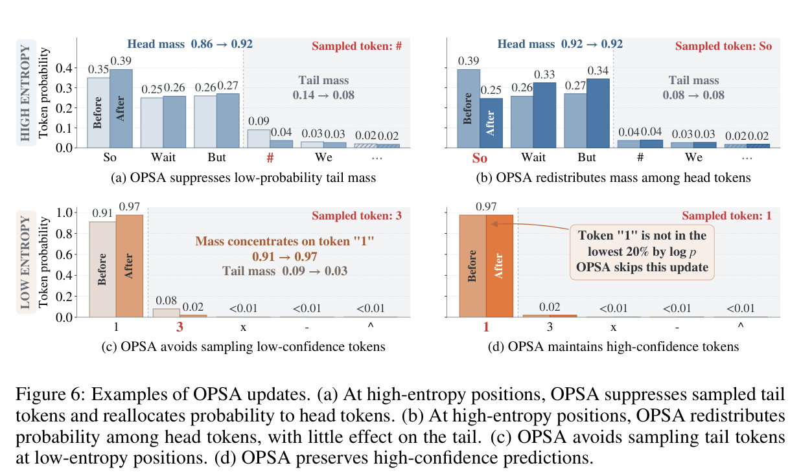
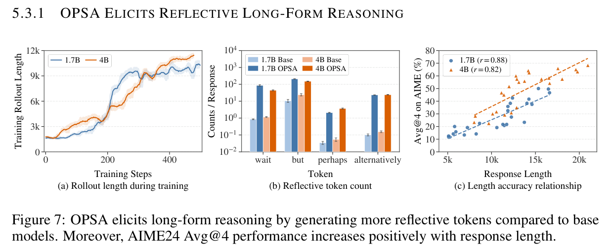
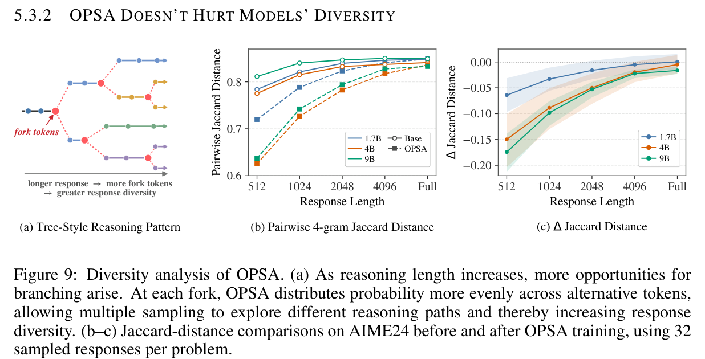

# Does On-Policy Distillation Really Distill? From Noisy Teacher to Self-Improvement

> [paper][git] https://github.com/DripNowhy/On-Policy-Self-Adaptation.git · https://arxiv.org/abs/2608.31046

## Summary & Outline

본 연구(Purdue University, Yi Ding & Ruqi Zhang)는 추론 언어 모델의 강화학습 및 지식 증류에서 널리 활용되던 **온폴리시 증류(On-Policy Distillation, OPD)**의 근본적인 작동 기제를 해체·분석하고, 외부 감독(교사 모델, 정답 라벨, 검증 보상, 힌트)이 전혀 필요 없는 새로운 자기 개선 프레임워크인 **On-Policy Self-Adaptation (OPSA)**를 제안한다.

저자들은 교사 모델이 학생 생성 궤적(student-generated trajectory)을 평가할 때 발생하는 지도 신호가 본질적으로 심각한 노이즈(최대 50% 이상, 235B 초대형 교사의 경우 정답 토큰의 97.8%에 음수 어드밴티지 부여)를 포함하고 있으며, 교사 스케일이 커질수록 노이즈가 증가함에도 불구하고 학생 모델은 노이즈 여부와 무관하게 동일한 성능으로 수렴한다는 역설적 현상을 규명하였다. 

원인 추적 결과, OPD의 성능 향상은 교사의 지식 전달에서 오는 것이 아니라, 학생 모델 스스로 샘플링한 **로그 확률 하위 20% 토큰(low-logp tokens)에 음수 어드밴티지(negative advantage)를 부여하여 저확률 테일(tail) 토큰을 억제**하는 데서 기인함을 입증하였다. 이를 바탕으로 고안된 OPSA는 토큰 엔트로피에 비례하여 동적 음수 어드밴티지를 할당함으로써 저엔트로피 구간에서는 결정론적 확신도를 높이고, 고엔트로피 추론 갈림길(fork)에서는 대안 헤드 토큰들 간 확률을 균등 재분배하여 성찰적 탐색을 촉진한다.

```
[ 논문 전체 구조 Outline ]
1. Introduction & Research Question: OPD의 교사 지도 신호 신뢰성에 대한 근본적 의문
2. Teacher Supervision in OPD is Highly Noisy: 교사 스케일에 따른 노이즈 측정 및 학생의 노이즈 둔감성 실증
3. Where Does Student Improvement Come From?: 그래디언트 소실 분석 및 단일 고정 음수 어드밴티지의 충분성 규명
4. Methodology (OPSA): 엔트로피 적응형 음수 어드밴티지 수식화 및 4가지 확률 재분배 메커니즘
5. Experiments & Results: 
   - 수학 벤치마크 (AIME24, AIME25, HMMT25) 및 OOD (MBPP+, GPQA-Diamond)
   - 모델 스케일 확장 (Qwen3-1.7B, Qwen3-4B, Qwen3.5-9B)
   - Thinking Mode vs Non-Thinking Mode 비교 및 RLVR 콜드 스타트 확장
6. Deep-Dive Analysis & Ablations:
   - 성찰적 단어(Reflective tokens) 발현과 갈림길 마스킹(Fork token masking) 영향
   - 4-gram Jaccard Distance 기반 생성 다양성 보존 분석
   - 학습 대상 토큰 비율(10%~40%) 민감도 분석
7. Conclusion & Future Directions
```

---

## Problem & Motivation

- **연구 배경**: 거대 언어 모델(LLM)의 복합 추론(Reasoning) 성능을 극대화하기 위해 검증 가능한 보상 기반 강화학습(RLVR, 예: GRPO)과 온폴리시 증류(On-Policy Distillation, OPD)가 핵심 사후 학습(post-training) 기법으로 자리 잡았다. RLVR이 결과 단위(outcome-level)의 희소한 보상에 의존하는 반면, OPD는 강한 교사 모델을 활용해 학생이 생성한 온폴리시 궤적의 매 토큰마다 조밀한(dense) 역방향 KL 어드밴티지 신호를 제공한다.
- **풀고자 하는 문제 (Core Dilemma)**: OPD에서 역방향 KL 발산은 학생 정책(`π_s`)이 샘플링한 prefix를 조건으로 계산된다. 이는 교사 모델(`π_t`) 입장에서 본인이 직접 생성하지 않은 **오프폴리시(off-policy) 상태**에서 학생의 행동을 평가해야 함을 의미한다. 과연 교사 모델은 이처럼 분포가 벗어난 학생 궤적에서 신뢰할 수 있는 지도 신호를 제공하는가?
- **기존 패러다임의 한계**:
  1. **교사-학생 간 심각한 분포 불일치(Distributional Mismatch)**: 교사의 파라미터가 거대해질수록 학생 궤적에 대해 일관되게 극단적인 음수 로그 확률 차이를 출력하며 무차별적인 음수 신호를 생성한다.
  2. **막대한 연산 및 인프라 비용**: 매 훈련 스텝마다 교사 모델의 순전파(forward pass)를 병렬 실행해야 하므로 GPU 메모리와 연산 오버헤드가 급증한다.
  3. **자가 증류(OPSD) 및 라벨 프리 방식의 국소 최적화 붕괴**: 힌트 주입형 OPSD는 초기 토큰 분포 불일치에 취약하며, 다수결 기반 자가 보상(TTRL)은 초기 오류 모드로 과도하게 수렴하여 Pass@k를 붕괴시키는 한계를 노출한다.

---

## Contributions

- **OPD 교사 신호의 노이즈 규명 및 스케일 역설 발견**:
  검증 가능한 정답 박스(`\boxed{}`) 토큰을 기준으로 교사 어드밴티지의 방향성을 측정한 결과, 4B 교사는 30.6%, 235B 교사는 50.6%의 노이즈 비율을 보였으며, 초대형 교사는 정답 토큰의 97.8%에 음수 어드밴티지를 부여하는 스케일 역설을 최초로 정량화하였다.
- **학생 정책의 지도 노이즈 둔감성 및 OPD의 진정한 개선 원천 규명**:
  노이즈 궤적만으로 학습한 학생이 표준 OPD와 동일한 속도 및 성능으로 수렴함을 입증하였다. 그래디언트 분석을 통해 상위 로그 확률 토큰은 그래디언트가 소실(`|A| ≤ 10^-4`)되며, 하위 20% 저확률 토큰에 **단일 고정 음수 어드밴티지(`A = -0.5`)를 부여하는 것만으로 표준 OPD의 성능 및 응답 길이 확장을 100% 재현**할 수 있음을 증명하였다.
- **외부 지도 없는 On-Policy Self-Adaptation (OPSA) 프레임워크 제안**:
  교사 모델, 정답 라벨, 보상 함수, 힌트 등 일체의 외부 지도 없이, 모델 자신의 엔트로피 신호만을 활용하여 저확률 토큰을 억제하고 고엔트로피 갈림길에서 헤드 토큰 간 확률을 재분배하는 알고리즘을 정립하였다.
- **전방위적 성능 도약 및 초고효율 실증**:
  Qwen3-1.7B에서 AIME24 Avg@32를 13.44%에서 48.85%로 향상(+263.5% 상대 향상)시켜 교사 기반 OPD(32.08%) 및 보상 기반 GRPO(33.96%)를 크게 상회하였으며, 학습 스텝 시간을 GRPO 대비 약 8배, OPD 대비 약 2.7배 단축시켰다.

---

## Method

### 1. Overall System Pipeline & Paradigm Comparison

```
[ 기존 RLVR (GRPO) ]
Question (x) ──► Policy (π_θ) ──► Multi-rollouts (y_1...y_n) ──► Verifiable Reward ──► Sparse Scalar Adv
                                                                (Ground Truth Answer)

[ 기존 OPD (On-Policy Distillation) ]
Question (x) ──► Student (π_s) ──► Rollout (y) ──► Teacher (π_t) Forward ──► Dense Token Adv: A_i = log(π_t/π_s)
                                                  (Massive Compute & High Noise)

[ 제안 OPSA (On-Policy Self-Adaptation) - Zero External Supervision ]
                                                                        ┌──► High Entropy Fork: A_i ≈ -1.0 (Strong Negative)
Question (x) ──► Policy (π_θ) ──► Rollout (y) ──► Token Log-p Rank ──► │     (Redistribute evenly across Head tokens)
                                                (Bottom 20% Selected)   └──► Low Entropy Tail: A_i ≈ -0.5 (Base Negative)
                                                                             (Suppress sampled tail, sharpen Mode)
```



---

### 2. Deconstructing OPD: Noisy Teacher & Gradient Vanishing

#### (1) K1 추정기 기반 OPD 목적함수
온폴리시 증류는 학생과 교사 간 역방향 KL 발산을 최소화하며, 정책 그래디언트 관점에서 토큰 단위 목적함수는 다음과 같다:

```
L_OPD = - E [ (1 / |y|) ∑_{i=1}^{|y|} A_i · log π_s(y_i | x, y_{<i}) ]

A_i = log π_t(y_i | x, y_{<i}) - log π_s(y_i | x, y_{<i})
```

#### (2) 교사 신호의 노이즈와 스케일 역설
학생이 생성한 궤적에 대해 교사 모델이 산출한 어드밴티지 부호(`sign(A_i)`)가 검증 가능한 최종 정답과 불일치하는 비율을 측정한 결과는 충격적이다.



- **스케일에 따른 노이즈 급증**:
  - `Qwen3-4B-Instruct` 교사: 정답 궤적 노이즈 20.4%, 오답 궤적 노이즈 40.8% (전체 노이즈 30.6%)
  - `Qwen3-30B-A3B-Instruct` 교사: 정답 궤적 노이즈 43.4%, 오답 궤적 노이즈 26.0% (전체 노이즈 34.7%)
  - `Qwen3-235B-A22B-Instruct` 교사: 정답 궤적 노이즈 **97.8%** (정답 토큰의 97.8%가 음수 어드밴티지 수신, 전체 노이즈 50.6%)
- **노이즈 둔감성 (Noise Insensitivity)**: 노이즈가 완전히 제거된 `Clean only` 데이터와 노이즈만으로 구성된 `Noisy only` 데이터로 학생을 학습시킨 결과, 두 모델 모두 표준 OPD와 완전히 동일한 학습 곡선을 보였다. 이는 학생의 개선이 교사의 올바른 지도에서 비롯된 것이 아님을 결정적으로 증명한다.

#### (3) 로짓 레벨 그래디언트 분석 및 저확률 토큰 집중 현상
로짓 `z_t^v`에 대한 그래디언트는 다음과 같이 전개된다:

```
- ∂L_OPD / ∂z_t^v ∝
    A_t · (1 - π_s(v | x, y_{<t}))    (if v = y_t, 샘플링된 토큰)
   -A_t · π_s(v | x, y_{<t})           (if v ≠ y_t, 비샘플링 토큰)
```



1. 전체 토큰의 **29.2%는 정확히 `A = 0`**, **51.7%는 `|A| ≤ 10^-4`**에 집중된다.
2. 학생이 높은 확신도를 가진 상위 로그 확률(high-logp) 토큰에서는 교사 역시 유사한 확률을 할당하여 `A_t ≈ 0`이 되며, `1 - π_s(y_t) ≈ 0`이 되어 그래디언트가 소실된다.
3. 상위 20% 또는 40%의 high-logp 토큰만으로 학습을 진행하면 실제 어드밴티지든 무작위 어드밴티지(`A ~ U[-1, 1]`)든 성능 향상이 전혀 일어나지 않는다. 실질적 학습 신호는 **하위 로그 확률 토큰(low-logp tokens)**에 국한된다.

---

### 3. The Power of Fixed Negative Advantage

저확률 토큰에 교사 어드밴티지 대신 인위적인 고정값을 부여하는 실험을 수행하였다.



- `A = -0.5` (고정 음수 어드밴티지): 교사 없이 하위 20% 토큰에 `-0.5`만 부여했음에도, 표준 OPD와 동일한 성능 향상 및 응답 길이의 자연스러운 확장(~12k 토큰)이 관측되었다.
- `A = +0.2` (고정 양수 어드밴티지): 학습 40스텝 만에 응답 길이가 0으로 붕괴하고 그래디언트 놈이 폭발하며 정책이 완전히 파괴되었다.
- **핵심 발견**: OPD의 진정한 작동 기제는 교사의 지식 전달이 아니라, **학생이 확률적 샘플링 과정에서 생성한 저확률 테일 토큰들을 억제(suppression)**하는 데 있다.

---

### 4. On-Policy Self-Adaptation (OPSA)

#### (1) 엔트로피 기반 동적 신호 변조
로그 확률이 낮은 토큰은 단순한 오류 테일일 수도 있지만, 여러 유력한 추론 갈림길(reasoning fork) 사이에서 발생하는 높은 불확실성의 산물일 수도 있다. 따라서 토큰 엔트로피 `H_i`를 측정하여 신호 강도를 적응적으로 변조한다:

```
H_i = - ∑_{v ∈ V} π_θ(v | x, y_{<i}) · log π_θ(v | x, y_{<i})

r_i = 2 · (H_i - H_min) / (H_max - H_min) - 1 ∈ [-1, 1]

A_i^dyn = A_i^fix - (1/4) · δ · r_i
```



`A_i^fix = -3/4`, `δ = 1`로 설정할 때:

```
A_i^dyn = -1/2 - (H_i - H_min) / (2 · (H_max - H_min)) ∈ [-1.0, -0.5]
```

엔트로피와 어드밴티지 크기가 양의 상관관계(`δ = 1`)를 가질 때 AIME24 Avg@4가 50.0%까지 도달하여 표준 OPD(35.13%)를 압도하며 가장 안정적인 그래디언트 놈을 유지한다. 반대로 음의 상관관계(`δ = -1`)를 부여하면 심각한 학습 불안정성이 초래된다.

#### (2) OPSA 최종 수식 및 구현
온폴리시 생성 궤적 내에서 로그 확률 하위 20% 토큰 집합 `S_lowest20`에만 엔트로피 적응형 어드밴티지를 적용한다:

```
L_OPSA = - E [ (1 / |S_lowest20|) ∑_{i ∈ S_lowest20} A_i^dyn · log π_θ(y_i | x, y_{<i}) ]
```

상세 구현 코드 확인 → [snippets](../source/git/snippets/Does_On-Policy_Distillation_Really_Distill_From_Noisy_Teacher_to_Self-Improvement_2026_Purdue__opsa_core.md)

---

### 5. Why Does OPSA Work? 4-Way Probability Reshaping Mechanism



| 시나리오 | 엔트로피 수준 | 샘플링된 토큰 종류 | OPSA의 확률 재분배 동작 | 추론에 미치는 효과 |
|---|---|---|---|---|
| **(a) High-Entropy Tail** | 높음 (Fork 위치) | 저확률 테일 토큰 (예: `#`) | 강한 음수 어드밴티지(`≈ -1.0`)로 테일 확률 급격히 억제 (`0.14 → 0.08`), 상위 헤드 집합 확률 증가 (`0.86 → 0.92`) | 부적절하거나 무의미한 분기 진입 방지 |
| **(b) High-Entropy Head** | 높음 (Fork 위치) | 경쟁 헤드 토큰 (예: `So`) | 샘플링된 헤드 토큰에 음수 어드밴티지를 부여하여 다른 유력 헤드 토큰(`Wait`, `But`)으로 확률을 균등 재분배 | 특정 분기로의 조기 수렴 방지, 탐색 다양성 극대화 |
| **(c) Low-Entropy Tail** | 낮음 (결정론적 위치) | 오샘플링된 테일 토큰 (예: `3`) | 음수 어드밴티지로 테일 확률 축소 (`0.09 → 0.03`), 정답 모드 확률 증폭 (`0.91 → 0.97`) | 확실한 연산/문법 구간에서 샘플링 정밀도 향상 |
| **(d) Low-Entropy Head** | 낮음 (결정론적 위치) | 고신뢰도 헤드 토큰 (예: `1`) | 하위 20% log-p 필터에 걸리지 않아 **업데이트 완전 제외 (Skip)** | 기존 베이스 모델의 정확한 지식 및 확신도 완벽 보존 |

---

## Experiments & Results

### 1. Benchmark Datasets & Experimental Setup

- **학습 데이터**: DAPO-17k의 문제 텍스트(Questions only)만을 사용. **정답 라벨, 보상 신호, 교사 응답 일체 미사용**.
- **평가 벤치마크**:
  - 수학 (In-Domain): AIME24, AIME25, HMMT25 (단일 샘플 Avg@32 및 Pass@32)
  - 코딩 (Out-of-Domain): MBPP+ (Python Code Generation)
  - 일반 상식/지식 (Out-of-Domain): GPQA-Diamond (High-difficulty Q&A)
- **대상 백본 모델**: Qwen3-1.7B, Qwen3-4B, Qwen3.5-9B
- **하드웨어 및 프레임워크**: slime 프레임워크 기반 8× NVIDIA H100/H200 GPU 클러스터

---

### 2. Main Results: In-Domain Mathematical Reasoning

모든 모델은 기본적으로 비생각 모드(Non-thinking mode)로 학습 및 평가되었다.

| Model | Setup | AIME24 Avg@32 | AIME24 Pass@32 | AIME25 Avg@32 | AIME25 Pass@32 | HMMT25 Avg@32 | HMMT25 Pass@32 | MBPP+ (Code) | GPQA-D (Q&A) |
|---|---|---|---|---|---|---|---|---|---|
| **Qwen3-1.7B** | Base | 13.44 | 40.00 | 9.69 | 30.00 | 5.73 | 23.33 | 58.24 | 27.92 |
| | **+ OPSA** | **48.85** | **80.00** | **35.31** | **66.67** | **23.33** | **50.00** | **59.44** | **32.40** |
| | *상승폭 (Δ)* | *+35.41 (↑263%)* | *+40.00 (↑100%)* | *+25.62 (↑264%)* | *+36.67 (↑122%)* | *+17.60 (↑307%)* | *+26.67 (↑114%)* | *+1.20* | *+4.48 (↑16%)* |
| **Qwen3-4B** | Base | 23.33 | 56.67 | 20.52 | 56.67 | 13.13 | 33.33 | 66.93 | 38.46 |
| | **+ OPSA** | **62.08** | **83.33** | **58.44** | **83.33** | **37.40** | **60.00** | **68.35** | **41.29** |
| | *상승폭 (Δ)* | *+38.75 (↑166%)* | *+26.66 (↑47%)* | *+37.92 (↑185%)* | *+26.66 (↑47%)* | *+24.27 (↑185%)* | *+26.67 (↑80%)* | *+1.42* | *+2.83* |
| **Qwen3.5-9B** | Base | 76.35 | 93.33 | 56.04 | 93.33 | 44.48 | 86.67 | 77.33 | 70.53 |
| | **+ OPSA** | **87.81** | **96.67** | **76.98** | **96.67** | **67.40** | **93.33** | **79.27** | **73.70** |
| | *상승폭 (Δ)* | *+11.46 (↑15%)* | *+3.34* | *+20.94 (↑37%)* | *+3.34* | *+22.92 (↑51%)* | *+6.66* | *+1.94* | *+3.17* |

---

### 3. Comparison with RL Baselines (Qwen3-1.7B)

| Training Method | Supervision Signal Required | AIME24 Avg@32 | AIME24 Pass@32 | AIME25 Avg@32 | AIME25 Pass@32 | HMMT25 Avg@32 | HMMT25 Pass@32 | 3-Bench Avg Avg@32 |
|---|---|---|---|---|---|---|---|---|
| Base Model | None | 13.44 | 40.00 | 9.69 | 30.00 | 5.73 | 23.33 | 9.62 |
| + GRPO | Ground-Truth Reward | 33.96 | 70.00 | 25.31 | 50.00 | 15.10 | 43.33 | 24.79 |
| + TTRL | Self-Consistency (Label-free) | 19.90 | 30.00 | 9.79 | 30.00 | 5.73 | 23.33 | 11.81 |
| + OPD | 4B Teacher Model | 32.08 | 73.33 | 20.52 | 50.00 | 13.85 | 40.00 | 22.15 |
| + OPSD | Self-Prompted Hints | 33.33 | 73.33 | 22.50 | 53.33 | 14.90 | 43.33 | 23.58 |
| **+ OPSA (Ours)** | **Zero External Supervision** | **48.85** | **80.00** | **35.31** | **66.67** | **23.33** | **50.00** | **35.83** |
| *Δ vs Best Baseline* | - | **+14.89** | **+6.67** | **+10.00** | **+13.34** | **+8.23** | **+6.67** | **+11.04** |

- **Thinking Mode 상호 보완성**: Thinking 모드를 활성화한 기본 `Qwen3-1.7B_Thinking`은 Avg@32 35.24%를 기록하는데, 비생각 모드의 OPSA 모델(35.83%)이 이를 능가한다. 나아가 OPSA 모델에 Thinking 모드를 적용하면 평균 Avg@32가 **40.71%**, Pass@32가 **72.22%**로 추가 향상되어 기존 추론 역량과 완벽히 상호 보완됨을 보여준다.

---

### 4. Training Efficiency & Cold-Start Synergy

- **학습 연산 효율성**:
  - **GRPO**: 186.2초/스텝 (그룹 샘플링 16회 롤아웃)
  - **OPD**: 61.2초/스텝 (교사 모델 순전파 필수)
  - **OPSA**: **22.8초/스텝** (교사 없음, 단일 롤아웃 기반 최적화로 약 **8.2배 가속**)
- **GRPO를 위한 콜드 스타트 (Cold-Starting)**:
  OPSA로 사전 적응된 Qwen3-4B 체크포인트에 후속으로 GRPO를 적용하여 DAPO-17k를 학습시킨 결과, 단 40스텝 만에 AIME24 Avg@4가 추가로 **+9.0 포인트 상승**하며 발산 없이 안정적인 추가 도약을 달성하였다.

---

## Deep-Dive Analysis & Ablations

### 1. Reflective Long-Form Reasoning & Fork Token Masking



- **자발적 성찰 단어 발현**: OPSA 학습이 진행됨에 따라 응답 길이가 12k 토큰 이상으로 자연스럽게 증가하며, 자가 점검 및 반성 키워드(`wait`, `however`, `but`, `alternatively`, `hmm`, `perhaps`, `check`, `actually`)의 생성 빈도가 급격히 상승한다.
- **길이와 정확도의 상관성**: 1.7B 모델에서 응답 길이와 AIME24 정확도 간 피어슨 상관계수 `r = 0.88`, 4B 모델에서 `r = 0.82`로 매우 높은 양의 상관관계를 기록하였다.

```
[ Fork Token Masking 실험 ]
상위 5개 후보 토큰에 성찰 단어가 포함된 고엔트로피 갈림길 위치를 OPSA 업데이트에서 마스킹(제외)할 경우:
──► 응답 길이 증가 현상 완전 소멸
──► AIME24 정확도 향상 정체 및 약 300스텝 시점에서 모델 붕괴
```

이는 OPSA의 성능 개선이 갈림길에서의 헤드 토큰 재분배와 성찰적 분기 탐색 유도에서 직접적으로 기인함을 입증한다.

---

### 2. Diversity Preservation via Jaccard Distance



- 전체 엔트로피가 감소함에도 불구하고 Pass@32가 붕괴하지 않는 원인을 4-gram Jaccard Distance(`D_J(L)`)로 분석하였다.
- 응답 길이가 길어질수록 베이스 모델과 OPSA 모델 간의 Jaccard Distance 차이(`ΔD_J(L)`)는 0으로 수렴한다.
- 이는 OPSA가 저엔트로피 구간에서는 정밀도를 높여 불필요한 오류 분기를 억제하는 동시에, 고엔트로피 갈림길에서는 대안 후보 간 확률을 균등 분배하여 트리 구조(Tree-style)의 다채로운 탐색 공간을 온전히 보존하기 때문이다.

---

### 3. Fraction of Trained Tokens Ablation

- **최하위 10%만 학습**: 선택된 토큰이 거의 전적으로 top-1 예측 외곽의 극단적 테일로만 구성되어, 정책 분포가 과도하게 뾰족해지고(over-sharpening) 엔트로피가 급락하여 AIME24 Avg@4가 20% 미만으로 정체.
- **최하위 20%, 30%, 40% 학습**: 모두 AIME24 Avg@4 45% 이상을 달성하며 견고한 성능을 발휘.
- **결론**: 하위 20% 설정이 연산 효율성과 헤드 재분배 효과를 극대화하는 최적의 지점이다.

---

## Analysis

### Strengths & Significance

1. **지식 증류 분야의 패러다임 전환**:
   온폴리시 증류의 실질적 이득이 교사의 정밀한 지식 전수가 아니라 학생 자신의 저확률 테일 억제와 갈림길 헤드 재분배에 있다는 사실을 엄밀한 정량 실험과 수식으로 규명하여, 수년간 당연시되던 전제를 뒤엎었다.
2. **진정한 무감독 자기 개선(Zero-Supervision Self-Improvement)**:
   정답 라벨, LLM 보상 모델, 교사 모델, 힌트 프롬프트가 모두 필요 없으므로 도메인에 구애받지 않고 문제 텍스트만으로 즉시 적용 가능한 초경량 포스트 트레이닝이 가능하다.
3. **연산 및 메모리 극대화**:
   교사 모델 순전파와 참조 모델(reference model) 인스턴스화가 필요 없어 GPU 메모리를 획기적으로 절약하고 훈련 속도를 수배 가속화한다.

### Limitations

1. **초대형 모델 및 MoE 구조 검증 부재**:
   본 연구의 실험은 9B 이하의 dense 모델에 집중되어 있어, 70B 이상의 대규모 모델이나 sparse MoE 구조에서의 확장성은 추가 검증이 필요하다.
2. **사전 사후학습이 극단적으로 진행된 모델의 한계**:
   이미 RLVR 등으로 출력 분포가 극도로 뾰족해져 엔트로피가 전반적으로 매우 낮은 체크포인트의 경우, OPSA가 재분배할 확률 질량이 부족하여 개선 여지가 제한될 수 있다.
3. **근본적 지식 지평(Exploration Frontier) 확장의 한계**:
   OPSA는 모델 내부의 잠재 확률을 재배치하는 방식이므로, 모델 가중치 내에 아예 존재하지 않는 완전히 새로운 지식을 생성해내는 데는 한계가 있다.

### Future Work / Improvements

- **OPSA와 RLVR/MCTS의 하이브리드 결합**: OPSA의 토큰 단위 확률 재배치와 검증 보상 기반 트리 탐색(MCTS)을 결합하여 탐색 프론티어를 능동적으로 확장하는 연구.
- **멀티모달 비전-언어 모델(VLM)로의 확장**: 멀티모달 추론 과정의 시각적 토큰 갈림길에 OPSA를 적용하여 환각 억제 및 자기 수정 유도.

---

## References

- 논문 원본: [source/paper/Does_On-Policy_Distillation_Really_Distill_From_Noisy_Teacher_to_Self-Improvement_2026_Purdue.pdf](../source/paper/Does_On-Policy_Distillation_Really_Distill_From_Noisy_Teacher_to_Self-Improvement_2026_Purdue.pdf)
- 핵심 발췌: [source/paper/Does_On-Policy_Distillation_Really_Distill_From_Noisy_Teacher_to_Self-Improvement_2026_Purdue.md](../source/paper/Does_On-Policy_Distillation_Really_Distill_From_Noisy_Teacher_to_Self-Improvement_2026_Purdue.md)
- 핵심 코드 스니펫: [source/git/snippets/Does_On-Policy_Distillation_Really_Distill_From_Noisy_Teacher_to_Self-Improvement_2026_Purdue__opsa_core.md](../source/git/snippets/Does_On-Policy_Distillation_Really_Distill_From_Noisy_Teacher_to_Self-Improvement_2026_Purdue__opsa_core.md)
- 공식 코드 저장소: [GitHub - DripNowhy/On-Policy-Self-Adaptation](https://github.com/DripNowhy/On-Policy-Self-Adaptation)
- 모델 및 가중치: [Hugging Face Collection - On-Policy Self-Adaptation](https://huggingface.co/collections/Tuwhy/on-policy-self-adaptation)
