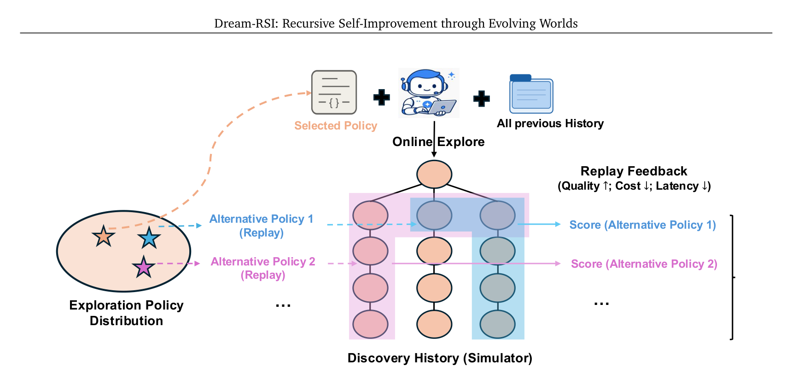
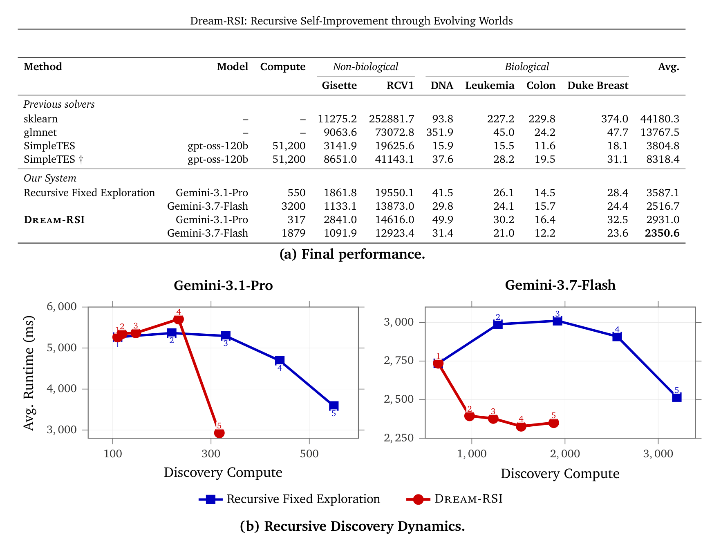
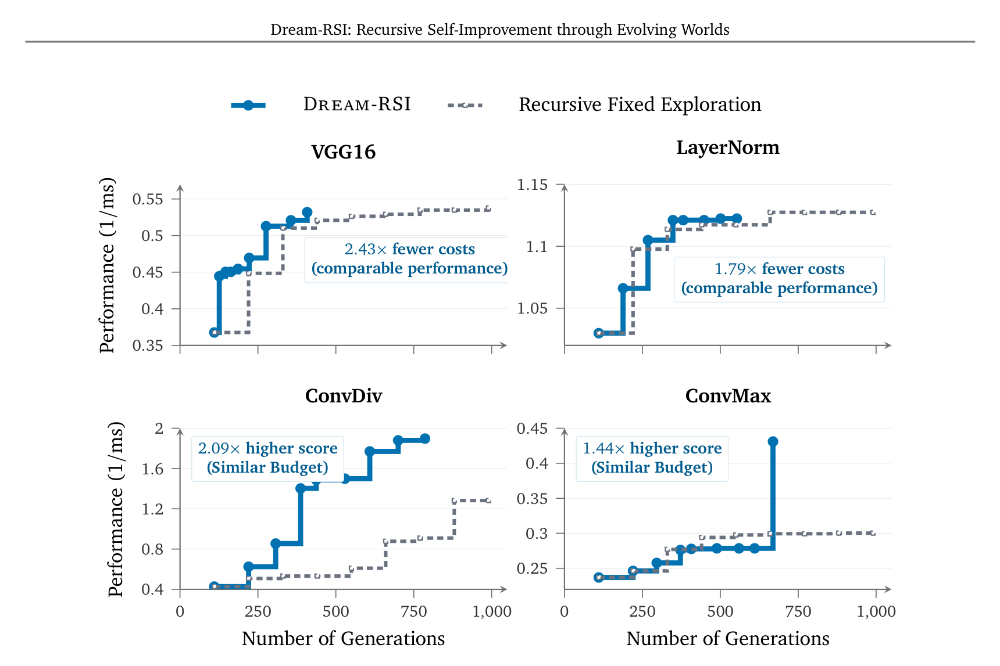
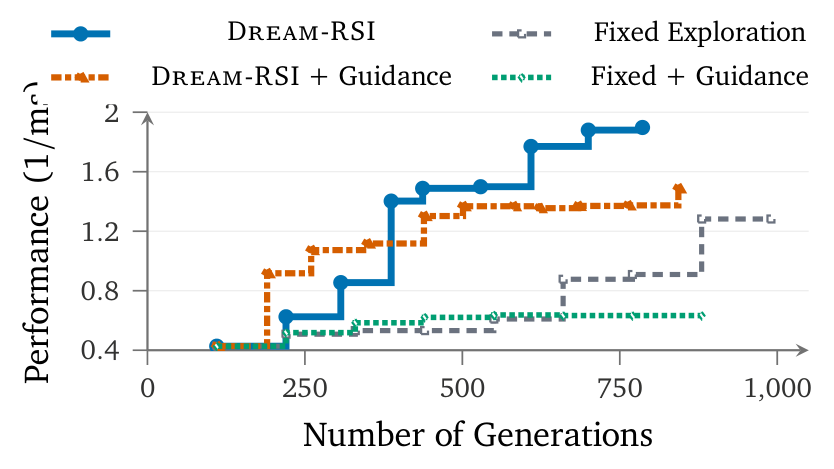
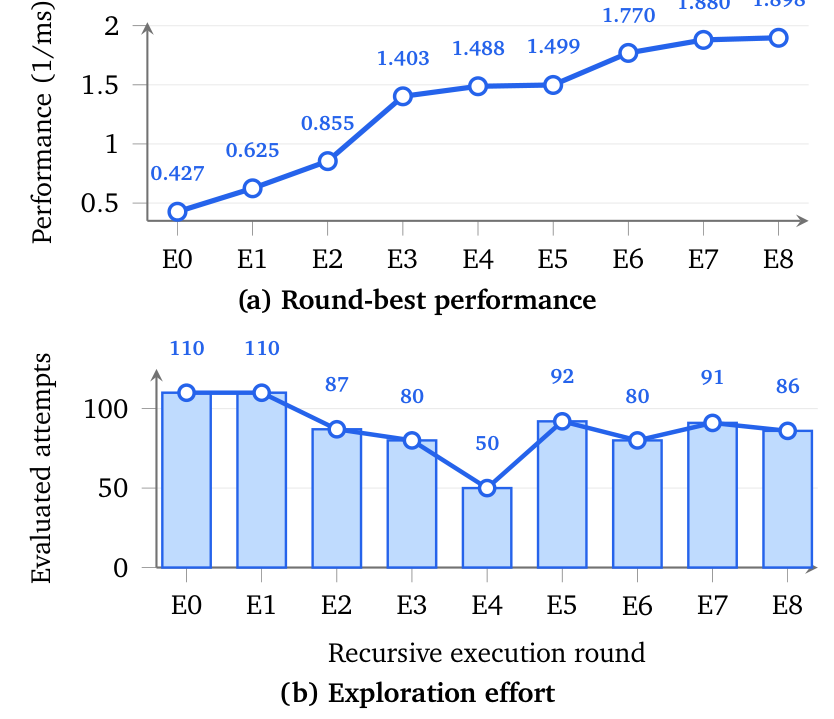

> [paper][git] https://github.com/zhengkid/Dream-RSI.git · https://arxiv.org/abs/2609.14858

# Dream-RSI: Recursive Self-Improvement through Evolving Worlds

## Summary & Outline

Google 및 Google DeepMind 연구진이 제안한 **Dream-RSI**는 과학적·알고리즘적 발견(Discovery) 과제에서 에이전트의 탐색 정책(Exploration Policy) 자체를 재귀적으로 자체 개선(Recursive Self-Improvement, RSI)하는 메타 탐색 오케스트레이션 프레임워크다.

자율 AI 에이전트가 고난도 장기 탐색(long-horizon exploration)을 수행할 때 마주하는 근본적 딜레마는, 고정된 탐색 전략은 탐색 공간 확장에 대응하지 못하는 반면 온라인 탐색 정책 최적화는 지연되고 값비싼 피드백(수천 회의 제안-평가 주기 관찰 필요)으로 인해 막대한 연산 비용이 소모된다는 점이다. Dream-RSI는 **"완료된 과거 탐색 이력(Discovery Tree) 자체가 탐색 공간에 대한 결정론적 재생 시뮬레이터(Replay Simulator / World Model) 역할을 수행할 수 있다"**는 통찰을 제시한다.

기존 코딩 에이전트와 평가자를 전혀 변경하지 않은 채, 탐색 분기(branching)·병렬화(parallelism)·조기 종료(stopping)를 제어하는 경량 제어 계층을 분리하고, 축적된 탐색 트리 위에서 가상 롤아웃을 수행하는 **"드림(Dreaming)"**을 통해 코드 실행이나 모델 호출 없이 즉각적이고 저비용인 오프폴리시(off-policy) 피드백을 확보한다. 이를 통해 개정된 탐색 정책을 온라인에 재배포하고 다시 새로운 시뮬레이터를 확충하는 닫힌 재귀 루프를 완성한다. 알고리즘 공학(Lasso path solver), 수학적 최적화(Sum-Difference, Circle Packing, Autocorrelation), GPU 커널 공학(KernelBench 4종)의 8개 벤치마크 전반에서 기존 SimpleTES 대비 최대 162배 적은 비용으로 동등 이상의 성능을 달성했다.

```
+-------------------------------------------------------------------------------------------------------+
|                                        Dream-RSI Closed Loop                                          |
|                                                                                                       |
|    [Stage 1: Online Exploration]                                                                      |
|    - Current Policy π_t drives real rollouts on Task                                                  |
|    - Worker pool (W concurrent calls) executes candidates                                              |
|    - Generates and logs actual Discovery Tree T_t with execution traces/scores                        |
|                                     │                                                                 |
|                                     ▼                                                                 |
|    [Stage 2: Replay Simulator Construction (Evolving Worlds)]                                         |
|    - Archives H_t = H_{t-1} ∪ {T_t}                                                                   |
|    - Freezes code outcomes, scores, and diagnostics into deterministic replay trees                   |
|                                     │                                                                 |
|                                     ▼                                                                 |
|    [Stage 3: Dreaming-based Policy Improvement (Offline Meta-RSI)]                                    |
|    - Policy Dev Agent generates candidate policies π_t^m (m = 0 ... M-1, π_t^0 = π_t)                 |
|    - Candidate policies "dream" across all historical trees {T_1, ..., T_t} without LLM/exec calls    |
|    - Evaluates trade-off: Quality (max s_v) - Cost (β_1·N) + Parallelism Bonus (β_2·N / k)            |
|    - Selects π_{t+1} = argmax V^m, strictly guaranteeing V^{m*} ≥ V^0 (monotonic non-degradation)     |
|                                     │                                                                 |
|                                     └─────────────────────► Redeploy Online (Stage 1)                 |
+-------------------------------------------------------------------------------------------------------+
```

---

## Problem & Motivation

### 1. 장기 자율 탐색에서의 메타 최적화 병목
자율 AI 에이전트의 재귀적 자체 개선(RSI) 연구는 과학적 발견(단백질 구조, 수학적 반례 발견, 양자 회로), 알고리즘 최적화, GPU 커널 튜닝 등 고부가가치 도메인에서 눈부신 성과를 거두고 있다. 그러나 목표 문제의 난이도가 상승함에 따라, 수천 번 이상의 '가설 제안-코드 생성-실행 평가(proposal–evaluation)' 루프를 동반하는 장기 탐색(long-horizon exploration)이 필연적으로 요구된다.

이 규모에서 탐색 오케스트레이션의 효율성은 전체 시스템의 성패를 가르는 결정적 요인이 된다:
1. **고정 전략(Fixed Strategies)의 적응 한계**: AlphaEvolve, SimpleTES, ShinkaEvolve 등 대부분의 기존 시스템은 병렬 분기 수, 심도별 리파인먼트 횟수, 가지치기 기준 등을 사람이 사전에 정적으로 정의한 규칙에 의존한다. 이러한 고정 전략은 탐색 공간의 구조 변화나 포화(saturation) 상태에 적응하지 못하고 비효율적인 탐색 경로에 연산을 낭비한다.
2. **온라인 정책 최적화의 극심한 피드백 지연**: 탐색 정책을 온라인 상에서 직접 학습하거나 개선하려는 시도는 극심한 피드백 지연에 직면한다. 개별 코드 후보의 평가는 즉각적인 채점 함수로 측정 가능하지만, '특정 탐색 정책이 우수한가'를 판정하려면 그 정책에 따라 수백~수천 회의 탐색 루프를 끝까지 실행해 보아야만 한다.
3. **방대한 메타 정책 공간과 시행착오 비용**: 탐색 정책 코드 공간은 매우 넓으며, 새로 제안된 정책이 조기 종료되거나 무한 루프에 빠지는 등 결함을 가질 가능성이 높다. 매 후보 정책마다 실제 코딩 에이전트와 컴파일러/벤치마크를 동원해 온라인 롤아웃을 수행하는 것은 현실적으로 불가능한 연산 비용을 수반한다.

### 2. 세계 모델(World Model) 및 리플레이 시뮬레이터로의 발상 전환
Dream-RSI 연구진은 모델 기반 강화학습(Model-Based RL)과 World Models(Ha & Schmidhuber 2018, Dreamer 시리즈)의 핵심 원리에서 해법을 도출했다. 물리 환경을 탐험한 에이전트가 수집된 궤적으로부터 환경 전이 모델을 학습하고, 그 내부 시뮬레이션("꿈, Dream") 속에서 수많은 행동 정책을 무비용으로 상상·평가하듯, **"이미 수행 완료된 과거 탐색 이력(Discovery History)은 탐색 공간의 실제 실현된 부분에 대한 완벽하게 접지된(grounded) 리플레이 시뮬레이터"**가 된다.

과거 탐색 기록을 단순한 텍스트 프롬프트 맥락이나 가중치 미세조정용 데이터셋으로 소비하던 종래의 방식과 달리, 부모-자식 관계와 실행 결과가 기록된 탐색 트리(Discovery Tree)를 불변의 시뮬레이터 풀로 취급하면, 새로운 탐색 정책은 실제 코드를 다시 생성하거나 컴파일할 필요 없이 기존 트리를 다른 순서, 다른 병렬 묶음, 다른 가지치기 기준으로 순회하는 것만으로 그 성능을 밀리초 단위에 즉각 측정할 수 있다.



---

## Key Insights & Contributions

1. **과거 탐색 이력의 시뮬레이터화 (History as Replay Simulator)**:
   - 완료된 탐색 트리를 상태 전이 모델로 재해석함으로써, 장기 탐색에서 가장 큰 장벽이었던 메타 탐색 정책 평가의 피드백 지연과 고비용 문제를 근본적으로 해소했다.
   - 단 한 번의 실제 온라인 탐색 실행으로 생성된 트리가 수십~수백 개의 대안 탐색 정책을 평가하는 재사용 가능한 시뮬레이션 환경("Evolving Worlds")으로 기능한다.

2. **메타 계층 재귀적 자체 개선 루프 (Meta-Layer RSI via Dreaming)**:
   - 기저 코딩 에이전트(LLM)와 태스크 평가기를 일절 수정하지 않고, 탐색 오케스트레이션 정책 코드만을 대상으로 하는 순수 메타 계층 closed-loop 최적화를 정립했다.
   - 오프라인 Dreaming 평가에서 현재 배포된 정책(`π_t^0 = π_t`)을 후보군에 반드시 포함시켜 최적 버전을 선발(`argmax V^m`)함으로써, 이전 정책 대비 성능이 절대 저하되지 않는 단조 비감소 보증(`V^{m*} ≥ V^0`)을 확립했다.

3. **다양한 영역에서의 압도적 효율성 실증 (Cross-Domain Empirical Validation)**:
   - **알고리즘 공학**: 고차원 통계의 핵심 연산인 Lasso Regularization Path 솔버 발견 과제에서, GPT-OSS-120B 기반 SimpleTES(51,200회 호출) 대비 약 1/162에 불과한 317회의 Gemini-3.1-Pro 호출만으로 6개 미공개 벤치마크 평균 실행 시간을 3804.8ms에서 2931.0ms로 단축.
   - **수학적 최적화**: Sum-Difference 과제에서 1.145427을 기록해 기존 SOTA를 경신했으며, Circle Packing(2.635983) 최고 기록 달성 및 Autocorrelation에서 50배 이상의 예산 절감 달성.
   - **GPU 커널 공학**: KernelBench 4개 과제(VGG16, LayerNorm, ConvDiv, ConvMax)에서 동일 성능 도달까지 1.79배~2.43배 적은 세대를 소모하거나, 동일 예산 하에서 최대 2.09배 높은 커널 성능을 달성.

4. **장기 탐색에서의 귀납적 편향(Inductive Bias) 규명**:
   - 과거 이력을 고수준의 텍스트 요약 지침(Semantic Guidance)으로 축약해 프롬프트에 주입하는 통상적인 접근법이 병렬 작업자들의 탐색 다양성을 심각하게 저해하고 국소 최적해에 조기 갇히게 만든다는 실험적 반례를 명확히 입증.

---

## Method & Architecture

### 1. 시스템 구성도 및 3단계 동작 흐름
Dream-RSI는 아래와 같이 온라인 탐색, 시뮬레이터 구축, 오프라인 드림 정책 개선의 3개 단계를 순환한다.


```
========================================================================================================
                                     Dream-RSI Execution Pipeline
========================================================================================================

[Phase 1: Online Rollout (Iteration t)]
   Task Spec & Evaluator (Fixed)
              │
              ▼
   Initial Tree T_t^0 = {r}
   Loop k = 0 ... K_1:
      1. Prefix Observation T_t^k observed by Policy π_t
      2. Policy outputs batch: C_t^k ⊆ A(T_t^k; W),  |C_t^k| ≤ W
      3. Workers (W parallel threads) invoke Coding Agent (Gemini) on selected parents
      4. Evaluator executes code, scores result s_v, attaches children -> T_t^{k+1}
   End when batch is empty or round limit K_1 reached -> Final Tree T_t

[Phase 2: Simulator Pool Expansion]
   H_t = H_{t-1} ∪ {T_t}   (Pool of Evolving Replay Worlds)

[Phase 3: Dreaming-based Policy Improvement (Offline)]
   Policy Version Pool: π_t^0 (= π_t), π_t^1, ..., π_t^{M-1}
   For each candidate policy π_t^m:
      For each historical world T_i ∈ H_t (i = 1 ... t):
         Start at T_i^{m, 0} = {r}
         Loop k = 0 ... K_2:
            - Policy observes revealed subtree T_i^{m, k}
            - Selects batch C_i^{m, k} ⊆ A(T_i^{m, k}; W)
            - State transition: Deterministically reveal recorded children from T_i
              (No LLM call, no code compile, instant dictionary lookup)
         Terminal round k_i^{m,*}, nodes N_i^m = |T_i^{m, k_i^{m,*}}| - 1
         Compute World Score:
            V_i^m = max s_v  -  β_1 · N_i^m  +  β_2 · ( N_i^m / max{1, k_i^{m,*}} )
      Average Score: V^m = (1/t) ∑_{i=1}^t V_i^m
      Policy-Development Agent diagnoses traces and updates code -> π_t^{m+1}
   Selection: π_{t+1} = argmax_{m} V^m   (Guaranteed V^{m*} ≥ V^0)
   Deploy π_{t+1} to Phase 1 (Iteration t+1)
========================================================================================================
```

### 2. 탐색 트리 및 공유 결정 인터페이스 (Shared Decision Interface)
탐색 과정은 트리 구조 `T`로 정형화된다:
- **루트 노드 `r`**: 초기 워크스페이스 상태 (베이스라인 코드 및 기본 환경).
- **비루트 노드 `v`**: 유일한 주 부모(primary parent)를 가지며, 부모의 파일시스템 스냅샷과 누적 관측 맥락을 상속받아 시도된 단일 생성-평가 사이클. 코드 아티팩트, 평가 진단 로그, 스칼라 점수 `s_v`를 보존한다.

온라인 실행과 오프라인 리플레이는 정확히 동일한 결정 인터페이스를 공유한다:
- **후보 노드 집합 `A(T)`**: 현재 관측된 트리의 루트 및 모든 리프 노드.
```
A(T) = {r} ∪ {v ∈ T : v is a leaf of T}
```
- **실행 배치 행동 `C`**: 최대 병렬 워커 수 `W` 이하의 노드 부분집합.
```
C ∈ A(T; W) = {C ⊆ A(T) : |C| ≤ W}
```

### 3. 오프라인 리플레이 전이 메커니즘
오프라인 드림 단계에서 candidate 정책 `π_t^m`이 배치 `C_i^{m,k}`를 선택하면, 실시간 생성을 수행하는 대신 기록된 트리 `T_i`에서 자식 노드들을 결정론적으로 노출한다:

```
T_i^{m, k+1} = T_i^{m, k} ∪ ⋃_{v ∈ C_i^{m,k}} Child(v; T_i, T_i^{m, k})
```

- 일반 노드(`v ≠ r`): `v`의 기록된 자식 노드 1개를 노출.
- 루트 노드(`v = r`): 이전에 열리지 않은 새로운 브랜치의 첫 번째 자식을 생성 시점 순서대로 노출하여 신규 탐색 갈래를 개척.
- 더 이상 기록된 후속 노드가 없으면 공집합(`∅`)을 반환.

이 전이 과정에는 어떠한 LLM 추론이나 샌드박스 코드 실행도 개입하지 않으므로, 수백 회의 결정 라운드로 구성된 장기 롤아웃이 수 밀리초 내에 완료된다. 상세 API 및 제어 명세는 스니펫 파일 [replay_policy_api](../source/git/snippets/Dream-RSI_Recursive_Self-Improvement_through_Evolving_Worlds_2026_Google__replay_policy_api.md)에 정리되어 있다.

### 4. 리플레이 목적 함수 및 파레토 트레이드오프
오프라인 시뮬레이터에서 탐색 정책을 평가하는 목적 함수 `V_i^m`은 단순 최고 점수만을 보지 않고, 탐색 품질·연산 비용·병렬화 효율의 3자 균형을 엄밀하게 수식화한다:

```
V_i^m = max_{v ∈ T_i^{m, k_i^{m,*}}} s_v  -  β_1 · N_i^m  +  β_2 · ( N_i^m / max{1, k_i^{m,*}} )
        [   discovery quality   ]    [ execution cost ]    [    parallelism bonus    ]
```

- **품질 항 (`max s_v`)**: 탐색 궤적 내에서 달성한 최고 솔루션 점수.
- **비용 페널티 (`- β_1 · N_i^m`)**: 노출된 비루트 노드 수(즉, 필요한 생성-평가 요청 총량)에 비례하는 감점. 불필요한 가지치기 지연을 억제.
- **병렬성 보너스 (`+ β_2 · (N_i^m / k_i^{m,*})`)**: 라운드당 평균 처리량. 워커들을 놀리지 않고 유망한 후보들을 한 라운드에 병렬 배치로 묶어 처리하는 정책에 가산점 부여 (직렬 탐색 대비 지연시간 대폭 단축).

실제 구현에서는 파레토 보상 공식이 적용된다:
```
pareto.reward = pareto.auc - λ · parallel_penalty
```
여기서 `parallel_penalty`는 `effective_sequential_rounds / total_probes`로 계산되어, 완전 직렬 탐색 시 1에 가까워지고 유용한 완전 병렬 탐색 시 `1/W`에 수렴한다.

### 5. 탐색 정책의 진화 규칙 및 안전 장치
정책 개발 에이전트(LLM)는 다음과 같은 엄격한 계약(Contract) 하에서 코드를 리팩토링한다:
1. **접두부 한정 관측 (Prefix-Only Observation)**: 정책은 현재까지 공개된 `question.observed()` 상태만을 참조해야 하며, 미래의 미공개 점수나 숨겨진 최적해 식별자에 접근할 수 없다 (정보 누출 원천 차단).
2. **동적 포트폴리오 배치 구성**: 각 라운드에서 배치는 (1) 강력한 기존 브랜치 정밀화(Exploitation), (2) 신규 루트 개척(Exploration), (3) 복구 가능한 구현 오류 브랜치 재생(Recovery)의 3가지 역할을 증거 기반으로 조합한다.
3. **단일 실패에 의한 성급한 폐기 방지**: 구문 에러, 메모리 한계, 변수명 오류 등은 복구 가능한 구현 실패(repairable failure)로 분류하여 즉각적인 영구 폐기를 금지한다.
4. **동적 그리드 플래닝 (`plan_grid`)**: 라이브 탐색 전에 과거 매니페스트를 기반으로 적정 브랜치 수 `W`와 깊이 `R`을 사전 계획한다.

---

## Experiments & Quantitative Results

### 1. 알고리즘 공학: Lasso Regularization Path 발견
고차원 통계 및 유전체 분석에서 필수적으로 사용되는 Lasso 정규화 경로 계산 알고리즘을 최적화하는 과제다. 17개의 합성 데이터셋에서 탐색을 진행하고, 일반화 검증을 위해 6개의 완전히 격리된 실제 벤치마크(Gisette, RCV1, DNA, Leukemia, Colon, Duke Breast)에서 벽시계 실행 시간(ms)을 측정했다.



#### 성능 및 연산 효율성 정량 비교

| 솔버 / 시스템 | 백본 모델 | 탐색 연산 (호출 수) | 비생물학 (Gisette) | 비생물학 (RCV1) | 생물학 (DNA) | 생물학 (Leukemia) | 생물학 (Colon) | 생물학 (Duke) | 6개 평균 (ms) |
|---|---|---|---|---|---|---|---|---|---|
| **기존 표준 라이브러리** |
| `scikit-learn` | — | — | 11,275.2 | 252,881.7 | 93.8 | 227.2 | 229.8 | 374.0 | 44,180.3 |
| `glmnet` (Fortran/C) | — | — | 9,063.6 | 73,072.8 | 351.9 | 45.0 | 24.2 | 47.7 | 13,767.5 |
| **선행 자동 발견 SOTA** |
| SimpleTES | GPT-OSS-120B | 51,200 | 3,141.9 | 19,625.6 | 15.9 | 15.5 | 11.6 | 18.1 | 3,804.8 |
| SimpleTES † (동일환경) | GPT-OSS-120B | 51,200 | 8,651.0 | 41,143.1 | 37.6 | 28.2 | 19.5 | 31.1 | 8,318.4 |
| **통제 실험: Gemini-3.1-Pro** |
| Recursive Fixed Exploration | Gemini-3.1-Pro | 550 | 1,861.8 | 19,550.1 | 41.5 | 26.1 | 14.5 | 28.4 | 3,587.1 |
| **Dream-RSI** | Gemini-3.1-Pro | **317** | 2,841.0 | 14,616.0 | 49.9 | 30.2 | 16.4 | 32.5 | **2,931.0** |
| **통제 실험: Gemini-3.7-Flash** |
| Recursive Fixed Exploration | Gemini-3.7-Flash | 3,200 | 1,133.1 | 13,873.0 | 29.8 | 24.1 | 15.7 | 24.4 | 2,516.7 |
| **Dream-RSI** | Gemini-3.7-Flash | **1,879** | 1,091.9 | 12,923.4 | 31.4 | 21.0 | 12.2 | 23.6 | **2,350.6** |

- **압도적인 계산 절감**: SimpleTES의 51,200회 대비 Dream-RSI(Gemini-3.1-Pro)는 **317회의 에이전트 호출(161.5배 절감)**만으로 2,931.0ms를 달성하여 SimpleTES 원작 보고 수치(3,804.8ms)보다 22.9% 더 빠른 솔버를 찾아냈다.
- **고정 탐색 대비 지속적 우위**: 고정 탐색 정책(Fixed Exploration) 대비 호출 수는 42.4% 감소(550→317)하면서 평균 실행 시간은 18.3% 단축(3,587.1ms → 2,931.0ms)되었다.

#### 발견된 솔버(Discovered Solver)의 핵심 알고리즘 아키텍처
Dream-RSI가 자동 생성한 C++ 구현체([lasso_active_set_solver](../source/git/snippets/Dream-RSI_Recursive_Self-Improvement_through_Evolving_Worlds_2026_Google__lasso_active_set_solver.md))는 기존 SimpleTES 솔버(문제 크기에 따라 LARS와 Coordinate Descent를 단순 분기)와 차원이 다른 최적화 기법들을 독자적으로 융합했다:
1. **적응형 코시-슈바르츠 KKT 가지치기 (Cauchy-Schwarz KKT Pruning)**:
   대규모 행렬(`p ≥ 500 && n ≥ 150`)에서 잔차의 노름 상계를 활용해 피처의 활성화 여부를 `O(1)`에 선별하고, 경계가 불확실할 때만 그래디언트를 재계산.
2. **분리 파티션 활성 집합 관리 (Disjoint-Partition Active-Set Bookkeeping)**:
   `unscreened_list`와 `screened_list`를 분리하고 `O(1)` 스왑 삭제(swap-deletion)를 적용해 불필요한 배열 순회 제거.
3. **SIMD 4x 레지스터 블로킹 지연 그람 행렬 (Lazy Gram Matrix)**:
   열 벡터 로딩을 4개 단위로 묶어 AVX 연산을 수행함으로써 메모리 대역폭 병목을 75% 감축.

### 2. 수학적 최적화 (Mathematics Optimization)
이산 조합론(Sum-Difference), 기하학적 패킹(Circle Packing), 함수 해석학(Autocorrelation Inequalities) 3개 과제에서 10회 라운드 탐색을 수행했다.

#### 벤치마크 결과 비교 (Table 1)

| 방법론 | 백본 LLM | Sum-Diff (↑) | Autocorrelation (↓) | Circle Packing (↑) |
|---|---|---|---|---|
| AlphaEvolve | Gemini-2.0 Pro + Flash | — | 1.455700 | 2.635862 |
| AlphaEvolveV2 | Gemini-2.0 Pro + Flash | 1.121936 | — | 2.635983 |
| OpenEvolve | — | — | 1.460000 | — |
| CodeEvolve | — | — | — | 2.635980 |
| ShinkaEvolve | Mixed | — | 1.457800 | 2.635982 |
| TTS-Discovery | Qwen3-8B | — | — | 2.635983 |
| ThetaEvolve | Distilled-Qwen3-8B | — | 1.493000 | 2.635983 |
| EvoX | Gemini-3.0-Pro | — | 1.458900 | 2.635900 |
| SimpleTES | GPT-OSS-120B (51.2k) | 1.143975 | **1.453675** | 2.635983 |
| **Recursive Fixed** | Gemini-3.1-Pro | 1.144047 | 1.456001 | 2.635983 |
| **Dream-RSI** | Gemini-3.1-Pro (<1k) | **1.145427** | 1.456375 | **2.635983** |

- **Sum-Difference**: Dream-RSI는 **1.145427**을 기록해 SimpleTES(1.143975)와 Recursive Fixed(1.144047)를 제치고 신기록을 달성.
- **Circle Packing**: 최고 수치인 **2.635983**에 완벽히 도달.
- **Autocorrelation**: 51,200세대를 투입한 SimpleTES(1.453675)와 대등한 **1.456375**를 1,000세대 미만의 예산으로 확보 (50배 이상의 비용 절감).

### 3. GPU 커널 공학 (KernelBench)
하드웨어 아키텍처, 공유 메모리, 워프 정렬 등 복합적인 엔지니어링 제약이 요구되는 KernelBench 4개 과제(VGG16, LayerNorm, ConvDiv, ConvMax)에서 Triton/CUDA 커널을 생성·평가했다.



- **VGG16**: Recursive Fixed Exploration 대비 **2.43배 적은 생성 횟수**로 동일 최고 성능에 도달.
- **LayerNorm**: **1.79배 적은 생성 횟수**로 동일 최고 성능에 도달.
- **ConvDiv**: 약 750세대 시점에서 고정 탐색(0.9 1/ms 수준) 대비 **2.09배 높은 성능 (1.898 1/ms)** 달성.
- **ConvMax**: 동일 예산 내에서 고정 탐색(0.30 1/ms) 대비 **1.44배 높은 성능 (0.43 1/ms)** 도달.

---

## Deep Dive & Analytical Findings

### 1. 과거 탐색 이력의 텍스트 요약 지침(Semantic Guidance) 주입 역효과
에이전트 메모리 및 자기개선 문헌에서 널리 쓰이는 패턴 중 하나는, 과거 탐색 성공/실패 사례를 자연어 요약 또는 지침(Directional Guidance)으로 변환해 다음 라운드 프롬프트에 주입하는 것이다. Dream-RSI 연구진은 이 방식의 유효성을 엄밀히 검증하기 위해 ConvDiv 과제에서 안내가 있는 경우(+ Guidance)와 없는 경우를 직접 비교했다.



실험 결과는 매우 인상적인 반직관적 사실을 드러냈다:
- **안내 주입 시 성능의 심각한 저하**: Dream-RSI 단독은 1.898 1/ms까지 지속 상승한 반면, 텍스트 지침이 주입된 Dream-RSI + Guidance는 1.48 1/ms 부근에서 조기 정체되었다. 고정 탐색의 경우 저하는 더욱 극심하여, 기본 1.28 1/ms에서 0.63 1/ms로 반토막 났다.
- **원인 분석**: 여러 병렬 워커가 넓은 탐색 공간을 독립적으로 개척해야 하는 장기 탐색에서, 과거의 편향된 성공 경로를 기반으로 추상화된 자연어 지침을 주입하면 모든 워커가 특정 하위 공간에 과도하게 수렴하게 된다. 즉, 프롬프트 수준의 고수준 의미론적 안내는 탐색 다양성을 파괴하는 독으로 작용한다. 반면 Dream-RSI는 텍스트 편향을 주입하지 않고 오케스트레이션 제어기(분기 폭, 깊이, 배치)만을 리플레이로 학습하므로 탐색의 자율성을 완벽히 보존한다.

### 2. 탐색 행동의 동적 적응 메커니즘 (Exploration Behavior Evolution)
라운드가 거듭됨에 따라 Dream-RSI가 학습한 정책이 어떻게 탐색 자원을 배분하는지 ConvDiv 9개 라운드(E0~E8) 추이를 추적했다.



- **초기 정밀화와 연산 절감 (E0 → E4)**: 초기 라운드 E0, E1에서는 110회의 탐색을 수행하다가, 유망한 브랜치가 발견되자 불필요한 브랜치를 과감히 쳐내며 평가 시도를 E4에서 50회까지 54.5% 절감했다.
- **정체기 감지와 재탐색 확대 (E5 → E8)**: E4 부근에서 성능 향상이 정체되자(1.488 → 1.499), 제어기는 정체 신호를 감지하고 평가 시도를 다시 92회, 80회, 91회, 86회로 공격적으로 확대했다. 이 재확장 덕분에 성능은 1.770, 1.880을 거쳐 최종 1.898 1/ms까지 비약적으로 상승했다.
- 고정된 탐색 전략으로는 불가능한 '수축과 팽창(contraction and expansion)'의 동적 조절이 리플레이 시뮬레이터 상에서의 드림을 통해 자율 획득되었음을 증명한다.

---

## Critical Analysis

### Strengths & Significance
1. **메타 최적화의 비용 패러다임 전환**:
   탐색 정책을 학습하기 위해 수만 번의 온라인 에이전트 롤아웃을 수행해야 했던 기존 연구의 한계를 타파하고, 과거 실행 이력을 결정론적 전이 모델로 재해석함으로써 메타 학습 비용을 거의 0으로 만들었다.
2. **비침습적(Non-invasive) 모듈형 설계**:
   기저 코딩 에이전트(Gemini, Claude, GPT 등)의 프롬프트나 가중치를 전혀 수정할 필요가 없으며, 평가 벤치마크 환경 역시 블랙박스로 유지된다. 오직 오케스트레이션 파이프라인의 정책 코드만 진화하므로 임의의 에이전트 시스템에 즉시 결합 가능하다.
3. **이론적 단조 개선 안전성**:
   선택 메커니즘(`argmax V^m`)에 기존 배포 정책(`π_t`)이 항시 포함되므로, 최소한 과거 환경들에 대해서는 성능이 저하되는 모델 붕괴나 정책 퇴보가 이론적으로 방지된다.

### Limitations
1. **서포트 외부(Out-of-Support) 탐색의 한계**:
   리플레이 시뮬레이터는 과거에 실제로 탐색되었던 노드들의 집합에 국한된다. 과거 이력에 존재하지 않는 완전히 새로운 코드 분기나 상태 전이는 시뮬레이터 내에서 재생될 수 없다. 따라서 오프라인 정책 개선은 '과거에 발견된 브랜치들을 얼마나 효율적인 순서와 배치로 탐색할 것인가'에 집중되며, 완전히 새로운 가설 공간을 시뮬레이터 내부에서 자가 생성하지는 못한다.
2. **트리 데이터 축적과 메모리 오버헤드**:
   수십 회 이상의 외부 라운드가 누적되면 과거 트리 `H_t`의 노드 수가 기하급수적으로 증가하여 오프라인 리플레이 순회 시간이 길어질 수 있다. 장기 운영 시에는 대표적인 서브트리만을 선별하거나 압축하는 메커니즘이 보완되어야 한다.
3. **확률적 평가 환경에 대한 민감도**:
   결정론적 채점 환경(알고리즘 정규화 경로, 수학 문제, GPU 커널 벤치마크)에서는 리플레이 결과가 100% 신뢰성을 갖지만, 평가 노이즈가 심하거나 분산이 큰 환경(예: 웹 에이전트, 강화학습 시뮬레이터)에서는 과거 노드의 점수가 실제 성능을 완벽히 대표하지 못할 위험이 있다.

### Future Work & Improvements
1. **생성형 세계 모델(Generative World Model)과의 융합**:
   단순 기록 기반 재생을 넘어, 과거 노드들의 코드 임베딩과 결과 피드백을 기반으로 '시도되지 않은 새로운 분기의 점수'를 예측하는 뉴럴 월드 모델을 결합한다면 서포트 외부로의 드림 확장이 가능해질 것이다.
2. **다중 에이전트 협업 오케스트레이션 확장**:
   단일 코딩 에이전트의 병렬 호출을 넘어, 설계자-구현자-검증자로 구성된 복합 멀티 에이전트 팀의 역할 분담 정책을 메타 드림 루프로 최적화하는 연구가 유망하다.
3. **크로스 태스크 메타 전이(Cross-Task Transfer)**:
   특정 알고리즘 과제에서 진화된 탐색 정책(예: 수축-팽창 스케줄러)을 다른 도메인의 탐색 과제에 제로샷 또는 퓨샷으로 전이하는 일반화 성능 검증이 요구된다.

---

## References & Code Links
- **Paper**: [arXiv:2609.14858](https://arxiv.org/abs/2609.14858)
- **Official GitHub**: [zhengkid/Dream-RSI](https://github.com/zhengkid/Dream-RSI.git)
- **Project Page**: [dream-rsi.com](https://dream-rsi.com)
- **Local Submodule**: [source/git/Dream-RSI_zhengkid](../source/git/Dream-RSI_zhengkid)
- **Local Excerpt**: [source/paper/Dream-RSI_Recursive_Self-Improvement_through_Evolving_Worlds_2026_Google.md](../source/paper/Dream-RSI_Recursive_Self-Improvement_through_Evolving_Worlds_2026_Google.md)
- **Local Code Snippets**:
  - [replay_policy_api](../source/git/snippets/Dream-RSI_Recursive_Self-Improvement_through_Evolving_Worlds_2026_Google__replay_policy_api.md)
  - [lasso_active_set_solver](../source/git/snippets/Dream-RSI_Recursive_Self-Improvement_through_Evolving_Worlds_2026_Google__lasso_active_set_solver.md)
  - [exploration_prompt](../source/git/snippets/Dream-RSI_Recursive_Self-Improvement_through_Evolving_Worlds_2026_Google__exploration_prompt.md)
