> [paper][git] https://github.com/microsoft/KBLaM.git · https://arxiv.org/abs/2410.10450

# KBLaM: Knowledge Base augmented Language Model

## Summary & Outline

외부 지식 베이스(Knowledge Base, KB)의 구조화된 트리플 `⟨name, property, value⟩`을 사전학습 문장 인코더와 선형 어댑터를 통해 1개 토큰 크기의 연속 키-값 벡터 쌍인 **지식 토큰(Knowledge Token, `(k_tilde_m, v_tilde_m) ∈ R^(L × D)`)**으로 변환한 뒤, 사전학습 거대 언어 모델(LLM)의 각 어텐션 레이어에 **직사각형 어텐션(Rectangular Attention)** 구조로 직접 주입하여 외부 지식을 증강하는 프레임워크인 **KBLaM(Knowledge Base augmented Language Model)**을 분석한다 (ICLR 2025 선정).

KBLaM은 사전학습된 LLM 백본과 문장 인코더를 완전히 동결(Frozen)한 채 오직 경량 선형 어댑터만 학습시키는 방식을 채택한다. 기존 RAG(Retrieval-Augmented Generation)와 같이 외부 검색기(Retriever) 모듈에 의존하는 2단계 파이프라인의 검색 오류 전파 및 최적화 단절 문제를 제거하고, 인컨텍스트 학습(In-Context Learning, ICL)의 이차적 계산·메모리 복잡도(`O((M·K + N)²D)`)를 극복하여 KB 크기 `M`에 대해 완전한 선형 복잡도(`O((M + N)ND)`)를 달성한다. 이를 통해 8K 컨텍스트 윈도우를 가진 8B LLM(Llama-3 8B, Phi-3-mini)에 **단일 A100 80GB GPU 환경에서 10,000개(10K+) 이상의 지식 트리플을 단일 컨텍스트로 통합**할 수 있다.

```
[KBLaM 전체 구조 Outline]
├── 1. Problem & Motivation: 외부 지식 주입 패러다임 비교 및 기존 RAG / ICL / SFT의 한계
├── 2. Contributions: 지식 토큰화, 직사각형 어텐션, 길이 스케일링, 완전 합성 정렬 학습
├── 3. Method:
│   ├── Step 1. Knowledge Token Formulation: ⟨name, property, value⟩ -> 1개 토큰 크기 (L × D) 압축
│   ├── Step 2. Linear Adapters & Offline Pre-computation
│   ├── Step 3. Rectangular Attention Mechanism & Separate Query Head (W_tilde_Q)
│   ├── Step 4. 전통적 Encoder-Decoder (Cross-Attention) 아키텍처와의 구조적 비교 분석
│   ├── Step 5. Attention Score Scaling for Length Generalization (log(C) - log(M))
│   ├── Step 6. Dynamic Sparsification (Top-K Key-Value Pruning for O(K) Inference)
│   └── Step 7. Instruction Tuning with 100% Synthetic Datasets (동결 백본 & 경량 어댑터 학습)
├── 4. Experiments & Results:
│   ├── Attention Interpretability & Retrieval Top-1/Top-5 Accuracy
│   ├── Simple & Multi-Entity Q&A (BERT Score F1)
│   ├── Open-Ended Reasoning Q&A (GPT-4 Score 0-5)
│   ├── Hallucination Refusal & Out-of-KB Precision/Recall
│   ├── Out-of-Distribution Generalization on Real Enron Email KB
│   ├── Robustness against Lexical Perturbation vs BM25 & Dense Retriever
│   └── Latency (TTFT) & Memory Footprint Scaling vs RAG / Prompt Caching
├── 5. Ablations:
│   ├── Sentence Encoder Capacity (MiniLM, MPNet, ada-002, text-embedding-3-large)
│   ├── Knowledge Token Injection Frequency (K = 1, 3, 10 layers)
│   └── Layer-by-Layer Representation Variance (Soft Prompt vs Semantic Knowledge)
└── 6. Analysis: Strengths, Limitations, and Future Work
```

---

## Problem & Motivation

### 1. 외부 지식 주입 패러다임 비교

거대 언어 모델이 최신 정보, 기업 비공개 문서, 개인화된 사실을 정확히 반영하도록 외부 지식을 주입하는 방식은 크게 네 가지 패러다임으로 분류된다:

| 항목 | 파라미터 미세조정 (SFT / Edit) | 인컨텍스트 학습 (ICL / Prompting) | 검색 증강 생성 (RAG) | **KBLaM (제안 방법론)** |
|---|---|---|---|---|
| **지식 통합 위치** | 모델 가중치 (`θ`) 내부 암기 | 입력 프롬프트 텍스트 컨텍스트 | 검색된 Top-k 텍스트 프롬프트 | **어텐션 Key-Value 지식 토큰** |
| **연산 복잡도** | 재학습 시 막대한 GPU 자원 소모 | `O((M·K + N)² · D)` (이차적 폭증) | 검색 `O(M·d)` + LLM `O((k·K + N)² · D)` | **`O((M + N) · N · D)` (선형적 확장)** |
| **메모리 오버헤드** | 없음 (가중치 고정) | `O((M·K + N)²)` (GPU 메모리 한계) | 검색기 인덱스 + Top-k KV 캐시 | **`O((M + N) · N)` (경량 선형 증가)** |
| **최대 수용 지식량** | 무제한 (단, 망각 발생) | 수십~수백 개 트리플 (컨텍스트 제약) | 수백만 문서 (단, 생성 시 k개만 주입) | **단일 GPU에서 10,000개+ 트리플 동시 주입** |
| **추론 파이프라인** | 단일 LLM 포워드 | 단일 LLM 포워드 (긴 Prefill) | 2단계 (검색기 분리 + LLM 생성) | **단일 LLM 엔드투엔드 소프트 검색·생성** |
| **지식 동적 갱신** | 모델 전체/일부 재학습 필수 | 프롬프트 수정 (전체 KV 캐시 무효화) | 벡터 인덱스 수정 (즉시 반영) | **단일 지식 토큰만 즉시 갱신 (캐시 보존)** |
| **위치 편향 (Lost in the Middle)** | 해당 없음 | 심각함 (중간 배치 지식 무시) | 중간 수준 (Top-k 순서 의존) | **없음 (지식 토큰 간 위치 독립성)** |
| **환각 억제 (답변 거부 제어)** | 어려움 (내부 지식과 혼재) | 프롬프트 지시어 의존 (불안정) | 검색 실패 시 환각 전파 | **인스트럭션 튜닝을 통한 거부 거동 학습** |

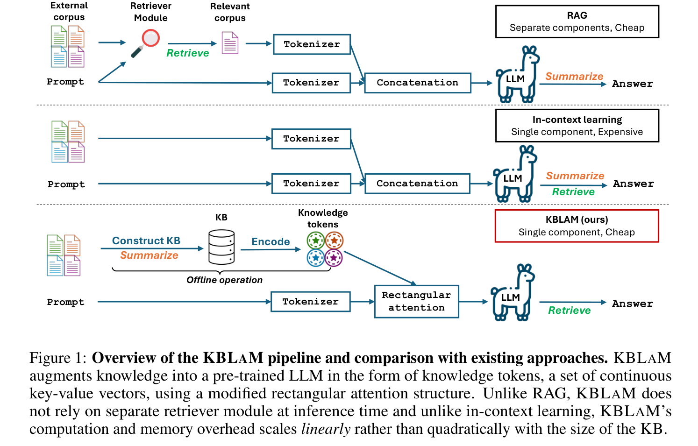

### 2. 기존 접근법의 구조적 한계

1. **Retrieval-Augmented Generation (RAG)의 단절 및 오류 전파**:
   - RAG는 외부 검색기(BM25, Dense Retriever)와 생성용 LLM이 별개의 컴포넌트로 분리되어 있다.
   - 검색기가 질문의 의미론적 모호성이나 어휘 불일치로 인해 정답 문서를 Top-K에 포함하지 못하면, LLM은 왜곡된 컨텍스트를 기반으로 답변하거나 심각한 환각(Hallucination)을 생성하게 된다.
   - 두 컴포넌트 간의 그래디언트 역전파가 불가능하여 전체 파이프라인의 엔드투엔드 최적화가 어렵다.
2. **In-Context Learning (ICL)의 이차적 자원 폭증 및 위치 편향**:
   - 비정형 텍스트나 트리플을 문자열로 직렬화하여 프롬프트에 나열하는 ICL은 시퀀스 길이가 길어질수록 어텐션 연산량이 `(M·K + N)²`로 폭증한다 (여기서 `K`는 트리플당 평균 토큰 수).
   - 어텐션 매트릭스 전체를 연산해야 하므로 단일 A100 GPU에서 약 200~500개 이상의 트리플을 올릴 수 없다.
   - 또한 긴 프롬프트 내부에서 정보의 위치에 따라 성능이 급격히 저하되는 "Lost in the Middle" 현상이 발생하며, 하나의 사실이 수정될 때마다 이전 모든 토큰의 KV 캐시가 무효화되어 재연산이 강제된다.
3. **Parameter Memorization (SFT / Model Editing)의 비효율성**:
   - 지식을 모델 파라미터에 직접 학습시키는 방식은 새로운 사실이 추가되거나 기존 사실이 변경될 때마다 파인튜닝을 반복해야 하며, 치명적 망각(Catastrophic Forgetting)과 높은 연산 비용을 유발한다.

---

## Contributions

KBLaM은 지식 베이스의 구조적 독립성을 수학적으로 모델링하여 기존 지식 증강 기법들의 한계를 근본적으로 해결한다:

1. **지식 토큰(Knowledge Tokens) 정식화**:
   - 구조화된 지식 트리플 `⟨name, property, value⟩`을 1개 토큰 크기의 연속 Key-Value 벡터 쌍 `(k_tilde_m, v_tilde_m) ∈ R^(L × D)`로 매핑하는 변환 기법을 제안.
   - 텍스트 문자열 길이에 구애받지 않고 고정된 차원으로 지식을 압축함으로써 메모리 사용량을 대폭 절감.
2. **직사각형 어텐션(Rectangular Attention) 아키텍처**:
   - 지식 토큰 상호 간의 무의미한 셀프 어텐션을 제거하고, 오직 프롬프트 쿼리가 이전 프롬프트 토큰들과 전체 지식 토큰들을 참조하는 `(M + N) × N` 직사각형 어텐션 행렬 설계.
   - 계산 및 메모리 복잡도를 `O((M + N)ND)`로 선형화하여 10K 이상의 트리플을 단일 8B 모델에 탑재.
3. **길이 일반화 어텐션 스케일링 (Attention Score Scaling)**:
   - KB 크기 `M`이 확장될 때 소프트맥스 분모에서 지식 토큰의 누적 합이 프롬프트 내부 토큰 정보를 압도하는 현상을 방지하기 위해 `log(C) - log(M)` 상수 오프셋 시프트를 도입하여 임의의 `M`에 대한 일반화 보장.
4. **동적 희소화 (Dynamic Sparsification / Top-K Key-Value Pruning)**:
   - 추론 시 쿼리와 지식 토큰 키 간의 내적 스코어 상위 K개만 선별하여 어텐션을 수행하는 동적 프루닝 메커니즘을 지원하여 초대규모 KB 환경에서도 극도의 속도와 낮은 메모리 점유 실현.
5. **동결 백본 기반 합성 인스트럭션 튜닝 (100% Synthetic Instruction Tuning)**:
   - 거대 언어 모델 백본을 동결한 채, 파라미터 학습의 목적이 "지식 암기"가 아니라 "인코더 임베딩 공간과 LLM 어텐션 공간 간의 선형 투영(Projection)"임을 규명.
   - LLM 사전 지식과 무관한 135K 완전 합성 트리플을 기반으로 4종(Simple, Multi-Entity, Open-Ended, Unanswerable) 인스트럭션 튜닝을 수행하여 실제 도메인(Enron email)으로의 제로샷 OOD 일반화 및 환각 억제(답변 거부) 달성.
6. **오픈소스 생태계 기여**:
   - PyTorch 및 Hugging Face 기반의 완전한 소스코드와 데이터셋(합성 KB, Enron KB)을 공개하여 재현성과 후속 연구 기반 제공.

---

## Method

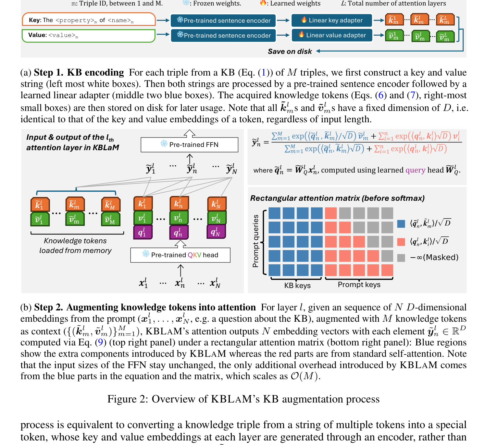

### 1. 지식 베이스 및 지식 토큰의 차원적 정의 (Dimension L × D)

지식 베이스(KB)는 비정형 코퍼스에서 엔티티 추출기를 통해 획득한 `M`개의 트리플 집합으로 정의된다:

```
KB = { (<name>_m, <property>_m, <value>_m) }_{m=1}^M
```

각 트리플 `m`은 사전학습 문장 인코더 `f(·) ∈ R^P`를 통해 기본 키(`k_m`)와 기본 값(`v_m`) 임베딩으로 변환된다:

```
k_m = f("The " + <property>_m + " of " + <name>_m) ∈ R^P
v_m = f(<value>_m) ∈ R^P
```

- **Key의 역할**: 식별자(Identifier)로서 프롬프트 쿼리와 매칭되어 해당 지식의 관련도를 결정.
- **Value의 역할**: 실제 지식 콘텐츠(Content)로서 어텐션 가중합을 통해 모델의 은닉 상태로 전달.

#### 차원 `L × D`의 구조적 의미
각 지식 토큰은 `L × D` 차원의 텐서로 표현된다:
* **`L` (Number of Transformer Layers)**: 백본 트랜스포머의 **전체 레이어 수**를 의미한다 (Llama-3 8B의 경우 `L = 32`, Phi-3-mini의 경우 `L = 32`). LLM은 하위 레이어에서 상위 레이어로 갈수록 구문 분석에서 고차원 의미 추론으로 표현 공간이 변화하므로, 단일 지식 항목이라도 각 레이어별 전용 Key/Value 벡터(`k_tilde^1_m, ..., k_tilde^L_m`)를 별도로 보유한다.
* **`D` (Hidden Dimension)**: LLM 어텐션의 **전체 은닉 차원 크기** (`hidden_size = num_heads × head_dim`)를 의미한다 (Llama-3 8B의 경우 `32 heads × 128 = 4096`, Phi-3-mini의 경우 `3072`). 이는 일반 텍스트 토큰 1개가 어텐션 레이어에서 차지하는 Key/Value 벡터의 크기와 정확히 일치한다.
* **1개 토큰으로의 압축**: 기존 ICL에서는 수십 토큰을 차지하던 긴 문자열의 트리플이, KBLaM에서는 **각 레이어당 정확히 1개 토큰 크기(`1 × D`)의 Key/Value 슬롯**으로 압축되어 총 `L × D`의 고정 차원으로 유지된다.

### 2. 선형 어댑터 및 오프라인 임베딩 사전 연산

인코더 차원 `P`를 `L`개 레이어, `D`차원 은닉 공간을 가진 LLM 어텐션 공간으로 정렬하기 위해 두 개의 학습 가능한 선형 어댑터 `W_tilde_K, W_tilde_V ∈ R^(L × D × P)`를 도입한다:

```
k_tilde_m = [k_tilde^1_m, ..., k_tilde^l_m, ..., k_tilde^L_m]^T = W_tilde_K · k_m ∈ R^(L × D)
v_tilde_m = [v_tilde^1_m, ..., v_tilde^l_m, ..., v_tilde^L_m]^T = W_tilde_V · v_m ∈ R^(L × D)
```

- 고정된 KB에 대해서는 `k_m`과 `v_m`을 사전에 계산(Offline Pre-computation)하여 디스크/메모리에 캐싱하므로, 추론 시에는 경량 선형 변환만 수행되어 지연 시간이 극소화된다.
- 상세 코드 구현 → [snippets: kb_encoder](../source/git/snippets/KBLaM_Knowledge_Base_augmented_Language_Model_2025_ICLR__kb_encoder.md)

### 3. 직사각형 어텐션 메커니즘 및 검색 쿼리 (`q_tilde`) 계산 방식

표준 인과 셀프 어텐션과 달리, KBLaM에서는 프롬프트 시퀀스 `x^l = [x^l_1, ..., x^l_N]^T ∈ R^(N × D)`의 각 토큰 `n`에 대해 다음과 같은 직사각형 어텐션을 수행한다:

```
y_tilde^l_n = ( ∑_{m=1}^M exp(w_tilde^l_{n,m}) · v_tilde^l_m + ∑_{i=1}^n exp(w^l_{n,i}) · v^l_i ) / ( ∑_{m=1}^M exp(w_tilde^l_{n,m}) + ∑_{i=1}^n exp(w^l_{n,i}) )
```

#### ① 이원화된 쿼리 아키텍처: 표준 쿼리(`q`) vs 지식 검색 쿼리(`q_tilde`)
KBLaM은 입력 프롬프트의 각 토큰 은닉 상태 `x^l_n ∈ R^D`로부터 목적이 완전히 다른 **두 가지 독립 쿼리 벡터**를 병렬로 도출한다:

```
[표준 인과 문맥 쿼리]   q^l_n       = W^l_Q · x^l_n         (코드: self.q_proj)
[KB 지식 검색 전용 쿼리] q_tilde^l_n = W_tilde^l_Q · x^l_n   (코드: self.q_proj_new)
```

```
                      ┌──> [ W^l_Q (동결된 기존 q_proj) ]    ──> q^l_n       (프롬프트 내부 문맥 파악용)
x^l_n (은닉 상태 D차원) ┤
                      └──> [ W_tilde^l_Q (학습된 q_proj_new) ] ──> q_tilde^l_n (KB 지식 토큰 검색용 쿼리)
```

1. **지식 검색 쿼리 `q_tilde^l_n` 계산 및 특징**:
   * **계산 공식**: `l`번째 레이어의 입력 은닉 상태 `x^l_n`에 학습 가능한 선형 프로젝션 행렬 `W_tilde^l_Q ∈ R^(D × D)`를 곱하여 계산된다 (`q_proj_new(hidden_states)`).
   * **가중치 초기화 및 학습**: 사전학습된 기존 LLM의 `W^l_Q` 가중치로 초기화된 후, 합성 데이터 인스트럭션 튜닝을 통해 질문 내에서 엔티티명이나 속성명이 등장할 때 해당 정답 지식 키(`k_tilde_m`)와 내적 유사도가 최대화되도록 가중치가 갱신된다.
   * **위치 임베딩(RoPE) 미적용**: 프롬프트 내부 쿼리 `q`는 시퀀스 순서를 반영하기 위해 RoPE(Rotary Position Embedding)를 적용하지만, `q_tilde`는 순서가 없는(Orderless) 독립적 지식 집합을 검색하므로 위치 왜곡 없이 순수 의미론적 내적 매칭을 수행한다.
2. **어텐션 로짓 및 RAG 유사도 내재화**:
   * KB 지식 검색 로짓: `w_tilde^l_{n,m} = ⟨q_tilde^l_n, k_tilde^l_m⟩ / √D`
   * 프롬프트 인과 모델링 로짓: `w^l_{n,i} = ⟨q^l_n, k^l_i⟩ / √D`
   * 즉, RAG에서 별도 벡터 DB가 수행하던 `Cosine_Similarity(Query, Doc)` 연산이 트랜스포머 어텐션 내부의 `⟨q_tilde, k_tilde⟩` 점수로 자연스럽게 내재화되어 소프트 검색을 수행한다.

```
[직사각형 어텐션 행렬 구조: (M + N) x N]
        KB Keys (1 ... M)             Prompt Keys (1 ... N)
    ┌───────────────────────────┬───────────────────────────┐
q_1 │ w_tilde_{1,1} ... w_tilde_{1,M} │ w_{1,1}    0       ...   0    │
q_2 │ w_tilde_{2,1} ... w_tilde_{2,M} │ w_{2,1}  w_{2,2}   ...   0    │
... │            ...            │            ...            │
q_N │ w_tilde_{N,1} ... w_tilde_{N,M} │ w_{N,1}  w_{N,2}   ... w_{N,N} │
    └───────────────────────────┴───────────────────────────┘
         (선형 소프트 검색 영역)           (표준 인과 언어 모델링 영역)
```

- 지식 토큰들은 상호 간에 어텐션을 계산하지 않으므로(`M × M` 어텐션 제거), 연산 복잡도는 `O(M²)`가 아닌 `O(MN)`으로 선형화된다.
- 상세 코드 구현 → [snippets: rectangular_attention](../source/git/snippets/KBLaM_Knowledge_Base_augmented_Language_Model_2025_ICLR__rectangular_attention.md)

### 4. 전통적 Encoder-Decoder (Cross-Attention) 구조와의 비교 분석

KBLaM의 직사각형 어텐션은 T5, BART 등 전통적인 인코더-디코더 구조의 크로스 어텐션(Cross-Attention)과 겉보기에는 유사해 보이지만, 아키텍처 및 시스템 레벨에서 근본적인 차별점을 갖는다:

```
[전통적 Encoder-Decoder 디코더 블록 (2단계 분리 구조)]
Input ──> [ Masked Self-Attention ] ──> [ Cross-Attention (with Encoder Output) ] ──> [ FFN ] ──> Output
          (프롬프트 토큰들끼리만)         (인코더 출력 시퀀스 전체에 대해서만)

[KBLaM 디코더 블록 (단일 소프트맥스 직사각형 어텐션 융합)]
Input ──> [ Rectangular Attention: (Prompt Self-Attn + KB Knowledge Tokens) ] ──> [ FFN ] ──> Output
          (단일 소프트맥스 안에서 프롬프트 문맥과 KB 지식이 동시에 경쟁·가중합)
```

| 비교 항목 | 전통적 Encoder-Decoder (T5, BART) | **KBLaM (Rectangular Attention)** |
|---|---|---|
| **어텐션 결합 방식** | Self-Attn 레이어와 Cross-Attn 레이어가 순차적으로 분리 | **단일 어텐션 행렬 `(M+N) × N`에서 단일 소프트맥스로 동시 융합** |
| **지식 표현 및 복잡도** | 인코더 내부에서 모든 토큰 간 상호 셀프 어텐션 (`O(M²_tokens)`) | **각 지식 트리플을 1개 토큰으로 독립 인코딩 (`O(M)`)** |
| **지식 갱신 (Mutation)** | 문서 일부 변경 시 인코더 전체 재연산 필요 | **수정된 1개 지식 토큰만 즉시 교체 (O(1), 기존 KV 캐시 보존)** |
| **백본 모델 및 학습** | 인코더-디코더 모델 전체 사전학습/파인튜닝 필요 | **기존 Decoder-Only LLM 백본을 완전 동결(Frozen)한 채 경량 어댑터만 학습** |

1. **단일 소프트맥스 확률 융합**:
   - Encoder-Decoder는 Self-Attention 결과 벡터를 다시 Cross-Attention의 Query로 전달하는 2단계 분리 구조를 취한다.
   - 반면 KBLaM은 별도의 하위 레이어를 추가하지 않고, 단일 소프트맥스 분모/분자 내에서 프롬프트 내부 토큰(`∑ exp(w) · v`)과 KB 지식 토큰(`∑ exp(w_tilde) · v_tilde`)이 동시에 경쟁하도록 하여, 문맥 정보와 외부 지식의 가중치가 하나의 확률 분포 안에서 최적화된다.
2. **독립적 지식 토큰화에 의한 선형성**:
   - Encoder-Decoder의 인코더는 외부 지식 텍스트 전체에 대해 양방향 어텐션을 수행하므로 지식 크기에 따라 연산량이 이차적으로 폭증한다.
   - KBLaM은 지식 간 상호 어텐션을 완전히 배제하고 독립적으로 1개 토큰 크기로 사영하므로 `O(M)`의 엄격한 선형성을 달성한다.
3. **초고속 동적 갱신(Dynamic Cache Mutation)**:
   - 외부 지식이 수정될 때 인코더 전체를 재연산해야 하는 Encoder-Decoder와 달리, KBLaM은 수정된 트리플의 `(k_tilde_m, v_tilde_m)` 슬롯 하나만 즉시 갱신할 수 있다.

### 5. 길이 일반화 어텐션 스케일링

KB의 크기 `M`이 학습 시 관측한 크기보다 훨씬 커지면, 소프트맥스 분모에서 지식 토큰들의 누적 합 `∑_{m=1}^M exp(w_tilde^l_{n,m})`이 프롬프트 내부 토큰들의 합 `∑_{i=1}^n exp(w^l_{n,i})`을 압도하여 프롬프트 질문 정보가 희석되는 문제가 발생한다.

이를 방지하기 위해 추론 시 KB 어텐션 로짓에 다음과 같은 스케일링 오프셋을 적용한다:

```
w_tilde^l_{n,m} = log(C) - log(M) + ⟨q_tilde^l_n, k_tilde^l_m⟩ / √D
```

- `C`는 학습 시 설정된 최대 컨텍스트 트리플 수 (실험에서는 `C = 100`).
- 이는 `M`개 지식 토큰의 소프트맥스 기여 총량을 `C / M` 비율로 스케일 다운함으로써, `M = 10,000` 이상으로 확장되어도 프롬프트 토큰과 지식 토큰 간의 어텐션 균형을 완벽히 유지한다.

### 6. 추론 가속을 위한 동적 희소화 (Dynamic Sparsification)

추론 시 방대한 지식 베이스 전체(`M >> 10,000`)에 대해 전체 어텐션을 수행하는 대신, 쿼리 임베딩 `q_tilde_n`과 지식 키 `k_tilde_m`의 내적 합을 기반으로 상위 `K`개(`top_k_kb`, 기본값 20~100) 지식 토큰만 선별하는 동적 프루닝(`prune_key_value`)을 지원한다:

```python
top_idx = (query @ kb_keys.T).sum(dim=(1, 2)).topk(topk_size)[1]
kb_keys = kb_keys.gather(-2, top_idx)
kb_values = kb_values.gather(-2, top_idx)
```

이 메커니즘을 통해 추론 시 어텐션 및 메모리 복잡도를 사실상 `O(KN)`으로 고정할 수 있다.

### 7. 합성 데이터셋 구축 및 4종 인스트럭션 튜닝

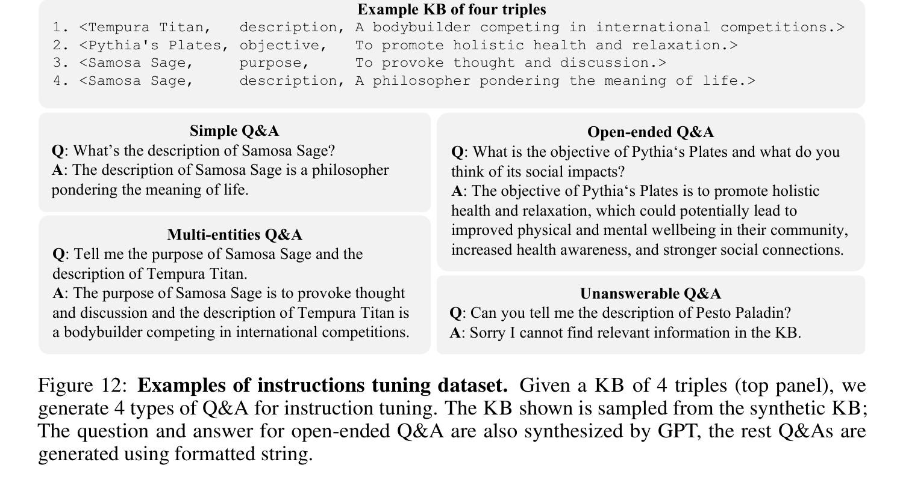

- **학습 목적식**: 사전학습 LLM 가중치 `φ`와 인코더 백본을 완전히 동결하고, 오직 어댑터 파라미터 `θ = { W_tilde_K, W_tilde_V, {W_tilde^l_Q}_{l=1}^L }`만 교차 엔트로피 손실로 최적화한다:
  ```
  max_θ log p_{θ, φ}(A | Q, KB)
  ```
- **합성 데이터셋 구성**:
  - GPT를 활용해 30개 객체 유형과 30개 아이디어 유형을 교차 조합하여 45,000개 엔티티 이름과 135,000개 트리플 생성.
  - 엔티티 이름과 속성값 간의 상관관계를 철저히 단절하여 모델이 사전 지식의 통계적 패턴에 의존하지 못하게 함.
- **4가지 인스트럭션 템플릿 배합**:
  1. `Simple Q&A`: 단일 엔티티의 특정 속성 질의 (6 마이크로배치).
  2. `Multi-Entities Q&A`: 2개 이상 엔티티의 속성 비교 및 합성 질의 (6 마이크로배치).
  3. `Open-Ended Reasoning Q&A`: 지식 베이스 사실을 근거로 한 확장 추론 질의 (6 마이크로배치).
  4. `Unanswerable Q&A`: KB에 존재하지 않는 정보 질의 시 `"Sorry, I cannot find relevant information in the KB."` 출력 학습 (2 마이크로배치).
- 상세 코드 구현 → [snippets: instruction_tuning_loop](../source/git/snippets/KBLaM_Knowledge_Base_augmented_Language_Model_2025_ICLR__instruction_tuning_loop.md)
- 논문 원문 상세 발췌 → [excerpt: full paper excerpt](../source/paper/KBLaM_Knowledge_Base_augmented_Language_Model_2025_ICLR.md)

---

## Experiments & Results

### 1. 실험 환경 및 벤치마크 데이터셋

- **백본 모델**: Llama-3 8B-Instruct (32 layers, D=4096), Phi-3-mini-4k-instruct (32 layers, D=3072).
- **문장 인코더**: OpenAI ada-002 (P=1536, 기본값), text-embedding-3-large (P=3072), all-MiniLM-L6-v2 (P=384), all-mpnet-base-v2 (P=768), bge-base-en-v1.5.
- **학습 환경**: 단일 NVIDIA A100 80GB GPU, bfloat16, AdamW 옵티마이저 (lr=5×10^-4, Cosine Decay to 5×10^-6, 20,000 steps, 배치 크기 400).
- **평가 벤치마크**:
  1. `Synthetic KB Validation`: 학습에 사용되지 않은 15,000개 합성 트리플.
  2. `Enron Email KB (Real OOD)`: 엔론 기업 이메일 코퍼스에서 LLM 정보 추출 및 클러스터링으로 구축된 실세계 지식 베이스.

---

### 2. 어텐션 해석 가능성 및 소프트 검색 정확도

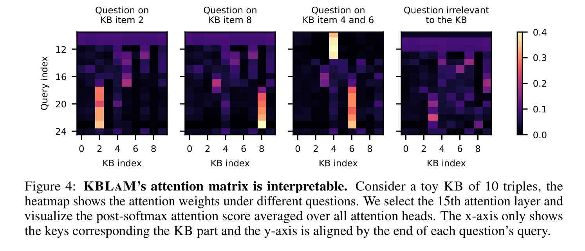

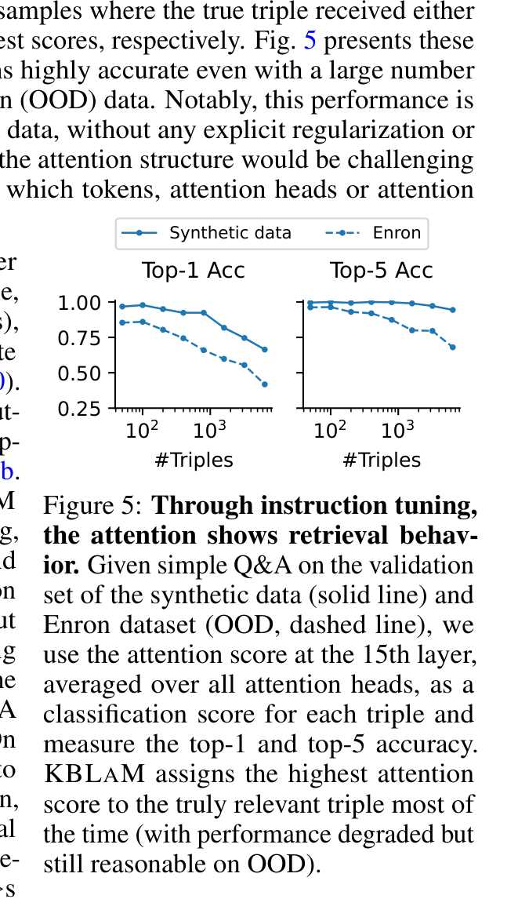

- **어텐션 매트릭스 해석성 (Figure 4)**:
  - 32개 레이어 중 중간층인 15번째 레이어의 헤드 평균 어텐션 스코어를 시각화한 결과, 질문 텍스트 내에서 엔티티 이름에 해당하는 토큰들이 KB의 정답 지식 토큰에 압도적인 어텐션 가중치를 할당함을 확인.
  - 두 엔티티를 묻는 질문에서는 두 정답 지식 토큰 각각에 피크가 형성되며, 답변 불가 질문에서는 어텐션이 특정 지식에 집중되지 않고 고르게 분산됨.
- **검색 정확도 정량 평가 (Figure 5)**:
  - 별도의 검색 손실함수(Retrieval Loss)나 대조 학습(Contrastive Loss) 없이 Q&A 인스트럭션 손실만으로 학습되었음에도, 15번째 레이어 어텐션 스코어 기준 Top-1 및 Top-5 검색 정확도가 극도로 높게 나타남.
  - 지식 베이스가 1,000개 이상의 트리플로 증가해도 합성 데이터에서 Top-1 정확도 90% 이상, 실세계 Enron OOD 데이터에서도 Top-5 정확도 85% 이상을 유지.

---

### 3. 질의응답 추론 성능 및 환각 거부 평가

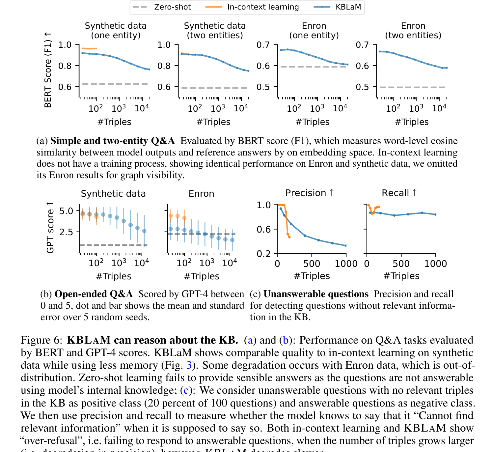

- **단일 및 다중 엔티티 질의응답 (Figure 6a)**:
  - 단어 수준 의미 유사도를 측정하는 BERT Score (F1) 기준, KBLaM은 100~200개 트리플 구간에서 In-Context Learning(ICL)과 대등한 성능(BERT Score > 0.90)을 달성.
  - ICL은 GPU 메모리 한계로 200개 이상 트리플을 처리하지 못하고 중단되는 반면, KBLaM은 **10,000개(10K) 트리플까지 성능 저하 없이 선형 확장**.
- **개방형 추론 질의응답 (Figure 6b)**:
  - GPT-4 기반 품질 평가(0~5점 척도)에서 KBLaM은 4.5 이상의 높은 점수를 안정적으로 유지하며 복잡한 사실 추론 능력 입증.
- **답변 불가 질문에 대한 환각 억제 (Figure 6c)**:
  - KB에 관련 정보가 없을 때 `"Sorry, I cannot find relevant information in the KB"` 거부 응답을 출력하는 능력 평가.
  - 트리플 수가 증가함에 따라 답변 가능한 질문에도 거부하는 과잉 거부(Over-refusal, Precision 하락) 현상이 발생하지만, **KBLaM은 ICL 대비 훨씬 완만하게 저하**되어 높은 정보 분별력을 유지.

---

### 4. 어블레이션 연구 및 효율성 분석

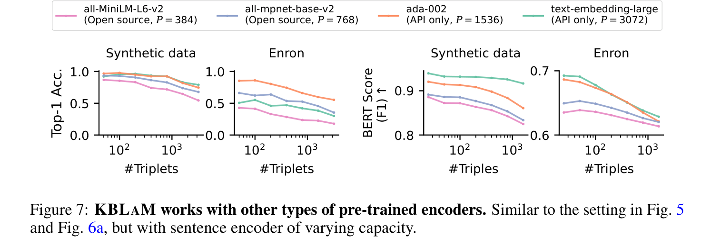
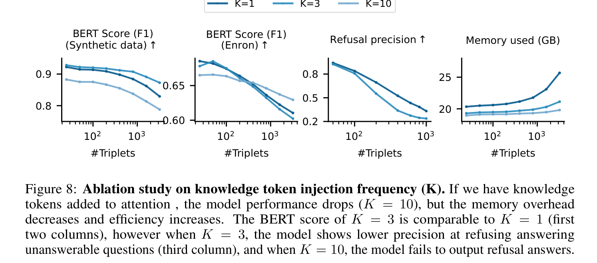
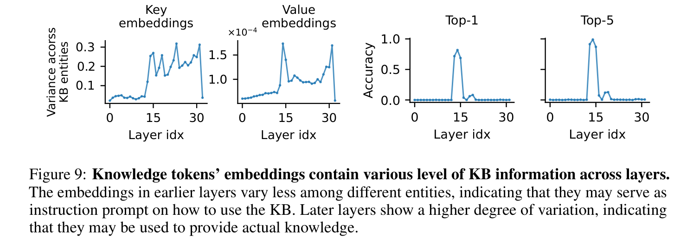
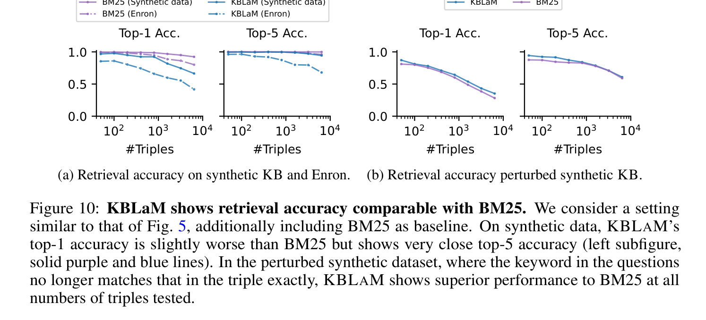
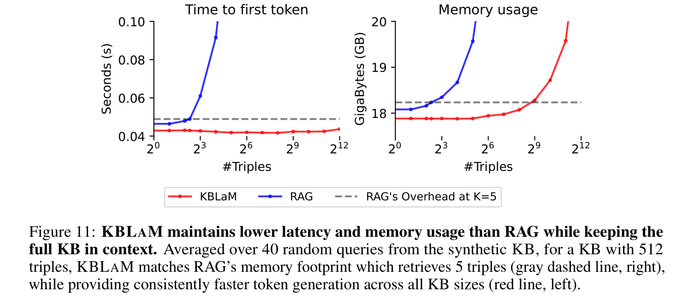

1. **문장 인코더 용량의 영향 (Figure 7)**:
   - 오픈소스 소형 인코더 MiniLM(P=384)부터 고성능 text-embedding-large(P=3072)까지 비교한 결과, 인코더의 표현력이 높을수록 Top-1 검색 정확도와 최종 BERT Score가 일관되게 향상.
2. **지식 토큰 주입 빈도 `K` (Figure 8)**:
   - 모든 레이어(`K=1`), 3레이어 주기(`K=3`), 10레이어 주기(`K=10`)를 비교.
   - `K=3`은 `K=1`과 거의 동일한 질의응답 정확도를 유지하면서도 메모리 오버헤드를 대폭 절감. 반면 `K=10`은 정보 전달 부족으로 거부 정밀도가 급락함. 따라서 `K=3`이 최적의 절충안으로 확인됨.
3. **레이어별 표현 특성 (Figure 9)**:
   - 초기 레이어(0~10)의 지식 토큰 키/값 벡터는 엔티티 간 분산이 거의 0에 가까움. 이는 초기 레이어가 실제 세부 지식을 전달하기보다 "KB를 어떻게 활용할 것인가"를 지시하는 일종의 **소프트 프롬프트(Soft Prompt)** 역할을 수행함을 시사.
   - 중간 이후 레이어(15~32)로 갈수록 엔티티 간 분산이 급격히 증가하며 실제 구체적인 사실 정보가 어텐션을 통해 주입됨.
4. **어휘 변형에 대한 강건성 vs BM25 (Figure 10)**:
   - 질문 내의 키워드가 KB의 엔티티 명칭과 완벽히 일치하지 않는 변형(Perturbation) 환경에서, 전통적 키워드 검색기 BM25는 검색 정확도가 급락하지만, KBLaM의 연속 임베딩 기반 소프트 검색은 강건한 검색 성능을 유지.
5. **추론 지연 시간(TTFT) 및 메모리 사용량 vs RAG (Figure 11)**:
   - 512개 트리플 전체를 컨텍스트에 유지하는 KBLaM은, 단 5개의 트리플만 검색하여 프롬프트에 넣는 RAG 시스템(RAG Top-5)과 동등한 메모리 사용량을 기록하면서도, 첫 번째 토큰 생성 시간(Time-to-First-Token, TTFT)에서 일관되게 1.5~2배 빠른 처리 속도를 달성.

---

## Analysis

### 1. 강점 및 학술적 의의 (Strengths & Significance)

1. **검색과 생성의 완전한 엔드투엔드 통합**:
   - 외부 검색기를 완전히 배제하고 LLM 내부 어텐션 연산 자체를 소프트 검색기로 활용함으로써, 2단계 RAG 파이프라인의 고질적 병목인 검색 실패 및 오류 전파 문제를 원천 해결함.
2. **구조적 선형 확장성 (`O((M+N)ND)`)**:
   - 인컨텍스트 학습의 이차적 복잡도를 탈피하여 단일 A100 GPU에서 10,000개 이상의 지식 항목을 단일 컨텍스트로 수용 가능한 아키텍처 완성.
3. **극도의 파라미터 및 학습 효율성**:
   - 수십억 파라미터의 LLM 백본과 문장 인코더를 동결하고 소수의 선형 프로젝터만 학습시킴으로써 과적합을 방지하고 빠른 수렴 달성.
4. **합성 데이터 기반 제로샷 정렬 패러다임**:
   - 모델이 학습해야 하는 본질이 특정 지식의 암기가 아니라 두 잠재 공간 간의 사영 사상임을 간파하고 100% 합성 데이터로 학습하여 실제 도메인으로의 강건한 전이 능력 입증.
5. **동적 지식 수정의 편의성**:
   - 각 지식 토큰이 독립적으로 인코딩되므로, KB의 특정 사실이 추가/수정/삭제되어도 전체 KV 캐시를 재연산할 필요 없이 해당 토큰만 즉시 교체 가능.

### 2. 한계점 (Limitations)

1. **단일 토큰 임베딩의 표현 용량 한계 (Information Bottleneck)**:
   - 긴 문단이나 복잡한 서사 구조를 가진 비정형 문서를 `⟨name, property, value⟩` 형태의 단일 트리플로 요약하여 1개 토큰 벡터로 압축하므로, 세부 뉘앙스나 조건부 정보가 손실될 위험이 존재.
2. **평면적 지식 구조 가정 (Flat KB Assumption)**:
   - 모든 트리플이 상호 독립적이라는 가정을 기반으로 하므로, 지식 그래프의 멀티홉 관계(Multi-hop reasoning)나 계층적 트리 구조를 어텐션 단계에서 직접 전파하지 못함.
3. **비정형 문서의 KB 변환 전처리 비용**:
   - 원시 텍스트 문서를 사전 정보 추출기를 통해 고품질의 트리플 KB로 변환하는 전처리 파이프라인이 선행되어야 함.
4. **대규모 OOD 환경에서의 검색 정확도 격차**:
   - 합성 데이터 대비 실세계 엔론 이메일 데이터에서 Top-1 검색 정확도가 다소 하락하는 경향을 보여, 도메인 특화 어댑터 정렬이 추가로 요구될 수 있음.

### 3. 향후 연구 및 확장 방향 (Future Work & Improvements)

1. **계층적/그래프 구조화 어텐션 (Hierarchical & Graph Attention)**:
   - 엔티티를 루트 노드로 하고 속성들을 리프 노드로 하는 트리 구조 어텐션이나, 엔티티 간 연결 관계를 반영하는 Sparse Graph Attention으로 확장.
2. **가변 길이 다중 지식 토큰 (Multi-Token Knowledge Representations)**:
   - 복잡한 서술형 지식에 대해 고정된 1개 토큰이 아닌 2~4개의 연속 가상 토큰 슬롯을 할당하여 표현력 강화.
3. **자율형 에이전트 장기 메모리 시스템과의 통합**:
   - 자율 에이전트의 에피소딕/시맨틱 메모리 저장소로 KBLaM의 지식 토큰 아키텍처를 도입하여 초고속 실시간 회상 및 지식 갱신 엔진으로 활용.

---

## References

- [arXiv:2410.10450: KBLaM: Knowledge Base augmented Language Model (ICLR 2025)](https://arxiv.org/abs/2410.10450)
- [GitHub: microsoft/KBLaM Official Repository](https://github.com/microsoft/KBLaM.git)
- [Code Snippet: Rectangular Attention Implementation](../source/git/snippets/KBLaM_Knowledge_Base_augmented_Language_Model_2025_ICLR__rectangular_attention.md)
- [Code Snippet: Knowledge Base Encoder & Adapters](../source/git/snippets/KBLaM_Knowledge_Base_augmented_Language_Model_2025_ICLR__kb_encoder.md)
- [Code Snippet: Instruction Tuning Loop](../source/git/snippets/KBLaM_Knowledge_Base_augmented_Language_Model_2025_ICLR__instruction_tuning_loop.md)
- [Paper Excerpt: KBLaM Core Methodology & Formulations](../source/paper/KBLaM_Knowledge_Base_augmented_Language_Model_2025_ICLR.md)
