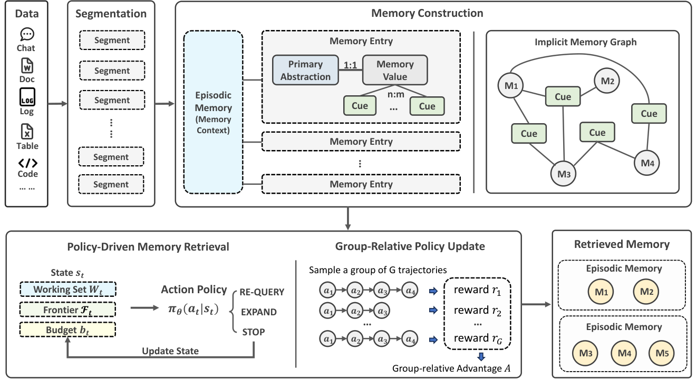

> [paper][git] https://github.com/microsoft/Memora.git · https://arxiv.org/abs/2602.03315

# Memora

## Overview

Microsoft Research의 agent memory 프레임워크로, 대화와 문서에서 메모리를 자동으로 추출·저장·검색하는 전체 lifecycle를 제공한다. ICML 2026에 발표되었으며, LoCoMo와 LongMemEval 벤치마크에서 새로운 SOTA를 달성했다.

**원본**: paper → [arXiv:2602.03315](https://arxiv.org/abs/2602.03315) (ICML 2026) / git → [github.com/microsoft/Memora](https://github.com/microsoft/Memora.git)

### 핵심 설계: Abstraction과 Specificity를 균형잡은 Harmonic Memory Representation

LLM 에이전트는 본질적으로 **무상태(stateless)** 특성을 지녀, 경험을 구조화·재사용하지 못하면 매번 계획 재수립과 중복 추론을 반복하는 병목이 발생한다. 이를 극복하기 위해 메모리를 확장하려 할 때 **추상화(Abstraction)**와 **구체성(Specificity)** 간의 상충 관계(trade-off)가 발생한다:

- **구체성(Specificity) 치중** (Flat RAG, Mem0): 원시 로그나 원자적 사실을 저장하여 세부사항은 보존되나, 서사 맥락이 상실된 채 메모리 파편화(fragmentation)와 무관한 사실의 범람(deluge of irrelevant facts)이 일어난다.
- **추상화(Abstraction) 치중** (MemoryBank 등): 고수준 요약으로 토큰은 절약되나, 과도한 압축으로 실행에 필수적인 세부 맥락(제약 조건, 수치 등 task-critical nuances)이 소실되어 행동 불가능한 모호한 요약에 그친다.

Memora는 구체적 내용물(concrete content) 위에 구조적 스캐폴딩을 얹어, **추상화와 구체성의 균형을 달성한 조화로운 메모리 표현(Harmonic Memory Representation)**을 제안한다.

메모리 하나 하나를 세 가지 요소로 분리하여 저장한다:

| 요소 | 이 메모리에서의 예시 | 인덱싱 | 역할 |
|---|---|---|---|
| **Memory Value** | `"Alice is starting a new job at Contoso in Seattle next month."` | ✗ | 구체적 세부 사실 보존. 원본 세그먼트 보존 또는 고수준 요약(Episodic), 세부 사실 추출 및 점진적 병합(Factual)으로 구체성(Specificity) 유지. |
| **Primary Abstraction** | `"Alice's new job at Contoso"` | ✓ (embedding) | value에 대한 1:1 요약. canonical identity이자 점진적 병합 기준 (Abstraction 제공). |
| **Cue Anchors** | `"Alice career change"`, `"Contoso new hire"` | ✓ (embedding) | value에서 추출한 `[Entity]+[Key Aspect]` 구문. 다대다 연결망 형성 (다단계 홉 순회 지원). |

#### Primary Abstraction과 Cue Anchor의 핵심 역할
1. **Primary Abstraction (개념적 정체성과 점진적 통합)**:
   - 메모리가 근본적으로 무엇에 관한 것인지를 규정하는 1:1 canonical identity이다.
   - 새 정보가 유입될 때 기존 엔트리와의 유사도를 평가하여 동일 개념이면 단일 엔트리로 누적·병합(Consolidation)함으로써, 시간이 흘러도 메모리가 수많은 파편으로 쪼개지는 현상을 방지하고 고수준 개념 검색 지표가 된다.
2. **Cue Anchor (다각적 맥락 접근점과 관계망 형성)**:
   - 메모리 값(Value)에서 추출한 `[Main Entity] + [Key Aspect]` 형태의 2~4어 짧은 시맨틱 훅이다.
   - 하나의 메모리에 여러 cue가 붙고 동일한 cue가 여러 메모리에 공유되는 비배타적 **다대다(many-to-many)** 연결을 제공한다.
   - 명시적인 그래프 DB 엣지 없이도 메모리 엔트리 간의 유기적 관계망인 **암묵적 메모리 그래프(Implicit Memory Graph)**를 형성하여, 후속 검색 시 다단계 홉(multi-hop) 순회의 징검다리가 된다.

#### Retrieve 단계의 핵심: 단서(Cue)를 따라가는 능동적 Multi-Hop 검색
기존 RAG의 1회성(single-step) 정적 벡터 유사도 검색은 서로 다른 메모리에 분산된 복합 의존성을 포착하지 못한다. Memora의 검색(Retrieve)은 단순한 정적 조회가 아니라 **MDP(Markov Decision Process) 기반의 능동적 다단계 추론(Active Multi-Hop Reasoning)**으로 동작한다:
- **초기 시드 탐색**: 질의와 관련된 Primary Abstraction 및 Cue Anchor를 매칭하여 초기 작업 메모리 집합(Working Set)을 확보한다.
- **다단계 홉 순회 (Frontier Expansion / Multi-Hop)**: 확보된 메모리들이 가진 **Cue Anchor의 다대다 연결망을 추적**하여, 표면적 질의 유사도는 낮지만 맥락적으로 얽혀 있는 다른 메모리 후보군(Frontier)을 순차적으로 엮어 들여온다(`EXPAND`). 필요에 따라 질의를 동적으로 재수립(`REFINE`)하며 단서를 확장한다.
- **조기 종료 (`STOP`)**: 에이전트에 충분한 맥락이 갖춰지면 유연하게 탐색을 중단하여 불필요한 토큰 낭비를 차단한다.

즉, **명시적 그래프 구조가 없더라도 Cue Anchor의 공유 관계를 징검다리 삼아 한 홉(hop), 두 홉 건너뛰며 숨겨진 다단계 연관 사실들을 능동적으로 추적·조립**하는 것이 Memora 검색의 핵심 차별점이다.

#### RAG와 Knowledge Graph의 이론적 일반화 (Unifying Theory)
Memora의 Harmonic 표현 구조는 기존 메모리 패러다임들을 포함하는 통합적 일반화 프레임워크이다 (Theorem D.1~D.3):
- **Flat RAG와의 동등성 (Theorem D.1)**: 그래프 순회 깊이를 `L = 0`으로 두고, cue anchor를 비활성화(`C = ∅`)하며, primary abstraction을 청크 원문 자체와 일치시키면(`a = v = s`), 단일 벡터 유사도 검색 후 종료하는 전통적인 **Flat RAG**와 수학적으로 정확히 일치한다.
- **Implicit Knowledge Graph와의 동등성 (Theorem D.2)**: cue anchor를 엔티티(Entity)로 제한하고, cue 간 임베딩 유사도를 기반으로 다단계 홉(L-hop) 확장을 수행하면 잠재 공간의 거리 기반으로 이웃 노드를 순회하는 **Implicit KG** 탐색과 동등해진다.
- **Explicit Knowledge Graph와의 동등성 (Theorem D.3)**: cue anchor를 `(Entity, Relation)` 쌍으로 정의하고 심볼릭 엣지를 따라 순회하도록 제약하면 기존 **Explicit KG**의 경로 탐색과 완전히 일치한다.

즉, Memora는 "구체적 내용(Value) 위의 고수준 추상화(Primary Abstraction) + 다각적 접근점(Cue Anchor)"이라는 구조를 통해, 단순 벡터 검색(RAG)부터 다단계 관계 순회(KG)까지를 단일 프레임워크 내에서 조건부로 재현할 수 있는 상위 집합(superset) 아키텍처이다.

> 본 문서는 **(1) Paper 이론 및 알고리즘 분석**을 먼저 다룬 후, **(2) Git 코드 구현 및 파이프라인 분석**을 상세히 전개한다.

---

## 1. Paper 분석: 이론, 알고리즘 및 벤치마크

> 상세 논문 발췌 → [paper 발췌](../source/paper/Memora_A_Harmonic_Memory_Representation_Balancing_Abstraction_and_Specificity_2026_ICML.md) / [arXiv:2602.03315](https://arxiv.org/abs/2602.03315)


*Figure 1: Memora 아키텍처 개요. Raw Data(대화/문서)를 의미 단위로 분할(Segmentation)하고 에피소딕 메모리를 구성한 후, 구체적 사실(Memory Value) 위에 개념적 정체성을 정의하는 Primary Abstraction과 다각적 접근점인 Cue Anchors를 구축하여 안정적 추상화와 풍부한 구체성의 균형을 달성한다. 검색 시에는 정책 기반 에이전트(Policy Retriever)가 이 구조를 순회하며 다단계 추론을 수행한다.*

---

### Figure 1 기반 시스템 아키텍처 흐름 (§3.2)

위 **Figure 1**은 Memora가 이종 데이터 스트림으로부터 구조화된 메모리를 구축하고, 이를 기반으로 에이전트의 복합 질의를 해결하는 전체 메커니즘을 4단계 파이프라인으로 보여준다:

1. **입력 분할 및 서사 맥락 형성 (Figure 1 좌측)**:
   - 다양한 데이터 소스(대화, 문서 등)의 원시 데이터 `D`는 의미적 일관성을 지닌 단위 세그먼트(`si`)로 분해된다 (`§3.3 Segmentation`).
   - 각 세그먼트마다 참여자·의도·시간 등의 상황적 맥락을 담은 **Episodic Memory(`ei`)**가 생성되어, 개별 사실들이 서사적 배경과 분리되지 않도록 지탱한다 (`§3.4 Episodic Memory`).

2. **조화로운 메모리 표현 구축 (Figure 1 중앙 상단)**:
   - 각 세그먼트로부터 추출된 구체적 정보는 무손실 원본 형태인 **Memory Value(`vi`)**로 보존된다.
   - 동시에 메모리의 핵심 주제를 대표하는 1:1 요약인 **Primary Abstraction(`ai`)**이 생성되며, 기존 저장소와 대조하여 동일 개념일 경우 단일 엔트리로 점진적 병합(Consolidation)된다 (`§3.5 Primary Abstraction`).
   - 세부적인 접근점을 제공하기 위해 `[Entity] + [Key Aspect]` 형태의 **Cue Anchors(`cij`)**가 다대다 방식으로 추가 추출된다 (`§3.6 Cue Anchors`).

3. **암묵적 메모리 그래프 형성 (Figure 1 중앙 하단)**:
   - 메모리 엔트리들은 명시적인 그래프 엣지(edge) 구축 없이도, 동일한 cue anchor를 공유하거나 추상화 수준에서 의미적으로 연결됨으로써 **암묵적 메모리 그래프(Implicit Memory Graph)**를 형성한다.

4. **정책 기반 순차 검색 및 추론 (Figure 1 우측)**:
   - 질의 시 쿼리 `q`를 primary abstraction 및 cue anchor와 매칭하여 초기 시드 메모리를 식별한다.
   - 이후 강화학습(GRPO)으로 최적화된 **Policy Retriever(πθ)**가 암묵적 그래프를 순회(EXPAND)하거나 쿼리를 갱신(REFINE)하는 MDP 다단계 추론을 수행하여, 복합 종속성이 연결된 최적의 메모리 부분집합을 추출한다 (`§4 Policy-Guided Sequential Retrieval`).

아래 하위 섹션에서는 Figure 1에 묘사된 각 컴포넌트의 수학적 정식화, 구축 알고리즘, 검색 프로세스 및 벤치마크 결과를 상술한다.

### 1.1 문제 정식화 및 설계 원칙 (§3.1)

메모리 관리를 구조화된 store의 유지 및 질의 문제로 정식화:

```
Fm: D → M          (memory construction function: raw data → structured memory set)
Q(q, M) → Mq       (retrieval function: query → relevant subset Mq ⊆ M, |Mq| ≪ |M|)
```

- **핵심 설계 목표**: 검색된 부분집합 `Mq`의 관련성을 극대화하면서 크기와 지연시간을 최소화한다. 고수준 시맨틱 스캐닝(semantic scanning)과 저수준 맥락적 룩업(contextual lookup)을 모두 지원하는 표현이 필수적이다.
- **핵심 혁신 (Decoupled Representation)**: **"무엇이 저장되는가(what is stored)"**와 **"어떻게 접근되는가(how it is accessed)"**를 분리한다. 메모리 콘텐츠(Memory Value)는 손실 없이 풍부하게 유지하고, 별도의 구조적 레이어(Primary Abstraction + Cue Anchors)가 인덱싱과 탐색 신호를 전담한다.

### 1.2 Harmonic Memory 구축 메커니즘 (§3.3 ~ §3.6)

#### Segmentation (§3.3)
```
S(d) = {s1, ..., sk}     # data item d를 semantically coherent segments로 분해
```
- 각 세그먼트 `si`가 메모리 구축의 입력 기본 단위가 된다. 단일 세그먼트에서 여러 개의 메모리 엔트리가 도출될 수 있다.
- 비정형 narrative는 프롬프트 기반 추출, 정형 파일은 구조적 계층(헤더, 문단 등)을 활용한다.

#### Episodic Memory (§3.4)
```
ei = E(si)              # 각 segment si에 대해 episodic memory 생성
```
- 해당 세그먼트에서 파생된 모든 메모리 엔트리의 공유 서사적 기반(narrative grounding)을 제공한다.
- 고수준 요약(참여자, 의도, 시간 범위) 또는 원본 텍스트 그대로 보존하는 방식 모두 지원한다.
- 검색 후 동일한 에피소딕 메모리에 속한 엔트리들을 묶어 서사적 일관성을 복원함으로써 다단계 추론(multi-step reasoning)을 지원한다.

#### Primary Abstraction (§3.5)
메모리를 안정적인 개념 중심으로 조직하여 무분별한 파편화를 방지한다. 2단계로 진행된다:

1. **추출 (Extraction)**: 새 세그먼트 `s`로부터 후보 메모리 엔트리 생성
```
Fa(s) = {mi}^N_{i=1},   mi = (ai, vi)
# ai: primary abstraction (메모리의 근본적 정체성, 1:1 요약)
# vi: memory value (구체적 세부 사실, 비인덱싱)
```

2. **통합 (Consolidation)**: 후보 엔트리를 기존 메모리 저장소 `M`에 점진적으로 병합 (Create-or-Update Rule)
- top-k 유사 기존 엔트리 검색: `R(ai) = TopK_{m∈M} sim(ai, am; k)`
- 유사도 임계값 `γ`로 필터링: `U(ai) = {m ∈ R(ai) | sim(ai, am) ≥ γ}`
- LLM 기반 판별 함수 `J`가 동일 개념인지 결정: `m⋆(ai) = J(ai, U(ai))`
- 생성-또는-갱신 규칙:
```
mi = { Update(m⋆(ai), ai, vi),  m⋆(ai) ≠ ∅   # 기존 엔트리에 vi 병합, 필요시 abstraction 갱신
       Create(ai, vi),          m⋆(ai) = ∅ }  # 신규 엔트리 생성
```
이를 통해 각 엔트리가 단일 primary abstraction에 앵커링되고, 의미적으로 정렬된 새 정보가 점진적으로 통합되어 메모리 파편화를 차단한다.

#### Cue Anchors (§3.6)
Primary abstraction이 의도적으로 거시적이므로, 미세한 맥락적 접근을 위한 시맨틱 훅으로 cue anchor를 추가한다.
```
Fc(ai, vi) = {cij}^{|Ci|}_{j=1},   cij ∈ Ci
```
- 형식: **`[Main Entity/Topic] + [Key Aspect]`** (2~4어 짧은 구문)
- **다대다(many-to-many) 비배타적 연결**: 하나의 메모리에 복수의 cue가 연결될 수 있고, 동일한 cue가 여러 메모리에 공유된다.
- 엔트리 삭제나 병합 시 연결 고리가 모두 끊긴 cue는 자동 소멸하여 저장소가 컴팩트하게 유지된다.

#### Implicit Memory Graph
Primary abstraction(1:1)과 Cue anchor(다대다)의 결합은 **명시적 엣지 정의 없이도 암묵적 메모리 그래프(implicit memory graph)**를 형성한다. 동일한 cue를 공유하거나 추상화 레벨에서 연관된 엔트리들이 상호 연결되어, 검색 시 단순 유사도를 넘어 구조적 순회(frontier expansion)를 가능하게 한다.

### 1.3 정책 기반 순차 검색 (Policy-Guided Sequential Retrieval, §4)

#### Retrieval as Markov Decision Process (§4.1)
정적 시맨틱 검색은 복잡한 다단계 의존성을 포착하지 못한다. Memora는 검색 과정을 **MDP(Markov Decision Process)**로 정식화한다:

- **State (상태, step t)**:
```
st = (qt, Wt, Ft, bt)
# qt: 현재 쿼리 (REFINE으로 갱신 가능)
# Wt: Working Set (현재까지 수집된 메모리 집합, W0 = Mq0)
# Ft: Frontier (다음에 확장 가능한 candidate 메모리 집합)
# bt: 남은 예산 (탐색 비용 제약, b0 = B)
```

- **Action Space (행동 공간)**:
```
At = {REFINE(q'), EXPAND(me), STOP}
# REFINE(q'): 쿼리를 q'로 재수립하고 새로운 시맨틱 검색 수행
# EXPAND(me): Frontier에서 me ∈ Ft를 선택하여 Working Set에 추가 (me의 cue anchor를 통해 frontier 재계산)
# STOP: 검색 종료, 현재 Working Set Wt 반환
```

- **Transition (전이)**:
```
Wt+1 = { Wt ∪ {me},   at = EXPAND(me)
         Wt ∪ Mq',    at = REFINE(q')
         Wt,          at = STOP }
Ft+1 = UpdateFrontier(Ft, at, M)
bt+1 = bt − Cost(at)
```

#### Algorithm 1: Sequential Retrieval Flow
```
Algorithm 1: Policy-Guided Sequential Retrieval
Input: query q0, memory store M, budget B, policy πθ
Output: retrieved working set WT

1: Mq0 ← SemanticSearch(q0, M)
2: W0 ← Mq0, F0 ← ExtractFrontier(W0, M), b0 ← B, t ← 0
3: while bt > 0 do
4:     at ~ πθ(· | st)
5:     if at = STOP then break
6:     st+1 ← Step(st, at, M)
7:     t ← t + 1
8: return Wt
```

#### GRPO 강화학습 정책 훈련 (§4.2, Appendix C)
Group Relative Policy Optimization (GRPO)으로 retriever 정책 `πθ`를 파인튜닝:
- 쿼리 `q`와 정답 `a`에 대해 `G`개의 탐색 trajectory를 샘플링: `τ^(1), ..., τ^(G) ~ πθ(· | s0)`
- 각 trajectory의 Working Set `WG`에 대해 종합 보상 점수 산출:
```
J(τ) = w1 · Groundedness(WG, a) − w2 · Redundancy(WG) − w3 · Cost(τ)
```
- Group-relative advantage 계산:
```
Ã(i) = J(τ^(i)) − mean({J(τ^(j))}_{j=1}^G)
```
- PPO-clip objective를 통해 정책 파라미터 `θ`를 업데이트한다.

### 1.4 통합 이론: RAG 및 Knowledge Graph의 일반화 (Appendix D)
Memora의 Harmonic 표현 구조는 기존 메모리 패러다임들을 수학적 특수 케이스로 완벽히 포함한다:

- **Theorem D.1 (Flat RAG as Special Case)**:
  - Traversal depth L=0, cue anchors 비활성화, 단일 query 후 STOP.
  - Memora는 문서를 청크 단위로 검색하는 표준 Flat RAG와 정확히 일치한다.
- **Theorem D.2 (Implicit Knowledge Graph as Special Case)**:
  - Cue anchor를 entity로 간주하고 유사도 기반 탐색을 수행.
  - Memora의 frontier 확장은 implicit KG의 multi-hop neighbor traversal과 수학적으로 동등하다.
- **Theorem D.3 (Explicit Knowledge Graph as Special Case)**:
  - Cue anchor를 (entity, relation) 튜플로 정의하고 직접 연결.
  - Memora의 policy retrieval은 explicit KG 상의 path-finding 순회 알고리즘을 정확히 재현한다.

### 1.5 벤치마크 평가 및 실험 분석 (§5)

#### 1.5.1 메인 결과 — LoCoMo (Table 1, LLM-as-Judge)

| Method | Multi-hop | Temporal | Open-domain | Single-hop | Overall |
|---|---|---|---|---|---|
| Full Context | 0.766 | 0.819 | 0.500 | 0.885 | 0.825 |
| RAG | 0.557 | 0.548 | 0.458 | 0.710 | 0.633 |
| HippoRAG | 0.390 | 0.224 | 0.510 | 0.587 | 0.471 |
| Mem0 | 0.624 | 0.660 | 0.500 | 0.677 | 0.653 |
| LangMem | 0.710 | 0.508 | 0.590 | 0.845 | 0.734 |
| Nemori | 0.751 | 0.776 | 0.510 | 0.849 | 0.794 |
| **Memora (S)** | 0.784 | 0.851 | 0.594 | 0.900 | 0.849 |
| **Memora (P)** | 0.787 | 0.866 | 0.594 | 0.918 | **0.863** |

→ Full Context(0.825)마저 능가 → "context noise" 필터링으로 curated memory가 brute-force reconstruction보다 정확.

#### 1.5.2 메인 결과 — LongMemEval (Table 2)

| Method | Context length | Avg Accuracy |
|---|---|---|
| Full Context | 115k | 65.6% |
| Nemori | 3.7-4.8k | 74.6% |
| **Memora (S)** | 2.1k | 83.8% |
| **Memora (P)** | 2.9k | **87.4%** |

#### 1.5.3 Component Build-up Ablation (Table 3, LoCoMo Overall)

| Configuration | Score | 증분 |
|---|---|---|
| w/o abstraction (= Mem0) | 0.653 | — |
| + primary abstraction (no update) | 0.795 | +0.142 |
| + update | 0.801 | +0.006 |
| + semantic retriever (full) | 0.849 | +0.048 |
| + policy retriever (full) | **0.863** | +0.014 |

→ abstraction layer만 추가해도 +0.142. abstraction 제거 시 Mem0로 퇴화.

#### 1.5.4 Memory Granularity Ablation (Table 4, LLM score + Avg Tokens)

| Retriever | Memory Type | Score | Avg Tokens |
|---|---|---|---|
| **Policy** | Episodic (Segment) + Factual | **0.863** | 1,853 |
| Policy | Factual only | 0.833 | — |
| **Semantic** | Episodic (Segment) + Factual | 0.849 | 8,499 |
| Semantic | Factual only | 0.833 | — |

핵심:
- **Policy가 cue anchor 없으면 semantic과 동일** → policy 이점은 cue anchor 순회能力에서 발생
- **Token 효율**: Policy(1,853)가 Semantic(8,499) 대비 **78% 적은 토큰**으로 더 높은 성능
- Episodic (Segment) > Extracted > Factual only — raw segment가 가장 풍부한 context

#### 1.5.5 GRPO 결과 (Figure 2, Qwen2.5-1.5B, LoCoMo test split)

| Model | Overall |
|---|---|
| Qwen 2.5 1.5B (Base) | 0.686 |
| Qwen 2.5 1.5B (GRPO) | **0.816** |
| GPT-4.1-mini (Policy, upper bound) | 0.863 |

→ GRPO 훈련으로 +0.130. 로컬 소형 모델로 0.816 달성 → 비용 절감 with 경쟁력.

#### 1.5.6 효율성 지표 (Table 5-7)

| 지표 | Semantic | Policy | 비고 |
|---|---|---|---|
| Search latency (mean) | 0.235s | 1.062s | Policy가 4-5배 느림 (평균 3.45 steps) |
| Construction time/convo | 1,322s (Mem0: 1,351s) | 동일 | Mem0와 비슷, offset 최적화 시 740s |
| Memory entries/convo | 344 | 344 | Mem0(651) 대비 절반 |
| Token vs full-context | — | — | **98% 절감** |

**작은 construction model 실험** (Table 7): gpt-5.4-nano + Policy(0.851) ≈ gpt-4.1-mini + Semantic(0.849) → policy retriever가 construction 품질을 보완.

---

## 2. Git 코드 구현 분석: 아키텍처 및 파이프라인

> 상세 코드 스니펫 → [extraction snippet](../source/git/snippets/Memora_2026_ICML__memory_extraction.md) / [retrieval snippet](../source/git/snippets/Memora_2026_ICML__memory_retrieval.md) / [GitHub 저장소](https://github.com/microsoft/Memora.git)

### 2.0 전체 시스템 구조와 LLM 호출 지점

`🔥` = LLM 호출 지점

```
                          MemoraClient
                          ├─ add() / add_file()     ── 추출
                          ├─ query()                ── 단일 semantic 검색
                          └─ advance_query()        ── 전략별 검색
                                │
    ┌─────────────────────────────────────────────────────────────────────────────┐
    │  [추출 파이프라인]                                                            │
    │                                                                              │
    │  LocalMemoraClient.add()                                                     │
    │   ├─ ProcessorRegistry (파일 입력시)                                          │
    │   │   └─ Markdown: 헤더 분할, Text: paragraph 분할                            │
    │   │      (대화 segmentation prompt는 paper에만 있고 code 미구현)              │
    │   │                                                                          │
    │   └─ MemoryBuilder.build()                                                   │
    │       ├─ normalize_content()                                                 │
    │       ├─ generate_metadata()                                                 │
    │       │                                                                      │
    │       ├─ [Step 1] Episodic Memory                                             │
    │       │    ├─ use_segments_as_episodic=True → 원본 text 그대로                │
    │       │    └─ use_segments_as_episodic=False                         🔥 LLM #1
    │       │         PROMPT_EPISODIC_MEMORY → EpisodicMemoryOutput                │
    │       │                                                                      │
    │       ├─ [Step 2] Factual Memory 추출                                         │
    │       │    └─ generate_memory_entries()                              🔥 LLM #2
    │       │         PROMPT_BUILD_MEMORY (chat) / PROMPT_BUILD_DOCUMENT_MEMORY (doc)
    │       │         → MemoryOutputs{entries:[MemoryOutput{index, value}]}        │
    │       │                                                                      │
    │       │    └─ if enable_cue_index:                                   🔥 LLM #3
    │       │         CueIndexGenerator.generate_cue_indices_batch()               │
    │       │         PROMPT_CUE_GENERATION → BatchCueIndices                       │
    │       │         (모든 메모리 cue를 단일 LLM 호출로 배치 생성)                   │
    │       │                                                                      │
    │       └─ [Step 3] upsert_memory_entry() (각 entry별)                          │
    │            ├─ (1) 동일 index 검사                                             │
    │            ├─ (2) 유사 메모리 탐색 (ChromaDB vector search)                    │
    │            └─ (3b) 유사 candidates 있을 때                          🔥 LLM #4 (조건부)
    │                 _decide_memory_update()                                      │
    │                 PROMPT_MEMORY_UPDATE_DECISION → MemoryUpdateDecision          │
    │                 (candidates 없으면 LLM 호출 안 함)                             │
    │                                                                              │
    │   └─ AgentMemory.add() → ChromaDB 저장                                       │
    │       (embedding model은 LLM이 아닌 text-embedding-3-small 등)                │
    └──────────────────────────────────────────────────────────────────────────────┘

    ┌─────────────────────────────────────────────────────────────────────────────┐
    │  [검색 파이프라인]                                                            │
    │                                                                              │
    │  ┌─ SemanticRetriever ──────────────────────────────────────────────┐        │
    │  │  AgentMemory.query()                                             │        │
    │  │   ├─ (1) Query 확장                                              🔥 LLM #5│
    │  │   │    QueryGenerator.generate_queries()                      │        │
    │  │   │    PROMPT_GENERATE_QUERIES → MemoryQueries                │        │
    │  │   │    (enhance_query=True 일 때)                              │        │
    │  │   │                                                            │        │
    │  │   ├─ (2) _query_result() — ChromaDB vector search              │        │
    │  │   │    score = 1 - distance, threshold 필터                   │        │
    │  │   │                                                            │        │
    │  │   ├─ (3) Hybrid Search (옵션)                                   │        │
    │  │   │    ├─ BM25: rank_bm25 검색                                 │        │
    │  │   │    └─ Keyword: 키워드 추출                        🔥 LLM #6 (조건부)  │
    │  │   │         PROMPT_EXTRACT_KEYWORDS → Keywords               │        │
    │  │   │         (hybrid_method="keyword" 일 때만)                 │        │
    │  │   │                                                            │        │
    │  │   ├─ (4) RRF 합산                                              │        │
    │  │   │    weight: primary 2.0 > cue 1.0 = hybrid 1.0            │        │
    │  │   │                                                            │        │
    │  │   └─ (5) LLM Filter (옵션)                           🔥 LLM #7 (조건부)  │
    │  │        MemoryFilter.filter_memory()                           │        │
    │  │        PROMPT_MEMORY_FILTER → MemoryScoreResponse             │        │
    │  │        (enable_llm_filter=True 일 때)                         │        │
    │  └────────────────────────────────────────────────────────────────┘        │
    │                                                                              │
    │  ┌─ PromptedPolicyRetriever ───────────────────────────────────────┐        │
    │  │  [Step 0] INIT_RETRIEVE                             (LLM #5 재사용)       │
    │  │   memory_client.query() (위와 동일)                             │        │
    │  │   build_frontier()                                             │        │
    │  │                                                                │        │
    │  │  [Step 1..max_steps] 반복                                       │        │
    │  │   └─ prompted_policy()                                🔥 LLM #8        │
    │  │        LLM_POLICY_PROMPT → JSON{action, frontier_ids, ...}    │        │
    │  │        (max_steps=5 이면 최대 5회 LLM 호출)                     │        │
    │  │        │                                                       │        │
    │  │        ├─ EXPAND  → build_frontier()                           │        │
    │  │        └─ RE_QUERY → memory_client.query()          (LLM #5 재사용)       │
    │  └────────────────────────────────────────────────────────────────┘        │
    │                                                                              │
    │  ┌─ LocalPolicyRetriever (GRPO) ───────────────────────────────────┐        │
    │  │  [Step 0] INIT_RETRIEVE                             (LLM #5 재사용)       │
    │  │                                                                │        │
    │  │  [Step 1..max_steps] 반복                                       │        │
    │  │   └─ _call_policy()                         🔥 LLM #8' (로컬 모델)      │
    │  │        Qwen2.5-7B + LoRA (POLICY_SYSTEM_MESSAGE)              │        │
    │  │        (GPT 대신 로컬 Qwen 사용, 동일 프롬프트)                  │        │
    │  └────────────────────────────────────────────────────────────────┘        │
    └──────────────────────────────────────────────────────────────────────────────┘
```

### LLM 호출 지점 요약

| # | 단계 | 프롬프트 / 모델 | 조건 | 호출 빈도 |
|---|---|---|---|---|
| **#1** | Episodic memory 요약 | `PROMPT_EPISODIC_MEMORY` | `use_segments_as_episodic=False` | segment 1개당 1회 |
| **#2** | Factual memory 추출 | `PROMPT_BUILD_MEMORY` / `PROMPT_BUILD_DOCUMENT_MEMORY` | 항상 | segment 1개당 1회 |
| **#3** | Cue anchor 배치 생성 | `PROMPT_CUE_GENERATION` | `enable_cue_index=True` | segment 1개당 1회 (배치) |
| **#4** | Update 결정 | `PROMPT_MEMORY_UPDATE_DECISION` | 유사 candidates 존재시 | entry마다 (조건부) |
| **#5** | Query 확장 | `PROMPT_GENERATE_QUERIES` | `enhance_query=True` | query 1개당 1회 |
| **#6** | Keyword 추출 | `PROMPT_EXTRACT_KEYWORDS` | `hybrid_method="keyword"` | query 1개당 1회 (조건부) |
| **#7** | Memory filter | `PROMPT_MEMORY_FILTER` | `enable_llm_filter=True` | query 1개당 1회 (조건부) |
| **#8** | Policy 결정 (GPT) | `LLM_POLICY_PROMPT` | `PromptedPolicyRetriever` | step마다 (최대 5회) |
| **#8'** | Policy 결정 (Qwen) | `POLICY_SYSTEM_MESSAGE` | `LocalPolicyRetriever` | step마다 (최대 5회, 로컬) |

**최악의 case LLM 호출 수** (추출 1 segment + 검색 1 query, policy retriever):
- 추출: #1 + #2 + #3 + #4×(entry 수) = ~5-8회
- 검색: #5×1 + #8×5 steps = ~6회
- 총 ~11-14회 LLM 호출

---


### 2.1 메모리 추출 파이프라인 구현 (`MemoryBuilder`)

> paper의 memory construction `Fm: D→M` (§3)과 code의 `MemoryBuilder.build()` 구현을 대응 정리. 상세 코드·프롬프트 → [extraction snippet](../source/git/snippets/Memora_2026_ICML__memory_extraction.md) / 논문 발췌 → [paper 발췌](../source/paper/Memora_A_Harmonic_Memory_Representation_Balancing_Abstraction_and_Specificity_2026_ICML.md)

#### 2.1.0 추출 파이프라인 호출 스택

`🔥` = LLM 호출 지점

```
MemoraClient.add(text, type="chat")
└─ LocalMemoraClient.add()                          # local_client.py:175
   ├─ Segment(content=text, segment_type="text")    # 단일 segment (분할 미구현)
   ├─ _get_memory_builder("chat") → ChatMemoryBuilder
   └─ MemoryBuilder.build(content, metadata)        # memory_builder.py:151
      │
      ├─ normalize_content(content)                  # utils/misc.py:27
      │    str → {"text": "..."}, List[Dict] → {"text":..., "image":[...]}
      │
      ├─ generate_metadata(content, metadata)        # utils/memory.py:93
      │    creation_time=now(), image_urls 추출
      │
      ├─ [Step 1] generate_episodic_memory()         # chat_memory_builder.py:145
      │    use_segments_as_episodic=True → 원본 text value
      │    False → 🔥 LLM #1 (PROMPT_EPISODIC_MEMORY) → EpisodicMemoryOutput
      │    agent_memory.add(episodic_entry) → metadata["episodic_memory_id"] 기록
      │
      ├─ [Step 2] generate_memory_entries()          # chat_memory_builder.py:71
      │    ├─ 🔥 LLM #2 (PROMPT_BUILD_MEMORY, response_format=MemoryOutputs)
      │    │    → entries:[MemoryOutput{memory_type, index, value}]
      │    ├─ convert_memory_output() → List[MemoryEntry] (memory_type="factual")
      │    │    episodic_memory_ids 연결, creation_time 세팅
      │    └─ if enable_cue_index:
      │         CueIndexGenerator.generate_cue_indices_batch()
      │         🔥 LLM #3 (PROMPT_CUE_GENERATION, 단일 배치) → BatchCueIndices
      │         entry.cue_indices = "cue1||cue2||..."
      │
      └─ [Step 3] for each entry: upsert_memory_entry()   # memory_builder.py:365
            ├─ (1) 동일한 index가 이미 존재하면 duplicate, 저장하지 않고 skip
            │       (index_to_id()로 SHA-256 해싱 → exact match, 한 글자라도 다르면 다른 entry)
            ├─ (2) _query_update_candidates(entry)
            │    where={creation_time≠배치, linked="", factual}
            │    query(top_k=5, PRIMARY_ONLY) → score ≥ UPDATE_SCORE_THRESHOLD 필터
            ├─ (3a) 유사한 기존 메모리가 없으면 신규 메모리로 추가
            └─ (3b) 유사한 기존 메모리가 있으면 🔥 LLM #4 (조건부, PROMPT_MEMORY_UPDATE_DECISION)
                     → MemoryUpdateDecision
                     should_update=True → update_memory()
                       · 기존 entry 삭제, value 병합, history 누적
                       · cue 재생성, image_urls·episodic_ids 합집합
                       · 갱신된 entry 저장
                     should_update=False → 신규 메모리로 추가
```

#### 2.1.1 paper 이론 → code 대응

```
[Paper 정식화]                          [Code 구현]

Fm: D → M (construction function)       MemoraClient.add() → MemoryBuilder.build()
  │                                       │
  ├─ S(d): Segmentation                   ├─ Segment(content, type) — 현재 단일 segment (TODO: 분할)
  │   · prompt-based / structural          │   (파일 입력시 ProcessorRegistry가 헤더/paragraph 분할)
  │                                       ├─ [Step 1] Episodic Memory
  ├─ E(si): Episodic Memory               │    use_segments_as_episodic → raw text or 🔥 LLM #1 summary
  │   · summary or raw text                │
  │                                       ├─ [Step 2] Factual Memory 추출
  ├─ Primary Abstraction (§3.5)           │    🔥 LLM #2 (PROMPT_BUILD_MEMORY) → MemoryOutputs
  │   Extraction: Fa(s)={mi=(ai,vi)}      │    convert_memory_output() → MemoryEntry list
  │                                       │
  │   Consolidation:                      │    [Step 3] upsert_memory_entry()
  │     R(ai) = TopK sim(ai,am;k)         │      _query_update_candidates() (UPDATE_SCORE_THRESHOLD)
  │     U(ai) = {sim ≥ γ}                 │      🔥 LLM #4 (조건부) → MemoryUpdateDecision
  │     m⋆ = J(ai, U(ai))  LLM 판단       │      add() or update_memory()
  │     create-or-update rule             │
  │                                       │
  └─ Cue Anchors (§3.6)                   └─ CueIndexGenerator.generate_cue_indices_batch()
      Fc(ai,vi)={cij}, many-to-many          🔥 LLM #3 (단일 배치, [Entity]+[Key Aspect], 0-3개/메모리)
```

#### 2.1.2 Harmonic Memory Representation — 3요소

논문의 핵심 설계("what is stored"와 "how it is accessed"의 decouple)가 code `MemoryEntry` 구조로 직접 구현:

| 요소 (paper) | 수식 | Code 필드 | ChromaDB 저장 | 역할 |
|---|---|---|---|---|
| **Memory Value** `vi` | `mi=(ai,vi)` | `value` | metadata에만 (인덱싱 ✗) | 고해상도 본문, 압축·손실 없음 |
| **Primary Abstraction** `ai` | `Fa(s)={mi}` | `index` | `documents` 필드 (embedding ✓) | 1:1 canonical identity, 갱신·집적 단위 |
| **Cue Anchors** `cij` | `Fc(ai,vi)={cij}` | `cue_indices` → 별도 entry | `documents` 필드 (embedding ✓), `value=""` | 다대다 `[Entity]+[Key Aspect]` 진입점 |

**ChromaDB 저장 디테일** (`AgentMemory.add()`):
- Primary entry: `upsert(documents=[index], metadatas=[{value, ...}])` — `index`가 embedding 대상
- Cue entry: `upsert(documents=[cue_text], metadatas=[{value:"", linked_memory:"primary1||primary2"}])` — cue text가 embedding 대상, `linked_memory`로 다대다 참조
- record ID: `sha256(index)` 해시 (`index_to_id()`)

→ **implicit memory graph**: 같은 cue를 공유하는 primary entry들이 explicit edge 없이 연결.

#### Cue Anchor란?

Primary abstraction(`ai`, index)만으로는 너무 coarse해서 놓치는 측면을 보완하는 **추가 진입점**. 메모리 value에서 추출한 `[Main Entity] + [Key Aspect]` 형태의 짧은 구문.

```
예시:
  index (ai): "Alice's new job at Contoso"            ← primary, 1:1
  value (vi): "Alice is starting a new job at
               Contoso in Seattle next month."        ← 본문, 비인덱싱
  cue_indices: "Alice career change||Contoso new hire" ← 🔥 cue, 다대다
```

- primary index가 잡지 못하는 각도(actor, action, 도메인)에서 메모리로 진입
- **다대다**: 한 메모리에 여러 cue, 같은 cue가 여러 메모리에 공유 → implicit graph 형성
- 별도 entry로 저장 (`value=""`, `linked_memory`로 primary 참조)

#### Episodic vs Factual Memory 관계

> 자주 혼동되는 부분: episodic이 `vi`에, fact가 `ai`에 저장되는 것이 **아님**.
> 둘 다 각자 **독립된 MemoryEntry**이며, 각각 자신의 `(ai, vi)` 쌍을 가짐.

```
┌─────────────────────────────────────────────────────────────┐
│ Episodic Memory (별도 MemoryEntry, memory_type="episodic")  │
│                                                             │
│  index (ai): "[EPISODIC] Alice's relocation plans (seg 0)"│
│  value (vi): "Alice discussed her upcoming move to Seattle"│
│              ↑ segment 전체의 narrative context (요약/원본) │
│  memory_type: "episodic"                                    │
└─────────────────────────────────────────────────────────────┘
                          ▲
                          │ factual entry의 episodic_memory_ids로 참조
                          │
┌──────────────────────────┴─────────────────────────────────┐
│ Factual Memories (각각 별도 MemoryEntry, memory_type="factual")│
│                                                             │
│  [Entry 1]                                                  │
│   index (ai): "Alice's new job at Contoso"      ← primary  │
│   value (vi): "Alice is starting a new job at               │
│                Contoso in Seattle next month."  ← 본문      │
│   cue_indices: "Alice career change||Contoso new hire"      │
│   episodic_memory_ids: ["[EPISODIC] Alice's..."]            │
│                                                             │
│  [Entry 2]                                                  │
│   index (ai): "Alice's apartment in Capitol Hill"           │
│   value (vi): "Alice found an apartment in Capitol Hill."   │
│   cue_indices: "Alice Capitol Hill housing||..."            │
│   episodic_memory_ids: ["[EPISODIC] Alice's..."]            │
└─────────────────────────────────────────────────────────────┘
```

| | Episodic Memory | Factual Memory |
|---|---|---|
| 단위 | **segment 1개당 1개** | segment에서 추출된 **fact 1개당 1개** |
| `ai` (index) | "[EPISODIC] topic (segment N)" | fact 요약 구문 (예: "Alice's new job at Contoso") |
| `vi` (value) | segment 전체 narrative | 개별 사실 상세 본문 |
| memory_type | "episodic" | "factual" |
| 관계 | **부모** (narrative container) | **자식** (`episodic_memory_ids`로 부모 참조) |
| 인덱싱 | index embedding ✓ (비인덱싱 value) | index + cue embedding ✓ (비인덱싱 value) |

- **Episodic = context**: "어떤 대화에서 나온 사실인가"를 알려주는 배경
- **Factual = atomic fact**: 그 대화에서 뽑은 개별 사실들
- 검색은 factual memory만 반환한다. 각 factual은 `episodic_memory_ids` 필드로 부모 episodic을 참조하고 있지만, `MemoraClient.query()`가 이를 따라가서 관련 메모리를 함께 가져오지는 않는다. 대신 벤치마크 평가용 app 코드(`app/locomo/`, `app/longmemeval/`)가 검색 후 이 필드를 읽어 같은 episodic을 참조하는 다른 factual들과 해당 episodic memory의 원문 대화를 함께 LLM context에 제공한다. 즉 LLM 관점에서는 하나의 factual만 검색에 걸려도 같은 대화 맥락의 다른 사실들과 원문이 함께 제공되는데, 이것은 벤치마크 평가 시 답변 품질을 높이기 위해 app 레이어에서 추가한 후처리이지 Memora 핵심 라이브러리의 검색 기능은 아니다. 사용자가 `MemoraClient.query()`를 호출하면 factual memory 리스트만 반환된다.
- `use_segments_as_episodic=True`면 원본 segment text 그대로, `False`면 LLM 요약

#### 2.1.3 LLM 프롬프트 — Factual Memory 추출 (`PROMPT_BUILD_MEMORY`)

> 프롬프트 전문 → [extraction snippet](../source/git/snippets/Memora_2026_ICML__memory_extraction.md#24-step-2-factual-memory-추출--llm-호출)

핵심 지시사항:
- **"extract ALL factual memories"** — 모든 사실 추출, 모자라기보다 넘치게
- MemIndex: "short, human-readable, self-contained, unambiguous phrase" (예: "Alice's Japan Vacation" not "Vacation")
- MemValue: "one or two full factual sentences", 원문 표현 유지, 대명사 → 구체명, 상대시간 → 절대시간 변환
- 이미지: 이미지만 설명하는 entry 금지, 관련 memory에 자연스럽게 통합
- 구조화 응답: `MemoryOutputs{entries:[MemoryOutput{memory_type, index, value}]}`

#### 2.1.4 LLM 프롬프트 — Cue Anchor 생성 (`PROMPT_CUE_GENERATION`)

> 프롬프트 전문 → [extraction snippet](../source/git/snippets/Memora_2026_ICML__memory_extraction.md#25-step-2-후-cue-anchor-배치-생성)

핵심 지시사항:
- 구조: **`[Main Entity] + [Key Aspect]`** (2-4어)
- 패턴 예: `[Person]+[Event]` → "Jane hiking trip", `[Domain]+[Artifact]` → "Project Orion timeline"
- **Atomicity**: 단일 불가분 측면, 타임스탬프/숫자 불포함
- **Distinct facets**: 같은 메모리의 cue들이 의미 중복 금지
- primary index와 중복 금지
- 구조화 응답: `BatchCueIndices{results:[MemoryCueIndices{memory_index, cue_indices}]}`

#### 2.1.5 Intelligent Upsert = paper의 Consolidation (§3.5)

논문의 create-or-update rule (식 2-5)이 code `upsert_memory_entry()`로 구현되는 과정을 단계별로 추적.

#### 단계별 결정 흐름

새로 추출된 entry가 `upsert_memory_entry(entry)`에 들어오면 3단계로 분기:

```
upsert_memory_entry(entry)
│
├─ [검사 1] 동일 index 존재?
│    agent_memory.get(entry.index)
│    → 존재 O: duplicate!  build_stats["duplicate"] += 1, return (저장 안 함)
│    → 존재 X: 다음 단계로
│
├─ [검사 2] 유사 기존 메모리 탐색
│    _query_update_candidates(entry):
│      agent_memory.query(
│        query = entry.index,              # 새 entry의 primary abstraction을 query로 사용
│        top_k = 5,
│        where = {"$and": [
│          {"creation_time": {"$ne": entry.creation_time}},  # 같은 배치(같은 add 호출)에서
│                                                            # 추출된 entry는 제외 — 자기 자신과
│                                                            # 매칭되는 것 방지
│          {"linked_memory": {"$eq": ""}},                   # cue entry가 아닌 primary entry만
│          {"memory_type": {"$eq": "factual"}},              # factual만 (episodic은 immutable)
│        ]},
│        query_mode = QueryMode.PRIMARY_ONLY,  # primary abstraction 공간에서만 검색
│        enhance_query = False,                 # query 확장 LLM 호출 안 함 (빠른 비교)
│        return_history = False,
│      )
│      → ChromaDB vector search: entry.index embedding vs 기존 primary index embeddings
│      → score = 1 - distance
│      → score ≥ UPDATE_SCORE_THRESHOLD (config, 예: 0.75)인 것만 남김
│
│    결과:
│      candidates = [] → [분기 A] 신규 추가
│      candidates = [m1, m2, ...] → [분기 B] LLM 갱신 결정
│
├─ [분기 A] candidates 없음 → 신규 추가
│    agent_memory.add(entry)
│    build_stats["new"] += 1
│
└─ [분기 B] candidates 있음 → LLM이 update vs new 결정
     _decide_memory_update(entry, candidates):
       🔥 LLM #4 (PROMPT_MEMORY_UPDATE_DECISION)

       프롬프트에 전달되는 정보:
       ┌──────────────────────────────────────────────────────┐
       │ NEW MEMORY ENTRY:                                    │
       │   Index: {entry.index}    # 예: "Alice's pet plans"  │
       │   Value: {entry.value}    # 예: "Alice is planning   │
       │                            to adopt a dog."          │
       │ EXISTING SIMILAR ENTRIES:                            │
       │   Candidate 0:                                        │
       │     Similarity Score: 0.82                           │
       │     Index: "Alice's pet plans"                       │
       │     Value: "Alice previously considered getting      │
       │             a cat."                                  │
       │     Creation Time: 2026-07-01 10:00:00               │
       │   Candidate 1:                                        │
       │     Similarity Score: 0.78                           │
       │     Index: "Alice's hobbies"                         │
       │     Value: "Alice enjoys hiking and painting."       │
       │     Creation Time: 2026-06-15 14:00:00               │
       └──────────────────────────────────────────────────────┘

       LLM에게 묻는 것: "새 entry가 기존 entry들 중 어느 것과 같은 개념인가?
                         같은 개념이면 병합(update), 아니면 신규(add)?"

       → MemoryUpdateDecision 구조화 응답:
         {
           should_update: True,
           best_candidate_index: 0,           # Candidate 0 ("Alice's pet plans") 선택
           updated_value: "Alice previously considered getting a cat, and is now
                          planning to adopt a dog after settling in Seattle.",
           updated_index: "Alice's pet plans", # 기존 index 유지 (또는 변경 가능)
           updated_cues: ["Alice pet adoption", "Alice cat consideration"],
         }

       분기:
         should_update = True  → update_memory() [분기 B-1]
         should_update = False → agent_memory.add(entry) [분기 B-2]
                                  build_stats["new"] += 1
```

#### 갱신 실행 — `update_memory()` 상세

`should_update=True`일 때의 실제 처리 (`memory_builder.py:494`):

```
update_memory(entry, update_decision)
│
├─ 1. 기존 entry 식별
│    best_candidate = candidates[decision.best_candidate_index]
│    # 예: "Alice's pet plans" (value: "Alice previously considered getting a cat.")
│
├─ 2. updated_index 충돌 검사
│    # LLM이 기존과 다른 index를 제안했을 수 있음
│    existing = agent_memory.get(updated_index)
│    if existing and updated_index != best_candidate.index:
│        # 다른 메모리가 이미 이 index를 쓰고 있으면 timestamp 추가
│        updated_index = f"{updated_index}. (Added on {timestamp}]"
│
├─ 3. 기존 entry 삭제
│    agent_memory.delete(best_candidate.index)
│    # "Alice's pet plans" entry + 연결된 cue entries 모두 삭제
│    # (단, cue가 다른 primary도 참조하면 linked_memory에서 제거만)
│
├─ 4. cue 재생성 (if enable_cue_index)
│    CueIndexGenerator.generate_cue_indices(
│      memory_value = updated_value,    # 병합된 value로 새 cue 생성
│      primary_index = updated_index,
│    )
│    # 예: ["Alice pet adoption", "Alice cat consideration"]
│
├─ 5. history 누적 — `generate_history()`
│    # 기존 entry의 history가 있으면 그것을 이어받고, 없으면 기존 entry 자체를 history에 추가
│    if best_candidate.history:
│        history = best_candidate.history              # 기존 히스토리 계승
│    else:
│        history = [{                                  # 기존 entry를 첫 히스토리로
│            "index": "Alice's pet plans",
│            "value": "Alice previously considered getting a cat.",
│            "creation_time": "2026-07-01 10:00:00",
│            "timestamp": "...",
│        }]
│    # 새 entry를 history에 추가
│    history += [{
│        "index": "Alice's plan to adopt a dog",        # 새 entry의 원래 index
│        "value": "Alice is planning to adopt a dog.",
│        "creation_time": "2026-07-07 12:00:00",        # 새 entry의 creation_time
│        "timestamp": "...",
│    }]
│    # → history로 두 버전의 값을 모두 추적 가능
│
├─ 6. 메타데이터 병합
│    image_urls = union(best_candidate.image_urls, entry.image_urls)     # 합집합, 중복 제거
│    episodic_memory_ids = union(best_candidate.episodic_memory_ids,
│                                entry.episodic_memory_ids)              # 두 episodic 모두 유지
│
└─ 7. 갱신 entry 생성·저장
     new_entry = MemoryEntry(
         memory_type = best_candidate.memory_type,    # "factual"
         index = updated_index,                        # "Alice's pet plans" (또는 변경된 index)
         value = updated_value,                        # 병합된 value
         creation_time = entry.creation_time,          # 새 배치의 시각
         timestamp = entry.timestamp,
         cue_indices = "||".join(updated_cue_indices),
         history = history,                            # 누적된 히스토리
         image_urls = merged_image_urls,
         episodic_memory_ids = merged_episodic_ids,
     )
     agent_memory.add(new_entry)
     build_stats["update"] += 1
```

#### 구체적 시나리오: "Alice's pet plans" 갱신

```
[기존 상태]
  index: "Alice's pet plans"
  value: "Alice previously considered getting a cat."
  cue_indices: "Alice pet plans"
  history: []
  memory_type: "factual"
  creation_time: 2026-07-01

[새 입력] "Alice is planning to adopt a dog after settling in Seattle."
  → LLM #2 추출: MemoryOutput{index:"Alice's plan to adopt a dog",
                               value:"Alice is planning to adopt a dog."}
  → upsert_memory_entry 진입

[검사 1] "Alice's plan to adopt a dog" index 없음 → 통과
[검사 2] query("Alice's plan to adopt a dog", top_k=5)
         → "Alice's pet plans" (score=0.82, ≥ 0.75) hit
         → candidates = ["Alice's pet plans"]
[분기 B] 🔥 LLM #4 호출
         → should_update=True, best=Candidate 0
         → updated_value: "Alice previously considered getting a cat, and
                          is now planning to adopt a dog after settling in Seattle."

[갱신 실행]
  1. delete("Alice's pet plans")
  2. cue 재생성 → ["Alice pet adoption", "Alice cat consideration"]
  3. history = [
       {index:"Alice's pet plans", value:"...getting a cat.", creation_time:"2026-07-01"},
       {index:"Alice's plan to adopt a dog", value:"...adopt a dog.", creation_time:"2026-07-07"},
     ]
  4. add(MemoryEntry{
       index:"Alice's pet plans",     # 기존 index 유지
       value:"Alice previously considered getting a cat, and is now planning
              to adopt a dog after settling in Seattle.",
       cue_indices:"Alice pet adoption||Alice cat consideration",
       history:[2개 버전],
       memory_type:"factual",
     })

[결과] 두 개의 분산된 사실이 하나의 entry로 병합되었다. 이를 통해 시간이 지나면서 같은 주제에 새로운 정보가 추가될 때, 메모리가 여러 개로 쪼개지는 것을 방지하고 하나의 일관된 기록으로 유지된다. history 필드에 이전 버전과 새 버전이 모두 기록되어 있어, 언제 어떤 정보가 추가되었는지 추적할 수 있다.
```

#### `MemoryUpdateDecision` 구조화 응답

```python
class MemoryUpdateDecision(BaseModel):
    should_update: bool                           # 갱신 vs 신규
    best_candidate_index: Optional[int]           # candidates 중 선택 (0-based)
    updated_value: Optional[str]                  # 기존+신규 병합값
    updated_index: Optional[str]                  # 갱신된 primary index (변경 가능)
    updated_cues: List[str] = []                  # 갱신된 cue indices
```

#### `build_stats` 추적

`build()` 호출 하나(=하나의 segment 처리)마다 집계:
```python
{"new": 2, "update": 1, "duplicate": 0, "extracted": 3}
# extracted: LLM이 추출한 총 entry 수
# new: 신규 추가된 entry 수
# update: 기존 entry에 병합된 수
# duplicate: 동일 index로 스킵된 수
```

#### 2.1.6 Segment 분할 기준

paper는 두 가지 분할 방식을 정의:

| 입력 타입 | Paper 이론 (§3.3) | Code 구현 |
|---|---|---|
| 대화 (chat) | LLM prompt로 topic-shift episode 분할 (Appendix A, Figure 3) | **미구현** — `add()`는 전체를 단일 Segment (`local_client.py:201` TODO) |
| 문서 (file) | structural hierarchy (헤더 등) | `ProcessorRegistry` — Markdown: `#` 헤더 기준, Text: `\n\n` paragraph 기준 |

paper의 segmentation 프롬프트는 존재하나 code `ChatMemoryBuilder`가 호출하지 않음.

---


##### 2.2.2.2 메모리 검색 파이프라인 구현 (3종 Retriever)

> paper의 policy-guided retrieval MDP (§4)와 code의 3종 retriever를 대응 정리. 상세 코드·프롬프트 → [retrieval snippet](../source/git/snippets/Memora_2026_ICML__memory_retrieval.md) / 논문 발췌 → [paper 발췌](../source/paper/Memora_A_Harmonic_Memory_Representation_Balancing_Abstraction_and_Specificity_2026_ICML.md)

##### 2.2.2.0 검색 파이프라인 호출 스택

`🔥` = LLM 호출 지점

```
MemoraClient.query(context)                      # 단순 semantic
└─ LocalMemoraClient.query()
   └─ AgentMemory.query()                        # core/memory.py:300
      ├─ (1) QueryGenerator.generate_queries()   🔥 LLM #5 (PROMPT_GENERATE_QUERIES)
      │    context → List[str] (6-14어 query 변형들)
      ├─ (2) _query_result() per query           # core/memory.py:111
      │    ├─ LocalMemoryStore.query()           # ChromaDB vector search
      │    │    documents=[index] embedding → top_k → score=1-distance
       │    ├─ QUERY_SCORE_THRESHOLD 필터
       │    └─ cue index가 검색에 걸리면, 연결된 primary 메모리를 가져와서 value 중복 제거
      ├─ (3) if enable_hybrid_search:
      │    _perform_hybrid_search()              # BM25 (rank_bm25) 또는 keyword
      │    └─ if hybrid_method="keyword":        🔥 LLM #6 (조건부, PROMPT_EXTRACT_KEYWORDS)
      ├─ (4) _merge_results_with_rrf()           # RRF 가중 합산, primary 2.0 > cue/hybrid 1.0
      └─ (5) if enable_llm_filter:
           MemoryFilter.filter_memory()           🔥 LLM #7 (조건부, PROMPT_MEMORY_FILTER) 1-3점 평가

MemoraClient.advance_query(query_type=...)        # 전략별
├─ "semantic"  → SemanticRetriever               # 위 AgentMemory.query thin wrapper
├─ "prompt"    → PromptedPolicyRetriever         # iterative MDP 루프
│    [Step 0] INIT_RETRIEVE                      (LLM #5 재사용)
│    [Step 1..max_steps] 반복
│      └─ prompted_policy()                      🔥 LLM #8 (LLM_POLICY_PROMPT, 최대 5회)
│         ├─ EXPAND  → build_frontier()
│         └─ RE_QUERY → memory_client.query()    (LLM #5 재사용)
└─ "grpo"      → LocalPolicyRetriever            # 동일 루프, Qwen LoRA 정책
     [Step 0] INIT_RETRIEVE                      (LLM #5 재사용)
     [Step 1..max_steps] 반복
       └─ _call_policy()                         🔥 LLM #8' (로컬 Qwen, POLICY_SYSTEM_MESSAGE, 최대 5회)
```

##### 2.2.2.1 검색 정식화: paper MDP → code 3종 전략

논문은 검색을 MDP로 정식화하고 policy πθ의 구현을 "prompt-guided LLM ~ fully trained model" 스펙트럼으로 정의. Code가 이를 3종 retriever로 직접 구현:

| Paper (§4) | Code 구현 | 정책 πθ |
|---|---|---|
| 정적 semantic search (special case, L=0) | `SemanticRetriever` | (정책 없음, 단일 검색) |
| prompt-guided LLM (zero-shot policy) | `PromptedPolicyRetriever` | GPT-4.1-mini (`LLM_POLICY_PROMPT`) |
| GRPO-trained policy | `LocalPolicyRetriever` | Qwen2.5-7B + LoRA checkpoint |

`MemoraClient.advance_query(query_type="semantic"|"prompt"|"grpo")`가 전략을 선택한다.

##### 2.2.2.2 SemanticRetriever — `AgentMemory.query()` 5단계

`SemanticRetriever`는 `AgentMemory.query()`의 thin wrapper로, 별도의 정책 없이 단일 검색을 수행한다. 논문의 Theorem D.1에서 flat RAG는 Memora의 특수 케이스(traversal depth L=0)로 증명되는데, SemanticRetriever가 이에 대응한다. 다만 code는 논문에 없는 실용적 강화를 추가한다. 전체 흐름을 예시로 따라가본다.

**예시 시나리오**: 사용자가 `"Where is Alice moving?"`이라는 질의로 검색. 메모리 store에는 다음이 저장되어 있다고 가정:
- primary entry: index=`"Alice's new job at Contoso"`, value=`"Alice is starting a new job at Contoso in Seattle next month."`, cue_indices=`"Alice career change||Contoso new hire"`
- cue entry: index=`"Alice career change"`, value=`""`, linked_memory=`"Alice's new job at Contoso"`
- cue entry: index=`"Contoso new hire"`, value=`""`, linked_memory=`"Alice's new job at Contoso"`
- primary entry: index=`"Alice's apartment in Capitol Hill"`, value=`"Alice found an apartment in Capitol Hill, Seattle."`

#### (1) Query 확장 (query rewrite) — `QueryGenerator` 🔥 LLM #5

`enhance_query=True`일 때, `QueryGenerator.generate_queries()`가 LLM을 호출하여 원본 context를 검색에 더 적합한 여러 query로 rewrite한다. 이것은 query rewriting이다. 원본 context가 반드시 질문 형태가 아닐 수도 있으므로, LLM이 의도를 추론해서 검색용 query들을 생성한다.

```
입력 context: "Where is Alice moving?"
  ↓ LLM (PROMPT_GENERATE_QUERIES)
출력 queries: ["Alice relocation destination", "Alice new city move", "Alice moving plans"]
```

프롬프트는 "transform a context into concise, specific queries for retrieving relevant memory"라고 지시하며, 6-14어 길이의 query를 생성하라는 요구사항이 있다. 하나의 query로 놓칠 수 있는 관련 메모리를 recall 측면에서 보완하기 위해 여러 query 변형을 만드는 것이다. `MemoryQueries{queries:[MemoryQuery{query}]}` 구조화 응답으로 받는다.

#### (2) 모드별 이중 검색 (embedding 검색) — `_query_result()`

이 단계에서 실제 embedding 검색이 수행된다. `QueryMode`에 따라 ChromaDB에서 검색하는 대상 entry가 달라지는데, 검색 방식 자체는 항상 동일한 **ChromaDB embedding 검색**이다. 차이는 `where` 필터 조건만 바뀐다.

| QueryMode | where 조건 | 검색 대상 |
|---|---|---|
| `PRIMARY_ONLY` | `linked_memory=""` AND `memory_type="factual"` | primary entry의 index embedding |
| `CUE_ONLY` | `linked_memory≠""` | cue entry의 cue text embedding |
| `BOTH` | 위 두 조건으로 각각 따로 검색 | primary + cue 모두 |

내부 동작을 풀어보면 다음과 같다. 각 query 변형마다 `LocalMemoryStore.query()`를 호출하는데, 이 함수는 ChromaDB의 `query_texts=[query]` API를 사용한다. ChromaDB는 query 텍스트를 embedding하고, 컬렉션의 `documents` 필드에 저장된 index(primary abstraction) 또는 cue text의 embedding과 거리를 계산한다. 거리는 `score = 1 - distance`로 변환되어 similarity score가 된다.

```
query: "Alice relocation destination"
  ↓ ChromaDB: query_texts=["Alice relocation destination"]
  ↓ query를 embedding하여 documents 필드의 index/cue embedding과 거리 계산
  ↓ score = 1 - distance

BOTH 모드인 경우:
  PRIMARY_ONLY 검색:
    "Alice's new job at Contoso" index embedding → score 0.85 (hit)
    "Alice's apartment in Capitol Hill" index embedding → score 0.62
    → score ≥ QUERY_SCORE_THRESHOLD (예: 0.4)만 유지

  CUE_ONLY 검색:
    "Alice career change" cue embedding → score 0.78 (hit)
    "Contoso new hire" cue embedding → score 0.71 (hit)
    → score ≥ threshold만 유지
```

검색 결과가 primary entry인 경우 그대로 결과에 추가한다. **검색 결과가 cue entry인 경우**, cue entry 자체를 반환하지 않고, cue entry의 `linked_memory` 필드를 따라가서 참조하는 primary entry를 `store.get()`으로 가져온다. 이때 가져온 primary entry의 value를 기준으로 중복 제거를 수행하여 같은 메모리가 여러 번 반환되지 않도록 한다.

```
cue entry "Alice career change" (linked_memory="Alice's new job at Contoso")
  → store.get("Alice's new job at Contoso")
  → primary entry의 value를 가져와서 결과에 추가

cue entry "Contoso new hire" (linked_memory="Alice's new job at Contoso")
  → store.get("Alice's new job at Contoso")
  → 같은 value → 중복 제거
```

#### (3) Hybrid Search (옵션, embedding 아님)

`enable_hybrid_search=True`일 때만 수행된다. **이 단계는 embedding 검색이 아니다.** 앞선 단계 (2)에서 embedding 검색 결과를 이미 얻었고, 이 단계는 키워드 기반 검색으로 추가 결과를 가져와서 보조한다. `hybrid_method` config에 따라 두 가지 방식 중 하나가 실행된다.

**BM25 방식**: `rank_bm25` 라이브러리의 `BM25Okapi`를 사용한다. 사용자별로 최초 1회 인덱스를 빌드하는데, 모든 메모리의 `index + value`를 토큰화하여 BM25 코퍼스를 만든다. query를 토큰화하여 BM25 점수를 계산하고, `bm25_score_threshold`(기본 0.4) 이상의 결과를 반환한다. 검색 결과가 cue entry인 경우 단계 (2)와 마찬가지로 linked primary entry를 가져오고, episodic memory는 제외한다.

```
query: "Where is Alice moving?"
  ↓ 토큰화: ["where", "is", "alice", "moving"]
  ↓ BM25 점수 계산 (모든 메모리의 index+value 토큰화 코퍼스에 대해)
  ↓ "Alice is starting a new job at Contoso in Seattle next month." → BM25 점수 0.52 (hit)
  ↓ score ≥ 0.4만 유지
```

**Keyword 방식**: 🔥 LLM #6(조건부)이 `PROMPT_EXTRACT_KEYWORDS` 프롬프트로 context에서 2-4어 키워드를 추출한 뒤, substring 매칭으로 검색한다. 긴 구문(3단어 이상)은 부분 매칭을 허용하고 짧은 구문은 정확 매칭을 요구한다. 단어 수 기반 점수를 계산하고 semantic threshold 이하로 스케일링한다.

```
query: "Where is Alice moving?"
  ↓ LLM 키워드 추출: ["Alice moving", "relocation"]
  ↓ 모든 메모리의 index+value에서 substring 매칭
  ↓ "Alice's new job at Contoso" value에 "Alice" 포함 → hit
```

#### (4) RRF 가중 합산 — `_merge_results_with_rrf()`

단계 (2)에서 얻은 primary 결과, cue 결과, 단계 (3)에서 얻은 hybrid 결과가 각각 별도의 ranked list로 들어온다. 이 세 리스트를 RRF(Reciprocal Rank Fusion)로 합친다. RRF는 각 list에서의 rank 위치를 기반으로 점수를 합산하는 방식으로, raw score의 스케일 차이(embedding score vs BM25 score 등)에 영향받지 않는다.

```
RRF_score(d) = Σ weight_i × 1/(k + rank_i),  k=60

가중치:
  primary embedding 결과: 2.0 (가장 신뢰)
  cue embedding 결과:     1.0
  hybrid (BM25/keyword):  1.0

→ 0-1 정규화 → score 갱신 → 내림차순 정렬
```

예시에서는 primary 결과의 "Alice's new job at Contoso"가 primary 검색에서 rank 1, cue 검색을 통해서도 rank 1로 들어오므로 가장 높은 RRF 점수를 받는다.

#### (5) LLM Filter (옵션) — `MemoryFilter` 🔥 LLM #7 (조건부)

`enable_llm_filter=True`일 때만 수행된다. `MemoryFilter.filter_memory()`가 `PROMPT_MEMORY_FILTER` 프롬프트로 LLM을 호출하여, 검색된 각 메모리를 원본 query와 비교하여 1-3점 관련성을 평가한다.

| 점수 | 의미 |
|---|---|
| 3 | 매우 관련 있고 직접 답변에 기여 |
| 2 | 부분적으로 관련, context 제공 |
| 1 | 무관련 |

2점 이상만 유지하고, LLM score 내림차순 → search score 내림차순으로 정렬한다.

##### 2.2.2.3 PromptedPolicyRetriever — Iterative MDP (`retriever/prompted_policy_retriever.py:96`)

논문의 `st=(qt, Wt, Ft, bt)`와 actions(REFINE/EXPAND/STOP)가 code에서 정확히 대응:

| Paper (§4.1) | Code (`PromptedPolicyRetriever`) |
|---|---|
| `qt` current query | `current_query` (RE_QUERY 시 갱신) |
| `Wt` working set | `memory_entries` |
| `Ft` frontier | `frontier` dict (`MemoryExpander.build_frontier()`) |
| `bt` budget | `max_steps` (step count 기반, default 5) |
| `REFINE` action | `RE_QUERY` — `new_query`로 재검색 |
| `EXPAND` action | `EXPAND` — `frontier_ids` 선택 → Wt 추가 |
| `STOP` action | `STOP` — 루프 종료 |
| `UpdateFrontier(ΔFt)` | `expander.build_frontier(frontier, chosen)` |

#### 루프 의사코드

```
retrieve(query):
  [Step 0] INIT_RETRIEVE
     ├─ memory_client.query(query)           # 초기 semantic 검색 → W
     └─ expander.build_frontier(frontier, W) # W의 cue link → F 구축

  [Step 1..max_steps] 반복:
     └─ prompted_policy() → LLM이 {action} 결정
         │  입력: user_question, current_query, W_summary, F_summary, trace
         │  출력: JSON {action, reason, confidence, frontier_ids, new_query}
         │  W_summary: "[1] Alice's new job: Alice is starting..." (value 150자 트렁케이션)
         │  F_summary: "- [Alice's pet plans]: Alice previously..." (value 100자 트렁케이션)
         │
         ├─ STOP    → 충분한 정보 수집, 루프 종료
         ├─ EXPAND  → frontier_ids 선택 → W에 추가, frontier 재구축
         └─ RE_QUERY → new_query로 재검색, W·F 갱신
```

#### LLM 프롬프트 — `LLM_POLICY_PROMPT`

> 프롬프트 전문 → [retrieval snippet](../source/git/snippets/Memora_2026_ICML__memory_retrieval.md#62-prompted_policy--llm-정책-결정)

핵심 지시사항:
- 3 actions: **EXPAND** (frontier에서 W 확장), **RE_QUERY** (query 재생성), **STOP**
- "Expansion is cheaper than re-querying" → EXPAND 우선
- **relative answer 탐지**: W가 포인터만 제공하면 RE_QUERY로 구체값 추적 (예: "Mike went to same college as Sarah" → RE_QUERY "Where did Sarah go to college?")
- JSON 출력: `{action, reason, confidence, frontier_ids, new_query}`

##### 2.2.2.4 MemoryExpander = paper의 Frontier Update (`core/memory_expander.py:16`)

논문의 `Ft+1 = UpdateFrontier(Ft, ΔFt)` (식 9)가 code `MemoryExpander.build_frontier()`로 구현:

#### 3단계 frontier 구축

```
build_frontier(frontier, memories):
  Step 1: W 메모리들의 cue indices 수집 (visited 추적)
    for memory in memories:
      for cue_index in memory.get_cue_indices():
        direct_cues.add(cue_index)
        cue_to_memory_score[cue_index] = max(score, memory.score)

  Step 2: relaxed frontier (옵션, enable_relaxed_frontier=True)
    상위 max_cues_to_expand(30)개 cue에 대해 병렬(ThreadPool) 유사 cue 검색
    _find_similar_cues(cue_index):
      memory_client.query(cue_index, top_k=4, CUE_ONLY)
      → score ≥ relaxed_frontier_threshold(0.85) 필터
    → 유사 cue들을 all_cues에 추가

  Step 3: 각 cue → linked primary memory를 frontier에 추가
    for cue_id in all_cues:
      cue_entry = memory_client.get(cue_id)
      for linked_index in cue_entry.get_linked_memories():
        if linked_index not in working_set and not in frontier:
          frontier[linked_index] = memory_client.get(linked_index)
```

- W 메모리의 cue anchors → linked primary memory를 frontier에 추가 (paper의 "candidate memories explicitly linked to items in Wt")
- **relaxed frontier** (code만의 확장): 유사 cue를 병렬 검색 — paper의 implicit KG traversal(유사도 기반 L-hop, Theorem D.2)과 유사

##### 2.2.2.5 GRPO — PromptedPolicyRetriever의 정책을 학습시키는 실험적 접근

GRPO는 `PromptedPolicyRetriever`의 검색 루프를 그대로 사용하되, 정책 결정을 내리는 LLM을 GPT-4.1-mini에서 로컬 Qwen으로 교체하고, 그 Qwen을 GRPO(Group Relative Policy Optimization)로 파인튜닝하는 실험적 접근이다. 목표는 비용이 큰 정책 결정 LLM 호출(최대 5회)을 로컬 소형 모델로 대체하여 비용과 지연시간을 줄이는 것이다.

#### PromptedPolicy와의 관계

| | PromptedPolicyRetriever | LocalPolicyRetriever (GRPO) |
|---|---|---|
| 검색 루프 | Step 0 초기 검색 → frontier 구축 → iterative EXPAND/RE_QUERY/STOP | **동일** |
| 정책 결정 LLM | GPT-4.1-mini (zero-shot, 학습 없음) | Qwen2.5-7B + LoRA |
| 정책 품질 | 0.863 (상한) | 0.686 (미학습) → 0.816 (GRPO 학습 후) |

두 retriever의 차이는 정책 결정의 품질뿐이며, 검색 루프 구조는 완전히 동일하다.

#### LocalPolicyRetriever 추론 (`local_policy_retriever.py:112`)

```python
# 모델 로드 (전역 캐시, 단일 인스턴스 보장)
model = AutoModelForCausalLM.from_pretrained("Qwen/Qwen2.5-7B-Instruct", torch_dtype=bfloat16)
if checkpoint_path:  # GRPO fine-tuned LoRA
    model = PeftModel.from_pretrained(model, checkpoint_path, is_trainable=False)

# 정책 호출 — PromptedPolicyRetriever와 동일한 프롬프트 사용
messages = [{"role":"system", "content": POLICY_SYSTEM_MESSAGE},
            {"role":"user", "content": format_user_message(...)}]
prompt_ids = tokenizer.apply_chat_template(messages, add_generation_prompt=True)
outputs = model.generate(prompt_ids, max_new_tokens=300, do_sample=False)
decision = parse_json_response(response)
decision = validate_policy_decision(decision, frontier)
```

#### GRPO 학습 과정 (`src/memora/rl/`)

GRPO 학습은 `PromptedPolicyRetriever`의 검색 루프를 그대로 사용하여 trajectory를 수집하고, 각 trajectory의 품질을 비교하여 정책을 개선한다.

과정은 다음과 같다:

1. **Trajectory 수집 (`collect_trajectories.py`)**: 현재 Qwen 정책으로 PromptedPolicyRetriever와 동일한 검색 루프를 실행하여 검색 trajectory를 샘플링한다. 각 trajectory는 여러 step의 (state, action) 쌍으로 구성되며, 같은 query에 대해 G개의 trajectory를 생성한다.

2. **Trajectory 채점 (`trajectory_scorer.py`)**: 각 trajectory를 세 기준으로 평가하여 점수를 부여한다:
   - **Groundedness**: 최종 답변이 검색된 메모리로 지지되는가
   - **Redundancy**: 검색된 메모리 간 중복 패널티
   - **Cost**: 검색 step 수 (적을수록 좋음)

   ```
   J(τ) = w1·Ground − w2·Redund − w3·Cost
   ```

3. **Group-relative advantage (`grpo_trainer.py`)**: 같은 query에 대한 G개 trajectory끼리 상대 비교하여 advantage를 계산한다. 절대 점수가 아니라 "다른 trajectory들보다 얼마나 좋았나"를 기준으로 하여, 채점 기준의 편향이나 스케일 차이에 영향받지 않는다.

   ```
   Ã(i) = J(τ^(i)) − mean(J)   # 그룹 내 zero-mean
   ```

4. **정책 업데이트**: positive advantage(다른 trajectory보다 좋았음)를 가진 trajectory에서 선택된 action들의 확률을 높이는 방향으로 Qwen의 LoRA 가중치를 업데이트한다. KL 정규화는 optional이다.

   ```
   L_GR(θ) = −Σ Ã log πθ(a|s)
   ```

| Paper 수식 | Code 구현 | 파일 |
|---|---|---|
| `τ^(i) = {(st,at)}` trajectory 샘플링 | `collect_trajectories.py` | 검색 루프 실행하여 G개 trajectory 생성 |
| `J(τ) = w1·Ground − w2·Redund − w3·Cost` | `trajectory_scorer.py` | groundedness, redundancy, cost 평가 |
| `Ã(i) = J(τ^(i)) − mean(J)` | `grpo_trainer.py` | 그룹 내 zero-mean advantage |
| `L_GR(θ) = −Σ Ã log πθ(a|s)` | LoRA fine-tuning | Qwen2.5-7B 가중치 업데이트 |
| `+ β KL(πθ‖πref)` | (optional) | 정책 drift 방지 |

#### 실험 결과

| 모델 | Overall (LoCoMo test split) |
|---|---|
| Qwen2.5-1.5B (Base, 미학습) | 0.686 |
| Qwen2.5-1.5B (GRPO 학습 후) | **0.816** |
| GPT-4.1-mini (Policy, 상한) | 0.863 |

GRPO 학습으로 +0.130 향상. GPT-4.1-mini에는 못 미치지만, 로컬 소형 모델로 0.816를 달성하여 비용과 지연시간을 크게 줄이면서도 경쟁력 있는 성능을 보인다.

> **참고**: GRPO는 실험적(experimental) 기능으로, torch와 peft 의존성이 추가로 필요하다. 기본 아키텍처는 단일 GPT 모델을 사용하며, GRPO는 정책 결정만 로컬 모델로 교체하는 옵션이다.

##### 2.2.2.6 검색 컴포넌트 매핑 (code ↔ paper)

| Code 컴포넌트 | 파일 | Paper 대응 |
|---|---|---|
| `AgentMemory.query` | `core/memory.py:300` | §3.2 retrieval function Q(q,M) |
| `QueryGenerator` | `core/query_generator.py` | (code 실용 확장) |
| `_query_result` | `core/memory.py:111` | §3.2 abstraction+cue union检索 |
| `MemoryFilter` | `core/memory_filter.py` | (code 실용 확장) |
| `MemoryExpander` | `core/memory_expander.py` | §4.1 Frontier Update |
| `SemanticRetriever` | `retriever/semantic_retriever.py` | Theorem D.1 (RAG special case, L=0) |
| `PromptedPolicyRetriever` | `retriever/prompted_policy_retriever.py` | §4.1 Algorithm 1 (prompt policy) |
| `LocalPolicyRetriever` | `retriever/local_policy_retriever.py` | §4.2 GRPO-trained policy |
| `LocalMemoryStore` | `core/local_memory_store.py` | §3.1 memory store M |
| `CueIndexGenerator` | `core/cue_index_generator.py` | §3.6 Fc(ai,vi) |
| `MemoryBuilder.upsert` | `builder/memory_builder.py:365` | §3.5 consolidation (식 2-5) |

---

## 3. 종합 평가 및 분석 (Analysis)

**장점**
- **Stateless 한계 극복 및 Abstraction-Specificity의 구조적 조화** (paper 핵심): LLM 에이전트의 무상태성을 극복하기 위해, raw chunk/atomic facts(Specificity 편향의 파편화·비구조적 노이즈)나 거친 요약(Abstraction 편향의 핵심 세부정보 소실)이라는 기존의 양극단 딜레마를 극복함. 손실 없는 Memory Value(구체성) 위에 Primary Abstraction과 Cue Anchors라는 이중 계층 내비게이션 스캐폴딩(추상화)을 결합하여 완벽한 구조적 균형을 달성함.
- **저장과 접근의 분리 (Decoupled Representation)**: raw value 자체를 임베딩하지 않아 긴 텍스트 임베딩 시의 fuzziness를 회피하면서, 짧고 명확한 primary abstraction + cue anchor로 고정밀 검색 신호 보장. 그래프 DB보다 유연하면서 flat store보다 정확함. 이론적으로 RAG·KG의 엄격한 일반화(Theorem D.1-3).
- **Intelligent upsert = consolidation**: paper의 create-or-update rule이 code의 LLM 기반 `upsert_memory_entry()`로 정확 구현. history 추적으로 버전 관리.
- **MDP 기반 agentic 검색**: 단순 similarity 한계 극복. frontier 기반 EXPAND로 구조적 연결성 탐색, RE_QUERY로 relative-answer 추적. Full Context마저 능가 (0.863 vs 0.825) — "curated memory > brute-force reconstruction".
- **GRPO 경제성**: prompted LLM 호출을 로컬 Qwen으로 대체해 비용·지연 절감. group-relative advantage로 sparse supervision 대응.
- **Token 98% 절감**: full-context 대비.

**단점·고려사항**
- LLM 의존도 높음: 추출·갱신결정·query확장·필터·정책 모두 LLM 호출 → 비용·지연. 배치 호출로 일부 완화.
- 긴 텍스트 분할 미구현 (`local_client.py:200` TODO) — 현재 입력 전체가 단일 segment. paper는 segmentation S(d) 명시.
- `print()` 디버그 문·`preference_optimized_retriever.py` 빈 파일 등 일부 WIP 흔적.
- GRPO가 experimental이라 torch·peft 의존 추가 필요.
- paper의 KL 정규화(식 13/21)가 code에 명시적으로 구현되었는지 불명확.

**적용 가능성**
- 장기 대화 에이전트(long-conversation memory), 개인화 어시스턴트에 직접 적용. LoCoMo/LongMemEval 벤치마크 내장.
- cue anchor 다대다 구조는 multi-hop 질의·관련 메모리 집적에 강점. RAG pipeline의 memory layer로 통합 용이.
- RAG·KG 특수 케이스 증명(Theorem D.1-3)은 기존 시스템 마이그레이션 시 이론적 정당성 제공.


## References
- Paper: [Memora: A Harmonic Memory Representation Balancing Abstraction and Specificity (arXiv:2602.03315)](https://arxiv.org/abs/2602.03315) — ICML 2026
- Code: [github.com/microsoft/Memora](https://github.com/microsoft/Memora.git)
- LoCoMo benchmark: [arXiv:2402.17753](https://arxiv.org/abs/2402.17753)
- LongMemEval benchmark: [arXiv:2410.10813](https://arxiv.org/abs/2410.10813)
- GRPO: [DeepSeekMath / Shao et al., 2024](https://arxiv.org/abs/2402.03300)

