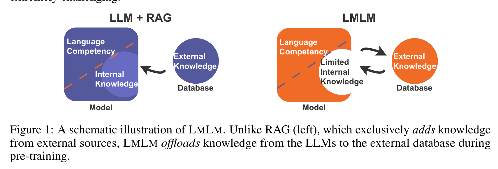
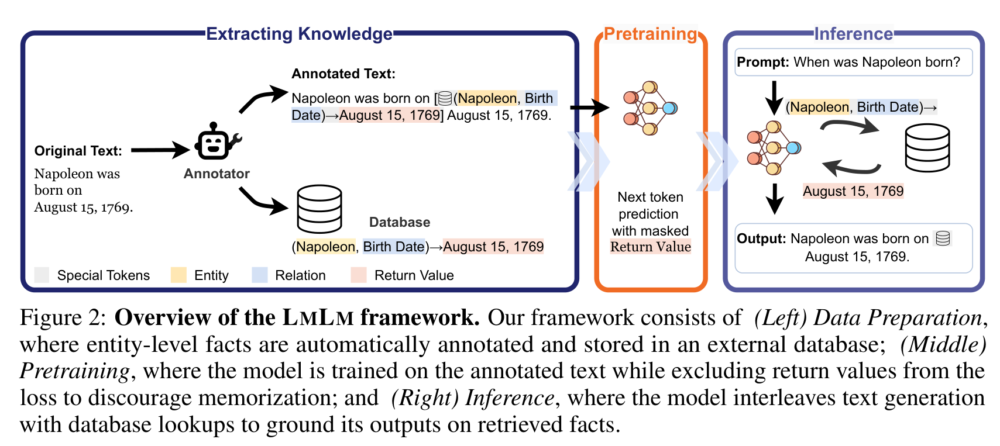
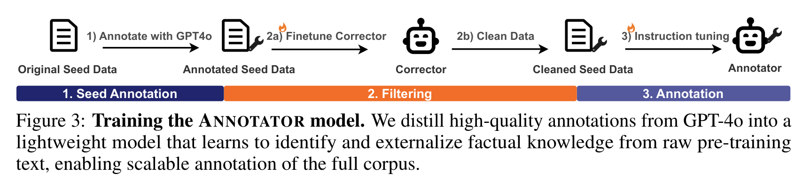
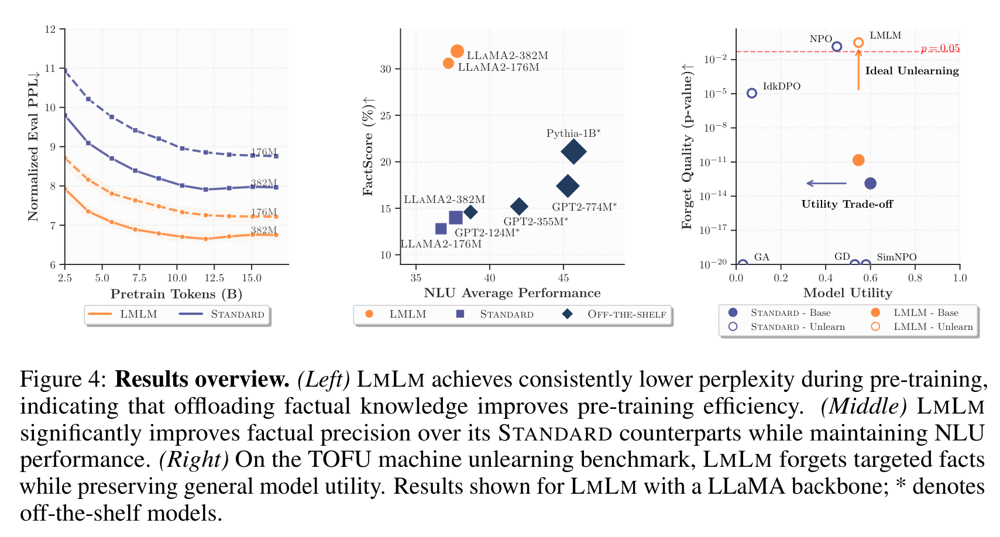
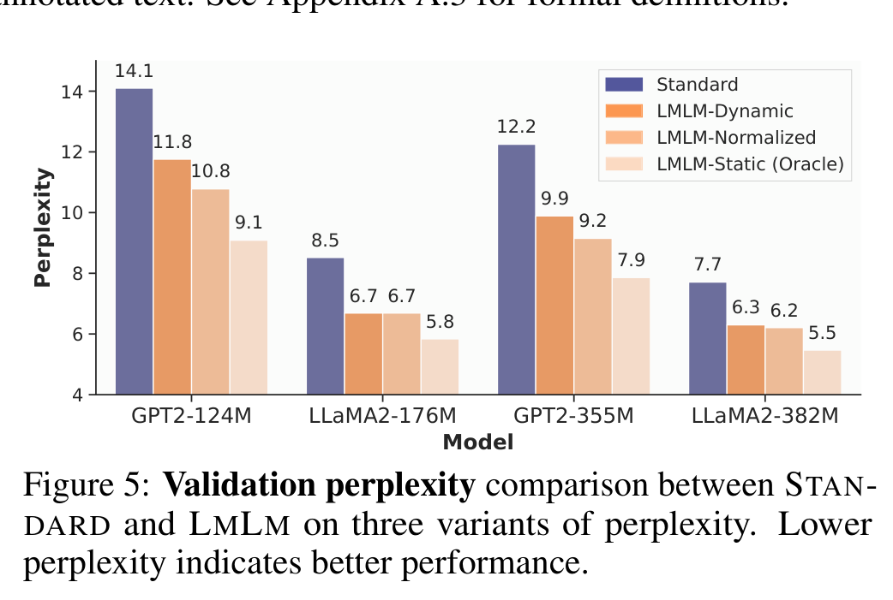
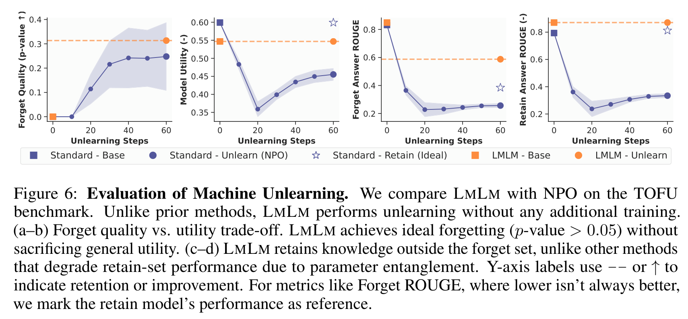
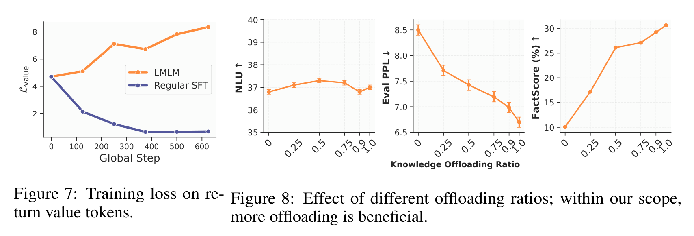
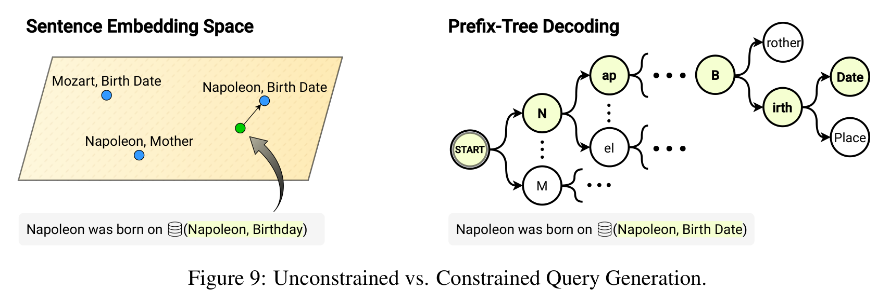

> [paper][git] https://github.com/kilian-group/LMLM.git · https://arxiv.org/abs/2505.15962

# Pre-training Limited Memory Language Models with Internal and External Knowledge

## Summary & Outline

본 연구(Cornell University, Kilian Q. Weinberger 교수 연구팀)는 기존 대형 언어 모델(LLM)이 사전학습 과정에서 언어적 패턴(문법, 유창성, 추론)과 사실적 지식(factual knowledge)을 수십억 개의 불투명한 파라미터에 뒤엉키게(entangled) 학습함으로써 발생하는 근본적인 문제점—지식 환각(hallucination), 업데이트의 난해함, 특정 사실 삭제(unlearning)의 위험성, 파라미터 용량 낭비—을 해결하기 위한 새로운 패러다임 **Limited Memory Language Models (LMLM)**을 제안한다.

### 핵심 메커니즘 요약
- **동적 룩업 쿼리 생성 및 주입 증강 생성**: LLM이 주어진 입력에 대해 텍스트를 생성하다가 사실 정보가 필요한 위치에 도달하면, 사전학습을 통해 획득한 특수 토큰(`<|db_entity|>`, `<|db_relationship|>`, `<|db_return|>`)과 함께 `(Entity, Relation)` 형태의 룩업 쿼리를 동적으로 생성한다. 추론 엔진은 이를 인터셉트하여 외부 지식 DB(5,460만 개 트리플)에서 최적의 사실값(Return Value)을 인출하고, 이를 컨텍스트에 주입한 뒤 사실에 근거한 증강 생성(grounded generation)을 완수한다.
- **사전학습 손실 마스킹 (Loss Masking)**: 사후 추론 시점에 외부 문서를 덧붙이는 일반 RAG(Retrieval-Augmented Generation)와 달리, LMLM은 **사전학습(Pre-training) 단계부터 사실 반환값 토큰을 손실 함수에서 0으로 마스킹**한다. 이를 통해 모델 파라미터가 사실 자체를 가중치에 암기하지 않고 오직 **"언제 어떤 룩업 쿼리를 생성하여 외부 지식을 호출할 것인가"**만을 학습하도록 강제한다.
- **실증적 우수성**:
  1. **초소형 모델의 스케일링 초월**: 소형 모델(124M~382M)만으로도 파라미터 수가 20~60배 이상 큰 7B~8B LLM에 필적하거나 이를 능가하는 사실 정밀도(FactScore, PopQA)를 달성.
  2. **유틸리티 무손실 즉각 망각**: 파라미터 재학습이나 Retain Set 손상 없이 외부 데이터베이스의 특정 엔트리 삭제만으로 완벽한 머신 언러닝(Instant Machine Unlearning, $p \approx 1.0$, Model Utility 1.0) 실현.
  3. **언어 모델링 성능 개선**: 실제 런타임 룩업 환경(Dynamic PPL)에서도 Standard 모델 대비 평균 1.98 포인트의 Perplexity 감소 달성.

### Outline
1. **Problem & Motivation**: 파라미터 지식 암기의 비효율성과 RAG 패러다임의 한계
2. **Contributions**: 지식-언어 분리 사전학습 정식화 및 3단계 증류 파이프라인
3. **Architecture & Pipeline**: 데이터 준비, 마스킹 사전학습, 인터리빙 동적 추론 파이프라인
4. **Methodology**: 
   - 3단계 자동 지식 추출 및 주석 (Seed Annotation $\to$ Filtering $\to$ Distillation)
   - 마스킹된 사전학습 목적함수 (Masked Next-Token Prediction)
   - 동적 룩업 디코딩 루프 및 Logit Bias 주입 메커니즘
   - 외부 지식베이스 및 Top-K 임베딩 검색기
5. **Experiments & Results**:
   - 언어 모델링 Perplexity 검증 (Static, Dynamic, Normalized)
   - TOFU 벤치마크 기반 머신 언러닝 (Instant Forgetting vs. NPO)
   - 사실 정밀도 평가 (FactScore, T-REx, PopQA)
   - 지식 오프로딩 비율 트레이드오프 및 일반 언어 이해(NLU) 검증
6. **Codebase Implementation & Snippets**: 모듈 구조, 핵심 클래스 및 스니펫 연결
7. **Analysis & Discussion**: 기존 지식 편집 기법과의 비교, 강점과 구조적 한계점

---

## Problem & Motivation

### 1. 파라미터 내 지식 뒤엉킴(Entanglement)의 병목
전통적인 LLM 사전학습 패러다임은 거대한 텍스트 코퍼스에서 다음 토큰을 예측함으로써 문법·추론 규칙과 방대한 사실 정보를 단일 가중치 행렬에 함께 압축한다. 그러나 지식을 파라미터에 저장하는 방식은 다음과 같은 치명적인 한계를 유발한다:
- **반복 학습 요구량의 과다**: 선행 연구에 따르면 신경망이 단일 사실을 안정적으로 암기하려면 사전학습 중 해당 사실이 수백 번 이상 노출되어야 하며, 롱테일(long-tail) 지식은 충분히 학습되지 못한다.
- **불투명성 및 지식 환각**: 사실이 수십억 개의 가중치에 분산 저장되어 특정 사실의 참/거짓 검증 및 귀속(attribution)이 불가능하며, 부정확한 사실을 확신을 갖고 출력하는 환각이 발생한다.
- **지식 갱신 및 삭제의 불가능성**: 새로운 사실을 업데이트하거나 특정 사용자의 개인정보·저작권 데이터를 삭제(Machine Unlearning)하려 할 때, 파라미터 간의 강한 결합으로 인해 인접 지식이 파괴되거나 치명적인 유틸리티 저하(catastrophic collapse)가 발생한다.

### 2. LLM + RAG의 구조적 불일치
기존 RAG 및 사후 툴 호출(Toolformer 등)은 이미 지식을 학습한 모델 위에 외부 검색기를 덧붙이는 구조다. 그러나 기본 모델 자체가 여전히 파라미터에 사실을 기억하고 있으므로, 검색 결과가 비어 있거나 모호할 때 내부의 낡거나 잘못된 기억으로 폴백(fallback)하여 환각을 유발하고, 도메인 외(out-of-scope) 지식에 대한 접근 차단 통제가 불가능하다.



### 3. 연구의 핵심 질문
> **"Can factual memorization be disentangled from language understanding in language models from pre-training?"**  
> (사전학습 단계부터 언어 모델의 사실 암기를 언어 이해 역량으로부터 분리할 수 있는가?)

LMLM은 언어 모델의 파라미터는 순수한 언어적 유창성과 논리적 조합 역량에 집중시키고, 모든 사실적 지식은 수정과 검증이 용이한 외부 데이터베이스로 오프로딩하는 근본적 분리 설계를 제시한다.

---

## Contributions

1. **새로운 모델 클래스 LMLM 제안**: 지식 저장을 모델 파라미터에서 외부 데이터베이스로 사전학습 단계부터 분리하는 Limited Memory Language Model 패러다임 정립.
2. **지식 마스킹 사전학습 목적함수 설계**: 사전학습 텍스트에 룩업 호출을 삽입하고, 데이터베이스에서 반환된 사실값($\mathcal{T}_v$)과 종료 토큰에 대한 손실 계산을 제외($m_t=0$)함으로써 파라미터의 사실 암기를 억제하고 룩업 트리거 능력만을 학습시키는 공식화 정립.
3. **확장 가능한 3단계 지식 추출 증류 파이프라인**: GPT-4o 시드 주석 $\to$ 과소적합 CORRECTOR 모델 기반 노이즈 필터링 $\to$ 경량 ANNOTATOR(LLaMA-3.1-8B) 증류를 통해 3B 토큰 규모의 Wikipedia 코퍼스에서 5,460만 개의 원자적 트리플을 자동 추출·구축.
4. **유틸리티 무손실 머신 언러닝 입증**: 데이터베이스에서 대상 사실 엔트리를 단순 삭제하는 것만으로 파라미터 재학습이나 Retain Set 손실 없이 완벽한 망각(Forget Quality $p \approx 1.0$, Model Utility 1.0) 달성.
5. **초소형 모델의 파라미터 스케일링 초월 실증**: LLaMA2-176M 및 382M LMLM이 표준 사전학습 모델 대비 FactScore를 각각 +20.5%p, +17.9%p 향상시키고, 7B~8B 규모의 오픈 모델(LLaMA2-7B, LLaMA3.1-8B)과 대등한 사실 정밀도를 기록.

---

## Architecture & System Pipeline

LMLM의 전체 생애주기는 데이터 준비(Data Preparation), 사전학습(Pre-training), 동적 추론(Inference)의 3개 파이프라인으로 구성된다.



```
[ Data Preparation Pipeline ]
 Raw Corpus (OLMo2 Wikipedia ~3B tokens)
        │
        ▼
 ┌──────────────┐      ┌──────────────┐      ┌──────────────┐
 │ Stage 1:     │ ---> │ Stage 2:     │ ---> │ Stage 3:     │
 │ GPT-4o Seed  │      │ CORRECTOR    │      │ ANNOTATOR    │
 │ (1k passages)│      │ Filter (10%) │      │ Distillation │
 └──────────────┘      └──────────────┘      └──────┬───────┘
                                                    │ Large-scale Annotation
                                                    ▼
 ┌────────────────────────────────────────────────────────────────────────┐
 │ Annotated Corpus with DB Lookups & External Database (54.6M Triplets)  │
 └──────────────────────────────────┬─────────────────────────────────────┘
                                    │
                                    ▼
[ Pre-training Pipeline ]
 Input: "Napoleon was born on <|db_entity|> Napoleon <|db_relationship|> Birth Date <|db_return|> August 15, 1769 <|db_end|> August 15, 1769."
                                    │
                       Next Token Prediction Loss
                       (Mask out: "August 15, 1769" & "<|db_end|>")
                                    │
                                    ▼
 [ LMLM Weights: Fluent Language Modeling + Query Generation Capability ]
                                    │
                                    ▼
[ Inference Pipeline ]
 Prompt: "When was Napoleon born? Napoleon was born on"
        │
        ▼ (Autoregressive Generation with Logit Bias)
 Model outputs: "<|db_entity|> Napoleon <|db_relationship|> Birth Date <|db_return|>"
        │
        ▼ (Stop generation & Intercept Query)
 Dense FAISS Retrieval on External DB -> Returns "August 15, 1769"
        │
        ▼ (Append Value + "<|db_end|>")
 Context: "... <|db_return|> August 15, 1769 <|db_end|>"
        │
        ▼ (Resume Generation)
 Model outputs: "August 15, 1769." -> Post-process: "Napoleon was born on August 15, 1769."
```

---

## Method

상세 코드 스니펫:
- [추론 디코딩 루프 스니펫](../source/git/snippets/Pre-training_Limited_Memory_Language_Models_with_Internal_and_External_Knowledge_2025_Cornell__modeling_inference.md)
- [사전학습 손실 마스킹 스니펫](../source/git/snippets/Pre-training_Limited_Memory_Language_Models_with_Internal_and_External_Knowledge_2025_Cornell__loss_masking.md)
- [데이터베이스 및 검색기 스니펫](../source/git/snippets/Pre-training_Limited_Memory_Language_Models_with_Internal_and_External_Knowledge_2025_Cornell__database_retriever.md)
- [논문 수식 및 벤치마크 핵심 발췌](../source/paper/Pre-training_Limited_Memory_Language_Models_with_Internal_and_External_Knowledge_2025_Cornell.md)

### 1. 지식 명세 및 3단계 자동 추출 파이프라인
LMLM은 지식의 단위를 `(entity, relation) -> value` 형식의 원자적 트리플(atomic triplet)로 규정한다. 이는 지식 그래프의 노드-엣지 구조와 1:1 대응하며, 검증과 수정이 가장 직관적인 최소 단위다.



1. **Seed Annotation (Stage 1)**: SQuAD-v2 및 Wikipedia에서 추출한 1,000개 지식 집약적 문서에 대해 GPT-4o를 호출하여 `[dblookup('Entity', 'Relationship') -> Value]` 태그를 본문에 삽입.
2. **Filtering via Underfit CORRECTOR (Stage 2)**: LLaMA-3.1-8B-Instruct 모델을 주석 데이터에 대해 2 epoch만 짧게 훈련(의도적 과소적합). 문법이 깨지거나 맥락상 부자연스러운 과도하게 특정한 주석은 높은 토큰 손실을 기록하므로, 손실 상위 10%의 불량 주석을 자동 제거.
3. **ANNOTATOR Distillation (Stage 3)**: 정제된 시드 데이터로 LLaMA-3.1-8B-Instruct를 10 epoch 인스트럭션 튜닝하여 전문 주석기 `LMLM-Annotator` 구축. vLLM 가속을 통해 64장의 A6000 GPU로 전체 OLMo2 Wikipedia 코퍼스(~3B 토큰)를 이틀 만에 자동 주석화. 최종적으로 5,460만 개의 지식 트리플(950만 엔티티, 850만 관계)을 구축.

### 2. 마스킹된 사전학습 목적함수 (Masked Pre-training Loss)
주석이 완료된 코퍼스를 토큰화할 때 4개의 특수 토큰을 도입한다:
- `DB_START_TOKEN` (`<|db_entity|>`): 룩업 블록의 시작
- `DB_SEP_TOKEN` (`<|db_relationship|>`): 엔티티와 관계 필드의 구분자
- `DB_RETRIEVE_TOKEN` (`<|db_return|>`): 검색된 사실 반환값의 주입 시작 지점
- `DB_END_TOKEN` (`<|db_end|>`): 룩업 블록의 종료

전체 토큰 시퀀스 $x = (x_1, \dots, x_T)$에서 반환값 토큰 집합 $\mathcal{T}_v$와 종료 토큰 $\langle|\text{db\_end}|\rangle$에 대한 가중치 $m_t$를 0으로 설정하여 그래디언트를 차단한다:

$$\mathcal{L}(\theta) = - \sum_{t=1}^T m_t \log p_\theta(x_t \mid x_{<t}), \quad m_t = \begin{cases} 0, & x_t \in \mathcal{T}_v \cup \{\langle|\text{db\_end}|\rangle\} \\ 1, & \text{otherwise} \end{cases}$$

이러한 손실 마스킹은 모델이 사실 반환값 토큰을 가중치에 암기하는 것을 원천적으로 차단하며, 오직 **(1) 어떤 문맥에서 사실 조회가 필요한지, (2) 어떤 엔티티와 관계를 쿼리로 생성해야 하는지, (3) 조회된 사실값을 문장 흐름에 어떻게 자연스럽게 연결할 것인지**만을 학습하게 만든다.

### 3. 동적 추론 디코딩 루프 (Interleaved Dynamic Decoding)
추론 시 `LlamaForLMLM`은 다음과 같이 텍스트 생성과 외부 룩업을 매끄럽게 교차 수행한다:
1. 사용자의 프롬프트를 입력받아 자기회귀 생성을 시작한다. 이때 특수 토큰 방출을 장려하기 위해 `LogitBiasProcessor`를 통해 룩업 시작 토큰에 로짓 바이어스(+4.0)를 부여한다.
2. 모델이 지식이 필요한 시점에 도달하면 `<|db_entity|> {Entity} <|db_relationship|> {Relation} <|db_return|>`을 방출하고 생성을 일시 중지(Stop token)한다.
3. 생성된 텍스트에서 엔티티와 관계를 정규식으로 파싱한 후, `TopkRetriever`를 호출한다.
4. `all-MiniLM-L6-v2` 모델로 쿼리를 인코딩하고, FAISS IndexFlatIP 인덱스에서 코사인 유사도 0.6 이상의 최고 일치 사실값(Return Value)을 인출한다. (조회 실패 시 `fallback_policy="top1_anyway"` 또는 `"unknown"` 적용).
5. 인출된 반환값과 `<|db_end|>`를 컨텍스트에 주입하고, 중단되었던 지점부터 생성을 재개한다.
6. 생성이 완료되면 `post_process`를 거쳐 특수 토큰과 중복 룩업 구문을 제거하고 매끄러운 최종 답변을 완성한다.

---

## Experiments & Results



### 1. 언어 모델링 Perplexity 검증
동일한 코퍼스(OLMo2 Wikipedia 3B 토큰)에서 동일 하이퍼파라미터(1024 context, 8 epochs)로 사전학습된 Standard 모델과 LMLM의 Validation Perplexity를 비교 평가하였다.



| 모델 아키텍처 및 규모 | Standard PPL | LMLM Dynamic PPL | LMLM Normalized PPL | LMLM Static (Oracle) |
|---|---|---|---|---|
| **GPT2-124M** | 14.1 | **12.2** (-1.9) | 8.5 | 7.7 |
| **LLaMA2-176M** | 11.8 | **9.9** (-1.9) | 6.7 | 6.3 |
| **GPT2-355M** | 10.8 | **9.2** (-1.6) | 6.7 | 6.2 |
| **LLaMA2-382M** | 9.1 | **7.9** (-1.2) | 5.8 | 5.5 |

- **결과 분석**: LMLM은 실제 런타임 룩업을 수행하는 Dynamic PPL 환경에서도 Standard 대비 평균 **1.98 포인트의 Perplexity 감소**를 달성하였다. 사실 암기 부담을 덜어냄으로써 모델 파라미터가 언어적 구조와 문맥 표현에 더욱 집중할 수 있음을 입증한다.

### 2. 머신 언러닝 (Machine Unlearning) 벤치마크
TOFU(Task of Fictitious Unlearning) 벤치마크(Forget 5% 설정)에서 기존 SOTA 언러닝 기법(NPO, Negative Preference Optimization) 및 미세조정 기반 기법들과 비교하였다.



- **Forget Quality ($p$-value)**: LMLM은 외부 데이터베이스에서 해당 인물의 트리플을 삭제하는 것만으로 $p=0.999$를 달성하여 완벽한 지식 삭제를 입증.
- **Model Utility**: NPO를 비롯한 가중치 수정 기반 기법들은 삭제 강도를 높일수록 Retain Set의 유틸리티가 급격히 저하되거나 붕괴하는 반면, LMLM은 가중치를 전혀 수정하지 않으므로 **Model Utility가 1.0(100%)으로 완벽히 보존**된다.

### 3. 사실 정밀도 (Factual Precision) 평가
장문 전기 생성(FactScore), 단문 지식 완성(T-REx 11k), 롱테일 지식 질의응답(PopQA)의 3개 벤치마크에서 평가를 수행하였다.

| 모델 | 모델 유형 | FactScore (%) ↑ | T-REx EM (%) ↑ | PopQA Acc (%) ↑ |
|---|---|---|---|---|
| OpenAI GPT2-124M* | Off-the-shelf | 14.6 | 20.1 | 18.51 |
| GPT2-124M | STANDARD | 10.7 | 41.2 | 18.51 |
| **GPT2-124M** | **LMLM (Ours)** | **20.6 (+9.9)** | **54.6 (+13.4)** | **49.89 (+31.38)** |
| LLaMA2-176M | STANDARD | 10.1 | 46.3 | 24.59 |
| **LLaMA2-176M** | **LMLM (Ours)** | **30.6 (+20.5)** | **54.1 (+7.8)** | **49.61 (+25.02)** |
| OpenAI GPT2-355M* | Off-the-shelf | 15.2 | 28.4 | 19.10 |
| GPT2-355M | STANDARD | 14.4 | 44.9 | 21.40 |
| **GPT2-355M** | **LMLM (Ours)** | **23.9 (+9.5)** | **58.7 (+13.8)** | **52.00 (+30.60)** |
| LLaMA2-382M | STANDARD | 14.0 | 52.0 | 22.70 |
| **LLaMA2-382M** | **LMLM (Ours)** | **31.9 (+17.9)** | **58.1 (+6.1)** | **50.80 (+28.10)** |
| Pythia-1B* | Off-the-shelf | 21.1 | 47.8 | 19.50 |
| LLaMA2-7B* | Off-the-shelf | 34.0 | 60.5 | 29.20 |
| LLaMA3.1-8B* | Off-the-shelf | 40.3 | 67.3 | 29.40 |

- **결과 분석**: LLaMA2-176M-LMLM(30.6%)은 파라미터가 5배 이상 큰 Pythia-1B(21.1%)를 크게 앞서며, LLaMA2-382M-LMLM(31.9%)은 LLaMA2-7B(34.0%)에 근접하는 FactScore를 달성하였다. 특히 롱테일 엔티티를 다루는 PopQA에서는 382M LMLM(50.8%)이 8B 모델(29.4%) 대비 **+21.4%p 높은 정확도**를 기록하였다.

### 4. 심층 분석 및 절제 연구 (Ablations)



- **사실 암기 억제 검증 (Figure 7)**: 일반 SFT로 훈련된 모델은 Return Value 토큰에 대한 훈련 손실이 빠르게 감소(암기)하는 반면, LMLM은 훈련 내내 높은 손실을 유지하여 파라미터 내 사실 암기가 성공적으로 차단됨을 확인.
- **데이터베이스 차단 실험 (Table 4)**: LLaMA2-382M-LMLM에서 데이터베이스 조회를 강제로 끄면 FactScore가 31.9%에서 12.8%로 급락하고 T-REx EM이 58.1%에서 38.5%로 폭락함. 이는 모델이 사실을 파라미터로 꼼수 암기하지 않고 전적으로 DB 조회에 의존하고 있음을 반증.
- **지식 오프로딩 비율 영향 (Figure 8)**: Standard 모델 대비 학습 손실 차이가 큰 사실(롱테일 지식)을 우선적으로 오프로딩할 때, 오프로딩 비율이 0%에서 90~100%로 높아질수록 Perplexity와 FactScore가 단조 증가하며, NLU 벤치마크(ARC, PIQA, SIQA, HellaSwag) 성능은 손실 없이 안정적으로 유지됨.
- **제약적 쿼리 생성 (Figure 9 & Appendix C.3)**: Prefix-tree(Trie) 기반 제약 디코딩과 Dense 임베딩 유사도 검색을 비교한 결과, Prefix-tree는 100% 유효한 트리플을 보장하지만 DB 규모가 제한적일 때 다양성이 제약될 수 있어, 범용 환경에서는 임베딩 기반 퍼지 매칭이 유연성을 제공함.



---

## Codebase Implementation & System Analysis

### 1. 서브모듈 구조
LMLM 공식 저장소(`source/git/LMLM_kilian-group/`)는 다음과 같은 모듈식 파이프라인으로 구성되어 있다:

| 디렉토리 / 파일 | 핵심 역할 및 설명 |
|---|---|
| `src/lmlm/constants.py` | 특수 토큰(`<|db_entity|>`, `<|db_relationship|>`, `<|db_return|>`, `<|db_end|>`) 및 경로 정의 |
| `src/lmlm/modeling_lmlm.py` | `LlamaForLMLM` 및 `GPT2ForLMLM` 추론 래퍼, `LogitBiasProcessor`, 동적 생성 루프 |
| `src/lmlm/annotate/` | GPT-4o 시드 주석, CORRECTOR 필터링, ANNOTATOR 인스트럭션 튜닝 및 vLLM 배치 주석 |
| `src/lmlm/database/` | `DatabaseManager`(JSON 지식베이스) 및 `TopkRetriever`(FAISS + sentence-transformers) |
| `src/lmlm/training/` | `pretrain.py`, `finetune.py`, `utils_mask.py`(스팬 마스킹), `utils_metrics.py`(PPL 계산) |
| `experiment/eval/` | FactScore, T-REx, TOFU, LightEval NLU 평가 스크립트 |

### 2. 핵심 컴포넌트 분석
- **`LlamaForLMLM.generate_with_lookup`**: HuggingFace의 표준 `generate` 호출 중간에 `DB_RETRIEVE_TOKEN`을 인터셉트하여 데이터베이스 조회를 수행하고, 사실값을 다시 주입하여 생성을 이어가는 제어 루프.
- **`utils_mask.extract_dblookup_masks`**: PyTorch `searchsorted` 및 `cumsum` 기반으로 벡터화된 배치 단위 스팬 추출을 수행하여 GPU 연산 병목 없이 1024 길이 시퀀스의 사실값 위치를 $O(1)$로 마스킹.
- **`TopkRetriever`**: 5,460만 개 트리플을 `all-MiniLM-L6-v2`로 인코딩하여 FAISS FlatIP 인덱스로 관리하며, HuggingFace Hub(`kilian-group/LMLM-database-cache`)와의 캐시 연동 지원.

---

## Analysis & Discussion

### 1. Strengths & Scientific Significance
- **사전학습 패러다임의 패러다임 전환**: RAG를 사후 대증요법으로 사용하던 기존 관행을 뒤집고, 사전학습 단계부터 모델의 역할을 "지식 암기체"가 아닌 "지식 인출 및 추론 엔진"으로 재정의함.
- **비용 대비 성능의 극대화**: 176M~382M 소형 모델이 8B LLM 수준의 사실 정밀도를 기록함으로써, 리소스가 극도로 제한된 온디바이스(on-device) 환경이나 프라이버시가 중요한 엔터프라이즈 환경에서 엄청난 효율성을 제공함.
- **규제 준수 및 완벽한 언러닝**: GDPR '잊힐 권리'나 저작권 데이터 삭제 요청 시, 파라미터 미세조정(Fine-tuning)이나 RL 기반의 불완전한 언러닝 대신 데이터베이스의 특정 row 삭제만으로 100% 안전한 망각을 보장함.

### 2. Limitations & Engineering Bottlenecks
- **추론 지연시간 및 배치 생성 미지원**: 현재 `LlamaForLMLM` 구현은 생성 도중 텍스트를 파싱하고 외부 검색기를 호출하는 구조로 인해 배치 추론(batched inference)이 지원되지 않으며 단일 샘플 단위로 순차 실행됨.
- **원자적 엔티티 사실에 국한된 지식 표현**: 현재 프레임워크는 `(entity, relation) -> value` 형태의 명시적 사실 트리플에 초점이 맞춰져 있어, 복합 추론 절차, 상식적 지식, 또는 조건부 정책과 같은 고차원 지식의 오프로딩에는 추가 연구가 필요함.
- **검색 실패 시의 폴백 취약성**: 데이터베이스에 존재하지 않는 엔티티 질의 시 상위 1개 유사 항목으로 폴백(`top1_anyway`)하거나 `unknown`을 출력하는 과정에서 경계선 오류가 발생할 수 있음.

### 3. Future Directions
- **고차원 지식 구조로의 확장**: 트리플 형태를 넘어 계층적 온톨로지, 문서 청크, 혹은 절차적 워크플로(Workflow) 메모리로의 확장.
- **엔드투엔드 미분 가능 룩업**: 현재의 텍스트 파싱 기반 룩업 대신 임베딩 공간에서의 미분 가능한 소프트 룩업 또는 최적화된 배치 디코딩 엔진 통합.
- **자율형 에이전트 시스템과의 결합**: 에이전트의 에피소딕 메모리 및 툴 사용 루프와 사전학습된 LMLM을 결합하여, 완벽히 제어 가능하고 환각 없는 자율 에이전트 아키텍처 구축.

---

## References

- **Paper**: [arXiv:2505.15962](https://arxiv.org/abs/2505.15962) — *Pre-training Limited Memory Language Models with Internal and External Knowledge* (Cornell University, 2025)
- **Code Repository**: [github.com/kilian-group/LMLM](https://github.com/kilian-group/LMLM)
- **Hugging Face Collections**: [kilian-group/lmlm-models](https://huggingface.co/collections/kilian-group/lmlm-models-6862b8091d72eab3891ffbcb)
- **Project Page**: [linxi-zhao.github.io/LMLM-site](https://linxi-zhao.github.io/LMLM-site/)
- **Related Benchmarks**: [TOFU (Open Unlearning)](https://github.com/locuslab/open-unlearning), [FActScore](https://github.com/shmsw25/FActScore), [T-REx / LAMA](https://dl.fbaipublicfiles.com/LAMA/data.zip), [PopQA](https://github.com/Alex-Ak/PopQA)
