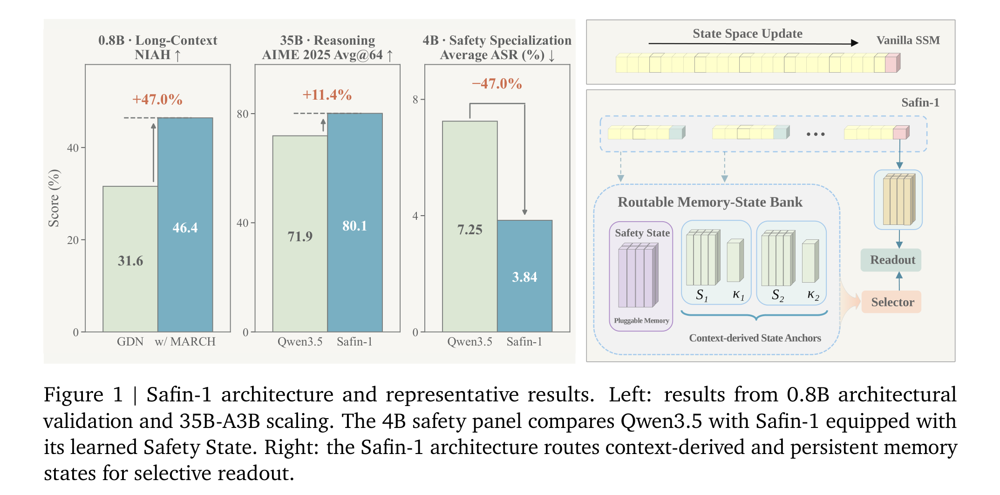
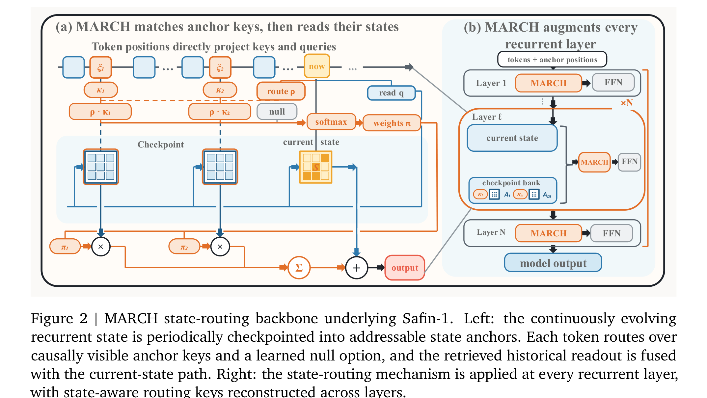
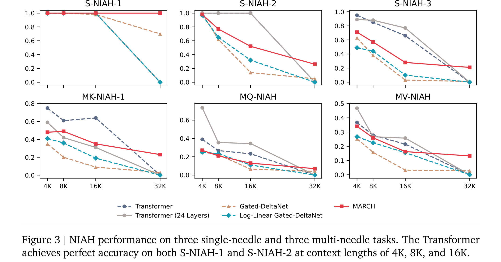
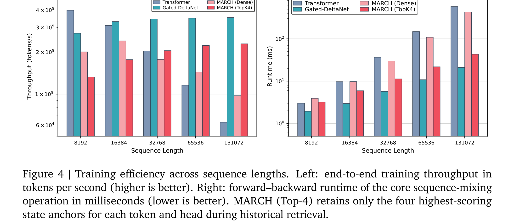

> [paper][git] https://github.com/AI45Lab/Safin-1.git · https://arxiv.org/abs/2609.00092

# Safin-1: Safety from Within through Memory-Native State Evolution

## Overview

Safin-1(Shanghai AI Laboratory, 2026)은 장기 상호작용(long-horizon interaction)과 복합 추론 환경에서 모델의 안전성(Safety)을 외부 보호막(external safeguards)이나 사후 미세조정(post-hoc SFT)에 의존하지 않고, 모델 본연의 계산 기저(native computation) 안에서 직접 표현하고 제어하는 **"내재적 안전성(Safety from Within)"** 패러다임을 구현한 파운데이션 모델 패밀리이다.

Safin-1의 핵심 아키텍처는 **MARCH(Memory-Anchor Routing across Context History)**로, 순환 신경망/선형 어텐션(Recurrent / Linear Attention)의 연속적인 내부 상태(`S_t`)를 주기적으로 스냅샷하여 **상태 앵커(State Anchor)**로 보관하고, 런타임에 쿼리 토큰이 내용 기반 라우팅(Content-conditioned Routing)을 통해 필요한 과거 상태를 선택적으로 인출(selective readout)하여 현재 상태와 가산 융합(additive fusion)한다.

나아가 Safin-1은 이 라우팅 인터페이스를 문맥 기억을 넘어 영구적 역량 상태(Persistent Capability State)로 확장하였다. 백본 가중치를 완전히 고정한(frozen) 상태에서 별도의 **안전 상태(`P_{safe}`)**를 라우팅 가능한 상태 뱅크에 플러그인(plug-in) 형태로 장착함으로써, 탈옥 공격 성공률(ASR)을 4B에서 42.3%, 35B-A3B에서 52.3% 대폭 감소시키면서도 기존 파라미터 미세조정(LoRA) 대비 과도한 거부(Over-Refusal)를 획기적으로 억제하고 일반 추론 역량을 온전히 보존함을 입증하였다.



---

## Problem & Motivation

### 1. 장기 상호작용에서의 두 가지 연속성 요구와 기존 모델의 한계
장시간에 걸친 지능적 상호작용(Long-horizon intelligence)을 수행하는 에이전트 및 파운데이션 모델은 두 가지 형태의 연속성을 유지해야 한다:
1. **문맥 연속성(Contextual Continuity)**: 긴 문맥 전체에서 발생한 사실과 상호작용 기록을 소실 없이 보존하고 회상하는 능력.
2. **역량 연속성(Capability Continuity)**: 주어진 상황과 위험 수준에 부합하는 적절한 행동 제약(안전성, 정렬 규범)을 일관되게 발동하는 능력.

기존 언어 모델 아키텍처는 이 두 기능을 분리된 기저(substrate)로 처리해 왔다:
- **트랜스포머(Transformer / Full Attention)**: 이전 모든 토큰에 대한 미세 접근을 보존하지만, 시퀀스 길이에 따라 KV 캐시 메모리가 선형(`O(L)`)으로 증가하고 어텐션 계산량이 이차(`O(L²)`)로 폭증하여 장기 추론 및 온디바이스 서빙에서 심각한 병목을 유발한다.
- **순환/선형 어텐션 모델(Recurrent / SSM / DeltaNet)**: 과거 인과적 접두사(causal prefix)를 고정 크기의 은닉 상태(`S_t ∈ ℝ^{d_v × d_k}`)로 압축하여 상수 메모리(`O(1)`) 디코딩을 달성한다. 그러나 **단일 상태 병목(Single-State Bottleneck)**으로 인해, 상태가 순차적으로 업데이트·감쇠(attenuation)·덮어쓰기(overwriting)되는 과정에서 초반에 형성된 핵심 연상(early association)이나 사실 정보가 비가역적으로 소실되어 현재 시점의 은닉 상태만으로는 과거 정보를 복원할 수 없다.

### 2. 외재적 안전성(External Safeguards) 및 사후 정렬의 한계
기존의 LLM 안전성 확보 방식은 주로 모델 외부에 래핑된 분류기(Guardrails)를 두거나, SFT / RLHF를 통해 모델의 출력 토큰 분포를 사후에 교정하는 방식에 의존하였다:
- **표면적 거부 편향(Superficial Refusal)과 과도 거부(Over-Refusal)**: 사후 정렬은 위험 키워드가 포함된 정상적인 요청(예: "어떻게 바이러스가 전파되는지 생물학적 원리를 설명해 줘")까지 무차별적으로 거부하는 정렬세(Alignment Tax)를 초래한다.
- **파라미터 오염 및 망각(Catastrophic Forgetting)**: 안전성 데이터를 학습시키는 과정에서 모델 백본의 가중치가 변형되어 수학, 코딩, 복합 추론 등의 범용 지능이 저하된다.
- **탈옥 공격(Jailbreak) 취약성**: 외부 가드레일은 다단계 프롬프트 주입(Multi-turn Prompt Injection)이나 모호화(Obfuscation) 기법을 통해 쉽게 우회될 수 있다.

### 3. "Safety from Within" 패러다임의 제안
이러한 한계를 극복하기 위해 제안된 **Safety from Within(Making Safe AI / R2AI 관점)**은 안전성을 외부 제약이나 파라미터 변조가 아닌, **모델 본연의 내부 상태 계산 및 선택적 인출 메커니즘(State-Native Computation & Selective Invocation)**으로 내재화한다. 
모델의 상태를 단순한 "과거 문맥의 수동적 압축물"이 아니라, "행동 양식을 유지하고 진화시키는 능동적 기저(Active Substrate)"로 재정의하는 것이다.

---

## Contributions

1. **MARCH(Memory-Anchor Routing across Context History) 아키텍처 제안**:
   - 순환 신경망(Recurrent Backbone)의 연속적 상태 갱신을 방해하지 않으면서, 일정한 경계마다 누적 상태를 **상태 앵커(State Anchor, `A^(m,ℓ)`)**로 스냅샷하여 보관.
   - 각 앵커 위치에 학습 가능한 앵커 임베딩(`ξ`)을 주입하여 레이어를 거치며 내용 기반 라우팅 키(`κ_m^(ℓ)`)를 동적으로 생성.
   - 쿼리 토큰(`x_t`)이 인과적으로 가시적인 앵커들을 내용 조건부로 라우팅하고, 상태 인출을 건너뛸 수 있는 **학습된 널 후보(Learned Null Candidate, `∅`)**를 포함하여 소프트맥스로 가중 결합한 뒤, 기본 순환 출력과 가산 융합(Additive Fusion)하는 구조 확립.
2. **영구적 역량 상태(Persistent Capability States) 및 Safety State 구현**:
   - 동적 문맥 앵커뿐만 아니라 시퀀스 위치를 점유하지 않는 학습 가능한 영구 상태(`P_j`)를 동일한 라우팅 뱅크에 통합.
   - 백본 파라미터를 100% 동결(frozen)한 상태에서 레이어별 **안전 상태(`P_{safe}`)**만 특화 학습시켜, 런타임에 손쉽게 탈부착(plug-and-play) 가능한 상태 기반 정렬 인터페이스 구축.
3. **하드웨어 친화적 Producer–Reader 퓨즈드 커널 개발**:
   - 순환 연산과 체크포인팅을 수행하는 청크 단위 Recurrent Producer와 FlashAttention 스타일의 I/O 인식 Fused State Reader를 결합.
   - 라우팅 행렬이나 거대한 후보별 상태 텐서를 GPU HBM에 구체화하지 않고 스트리밍 리덕션으로 처리하며, Top-4 희소 라우팅(Sparse Routing)을 통해 128K 초장문맥에서 Dense 라우팅 대비 2배 이상의 처리량 및 10배의 코어 런타임 단축 달성.
4. **0.8B 소규모 검증부터 4B 및 35B-A3B 대규모 확장까지 철저한 실증**:
   - 0.8B 모델 50B 토큰 학습을 통해 GDN, KDA, GDN-2 등 다양한 순환 백본에서 일관된 성능 향상 및 NIAH 6개 태스크 평균 최대 +47.0% 회상도 달성.
   - Qwen3.5 기반 4B Dense 및 35B-A3B MoE 백본을 CPT-SFT 파이프라인으로 확장하여 MMLU-Pro(+9.28 pp), AIME 2025(+8.22 pp), MBPP(+6.20 pp) 등 장기 추론 성능 대폭 향상.
   - Safety State 장착 시 4B에서 42.3%, 35B-A3B에서 52.3%의 탈옥 ASR 감소를 달성하면서, 동등하게 학습된 rank-8 LoRA 대비 XSTest 과도 거부율(ORR)을 현저히 낮추고 수학/코딩 역량을 안전하게 보존.

---

## Architecture & Method

상세 발췌 수식 및 구현 사양 → [excerpt](../source/paper/Safin-1_Safety_from_Within_through_Memory-Native_State_Evolution_2026_Shanghai_AI_Lab.md)



### 1. MARCH 전체 아키텍처 및 연산 파이프라인

MARCH는 기존의 순환형 믹서(Recurrent Mixer, 예: Gated DeltaNet)의 상태 갱신 메커니즘을 수정하지 않고 보조적인 기억 인출 경로(Auxiliary Memory-Readout Branch)를 병렬로 추가하는 방식으로 동작한다.

```
[ Input Tokens & Anchor Boundaries ]
  t_1, t_2, ..., t_{b_1}  |  [ξ_1]  |  t_{b_1+1}, ..., t_{b_2}  |  [ξ_2]  |  ...  |  t_L
                           ↓                                      ↓
[ Continuous Recurrent Update ]                                  ↓
  S_t = S_{t-1} + ΔS_t (Non-resetting cumulative state)           ↓
  At b_1: Snapshot A^(1,ℓ) = S_{b_1}^(ℓ)                          ↓
  At b_2: Snapshot A^(2,ℓ) = S_{b_2}^(ℓ) -------------------------+
                           ↓
[ Content-Conditioned Metadata Generation ]
  Anchor Token ξ_m  ──>  q_m^(ℓ) = W_q u_m^(ℓ)  ──>  o_m^(ℓ) = A^(m,ℓ) q_m^(ℓ) (Read own state)
                    ──>  Routing Key: κ_m^(ℓ) = W_k u_m^(ℓ) ∈ ℝ^{d_r}
                           ↓ (Propagated through residual & FFN across layers)
                           ↓ (Key κ becomes state-aware after Layer 1)
[ Routable Memory-State Bank at Layer ℓ ]
  Bank = { (A^(1), κ_1), (A^(2), κ_2), ..., (A^(M), κ_M) } ∪ { (P_safe, κ_safe) } ∪ { Null (A=0) }
                           ↓
[ Query Token t (at position t > b_m) ]
  Current Hidden x_t  ──>  Native State Query: q_t = W_q x_t  ──>  Native Readout: S_t q_t
                      ──>  Routing Query:      ρ_t = W_R x_t
                           ↓
[ Content-Routed Selection & Normalization ]
  Logits:  a_{t,j} = ρ_t^T κ_j   (for visible anchors & persistent states)
           n_t     = w_∅^T x_t + b_∅  (for learned Null option)
  Softmax: π_{t,j} = exp(s_{t,j}) / [ ∑_{r} exp(s_{t,r}) + exp(n_t) ]
                           ↓
[ Additive State Fusion ]
  o_t = S_t q_t  +  ∑_{j} π_{t,j} · A(j) q_t   ──>  Projection & FFN  ──>  Layer Output
```

---

### 2. 수학적 정식화 (Mathematical Formulation)

#### (1) 문맥 유도형 상태 앵커 (Context-Derived State Anchors)
시퀀스 `T = [t_1, ..., t_L]`에 대해 앵커 경계 집합 `B = {b_m}_{m=1}^M` (`0 = b_0 < b_1 < ... < b_M ≤ L`, 기본 간격 `C = 512` 토큰)을 정의하고, 각 경계 바로 뒤에 공유된 학습 가능 임베딩 `ξ`를 삽입한다:

```
T_tilde = ∥_{m=1}^M ( [t_{b_{m-1}+1}, ..., t_{b_m}] ∥ [ξ_m] ) ∥ [t_{b_M+1}, ..., t_L]
```

순환 상태는 앵커 위치에서 초기화(reset)되지 않고 연속적으로 전파된다. 경계 `b_m` 직후 누적된 은닉 상태를 스냅샷하여 상태 앵커 `A^(m,ℓ)`를 생성한다:

```
A^(m,ℓ) = S_{b_m}^(ℓ) ∈ ℝ^{d_v × d_k},    m = 1, ..., M
```

이는 특정 세그먼트만의 국소 상태가 아니라 `0`부터 `b_m`까지의 **누적 문맥(cumulative prefix)** 전체를 보존하므로, 단일 순환 메모리가 시간에 따라 진화하는 궤적(temporal trajectory)을 고스란히 담아낸다.

#### (2) 내용 조건부 앵커 메타데이터 생성 (Content-Conditioned Anchor Metadata)
레이어 `ℓ`에서 앵커 위치 `ξ_m`의 정규화된 입력 표현 `u_m^(ℓ)`은 자신이 대응하는 스냅샷 `A^(m,ℓ)`만을 읽는다:

```
q_m^(ℓ) = W_q^(ℓ) u_m^(ℓ),    o_m^(ℓ) = A^(m,ℓ) q_m^(ℓ)
κ_m^(ℓ) = W_k^(ℓ) u_m^(ℓ) ∈ ℝ^{d_r}
```

이 읽기 출력 `o_m^(ℓ)`이 레이어의 잔차 연결(residual connection)과 FFN을 통과하여 다음 레이어의 앵커 표현 `u_m^(ℓ+1)`을 형성하므로, **첫 번째 레이어 이후부터는 모든 앵커의 라우팅 키 `κ_m`이 해당 체크포인트에 저장된 실제 메모리 내용에 종속(state-dependent / content-conditioned)**된다. 따라서 라우터는 앵커의 시간적 위치가 아니라 "어떤 정보가 저장되어 있는가"를 기준으로 상태를 검색할 수 있다.

#### (3) 내용 기반 상태 인출 및 널 옵션 (Content-Routed Retrieval & Null Option)
시점 `t`의 텍스트 토큰에 대해 인과적으로 가시적인 앵커 집합을 `V_t = {m ∈ {1, ..., M} | b_m < t}`라 하자. 
토큰의 은닉 벡터 `x_t`로부터 라우팅 쿼리 `ρ_t`를 사영하고 앵커 키와의 내적으로 유사도 점수를 계산한다:

```
ρ_t = W_R x_t,    a_{t,j} = ρ_t^T κ_j,    j ∈ V_t
```

과거 상태 회상이 불필요한 일반적인 토큰 생성 단계에서는 상태 인출을 완전히 우회(bypass)할 수 있도록, 내용이 0인 **널 후보(`∅`, `A(∅) = 0`)**를 후보 집합 `C_tilde_t = V_t ∪ {∅}`에 추가한다:

```
n_t = w_∅^T x_t + b_∅
s_{t,j} = a_{t,j} (j ∈ V_t),    s_{t,j} = n_t (j = ∅)
π_{t,j} = exp(s_{t,j}) / ∑_{r ∈ C_tilde_t} exp(s_{t,r})
```

최종 레이어 출력은 기본 순환의 네이티브 쿼리 `q_t`를 재사용하여 가산 융합된다:

```
o_t = S_t q_t + ∑_{j ∈ C_tilde_t} π_{t,j} · A(j) q_t
```

널 후보는 행렬 값이 0이므로, 라우터가 널에 높은 가중치(`π_{t,∅}`)를 부여하면 추가적인 게이트 모듈 없이도 보조 인출 경로의 출력이 자연스럽게 감쇠되어 순수한 현재 상태(`S_t q_t`)만 유지된다.

---

### 3. 영구적 역량 상태 (Persistent Capability States: Safety State)

MARCH의 라우팅 뱅크는 문맥에서 동적으로 생성되는 앵커 외에도, 입력 토큰 위치를 차지하지 않는 `J`개의 **학습 가능한 영구 상태 `{P_j}_{j=1}^J`**를 탑재할 수 있다.

```
C_t = V_t ∪ {p_1, ..., p_J} ∪ {∅},    A(p_j) = P_j
```

영구 상태 `P_j`는 동적 앵커와 완전히 동일한 행렬 구조(`ℝ^{d_v × d_k}`)와 메타데이터 경로를 가지며, 동일한 쿼리 `ρ_t`에 의해 단일 소프트맥스 상에서 동적 앵커 및 널 옵션과 함께 공동 정규화(jointly normalized)된다.

```
[ Dynamic Anchors (Context) ]      [ Persistent State (Safety) ]      [ Null Option ]
       A^(1), A^(2), ...                   P_safe (Layer ℓ)                  A = 0
             │                                    │                            │
             ▼                                    ▼                            ▼
       Sim: ρ_t^T κ_m                      Sim: ρ_t^T κ_safe                  Logit: n_t
             └──────────────────┬─────────────────┘                            │
                                ▼                                              ▼
                  Single Softmax Distribution: [ π_1, π_2, ..., π_safe, π_null ]
                                                │
                                                ▼
                 Selective Token-Dependent Injection: o_t = S_t q_t + π_safe · P_safe q_t + ...
```

- **안전 상태(`P_{safe}`)의 특화(Specialization)**:
  - 언어 모델 백본(가중치)을 **100% 동결(Frozen)**.
  - 레이어별 `{P_{safe}^(ℓ)}_ℓ` 파라미터만을 손실 함수(causal cross-entropy)로 최적화.
  - 위험 프롬프트가 들어오면 토큰의 라우팅 쿼리 `ρ_t`가 `P_{safe}`의 키 `κ_{safe}`와 높은 유사도를 형성하여 안전 제약이 활성화되고, 무해한 프롬프트에서는 널 옵션이나 동적 문맥 앵커가 선택되어 백본 본연의 지능과 유용성이 100% 발현된다.
  - 모델의 파라미터를 영구적으로 변경하지 않으므로, 필요에 따라 `P_{safe}`를 런타임에 켜거나 끄는(attach / detach) 무손실 제어가 가능하다.

---

### 4. 하드웨어 친화적 Producer–Reader 퓨즈드 커널

긴 시퀀스 길이에서 발생할 수 있는 메모리 대역폭(HBM) 병목과 연산 지연을 해소하기 위해 I/O 인식 설계를 도입하였다:

1. **Recurrent Producer (청크 단위 순환 커널)**:
   - Gated DeltaNet의 하드웨어 최적화 청크 커널을 계승하여 텐서 코어(Tensor Core) 블록 단위로 순환 상태를 갱신.
   - 앵커 경계 `b_m`에 도달할 때마다 누적 상태 `A^(m,ℓ)`를 상태 뱅크에 기록.
2. **Fused State Reader (I/O 인식 스트리밍 리덕션)**:
   - FlashAttention의 타일링 원리를 적용하여 쿼리 토큰 블록과 상태 후보 타일을 온칩 SRAM에 로드.
   - `[토큰 수 × 앵커 수]` 크기의 거대한 라우팅 유사도 행렬이나, `[토큰 수 × 앵커 수 × d_v]` 크기의 후보별 상태 출력 텐서를 전역 메모리(HBM)에 전혀 저장하지 않고, SRAM 내부에서 라우팅 점수 계산 → 소프트맥스 정규화 → 가중 상태 융합을 단일 퓨즈드 연산으로 완결.
3. **Top-K 희소 라우팅 (Top-4 Default)**:
   - 각 토큰마다 라우팅 점수가 가장 높은 상위 `K=4`개의 앵커 및 영구 상태에 대해서만 행렬-벡터 곱(`A(j) q_t`)을 수행.
   - 128K 문맥에서 Dense 라우팅 대비 학습 처리량(Throughput)을 2배 이상 높이고 코어 런타임을 10배 가까이 단축.

---

## Experiments & Results

### 1. 벤치마크 및 실험 설정

- **소규모 아키텍처 검증 (0.8B)**:
  - 21개 레이어의 완전 순환 백본(GDN, KDA, GDN-2), hidden size 1,536, SwiGLU 4,096.
  - Long-Data-Collections 기반 50B 토큰 사전학습(from scratch, 16K context).
  - 평가: 8개 상식 추론(CS), 12개 LongBench 태스크, 6개 실세계 In-Context Retrieval, 6개 RULER Needle-In-A-Haystack(NIAH) 태스크(4K~64K 길이 외삽).
- **대규모 스케일링 (4B & 35B-A3B)**:
  - 4B Dense: Qwen3.5-4B 기반 (32개 레이어 중 24 GDN + 8 Full-Attention, 16개 GDN 레이어에 MARCH 적용).
  - 35B-A3B MoE: Qwen3.5-35B-A3B-Instruct 기반 (40개 레이어 중 30 GDN + 10 Full-Attention, 16개 GDN 레이어에 MARCH 적용).
  - Continual Pretraining(CPT, 50B 토큰, 32K context) + SFT(30B 토큰, 32K context).
  - 평가: MMLU, MMLU-Pro, GPQA-Diamond, GSM8K, MATH, AIME 2025 (Avg@64), IFEval, LongBench v2, MBPP, HumanEval.
- **안전성 평가 (Safety Suite)**:
  - 5대 탈옥 공격 벤치마크 (ASR ↓): WildJailbreak, FORTRESS, StrongREJECT, Jailbreak-R1, JailbreakBench(JBB).
  - 과도 거부 평가 (ORR ↓): XSTest (무해한 프롬프트 거부율).

---

### 2. 소규모 아키텍처 검증 결과 (0.8B 모델)

#### (1) 상식 추론, 장문맥 이해 및 검색 성능 비교

| 모델 | Commonsense (8-Task Avg ↑) | LongBench (12-Task Avg ↑) | Retrieval (6-Task Avg ↑) | NIAH 16K (6-Task Avg ↑) | NIAH 32K (외삽 ↑) |
|---|---|---|---|---|---|
| **Transformer (24-Layer)** | 41.38% | 15.42% | 33.20% | 66.88% | 0.00% (외삽 붕괴) |
| **Gated DeltaNet (GDN)** | 40.11% | 11.90% | 19.20% | 21.73% | 15.13% |
| **GDN w/ Log-Linear** | 39.99% | 12.51% | 20.52% | 19.00% | 0.00% |
| **GDN w/ MARCH (Safin-1)** | **41.48%** (+1.37 pp) | **14.87%** (+25.0% 상대) | **23.31%** (+21.4% 상대) | **39.46%** (+81.6% 상대) | **31.71%** (+109.6% 상대) |



- **순환 백본 전반의 범용적 향상**:
  - Gated DeltaNet: NIAH 평균 31.58% → **46.43%** (+47.0% 상대 향상)
  - KDA: NIAH 평균 31.64% → **41.38%** (+30.8% 상대 향상)
  - GDN-2: NIAH 평균 40.52% → **44.80%** (+10.6% 상대 향상)
- **트랜스포머 수준의 단문맥 성능 달성**: 0.8B 규모에서 MARCH는 순환 모델이면서도 24레이어 트랜스포머(41.38%)를 능가하는 41.48%의 상식 추론 정확도를 기록.
- **외삽(Length Extrapolation) 안정성**: 트랜스포머가 학습 길이(16K)를 벗어난 32K/64K에서 0%로 급락하는 반면, MARCH는 RoPE 제거 구조를 통해 64K에서도 높은 정확도를 유지.

---

### 3. 대규모 스케일링 결과 (4B & 35B-A3B 백본)

동일한 CPT 및 SFT 데이터를 투입하여 매칭 훈련된 Qwen3.5 베이스라인과 Safin-1의 전체 성능 비교:

| 평가 영역 | 벤치마크 태스크 | 4B Qwen3.5 | 4B Safin-1 | 35B-A3B Qwen3.5 | 35B-A3B Safin-1 |
|---|---|---|---|---|---|
| **지식 및 복합 추론 (↑)** | MMLU | 75.47% | 74.55% | 81.14% | **81.83%** |
| | MMLU-Pro | 58.27% | **67.55%** (+9.28 pp) | 75.33% | **75.98%** |
| | GPQA-Diamond | 57.58% | **58.59%** | 64.65% | **71.21%** (+6.56 pp) |
| **수학 추론 (↑)** | GSM8K | 87.72% | 87.11% | 87.87% | **89.31%** |
| | MATH (Minerva) | 89.22% | **89.90%** | 94.10% | 93.58% |
| | **AIME 2025 (Avg@64)** | 55.57% | **63.59%** (+8.02 pp) | 71.88% | **80.10%** (+8.22 pp) |
| **지시 이행 & 장문맥 (↑)** | IFEval | 76.52% | **76.71%** | 78.37% | **79.67%** |
| | LongBench v2 | 35.19% | **35.39%** | 42.54% | **42.94%** |
| **코드 생성 (↑)** | MBPP | 59.20% | **65.40%** (+6.20 pp) | 77.60% | **78.60%** |
| | HumanEval | 73.17% | 73.17% | 89.02% | **90.24%** |
| **안전성 (ASR ↓)** | WildJailbreak | 4.40% | **3.60%** | 5.20% | 6.80% |
| | FORTRESS | 24.80% | **23.20%** | 23.80% | **17.80%** (-6.00 pp) |
| | StrongREJECT | 1.28% | 1.28% | 1.28% | **0.64%** |
| | JailBreak-R1 | 4.79% | **3.19%** | 4.15% | **3.19%** |
| | JailbreakBench (JBB) | 1.00% | 2.00% | 0.00% | 1.00% |
| | **평균 탈옥 ASR (↓)** | 7.25% | **6.65%** (-0.60 pp) | 6.89% | **5.89%** (-1.00 pp) |
| **과도 거부 (↓)** | **XSTest ORR (↓)** | 8.80% | **8.60%** | 16.80% | 17.60% |

- **장기 다단계 추론(AIME 2025)에서 압도적 우위**: 4B에서 +8.02 pp, 35B-A3B에서 +8.22 pp의 비약적인 도약을 기록. 이는 상태 라우팅을 통해 복잡한 수학 증명 과정에서 초반에 생성된 중간 연산 상태를 망실 없이 인출할 수 있기 때문이다.
- **스케일 및 MoE 구조 불문 일관된 이점**: 4B Dense뿐 아니라 35B-A3B MoE에서도 10개 평가 벤치마크 중 9개에서 베이스라인을 능가.

---

### 4. Safety State 특화 vs 매칭 LoRA 비교 분석

Safin-1 SFT 체크포인트의 백본을 고정한 상태에서 **Safety State(`P_{safe}`)**를 탑재한 경우와, 동일한 데이터(STAR 5,745개 예제) 및 조건으로 학습된 **Rank-8 LoRA** 어댑터 간의 정밀 비교:

| 평가 항목 | 세부 벤치마크 | Safin-1 (4B) Base | 4B Safety State | 4B LoRA (r=8) | Safin-1 (35B-A3B) Base | 35B Safety State | 35B LoRA (r=8) |
|---|---|---|---|---|---|---|---|
| **안전성 (ASR ↓)** | WildJailbreak | 3.60% | 2.40% | **1.60%** | 6.80% | 1.60% | **1.20%** |
| | FORTRESS | 23.20% | **13.60%** | 20.20% | 17.80% | **11.80%** | 12.40% |
| | StrongREJECT | 1.28% | 1.60% | 2.88% | 0.64% | **0.32%** | 0.64% |
| | JailBreak-R1 | 3.19% | 1.60% | **0.96%** | 3.19% | **0.32%** | 0.96% |
| | JBB | 2.00% | **0.00%** | 1.00% | 1.00% | **0.00%** | **0.00%** |
| | **평균 ASR (↓)** | 6.65% | **3.84%** (-42.3%) | 5.33% | 5.89% | **2.81%** (-52.3%) | 3.04% |
| **과도 거부 (↓)** | **XSTest ORR (↓)** | 8.60% | **9.00%** (+0.40 pp) | 13.60% (+5.00 pp) | 17.60% | **19.60%** (+2.00 pp) | 27.60% (+10.00 pp) |
| **역량 보존 (↑)** | MMLU-Pro | 67.55% | **66.49%** | 65.55% | 75.98% | 72.61% | **74.92%** |
| | MATH | 89.90% | **87.54%** | 87.42% | 93.58% | **93.32%** | 93.12% |
| | AIME 2025 (Avg@64) | 63.59% | **60.99%** | 60.42% | 80.10% | **74.21%** | 72.61% |
| | MBPP | 65.40% | **64.40%** | 62.80% | 78.60% | 74.40% | **76.80%** |
| | **평균 역량 보존 (↑)** | 71.61% | **69.86%** | 69.05% | 82.07% | 78.64% | **79.36%** |



#### 핵심 실증적 발견:
1. **극적인 탈옥 방어력 향상**: Safety State는 4B에서 ASR을 6.65%에서 3.84%로, 35B-A3B에서 5.89%에서 2.81%로 각각 **42.3%, 52.3% 감소**시켜 매칭 LoRA보다 우수한 방어력을 입증.
2. **과도 거부(Over-Refusal)의 획기적 억제**: LoRA가 XSTest에서 과도 거부율을 +5.00 pp(4B), +10.00 pp(35B)나 폭증시킨 반면, Safety State는 각각 +0.40 pp, +2.00 pp의 극미한 증가에 그침. 이는 안전 상태가 조건부로 라우팅되어 무해한 요청 시에는 널 옵션으로 우회되기 때문임.
3. **지능 보존**: 4B 규모에서 Safety State는 모든 벤치마크에서 LoRA보다 높은 역량 보존율을 기록. 35B-A3B에서는 MATH 및 AIME 2025와 같은 정밀 수학 추론에서 LoRA 대비 우수한 성능을 유지.

---

### 5. 주요 아키텍처 어블레이션 (Ablation Studies)

- **앵커 간격(`C`)의 영향 (Table 6)**:
  - `C=512`가 연산 오버헤드와 검색 해상도 간 최적의 트레이드오프를 제공.
  - 흥미롭게도 `C=512`로 훈련된 체크포인트는 추론 시점에 `C=256`으로 앵커를 더 촘촘히 두거나 Fenwick-Tree 구조로 재구성해도 성능이 유지되거나 향상되어, 상태 리더가 다양한 상태 뱅크 레이아웃으로 일반화됨을 입증.
- **라우팅 설계 요인 (Table 7)**:
  - **라우팅 차원(`d_r`)**: `d_r=64`가 `d_r=192` 대비 전반적인 상식 추론 및 NIAH에서 우수한 종합 밸런스를 달성.
  - **널 옵션(`∅`)의 필수성**: 널 후보를 제거할 경우 모든 벤치마크에서 성능이 일제히 하락(CS 41.48→41.04, NIAH Avg 51.33→45.98). 불필요한 과거 상태를 소프트맥스 상에서 명시적으로 무시할 수 있는 탈출구(escape hatch)가 아키텍처 안정성에 결정적임을 규명.
- **RoPE 위치 인코딩 제거의 이점 (Table 5)**:
  - 순환 라우팅 경로에서 RoPE를 제거했을 때 16K 학습 모델이 32K 및 64K로의 길이 외삽 시 NIAH 회상도가 46.79%에서 **68.26%**로 비약적으로 향상.

---

## Analysis

### Strengths & Significance

1. **메모리를 '능동적 계산 기저'로 재정의**:
   기존 LLM에서 메모리는 과거 토큰의 수동적 저장소(Passive KV Cache / State Vector)에 불과했다. Safin-1은 메모리를 "과거 상태의 회상"과 "영구적 역량의 조건부 주입"이라는 두 가지 목적을 단일 라우팅 인터페이스로 통합하여, 능동적 계산 및 제어의 핵심 기저로 격상시켰다.
2. **백본 파라미터 불변의 안전성 특화 (Non-Invasive Alignment)**:
   기존 SFT/RLHF처럼 수십억 개의 백본 가중치를 교란하여 모델을 멍청하게(Dumb down) 만들지 않고, 고정된 백본 위에 순수하게 상태 벡터(`P_{safe}`)만 최적화하여 장착함으로써 정렬세(Alignment Tax)와 역량 파괴를 근본적으로 차단하였다.
3. **상수 디코딩 메모리와 내용 기반 연상 회상의 결합**:
   트랜스포머의 `O(L)` KV 캐시 폭증과 순환 모델의 단일 상태 망각이라는 오랜 딜레마를 해결하고, 하드웨어 효율적인 청크 연산과 I/O 인식 Fused Reader를 통해 대규모 실용성을 확보하였다.

---

### Limitations

1. **상태 뱅크 메모리의 시퀀스 비례 증가**:
   트랜스포머의 토큰별 KV 캐시보다는 훨씬 작지만(`L/C = L/512`), 시퀀스가 수백만 토큰으로 늘어날 경우 저장해야 하는 상태 앵커 행렬(`d_v × d_k`)의 총량이 선형적으로 증가한다.
2. **고정 간격 앵커링의 비효율성**:
   텍스트의 정보 밀도와 상관없이 고정된 토큰 간격(`C=512`)마다 앵커를 생성하므로, 중요하지 않은 문맥에 대한 중복 앵커가 생성될 수 있다.
3. **35B 규모에서의 태스크별 역량 보존 편차**:
   4B에서는 Safety State가 LoRA를 압도했으나, 35B-A3B MoE 규모에서는 MMLU-Pro와 MBPP 등 지식·코딩 태스크에서 LoRA 대비 소폭 낮은 보존율을 보여 고용량 모델에서의 최적화 전략 보강이 필요하다.
4. **다국어 및 적응형 공격(Adaptive Attack) 미평가**:
   현재 안전성 실험은 영어 중심의 정적 탈옥 벤치마크에 국한되어 있으며, 상태 주입 경로 자체를 겨냥한 적응형 공격에 대한 방어 검증은 후속 연구로 남아있다.

---

### Future Work & Improvements

1. **적응형 앵커 생성 및 압축·퇴거 (Adaptive Anchoring & Eviction)**:
   토큰의 정보량이나 문맥 경계(단락, 대화 턴)에 따라 동적으로 앵커를 배치하고, 불필요해진 과거 앵커를 계층적으로 병합하거나 퇴거(eviction)시키는 메커니즘 도입.
2. **다중 영구 역량 상태의 합성 (Multi-State Composition)**:
   안전 상태(`P_{safe}`) 외에도 코딩 전문가 상태(`P_{code}`), 수학 추론 상태(`P_{math}`), 역할극 상태(`P_{role}`) 등 복수의 영구 상태를 단일 라우팅 뱅크에 동시에 탑재하고, 상호 간섭 없이 문맥에 따라 동적으로 조합하는 모듈러 파운데이션 모델 구축.
3. **온디바이스 및 초저지연 서빙 커널 고도화**:
   FlashAttention 계열 커널을 넘어 FP8/INT4 양자화된 상태 뱅크 인출 및 텐서 코어 가속 파이프라인의 오픈소스화.

---

## References

- **Paper & Repositories**:
  - Safin-1 arXiv: [arXiv:2609.00092](https://arxiv.org/abs/2609.00092)
  - Safin-1 GitHub Repository: [AI45Lab/Safin-1](https://github.com/AI45Lab/Safin-1)
  - Safin-1 Hugging Face Collection: [AI45Research/safin-1](https://huggingface.co/collections/AI45Research/safin-1)
  - MARCH arXiv: [arXiv:2608.12435](https://arxiv.org/abs/2608.12435)
- **Key Related Works**:
  - Gated DeltaNet: [Yang et al., 2024 (NeurIPS)](https://proceedings.neurips.cc/paper_files/paper/2024/hash/d13a3eae72366e61dfdc7eea82eeb685-Abstract-Conference.html)
  - Log-Linear Attention: [Tang et al., 2024 (ICML)](https://proceedings.mlr.press/v235/tang24l.html)
  - STAR: Safety Tuning with Anchor Representations: [Zheng et al., 2026 (ACL)](https://aclanthology.org/2026.acl-long.1759/)
  - FlashAttention: [Dao et al., 2022 (NeurIPS)](https://proceedings.neurips.cc/paper_files/paper/2022/hash/67d57c32e20fd0a7a302cb81d36e40d5-Abstract-Conference.html)
  - Qwen3.5 Architecture: [Alibaba Qwen Team, 2026](https://arxiv.org/abs/2608.30320)
