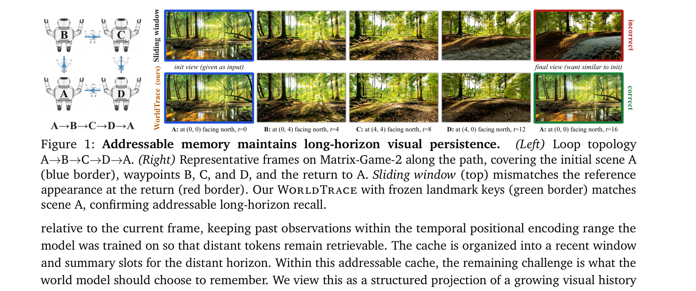
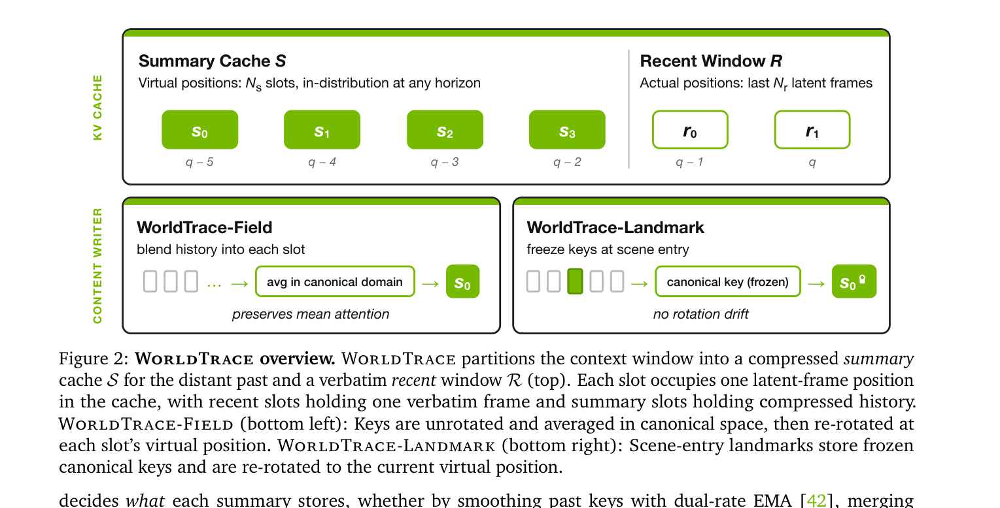
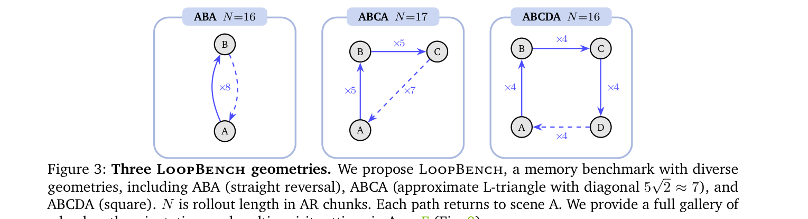
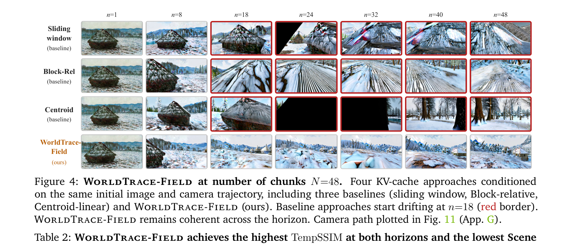

> [paper] https://arxiv.org/abs/2608.07408

# Addressable Memory for Video World Models

## Summary & Outline

본 논문은 대화형 비디오 월드 모델(Interactive Video World Models)의 장기 비주얼 지속성(Visual Persistence) 문제를 해결하기 위해, 파인튜닝 없이(training-free) KV 캐시 메모리의 주소 지정 가능성(Addressability)과 정보 보존성(Informativeness)을 동시에 보장하는 **WorldTrace** 프레임워크를 제안한다.

### Outline
- **Problem & Motivation**: 생성 길이가 길어질 때 위치 인코딩(RoPE) 오프셋이 학습 범위를 벗어나 과거 관측을 읽지 못하는 Addressability 병목과, 키 평균화 시 발생하는 RoPE 위상 상쇄(Phase Cancellation)로 인해 시각적 일관성이 무너지는 문제 분석.
- **Contributions**: Slot Rank 기반의 고정 가상 위치 할당 (Def. 1), 정규 공간(canonical space) 내 키 평균화 기반 **WorldTrace-Field** (Def. 2), 랜드마크 기반 고정 키 추적의 **WorldTrace-Landmark**, 닫힌 루프(closed-loop) 재방문 벤치마크 **LoopBench** 제시.
- **Method**: 메모리를 최근 윈도우($N_r$)와 요약 캐시($N_s$)로 분할하고, 롤아웃 길이에 구속받지 않는 가상 위치 할당과 Canonical Unrotated Keys 매핑 아키텍처.
- **Experiments & Results**: 롤아웃 $N=48$ 환경에서 비주얼 일관성(+15.5%) 및 장시간 탐색 후 출발 장소 재방문 시 에피소드 회상(+19.5%) 대폭 향상.

---

## Background: RoPE(Rotary Position Embedding)와 범위 초과(OOD)란?

### 1. RoPE (회전 위치 인코딩)의 직관적 개념: "시계 바늘 회전"
RoPE는 모델이 토큰(프레임)의 위치를 기억하도록 **벡터를 시계 바늘처럼 특정 각도($\theta \times t$)만큼 회전시키는 기술**이다.

```
 [t = 0 시점 (12시)]     [t = 1 시점 (1시)]     [t = 2 시점 (2시)]     [t = 6 시점 (6시)]
       12시                     1시                    2시                    6시
        │                      ↗                      ➔                      │
        │ 0°                   │ 30°                  │ 60°                  ▼ 180°
```

- **상대 위치(Relative Position) 계산**: 
  - 쿼리(현재 질문 시점 $q$)와 과거 키(답변 시점 $t$) 간의 Attention(주의집중) 점수를 계산할 때, 모델은 절대 시간 $t$가 아니라 두 시각 바늘의 **'각도 차이(상대 거리 $\delta = q - t$)'**를 보고 정보를 읽어온다.

---

### 2. "RoPE 범위를 초과했다 (Out-of-Distribution, OOD)"는 무슨 의미인가?

```
==================================================================================================
훈련 시점 (Training Window) : 최대 거리 18 까지만 학습 (각도 차이 0° ~ 180° 범위)
==================================================================================================
 [Query q=18] ── (각도 차이 δ = 18 - 0 = 18, 180°) ──► [Memory t=0] ──>  정상 작동! (훈련에서 본 각도)

==================================================================================================
생성 시점 (Long Horizon)   : 생성이 길어져 q=100 도달 (각도 차이 δ = 100 - 0 = 100, 수 바퀴 회전)
==================================================================================================
 [Query q=100] ── (각도 차이 δ = 100 - 0 = 100) ────────► [Memory t=0] ──> ❌ 무시됨! (OOD 범위 초과!)
                                                                      (메모리가 캐시에 있어도 
                                                                       Attention 점수가 0에 가까워짐)
```

- **문제 발생 원인**:
  - 모델을 훈련시킬 때 비디오 길이는 최대 6개 청크(약 18 프레임) 수준이었으므로, 모델은 상대 오프셋 $\delta \le 18$ 범위 내의 각도 차이만 보고 과거를 읽도록 학습됨.
  - 하지만 실시간 생성 길이가 길어져 $q = 100$ 시점에 도달하면, $t=0$ 시점의 과거 메모리를 읽으려 할 때 오프셋이 $\delta = 100$으로 커짐.
  - **시계 바늘이 수없이 뱅글뱅글 돌아서 훈련할 때 한 번도 본 적 없는 낯선 각도 오프셋(OOD)**이 발생함.
  - 결과적으로 과거 메모리가 KV 캐시에 물리적으로 저장되어 있더라도, Attention 메커니즘이 이 메모리를 찾지 못해 **'메모리가 없는 것처럼 무시'**하게 됨 (Addressability Failure).

---

## Problem & Motivation (풀고자 하는 문제)

### 시각적 예시: "탐색 후 출발 지점으로 복귀할 때의 비주얼 지속성 (Visual Persistence)"



> **그림 1 분석 (논문 Figure 1 원본)**: 
> - **경로**: 출발지 A(초록 숲/도로, $t=0$) ──> B ($t=4$) ──> C ($t=8$) ──> D ($t=12$) ──> 다시 **출발지 A 복귀** ($t=16$).
> - **Sliding Window (기존)**: 과거 A의 메모리를 잊어버리거나 위치 오프셋 이탈로 인출하지 못해, 출발지로 돌아왔을 때 원래 모습이 아닌 **완전히 무너진 가짜 도로/건물(빨간색 테두리)**을 생성함.
> - **WorldTrace (Ours)**: 랜드마크 정규 키 메모리를 유지하여, 긴 탐색 복귀 후에도 최초 A 시점의 시각적 모습과 **구조적으로 정확히 일치하는 오리지널 씬(초록색 테두리)**을 복원함.

---

### 무엇이 문제인가? (2가지 핵심 병목)

1. **Addressability Failure (위치 주소 지정 실패)**:
   - 비디오 월드 모델은 temporal RoPE를 통해 과거 프레임과의 상대 거리 $\delta = q - t$를 계산함.
   - 탐색 시간이 길어져 오프셋 $\delta$가 학습 윈도우 $\Delta t_{\text{train}}$를 넘어서면, KV 캐시에 과거 Point A가 저장되어 있더라도 주의집중(Attention) 메커니즘이 이 메모리를 찾지 못함 (Addressation 불가).
2. **Phase Cancellation (위상 상쇄)**:
   - 메모리 용량을 줄이기 위해 서로 다른 시점의 프레임 Key들을 단순 평균하면, RoPE로 회전된 각도가 서로 반대 방향을 가리켜 벡터가 상쇄됨 (신호 파괴).

---

## Method (어떻게 해결했는가?)



> **그림 2 분석 (논문 Figure 2 원본)**: 
> - **전체 구조**: 전체 주의집중 윈도우 $L_{\text{attn}}$를 최근 윈도우 $\mathcal{R}$ ($N_r$ 슬롯)과 먼 과거 요약 캐시 $\mathcal{S}$ ($N_s$ 슬롯)로 분할.
> - **WorldTrace-Field (좌측 하단)**: 과거 프레임들의 RoPE 회전을 역으로 풀어서 정규 공간(Canonical Domain)에서 평균화한 뒤, 각 슬롯의 Virtual Position $t^v_s$로 재회전하여 시각적 일관성 유지.
> - **WorldTrace-Landmark (우측 하단)**: 씬 전환 시점의 정규 키(Canonical Key)를 Frozen 상태로 보관하고 쿼리 시점에 $t^v_s$로 동적 회전하여 재방문 회상 달성.

---

### 1. 가상 위치 할당 (Virtual Position Assignment)

- **아이디어**: 과거 메모리 슬롯을 절대 시간 $t$ 대신, 항상 모델이 학습했던 안전한 상대 거리 범위 내의 **슬롯 순위(Slot Rank)** 위치 $t^v_s$에 배치한다.
- **수식**: $t^v_s = q - (L_{\text{attn}} - 1 - s)$
- **효과**: 롤아웃이 1000 프레임 이상으로 길어져도, 모델은 항상 훈련 받은 인-디스트리뷰션(In-Distribution) 오프셋 범위 내에서 과거 요약 슬롯을 안전하게 주소 지정(Address)할 수 있음.

---

### 2. 해결 방식 A: WorldTrace-Field (연속적 시각 일관성)

```
[Source Frames Keys] ───► 1) RoPE 회전 제거: R(-θ_m) * K_m ───► Canonical Space (정규 공간)
                                                                       │
                                                               2) 위상 상쇄 없는 평균 계산
                                                                       │
[Compressed Key] ◄─── 3) Target 가상 위치로 재인코딩: R(θ t^v_s) ◄───┘
```

- **Canonical Key Averaging (Def. 2)**:
  $$K^{\text{field}}_f(t^v) = R(\theta_f t^v) \cdot \frac{1}{M} \sum_{m=1}^{M} R(-\theta_f t_m) K^f_{t_m}$$
- **Mean Attention Preservation (Prop. 2)**: 위상 상쇄 없는 정규 공간 평균화는 소프트맥스 주의집중 이전의 평균 점수(Mean Attention Score)를 이론적으로 완벽히 보존함.

---

### 3. 해결 방식 B: WorldTrace-Landmark (재방문 에피소드 회상)

- **Scene-Entry Detection**: 연속 프레임 간 정규 키 코사인 거리 $\text{dist}(t) = 1 - \cos(K_{\text{can}}(t), K_{\text{can}}(t-1))$가 역치 $\tau$를 넘을 때 해당 프레임을 Landmark로 선정.
- **Frozen Canonical Key**: 랜드마크 프레임의 정규 키를 고정 보존하다가, 쿼리가 발생할 때 가상 위치 $t^v_s$로 동적 회전하여 완벽한 시각적 모습을 복원함.

상세 발췌 → [excerpt](../source/paper/Addressable_Memory_for_Video_World_Models_2026_NVIDIA.md)

---

## Experiments & Results (검증 결과 및 시각적 비교)

### 1. LoopBench 벤치마크 궤적



> **그림 3 분석 (논문 Figure 3 원본)**: 
> LoopBench는 복귀 시점의 비주얼 지속성을 평가하기 위해 3가지 기하학적 궤적(**ABA** 180도 반전, **ABCA** 삼각형, **ABCDA** 사각형 궤적)을 제공함.

---

### 2. 장기 롤아웃 시 시각적 프레임 비교 (N=48 AR Chunks)



> **그림 4 분석 (논문 Figure 4 원본)**: 
> - 동일한 입력 이미지 및 카메라 궤적으로 $N=48$ 청크(장시간) 생성 시 비교.
> - **기존 방식들 (Sliding Window, Block-Relative, Centroid)**: 청크 $n=18$ 시점부터 시각적 왜곡 및 드래프트(빨간 테두리)가 심각하게 발생함.
> - **WorldTrace-Field (Ours)**: 롤아웃 끝($n=48$)까지 도로와 건물의 구조가 일관되게 유지됨.

---

### 3. 정량적 성과 표

| 구분 | TempSSIM ($\uparrow$, 일관성) | Local Scene Drift ($\downarrow$, 붕괴율) | LoopBench Revisit PAC ($\uparrow$, 회상률) |
| :--- | :---: | :---: | :---: |
| **Sliding Window (기존)** | 0.472 | 0.0305 | 0.638 |
| **Block-Relative (기존)** | 0.530 | 0.0339 | - |
| **WorldTrace-Field (Ours)** | **0.545** (+15.5%) | **0.0295** | - |
| **WorldTrace-Landmark (Ours)** | - | - | **0.833** (+19.5%) |

---

## Analysis (종합 평가)

### 장점 & 의의
1. **Zero-Retraining (Training-Free)**: 기존 훈련된 비디오 월드 모델의 가중치를 고정한 채, 추론 시점의 KV 캐시 포지셔닝과 정규화 변환만으로 장기 메모리 구축.
2. **시각 자료 입증**: Figure 1, 4의 결과처럼 롤아웃 장기화 및 씬 재방문 시 프레임 붕괴를 완벽히 차단함.

---

## References

- **Paper URL**: [https://arxiv.org/abs/2608.07408](https://arxiv.org/abs/2608.07408)
- **Project Webpage**: [https://research.nvidia.com/labs/sil/projects/WorldTrace/](https://research.nvidia.com/labs/sil/projects/WorldTrace/)
- **Excerpt File**: [Addressable_Memory_for_Video_World_Models_2026_NVIDIA.md](../source/paper/Addressable_Memory_for_Video_World_Models_2026_NVIDIA.md)
