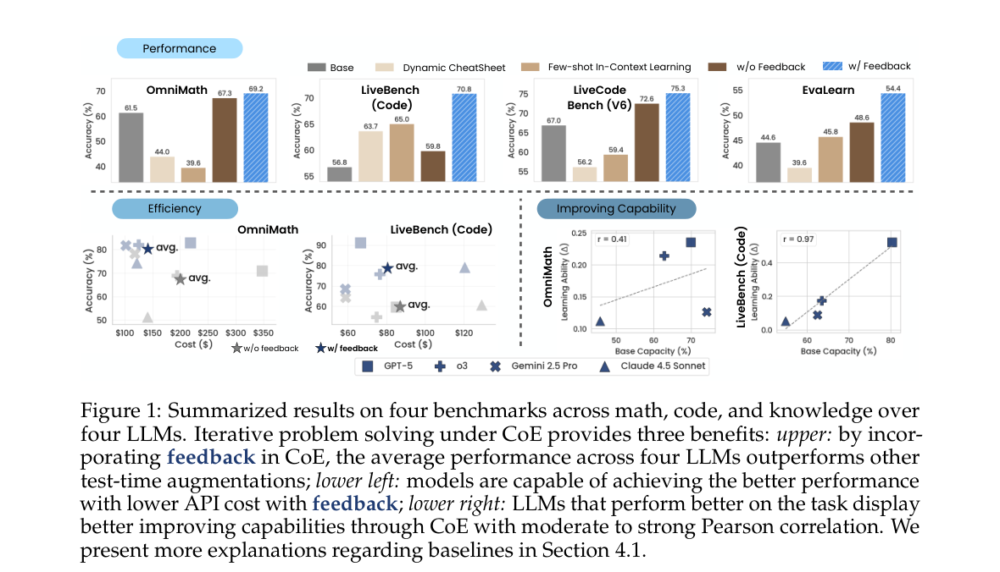
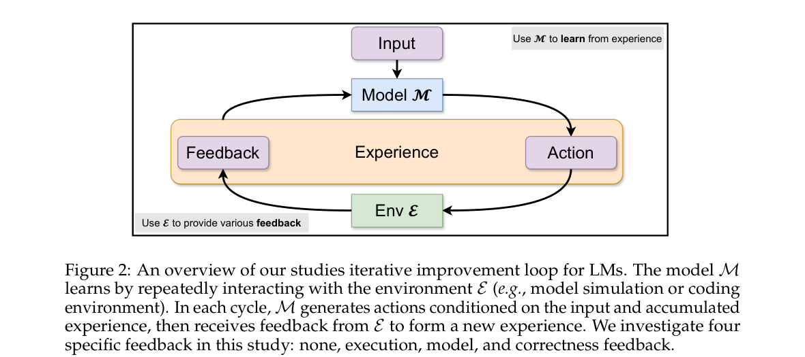
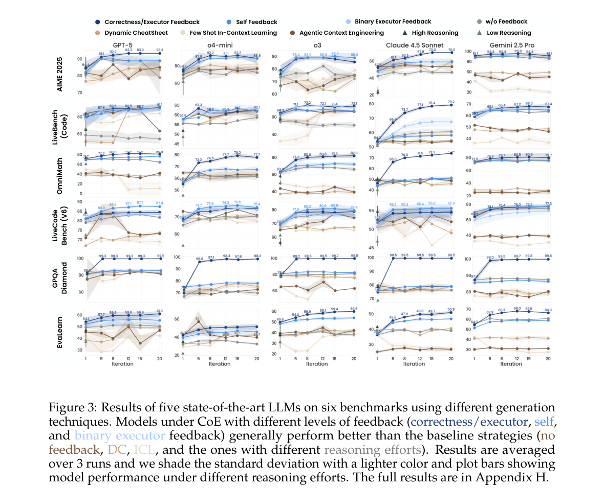
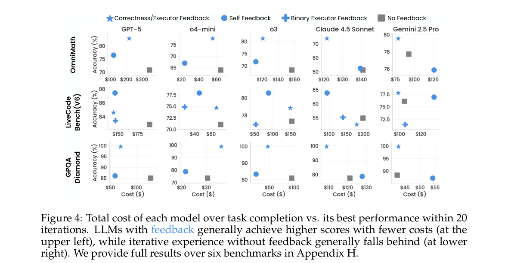
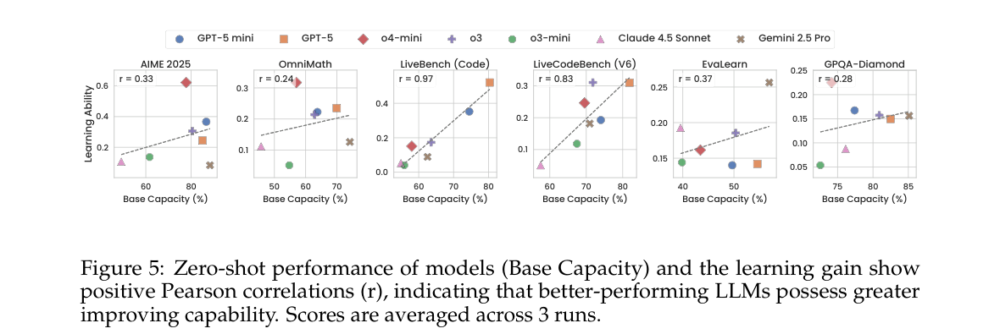
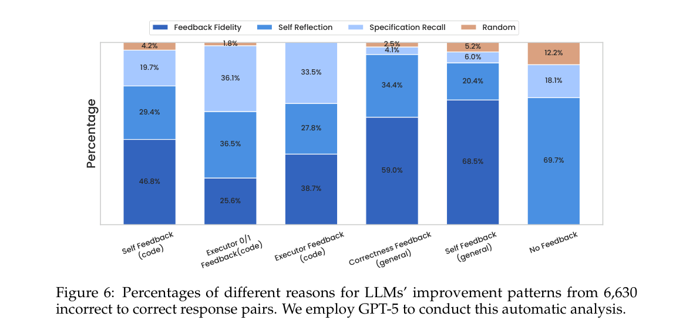
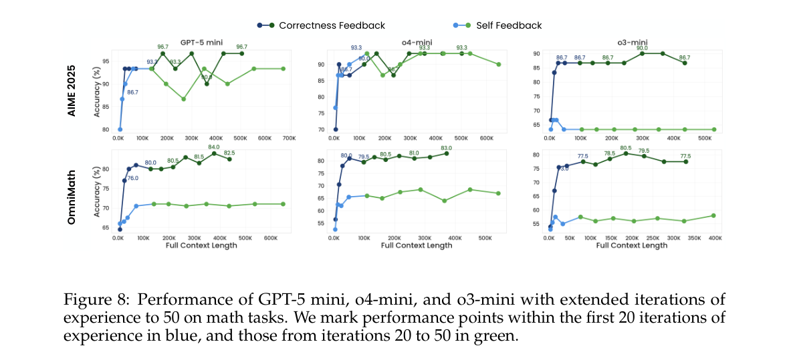

> [paper] https://arxiv.org/abs/2608.18027

# Chain-of-Experience for Continual LLM Improvement

## Summary & Outline

본 논문은 대규모 언어 모델(LLM)이 사전 훈련된 정적 가중치에만 의존하여 각 질의를 독립 사건으로 처리하는 기존 단일 턴(Zero-shot) 추론의 한계를 극복하고, 테스트 시점(**Test-time**)에서 자기 자신 또는 환경과의 상호작용 피드백을 축적하여 지속적으로 개선되는 **Chain-of-Experience (CoE)** 프레임워크를 제안한다. 연구진은 피드백 신호의 풍부도 스펙트럼(No Feedback, Execution, Model Critique, Correctness Oracle)에 따라 CoE를 체계화하고, 8개 최신 LLM(GPT-5, o3, Gemini-2.5 Pro, Claude-4.5 Sonnet 등)을 대상으로 수학·코딩·지식 6개 벤치마크에서 광범위한 실증 분석을 수행하였다.

실험 결과, Self-Feedback 기반 CoE만으로도 기존 테스트 시점 확장 기법(Dynamic CheatSheet, ACE, ICL) 대비 평균 7~9%p 앞서며, 전체 모델 평균 5.6% 성능 향상과 19%의 API 호출 비용 절감을 동시에 달성하였다. 또한 기본 추론 역량($S_{		ext{base}}$)과 테스트 시점 개선 잠재력($\Delta_M$) 간의 강한 양의 상관관계($r=+0.50$, 코딩 $r=0.97$), 스푸리어스(위조) 피드백에 대한 강건성, 모델 개선 요인 분석(Feedback Fidelity 47.7%, Specification Recall 30.0%) 등 추론 시점 지속 학습의 핵심적 동역학을 규명하였다.



### Paper Outline
- **Section 1: Introduction** — 정적 파라미터 추론 패러다임의 한계 및 경험 축적 기반 지속 개선(CoE)의 필요성 제기.
- **Section 2: Related Work** — Training-free 테스트 시점 기법(CoT, Search/Verifier) 및 태스크 내/태스크 간 경험 학습(Reflexion, Dynamic CheatSheet, ACE)과의 차별점 정립.
- **Section 3: Model Improvement via CoE** — 환경 피드백 $F$를 수용한 순차적 의사결정 수식화 및 4단계 피드백 스펙트럼 정의.
- **Section 4: Experiments** — 8개 SOTA LLM 및 6개 도메인 벤치마크 상의 성능(Finding 1), 비용 효율성(Finding 2), 개선 역량 상관성(Finding 3) 검증.
- **Section 5: Further Discussion & Conclusion** — 위조 피드백(Spurious feedback) 복원력, 6,630개 궤적 기반 개선 원인 분해, 이중 피드백(Dual Feedback) 시너지, 메모리 압축(DC, SimpleMem) 대비 전체 궤적 보존의 우위성 분석.

---

## Problem & Motivation

- **연구 배경**: 인간의 문제 해결은 시행착오와 피드백을 통해 이해도를 점진적으로 갱신하는 연속적 학습 과정이다. 반면 현대 LLM은 배포 후 고정된 상태($P(A|Q)$)로 동작하며, 문제 해결 도중 발생하는 풍부한 환경 상호작용 피드백을 단발성으로 소비한 뒤 폐기하는 구조적 한계를 지닌다.
- **풀고자 하는 문제 (Task)**: **Test-Time Continual LLM Improvement via Iterative Experience Accumulation** — 모델 파라미터를 역전파로 수정하지 않고, 인퍼런스 컨텍스트 내에서 이전 시도($a_i$)와 피드백($f_i$)의 상호작용 궤적을 순차적으로 축적하여 최적 해법으로 수렴시키는 메커니즘을 정립하고 평가하는 문제.
- **기존 접근의 한계**:
  1. **Parallel Sampling & Verifier (Best-of-N, Majority Voting)**: 독립적으로 생성된 후보군 중 최적 답안을 사후 선별하지만, 생성 과정에서 얻은 오류 신호가 다음 생성으로 전파되지 않고 버려진다.
  2. **Cross-Task Memory Baselines (Dynamic CheatSheet, ACE)**: 이전 문제들로부터 요약된 휴리스틱/플레이북을 검색하여 컨텍스트에 주입하지만, 현재 당면한 복합 문제에 대한 미세한 단위 테스트 실패나 실행 흔적 같은 즉각적 피드백을 흡수하지 못해 최신 추론 모델 환경에서 성능 저하를 초래한다.
  3. **Aggressive Context Compression**: 중간 추론 단계를 과도하게 요약·압축할 경우, 오류 수정에 결정적인 중간 불변식(invariant)이나 문맥적 제약 조건이 유실된다.

---

## Contributions

- **Chain-of-Experience (CoE) 정식화**: 단일 턴 QA를 순차적 의사결정 프로세스로 확장하고, 피드백의 질과 유무에 따른 4단계 스펙트럼(No Feedback, Execution, Model Critique, Correctness Oracle)을 엄밀하게 정의.
- **광범위하고 체계적인 다중 도메인 벤치마킹**: 수학(AIME 2025, OmniMath), 코딩(LiveCodeBench V6, LiveBench Code), 지식 추론(EvaLearn, GPQA Diamond)에 걸쳐 8개 최신 LLM(GPT-5, o3, Gemini-2.5 Pro, Claude-4.5 Sonnet 등)을 3회 반복 검증하여 신뢰성 있는 통계 확립.
- **성능-비용 파레토 최적성 입증**: CoE with Self-Feedback이 단순 재시도(No Feedback) 대비 정확도를 5.6% 높이는 동시에, 불필요한 장문 생성을 억제하여 API 토큰 비용을 19% 절감함을 규명.
- **개선 잠재력과 Base 역량의 양의 상관관계 발견**: 기본 모델의 추론 능력이 뛰어날수록 피드백을 소화하여 성능을 반등시키는 능력($\Delta_M$)이 유의미하게 증가함을 정량화(평균 $r=+0.50$, 코딩 $r=0.97$).
- **개선 동역학의 다각도 심층 분석**:
  - GPT-5 판정기($\kappa=0.768$)를 통해 6,630개 정답 전환 케이스의 원인(피드백 충실도 47.7%, 명세 재인식 30.0% 등)을 규명.
  - 100% 오답 피드백 환경에서도 선택적 다수결(SelMV)을 통해 오히려 비판적 재검토를 유도하여 성능을 방어하는 강건성 확인.
  - 단일 태스크 내 메모리 압축(DC, SimpleMem)보다 전체 궤적 보존이 우수함을 입증.

---

## Method

상세 발췌 → [excerpt](../source/paper/Chain-of-Experience_for_Continual_LLM_Improvement_2026_Bytedance_Seed.md)



### 1. CoE Sequential Decision Process Formulation
기존 QA 시스템이 $a \sim P(A \mid Q)$의 조건부 확률 분포에서 단일 샘플링을 수행하는 것과 달리, CoE는 환경 피드백 변수 $F$를 도입한다. 환경 $\mathcal{E}$로부터 샘플링된 피드백 $f \sim P'(F \mid Q, a)$를 바탕으로 $t$번째 시점의 응답 $a_t$는 이전의 모든 시도 및 피드백 튜플 $e_i = (a_i, f_i)$의 이력을 조건부로 하여 생성된다:

$$a_t \sim P(a_t \mid Q, e_0, e_1, \dots, e_{t-1}) = P(a_t \mid Q, (a_0, f_0), (a_1, f_1), \dots, (a_{t-1}, f_{t-1}))$$

```
+-------------------------------------------------------------------------+
|                    Chain-of-Experience (CoE) Iteration Loop             |
|                                                                         |
|  [ User Question Q ]                                                    |
|          |                                                              |
|          v                                                              |
|   +--------------+      Action a_t       +--------------------------+   |
|   |  LLM (M)     | --------------------> | Environment (E)          |   |
|   |  Policy      |                       | - Code Interpreter       |   |
|   |              | <-------------------- | - Model Judge (M_fb)     |   |
|   +--------------+      Feedback f_t     | - Verifier / Oracle      |   |
|          ^                               +--------------------------+   |
|          |                                            |                 |
|          +=========== Accumulate Experience ==========+                 |
|                       e_t = (a_t, f_t)                                  |
+-------------------------------------------------------------------------+
```

### 2. Feedback Spectrum (4단계 분류)

| 피드백 유형 | 수식 정의 | 신호의 특성 및 동작 방식 | 적용 도메인 |
|---|---|---|---|
| **No Feedback** | $f_i = \emptyset$ | 외부 평가 없이 이전 시도 목록($a_0, \dots, a_{t-1}$)만을 컨텍스트에 축적. 모델 내적 반성에만 의존 | 전 도메인 Baseline |
| **Execution Feedback** | $f_i = \mathcal{E}(Q, a_i)$ | 코드 실행기에서 반환되는 stdout, stderr, 런타임 예외 트레이스, 공개 단위 테스트 통과율 | LiveCodeBench, LiveBench |
| **Model Feedback** | $f_i = \mathcal{M}_{fb}(Q, a_i)$ | 보조 LLM 또는 Self-Critic이 생성하는 자연어 비평, 논리적 모순 지적, 점수화 | 전 도메인 (자연어 피드백) |
| **Correctness Feedback** | $f_i = \mathbf{1}\{a_i 	ext{ is correct}\}$ | 오라클 정답 비교기를 통한 이진 판정($\{0, 1\}$). 이론적 상한선(Upper-bound) 제공 | AIME, GPQA, OmniMath |

### 3. Dual Feedback & Selective Majority Voting (SelMV)

- **Dual Feedback Synergy**:
  언어적 비평을 제공하는 **Model Feedback**과 하드웨어/오라클 검증 신호인 **Execution/Correctness Feedback**을 동시에 결합($f_i = (f_i^{	ext{model}}, f_i^{	ext{exec}})$). 언어 모델이 '어디가 틀렸는지(Why)'에 대한 맥락과 '실제 통과 여부(Binary Status)'를 상호 보완적으로 학습하도록 유도한다.
- **Selective Majority Voting (SelMV-$n$)**:
  피드백이 노이즈를 포함하거나 적대적인 위조 피드백(항상 오답이라고 알림) 환경에서, 모델의 신뢰성을 보존하기 위해 유효한 최초 $n$회 시도 중에서 다수결 투표로 최종 답안을 결정하는 앙상블 안전장치.

---

## Experiments & Results

### Benchmark Datasets
- **수학 (Math)**:
  - **AIME 2025**: 2025년 미국 수학초청시험(AIME) 30문항 (정수 단답형 Exact Match).
  - **OmniMath**: 올림피아드 수준 고난도 수학 4,428문항 중 난이도별 균등 샘플링 200문항 (LLM-as-a-Judge 평가).
- **코딩 (Code)**:
  - **LiveCodeBench (V6)**: 오염 없는 실시간 코딩 벤치마크 최신 V6 버전 175문항 (Python 인터프리터 비공개 테스트 통과율).
  - **LiveBench (Code)**: 다방면 평가 벤치마크 중 코딩 서브셋 128문항.
- **지식 및 경험 학습 (Knowledge & Continual Learning)**:
  - **EvaLearn**: LLM의 순차적 경험 학습 능력을 측정하기 위해 설계된 648문항 전용 벤치마크.
  - **GPQA Diamond**: 생물·화학·물리학 PhD 수준 전문가 작성 4지선다형 198문항.
- **추가 평가**:
  - **BrowseComp-Plus**: 심층 리서치 및 외부 웹 검색 의존형 200문항 (OOD 지식 한계 검증용).

### Setup
- **대상 모델 (8개 LLM)**: OpenAI GPT-5, GPT-5 mini, o3, o3-mini, o4-mini, Google Gemini-2.5 Pro, Anthropic Claude-4.5 Sonnet.
- **디코딩 파라미터**: OpenAI 모델 Temperature 1.0, Gemini/Claude 모델 Temperature 0.2. 3회 반복 측정 후 평균 및 표준편차 보고.
- **최대 반복 수**: 20 Iterations (확장 실험 시 50 Iterations).

### Results



#### 1. 종합 벤치마크 성능 비교 (Table 3 요약)

| 방법론 (Method) | AIME 2025 | LCB V6 | LiveBench | OmniMath | GPQA Diamond | EvaLearn | 평균 (Avg) |
|---|---|---|---|---|---|---|---|
| **ICL ($k \le 20$)** | 71.83% | 62.50% | 65.46% | 53.12% | 78.45% | 40.99% | 62.06% |
| **ACE (Agentic Playbook)** | 71.98% | 66.94% | 69.38% | 50.33% | 76.58% | 42.54% | 62.96% |
| **Dynamic CheatSheet (DC)** | 73.33% | 63.59% | 68.58% | 48.64% | 79.56% | 42.68% | 62.73% |
| **w/o Feedback (NF CoE)** | 77.78% | 72.57% | 60.16% | 65.17% | 80.02% | 44.91% | 66.77% |
| **Reasoning-High** | 69.05% | 70.63% | 55.46% | 61.81% | 76.21% | 39.58% | 62.12% |
| **CoE Self Feedback (SF)** | **82.22%** | **75.69%** | **69.94%** | **67.52%** | **81.03%** | **51.73%** | **71.36%** |
| **CoE Correctness/Exec (CEF)** | **89.05%** | **74.50%** | **75.78%** | **79.61%** | **99.52%** | **57.05%** | **79.25%** |

#### 2. 토큰 및 API 비용 효율성 (Table 5 & Figure 4)



- **비용 절감과 성능 향상의 동시 달성**: 피드백이 주어질 때 모델은 방황하지 않고 오류 지점에 집중하므로 전체 반복 수가 줄어들어 AIME 2025 기준 API 비용이 $8.8에서 $4.6으로 47.3% 감소하면서도 정확도는 4.4% 상승하였다.
- **토큰당 효용(Accuracy per Token)**: AIME 2025에서 CoE CEF(108K 토큰, 84.6%)는 동일 수준의 토큰을 소비한 No-Feedback(106K 토큰, 74.1%) 대비 월등히 높은 정확도를 기록하였으며, DC(11K 토큰, 74.7%) 대비 압도적인 추론 성과를 냈다.

#### 3. Base Capacity와 개선 역량 간의 양의 상관관계 (Figure 5)



개선 능력 지표 $\Delta_M = rac{S_{\max} - S_{		ext{base}}}{1 - S_{		ext{base}}}$ 분석 결과:
- LiveBench Code: **$r = 0.97$**, LiveCodeBench V6: **$r = 0.83$**의 극도로 강한 상관관계 확인.
- 수학 및 지식 도메인을 포함한 전체 평균 **$r = +0.50$** 달성. 즉, 기본 추론 역량이 높은 최상위 모델일수록 피드백을 소화하여 정답으로 전환시키는 메타인지 능력이 뛰어남을 입증.

### Findings & Implications

#### 1. 개선 원인 심층 분해 (Attribution Analysis, Figure 6)
GPT-5 기반 자동 평가(인간 평가자 100개 샘플 검증 시 $\kappa = 0.768$ 달성)로 오답에서 정답으로 전환된 6,630개 케이스를 분해:



- **Feedback Fidelity (47.7%)**: 전체 개선의 절반 가까이가 피드백에서 지적한 오류를 충실히 반영하여 달성됨.
- **Specification Recall (30.0% in Coding)**: 코딩 과제에서는 알고리즘 오류보다 문제 지문의 입출력 제약, 엣지 케이스 처리, wrapper 포맷 준수 등 명세를 다시 상기하는 과정에서 대규모 정답 전환이 발생.
- **Self Reflection**: 피드백이 없거나 모호한 경우에도 모델 자체의 내부 계산 검증이 정답 전환을 견인.

#### 2. 위조 피드백(Spurious Feedback)에 대한 회복 탄력성 (Table 2 & Figure 7)
- 항상 "틀렸다"는 부정 피드백을 지속적으로 주입했을 때, 모델은 맹목적으로 무너지지 않고 오히려 자신의 논리를 비판적으로 재검토하여 GPT-5 mini 기준 AIME 2025에서 91.7%의 높은 정확도를 유지.
- 여기에 **SelMV (Selective Majority Voting)**를 결합할 경우 GPQA Diamond에서 82.8%로 Self-Feedback(79.9%)을 역전하는 현상이 관찰됨. 즉, 적절한 노이즈가 모델의 과도한 확신(Overconfidence)을 방지하는 자극제로 작용.

#### 3. Dual Feedback 시너지와 메모리 압축의 한계 (Table 1)
- **Dual Feedback**: Claude 4.5 Sonnet 기준 AIME 2025에서 Model Feedback(60.0%)과 Correctness(70.0%)를 결합한 Dual Feedback이 **76.7%**를 기록하며 명확한 상호보완성을 증명.
- **메모리 압축의 역효과**: 단일 태스크 내에서 Dynamic CheatSheet(50.0%)나 SimpleMem(56.7%)으로 이전 시도를 요약·압축한 방식은 전체 궤적을 보존한 순수 Model Feedback(60.0%)보다 열세. 이는 과도한 압축이 중간 추론 단계의 필수 세부정보를 파괴함을 시사.



- **수렴 속도 (Figure 8)**: 50 라운드 확장 시 대부분의 개선은 **초기 20 라운드 이내에 완료**(AIME 25 기준 1~20 라운드 개선폭 16.7% vs 20~50 라운드 개선폭 2.2%).
- **OOD 지식 한계**: 외부 검색 지식이 필수적인 BrowseComp-Plus에서는 모델 내부 가중치에 지식이 없으므로 Self-Feedback이 오히려 성능을 저하시키는 환각 현상 발생.

---

## Analysis

### Strengths & Significance
1. **패러다임의 명확한 확장**: 정적 LLM 추론을 환경과 상호작용하는 순차적 의사결정 프로세스(Sequential Decision Process)로 체계화하고, 피드백 유형별 영향을 명확히 규명.
2. **실용적인 비용-성능 파레토 개선**: 피드백 주입이 토큰 낭비를 유발할 것이라는 통념과 달리, 목적 지향적 추론을 유도하여 19%의 API 비용 절감과 5.6% 성능 향상을 동시에 입증.
3. **엄밀한 인과 분석**: 6,630개 궤적에 대한 2축(WHY / WHAT) 원인 규명과 통계적 상관관계($r=+0.50$), Spurious 피드백 실험을 통해 단순 벤치마크 점수 나열을 넘어선 학술적 통찰 제공.

### Limitations
1. **파라미터 비갱신(No Weight Update)**: 테스트 시점 컨텍스트 내에서의 지속 개선에 집중하였으므로, 세션이 종료되면 축적된 경험이 소멸됨 (진정한 지속 학습을 위한 파라미터 내재화 부재).
2. **OOD 지식 검색 한계**: BrowseComp-Plus 실험에서 드러났듯, 모델 내부 지식 영역을 벗어난 사실적 정보 검색 과제에서는 Self-Feedback 기반 CoE가 환각을 증폭시킬 위험 존재.
3. **오라클 피드백 의존성**: 완벽한 Correctness 피드백은 실제 배포 환경에서 획득하기 어려우며, Model-as-Judge의 경우 판정 모델의 역량이 피험 모델보다 우수해야 한다는 제약이 따름.

### Future Work / Improvements
1. **Test-time Experience의 파라미터 증류 (Post-Training Integration)**: CoE를 통해 축적된 성공/실패 궤적을 DPO/RL 또는 온라인 가중치 미세조정으로 전이하여 영구 지식화하는 연구.
2. **에이전트 외부 도구 및 웹 검색 융합**: BrowseComp-Plus와 같은 지식 집약적 과제 해결을 위해 RAG 및 Web Search Tool을 피드백 루프의 환경($\mathcal{E}$)으로 능동 편입.
3. **장기 호라이즌(Long-Horizon) 소프트웨어 엔지니어링 확장**: SWE-bench, OSWorld 등 수십 단계의 액션이 요구되는 복합 에이전트 환경으로 CoE 확장 적용.

---

## References
- Suzgun et al., "Dynamic CheatSheet: Test-Time Learning with Adaptive Memory", arXiv 2025.
- Zhang et al., "Agentic Context Engineering: Evolving Contexts for Self-Improving Language Models", arXiv 2025.
- Shinn et al., "Reflexion: Language Agents with Verbal Reinforcement Learning", NeurIPS 2023.
- Dou et al., "EvaLearn: Quantifying the Learning Capability and Efficiency of LLMs via Sequential Problem Solving", arXiv 2025.
- Liu et al., "SimpleMem: Efficient Lifelong Memory for LLM Agents", arXiv 2026.
