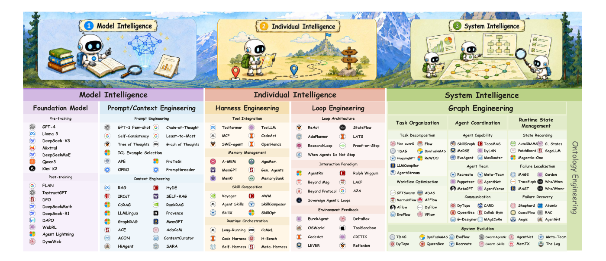
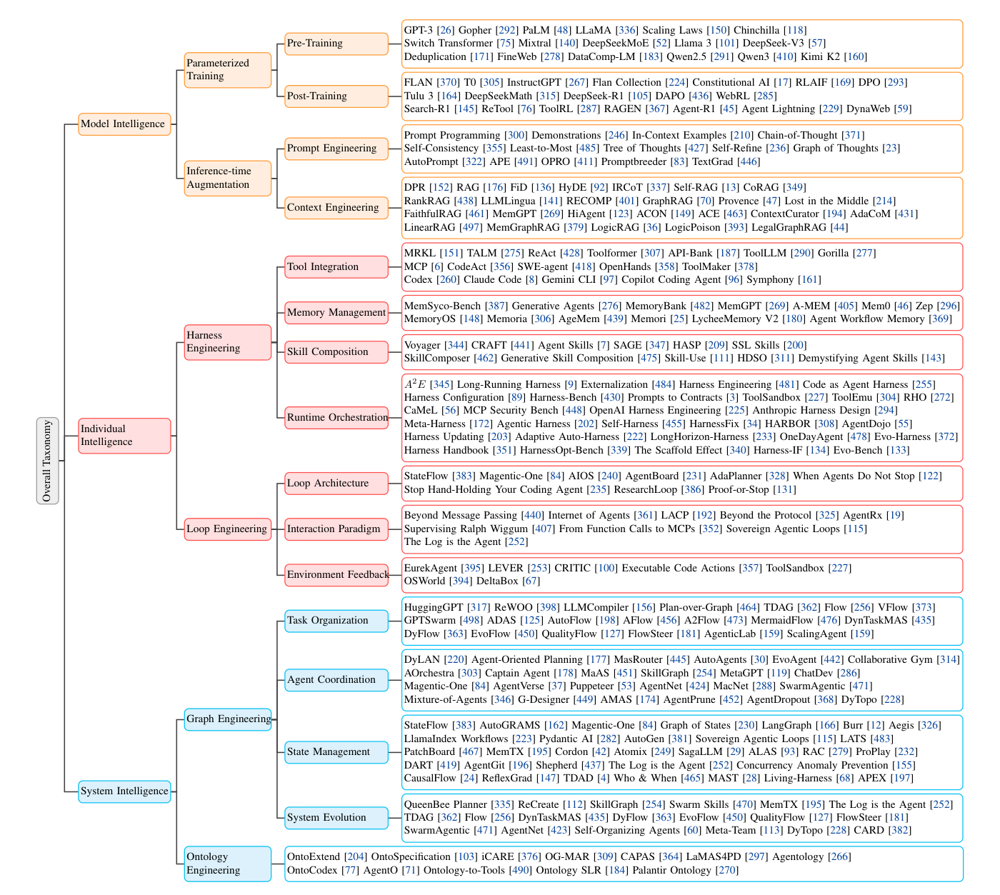
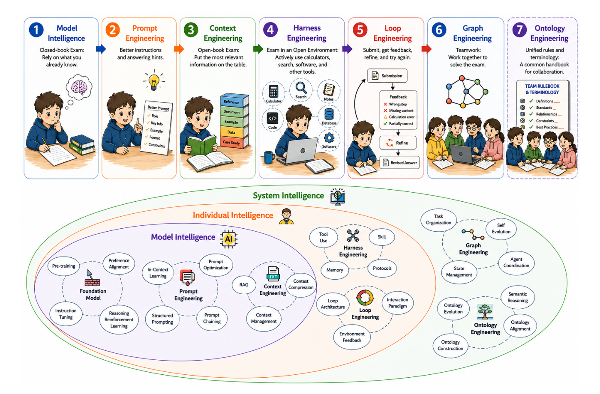
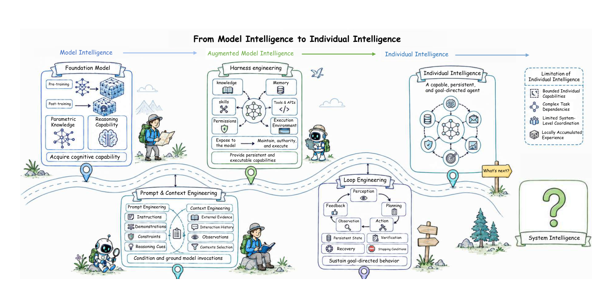
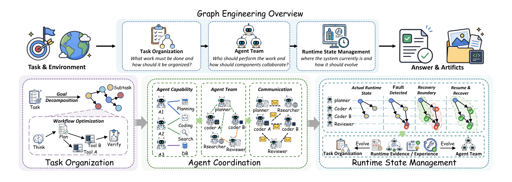
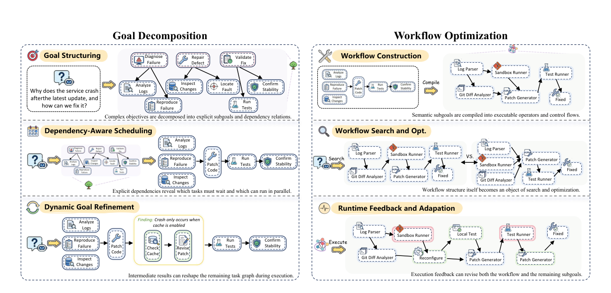
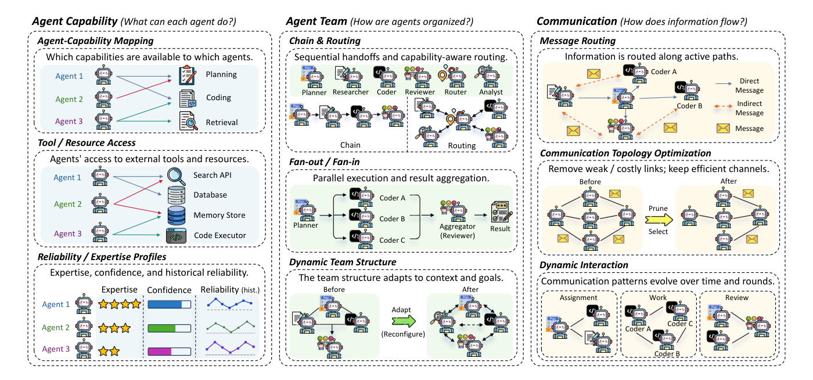
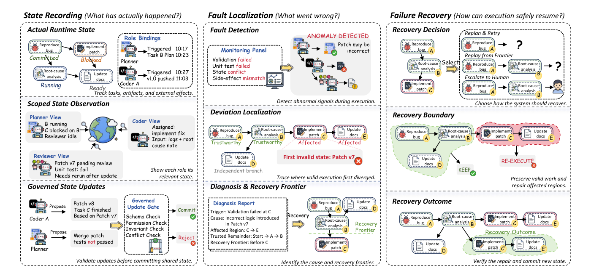

> [paper] https://arxiv.org/abs/2608.21156

# Graph Engineering in the Era of LLM Agents: From Individual Intelligence to System Intelligence

## Summary & Outline

본 논문은 대규모 언어 모델(LLM) 기반 자율 에이전트 연구가 단일 에이전트의 능력 증강(Individual Intelligence)에서 다중 에이전트 협업 및 시스템 차원의 구조화(System Intelligence)로 진화하는 패러다임 전환을 선언하고, 이를 실현하기 위한 핵심 방법론으로 **그래프 엔지니어링(Graph Engineering)**을 체계화한 63페이지 분량의 종합 서베이 논문이다. 

기존의 프롬프트 엔지니어링(Prompt Engineering), 컨텍스트 엔지니어링(Context Engineering), 하네스 엔지니어링(Harness Engineering), 루프 엔지니어링(Loop Engineering)은 단일 에이전트의 국소적 추론과 실행 역량을 극대화하는 데 기여했으나, 장기 실행(Long-Horizon), 이종 전문성(Heterogeneous Expertise), 병렬 의존성(Interdependent Workflows), 독립적 검증(Independent Verification), 지속적 상태 보존(Persistent State)이 요구되는 복잡한 실세계 과제에서는 본질적인 '개별 지능의 한계'에 직면한다. 논문은 이러한 한계를 극복하기 위해 과제(Task), 행위자(Agent), 런타임 상태(Runtime State) 간의 상호관계를 명시적 그래프 구조로 외재화(Externalize)하고 제어·최적화하는 **그래프 엔지니어링 3대 핵심 축(Task Organization, Agent Coordination, Runtime State Management)**과 **시스템 진화(System Evolution)** 메커니즘을 정식화한다. 나아가 구조적 연결성을 넘어 공유 의미론과 가치 정렬을 제공하는 차세대 패러다임으로 **온톨로지 엔지니어링(Ontology Engineering)**을 제시한다.

```
                    ┌────────────────────────────────────────────────────────┐
                    │                   SYSTEM INTELLIGENCE                  │
                    └───────────────────────────┬────────────────────────────┘
                                                │
                 ┌──────────────────────────────┴──────────────────────────────┐
                 ▼                                                             ▼
┌───────────────────────────────────┐                        ┌───────────────────────────────────┐
│        GRAPH ENGINEERING          │                        │       ONTOLOGY ENGINEERING        │
│    (Structural Substrate)         │                        │     (Shared Semantics & Logic)    │
├───────────────────────────────────┤                        ├───────────────────────────────────┤
│• Task Organization (G_task)       │ ──(Formal Grounding)──►│• Shared Semantic Classes & Axioms │
│• Agent Coordination (G_cap/team)  │                        │• Goal Formation & Value Alignment │
│• State Management (G_state/exec)  │◄──(Rule Constraints)───│• Cross-Framework Interoperability │
│• System Evolution (Graph Mutation)│                        │• System Intelligence Measurement  │
└───────────────────────────────────┘                        └───────────────────────────────────┘
                 ▲
                 │ (Scaffolding & Structural Scaling)
┌────────────────┴──────────────────┐
│       INDIVIDUAL INTELLIGENCE     │
│   Ai = Loop(Fi, Hi; s_i^t)        │
├───────────────────────────────────┤
│• Harness Engineering (Tools/Mem)  │
│• Loop Engineering (StateFlow/Fdbk)│
└───────────────────────────────────┘
                 ▲
                 │ (Elicitation & Augmentation)
┌────────────────┴──────────────────┐
│         MODEL INTELLIGENCE        │
├───────────────────────────────────┤
│• Foundation Models (Pre/Post-train│
│• Prompt & Context Engineering     │
└───────────────────────────────────┘
```

---

## Problem & Motivation

### 연구 배경
인공지능 연구는 기초 모델(Foundation Model)의 매개변수 지능(Model Intelligence)을 활용하여 도구 사용, 장기 기억, 상태 전이를 수행하는 단일 자율 에이전트(Individual Intelligence)로 빠르게 발전해 왔다. 이를 지탱한 4대 선행 엔지니어링 패러다임은 다음과 같다:
1. **Prompt Engineering**: 모델의 잠재 추론 경로를 유도(CoT, ToT, GoT, APE, TextGrad).
2. **Context Engineering**: 동적 검색과 컨텍스트 압축을 통해 유효 정보를 주입(RAG, GraphRAG, MemGPT, ACE).
3. **Harness Engineering**: 도구 인터페이스, 메모리 뱅크, 스킬 라이브러리, 보안 샌드박스를 결합(MCP, SWE-agent, OpenHands, Mem0).
4. **Loop Engineering**: 행동-관찰-피드백-상태 갱신을 반복하는 제어 루프 구성(StateFlow, Magentic-One, AIOS).

그러나 단일 모델의 컨텍스트 윈도우 확장과 하네스 고도화만으로는 소프트웨어 엔지니어링, 과학적 발견, 복합 디지털 자동화 등 현대 산업 과제가 요구하는 거대한 복잡성을 감당할 수 없다.

### 풀고자 하는 문제 (Target Problem)
본 연구가 집중하는 핵심 과제는 **다중 이종 에이전트 시스템 조율(Multi-Agent System Orchestration)**과 **장기 다단계 과제 실행(Long-Horizon Heterogeneous Execution)**이다. 복잡한 목표를 수행하기 위해서는 다수의 상호의존적인 하위 과제를 분해·스케줄링하고, 서로 다른 전문 지식과 권한을 가진 에이전트 팀을 구성하며, 분산 실행 중 발생하는 부분 오류를 격리·복구하고, 누적된 궤적으로부터 시스템 구조 자체를 지속 개선해야 한다.

### 기존 접근의 한계: 개별 지능의 4대 본질적 병목
단일 에이전트 중심의 아키텍처는 다음과 같은 구조적 불일치(Architectural Mismatch)를 겪는다:

| 병목 요인 | 메커니즘 및 증상 | 시스템에 미치는 영향 |
|---|---|---|
| **1. 용량-워크로드 불일치 (Capacity vs. Workload Mismatch)** | 컨텍스트가 길어질수록 주의력 희석(Attention Dilution)과 'Lost-in-the-Middle' 현상 발생, 연산량 및 지연 시간의 2차 곡선형($O(N^2)$) 증가 | 단일 에이전트에 수십 개의 도구와 수만 줄의 코드베이스, 방대한 실행 로그를 동시 주입 시 추론 정밀도 급락 |
| **2. 컨텍스트 오염 및 오류 연쇄 (Context Pollution & Error Cascading)** | 단일 실행 루프 내에서 발생한 하나의 환각(Hallucination)이나 잘못된 도구 반환값이 컨텍스트 히스토리에 영구 보존 | 후속 추론 단계가 오염된 사전 지식에 조건화되어 복구 불가능한 연쇄 실패(Catastrophic Drift) 초래 |
| **3. 전문화 부족과 인지 과부하 (Specialization vs. Cognitive Overload)** | 범용 프롬프트를 통해 단일 모델이 계획자, 도구 실행자, 도메인 전문가, 비평가(Critic) 역할을 동시 수행 | 역할 간 간섭(Role Interference)으로 인해 전반적 추론 성능 저하 및 얕은 의사결정 고착화 |
| **4. 단일 장애점과 독립 검증 부재 (Single Point of Failure & Lack of Verification)** | 단일 에이전트 루프의 런타임 크래시, 무한 루프, 도구 타임아웃 발생 시 복구 경계 없이 전체 태스크 중단 | 자기 자신의 추론 결함을 스스로 비판하는 데 내재적 한계(Self-Preference Bias) 존재 |

```
[단일 에이전트의 컨텍스트 오염 및 실패 연쇄]
Task Start ──► Step 1 (정상) ──► Step 2 (환각/오작동) ──► Step 3 (오염 상태 조건화) ──► Total Crash
                                           │
                                  [컨텍스트 윈도우 오염]
                                  [독립 검증 부재 / 롤백 불가]

[그래프 엔지니어링의 분산 격리 및 인과적 복구]
Task Start ──► Subtask A (Agent 1) ──► Validation Gate ──(Pass)──► Subtask B (Agent 2) ──► Success
                     ▲                        │
                     │                        ▼ (Fail 검출)
                     └── Causal Rollback ◄────┘
                         & Re-dispatch
```

### 복합 실세계 과제의 5대 본질적 요구조건 (Core Requirements of Complex Real-World Tasks)

단일 에이전트(Individual Intelligence)가 복잡한 실세계 산업 과제를 완수하지 못하는 근본 원인은 다음과 같은 5가지 본질적 시스템 요구조건을 단일 실행 루프로는 수용할 수 없기 때문이다:

| # | 핵심 요구조건 | 개념 정의 및 단일 에이전트의 실패 메커니즘 | 실세계 대표 사례 | 그래프 엔지니어링 대응 기제 |
|---|---|---|---|---|
| 1 | **장기 실행<br>(Long-Horizon Execution)** | 수십~수백 단계에 걸친 다단계 추론과 장시간 연속 실행 능력. 단계가 누적될수록 컨텍스트 길이 초과 및 주의력 희석(Attention Dilution)으로 후반부 의사결정 품질 급락 | 대규모 코드베이스 리팩토링, 전임상 신약 후보물질 탐색 | 상태 체크포인팅 및 서브태스크 분할 스케줄링 |
| 2 | **이종 전문성<br>(Heterogeneous Expertise)** | 서로 다른 전문 지식, 도구(Tools), 시스템 권한(Permissions), 백본 모델을 가진 전문 에이전트 간의 역할 분담. 단일 모델에 전 역할을 프롬프트로 몰아넣을 경우 역할 간섭(Role Interference) 및 인지 과부하 초래 | 기획자, 보안 감사관, 백엔드 엔지니어, QA 테스터 협업 | $G_{\text{cap}}$ (역량 그래프), $G_{\text{team}}$ (팀 토폴로지) |
| 3 | **병렬 의존성<br>(Parallel & Interdependent Dependencies)** | 동시 실행 가능한 독립 작업과 결과 취합이 필수적인 선후행 의존 작업의 복합 구조. 단일 에이전트 루프는 본질적으로 작업을 직렬화(Serialization)하여 전체 지연 시간(Makespan) 극대화 | 로그 분석·재현 환경 구성·코드 감사의 동시 병렬 진행 후 패치 작성으로 취합 | $G_{\text{task}}$ (DAG 과제 분해 및 위상 정렬 스케줄링) |
| 4 | **독립적 검증<br>(Independent Verification)** | 산출물 생성자(Creator)와 검증자(Auditor)의 인지 컨텍스트 및 권한 분리. 단일 에이전트가 생성과 검증을 동시 수행 시 자기 확증 편향(Confirmation Bias) 및 환각 맹점 발생 | Coder의 구현물을 독립된 Reviewer 에이전트와 격리 샌드박스 테스트 러너가 감사 | Review Gates, $E_{\text{verify}}$ (검증 게이트 엣지) |
| 5 | **지속적 상태 보존<br>(Persistent State Management)** | 휘발성 컨텍스트를 넘어 시스템 전반의 이벤트, 산출물 버전, 데이터 계보(Provenance)를 영속 관리. 단일 에이전트 크래시 또는 오염 시 전체 작업을 처음부터 재시작해야 하는 결함 방지 | 수십 개 파일 수정 중 3개 파일 컴파일 실패 시 원인 커밋만 식별하여 직전 유효 상태로 롤백 | $G_{\text{state}}$ (인과 계보 DAG), $B_{\text{rec}}$ (회복 경계 롤백) |

---

## Contributions

1. **지능 진화 4단계 계층화 (Four-Level Intelligence Hierarchy)**:
   - 인공지능 엔지니어링 패러다임을 **Model Intelligence $\rightarrow$ Individual Intelligence $\rightarrow$ System Intelligence $\rightarrow$ Next-Gen Ontology Intelligence**로 명확히 정립하고, 이를 설명하는 직관적 **시험 비유(Exam Analogy)**를 구축.
2. **시스템 지능(System Intelligence) 및 에이전트 시스템의 수학적 형식화**:
   - 개별 에이전트 $A_i = \text{Loop}(F_i, H_i; s_i^t)$와 에이전트 시스템 $S_t = \langle A_t, R_t, E_t, \Pi_t, x_t \rangle$을 정의하여, 개별 구성요소의 단순 합산과 시스템 차원의 구조적 조율 간의 본질적 차이를 이론적으로 규명.
3. **그래프 엔지니어링 3대 핵심 기둥 및 시스템 진화의 수학적 정식화**:
   - **Task Organization** ($G_{\text{task}} = \langle V_{\text{task}}, E_{\text{task}}, \Phi_{\text{task}}, \Sigma_{\text{task}} \rangle$), **Agent Coordination** ($G_{\text{cap}}, G_{\text{team}}, G_{\text{comm}}^t$), **Runtime State Management** ($G_{\text{state}}^t, G_{\text{exec}}^t$, $\Gamma_{\text{gate}}$, $v_{\text{root}}$, $B_{\text{rec}}$) 및 크로스 런 메타 최적화 연산자 $U_{\text{sys}}$를 엄밀한 수식 체계로 정립.
4. **차세대 온톨로지 엔지니어링(Ontology Engineering) 비전 제시**:
   - 그래프 구조의 위상적 연결성을 넘어, 도메인 불변 제약, TBox/ABox 형식 의미론, 가치 정렬 및 범조직적 상호운용성을 제공하는 온톨로지 기반 차세대 시스템 지능 청사진 제시.
5. **20+ 대표 서베이 비교, 50+ 라이브러리 및 6대 산업 응용 분석**:
   - 선행 서베이들과의 차별성을 8대 평가 축으로 명시하고(Table 4), 현대 에이전트 에코시스템(LangGraph, AutoGen, CrewAI, MetaGPT, AIOS 등) 및 소프트웨어 공학, 과학 발견, 헬스케어, 엔터프라이즈 워크플로 응용을 망라.

---

## Method

### 1. 지능 진화의 전개와 시험 비유 (Exam Analogy)





논문은 LLM 기술의 진화를 개별 수험생이 시험을 치르는 과정에 빗대어 설명한다(Figure 4 참조):
- **Model Intelligence (기초 지능)**: 수험생이 머릿속에 암기하고 있는 기본 지식과 지적 잠재력.
- **Prompt & Context Engineering (조건화)**: 시험지 질문을 명확하게 다듬고(Prompt), 오픈북 시험처럼 관련 참고 자료와 요약본(Context/Cheat-sheet)을 책상에 제공하는 과정.
- **Harness Engineering (도구 보강)**: 계산기, 사전, 그래프 용지 등 외부 보조 도구(Tools, Memory, Sandboxes)를 손에 쥐여주는 과정.
- **Loop Engineering (반복 실행)**: 초안을 작성한 후 다시 읽어보고 오류를 수정하며 정답을 다듬는 자기 반성 루프(Draft $\rightarrow$ Verify $\rightarrow$ Refine).
- **Graph Engineering (팀 협업 및 시스템 조율)**: 단일 수험생의 한계를 넘어, 수학 전문가, 코딩 전문가, 검토자로 구성된 **수험 팀**을 조직하고, 문제 분해 DAG를 작성하여 역할을 배분하며, 중간 풀이 과정을 공유 칠판에 기록하고 오답 발생 시 롤백하는 구조적 협업 체계.
- **Ontology Engineering (표준 의미론 및 가치 정렬)**: 서로 다른 팀과 연구실 간에 수학 기호, 과학적 정의, 윤리적 기준, 검증 규칙을 통일하여 범용적으로 소통하고 검증하는 표준 의미 체계.



---

### 2. 개별 지능과 에이전트 시스템의 수학적 정식화



#### 2.1 개별 에이전트 (Individual Agent)
개별 에이전트는 환경을 인식하고, 결정을 내리며, 행동을 취하고, 피드백에 따라 적응하는 자율적 계산 단위이다:

$$A_i = \text{Loop}(F_i, H_i; s_i^t)$$

- $F_i$: 인지 핵심(Cognitive Core) 역할을 수행하는 Foundation Model.
- $H_i$: 모델의 내재적 역량을 확장하는 Agent Harness (인식, 컨텍스트 조립, 메모리 접근, 도구 호출, 스킬 합성, 런타임 제어 인터페이스).
- $s_i^t$: 시간 $t$에서의 에이전트 $i$의 국소 런타임 상태(Local Runtime State).
- $\text{Loop}$: 지각(Perception) $\rightarrow$ 추론(Reasoning) $\rightarrow$ 행동(Action) $\rightarrow$ 피드백 처리(Feedback) $\rightarrow$ 상태 갱신(State Update)을 반복하는 실행 제어기.

#### 2.2 에이전트 시스템 (Agent System)
에이전트 시스템은 공유 자원, 외부 환경, 조율 메커니즘을 통해 상호작용하는 다중 에이전트의 결합체이다:

$$S_t = \langle A_t, R_t, E_t, \Pi_t, x_t \rangle$$

- $A_t = \{A_1, \dots, A_n\}$: 에이전트 팀(Agent Team). 각 에이전트는 독립된 $F_i, H_i, s_i^t$를 보유.
- $R_t$: 공유 자원(Shared Resources: 도구 레지스트리, 공용 메모리/KB, 독립 검증기, 인간 개입 채널).
- $E_t$: 외부 환경(External Environment: 관측값 제공 및 행동 효과 반영).
- $\Pi_t$: 조율 메커니즘(Coordination Mechanisms: 과제 할당 규칙, 메시지 라우팅, 합의 알고리즘, 오류 격리 정책).
- $x_t$: 글로벌 시스템 상태(Global System State: 전체 태스크 진행도, 산출물 버전, 자원 잠금, 실패 이력).

---

### 3. 그래프 엔지니어링 수식 정식화 (Graph Engineering Mathematical Formalization)



그래프 엔지니어링은 복잡한 시스템 수준의 상호관계를 명시적 그래프 객체로 모델링하여 제어하는 구조 중심 인프라이다.

```
                    ┌──────────────────────────────────────────────────────────┐
                    │                 GRAPH ENGINEERING TRIAD                  │
                    └─────────────────────────────┬────────────────────────────┘
                                                  │
         ┌────────────────────────────────────────┼────────────────────────────────────────┐
         ▼                                        ▼                                        ▼
┌─────────────────────────────────┐      ┌─────────────────────────────────┐      ┌─────────────────────────────────┐
│       Task Organization         │      │       Agent Coordination        │      │    Runtime State Management     │
│  G_task = (V, E, Phi, Sigma)    │      │     G_cap, G_team, G_comm^t     │      │        G_state^t, G_exec^t      │
├─────────────────────────────────┤      ├─────────────────────────────────┤      ├─────────────────────────────────┤
│• Goal Decomposition (DAG/Hyper) │      │• Capability Bipartite (G_cap)   │      │• State & Provenance (G_state)   │
│• Typed Dependencies (Precedence,│      │• Team Hierarchy & Review Gates  │      │• Governed Update Gate (Gamma)   │
│  Dataflow, Conditional, Review) │      │• Dynamic Sparsification (G_comm)│      │• Root-Cause Localization (v_root│
│• Workflow Topology Optimization │      │• Quadratic Flooding Prevention  │      │• Scoped Rollback & Recovery (B) │
└────────────────┬────────────────┘      └────────────────┬────────────────┘      └────────────────┬────────────────┘
                 │                                        │                                        │
                 └────────────────────────────────────────┼────────────────────────────────────────┘
                                                          ▼
                                    ┌───────────────────────────────────────────┐
                                    │             System Evolution              │
                                    │  Theta_sys^(k+1) = Theta_sys^k (+) U_sys  │
                                    └───────────────────────────────────────────┘
```

---

#### 3.1 Task Organization ($G_{\text{task}}$: 과제 조직화 수식)



Task Organization은 비구조적 고수준 목표를 방향성 비순환 그래프(DAG) 또는 하이퍼그래프 $G_{\text{task}}$로 구조화하여 스케줄링 및 실행 흐름을 제어한다:

$$G_{\text{task}} = \langle V_{\text{task}}, E_{\text{task}}, \Phi_{\text{task}}, \Sigma_{\text{task}} \rangle$$

1. **노드 및 엣지 정의**:
   - $V_{\text{task}} = \{v_1, \dots, v_m\}$: 하위 과제(Subtask/Subgoal) 노드 집합. 각 노드 $v_k = \langle \text{spec}_k, \text{input}_k, \text{output}_k \rangle$.
   - $E_{\text{task}} \subseteq V_{\text{task}} \times V_{\text{task}} \times T_{\text{dep}}$: 타입화된 의존성 엣지 집합:
     - **데이터 흐름 의존성 (Dataflow)**: $u \xrightarrow{\text{data}} v \iff \text{output}(u) \subseteq \text{input}(v)$
     - **선행 제약 (Precedence)**: $u \prec v \iff t_{\text{start}}(v) \ge t_{\text{finish}}(u)$
     - **조건부 분기 (Conditional)**: $u \xrightarrow{\text{cond}(c)} v$
     - **검증/승인 게이트 (Review Gate)**: $u \xrightarrow{\text{verify}} v$
2. **런타임 노드 실행 상태 함수 ($\Sigma_{\text{task}}$)**:
   $$\Sigma_{\text{task}}(v) \in \{\text{Pending}, \text{Ready}, \text{Running}, \text{Blocked}, \text{Committed}, \text{Failed}\}$$
   - **Ready 상태 전이 조건**:
     $$\Sigma_{\text{task}}(v) \leftarrow \text{Ready} \iff \forall u \in \text{Parents}(v), \Sigma_{\text{task}}(u) = \text{Committed}$$
3. **워크플로 구조 최적화 (Workflow Optimization as Structural Search)**:
   $$G_{\text{task}}^* = \arg\max_{G \in \Omega(\text{Goal})} \mathbb{E}_{\tau \sim G}[ R(\tau) - \lambda_1 \cdot \text{Cost}(\tau) - \lambda_2 \cdot \text{Latency}(\tau) ]$$
   - **임계 경로 메이크스팬 (Critical Path Makespan)**:
     $$T_{\text{makespan}}(G_{\text{task}}) = \max_{p \in \text{Paths}(G_{\text{task}})} \sum_{v \in p} \text{Duration}(v)$$

---

#### 3.2 Agent Coordination ($G_{\text{cap}}, G_{\text{team}}, G_{\text{comm}}^t$: 에이전트 조율 수식)



Agent Coordination은 이종 전문성을 가진 다중 에이전트의 역량, 팀 구조, 통신 채널을 3대 상호보완 그래프로 모델링한다:

1. **에이전트 역량 이분 그래프 (Agent Capability Bipartite Graph $G_{\text{cap}}$)**:
   $$G_{\text{cap}} = \langle V_{\text{agent}} \cup V_{\text{res}}, E_{\text{cap}}, W_{\text{cap}} \rangle$$
   - $V_{\text{agent}} = \{A_1, \dots, A_n\}$: 에이전트 집합.
   - $V_{\text{res}} = K_{\text{skills}} \cup T_{\text{tools}} \cup D_{\text{data}}$: 자원(스킬, 도구, 데이터베이스) 노드 집합.
   - $E_{\text{cap}} \subseteq V_{\text{agent}} \times V_{\text{res}}$: 소유 및 접근 권한 엣지.
   - $W_{\text{cap}}(A_i, r) = \langle \text{proficiency}_{ir}, \text{permission}_{ir}, \text{reliability}_{ir} \rangle$: 역량 가중치 튜플.
   - **에이전트-과제 최적 할당 함수 ($\mu^*: V_{\text{task}} \to V_{\text{agent}}$)**:
     $$\mu^*(v) = \arg\max_{A_i \in V_{\text{agent}}} [ \text{Match}(W_{\text{cap}}(A_i), \text{Req}(v)) \cdot \text{Avail}(A_i, t) ]$$

2. **에이전트 팀 조직 그래프 ($G_{\text{team}}$)**:
   $$G_{\text{team}} = \langle V_{\text{agent}}, E_{\text{team}}, \text{Role} \rangle$$
   - $E_{\text{team}}$: 위계 및 보고 관계($A_{\text{lead}} \xrightarrow{\text{supervise}} A_{\text{sub}}$), 피어 협업($A_i \xleftrightarrow{\text{peer}} A_j$), 독립 검토 게이트($A_{\text{worker}} \xrightarrow{\text{submit}} A_{\text{reviewer}}$).

3. **동적 통신 그래프 ($G_{\text{comm}}^t$)**:
   $$G_{\text{comm}}^t = \langle V_{\text{agent}}, E_{\text{comm}}^t, M^t \rangle$$
   - **동적 통신 가지치기 (Communication Sparsification)**: $O(N^2)$ 메시지 범람을 차단하고 관련성 기반 활성 채널만 유지:
     $$E_{\text{comm}}^t = \{ (i, j) \in V_{\text{agent}}^2 \mid \text{Score}(m_{i \to j}^t, \text{Context}_j^t) \ge \tau_{\text{comm}} \land \text{Perm}(i \to j) = 1 \}$$
   - $m_{i \to j}^t$: 구조화된 교환 메시지 $\langle \text{Sender}, \text{Receiver}, \text{Type}, \text{Payload}, \text{ArtifactID}, t \rangle$.

---

#### 3.3 Runtime State Management ($G_{\text{state}}^t, G_{\text{exec}}^t$: 런타임 상태 관리 수식)



분산 런타임 환경에서 글로벌 상태의 일관성, 인과적 결함 격리 및 부분 롤백을 정형화한다:

1. **글로벌 상태 & 인과 실행 그래프 ($G_{\text{state}}^t, G_{\text{exec}}^t$)**:
   $$G_{\text{state}}^t = \langle V_{\text{event}}^t \cup V_{\text{art}}^t, E_{\text{causal}}^t, x_t \rangle$$
   - $V_{\text{event}}^t$: 시간 $t$까지의 실행 이벤트 $e_k = \langle A_i, \text{action}, \text{args}, \text{result}, t \rangle$.
   - $V_{\text{art}}^t$: 산출물 버전 $a_k$ (코드 diff, 테스트 로그, 중간 상태 문서).
   - $E_{\text{causal}}^t$: 인과 의존성 엣지 ($e_1 \xrightarrow{\text{causes}} e_2$, $e \xrightarrow{\text{generates}} a$, $a \xrightarrow{\text{derives}} a'$).

2. **거버넌스 상태 업데이트 게이트 (Governed State Update Gate)**:
   임의의 에이전트 $A_i$가 제안한 상태 변이(State Mutation) $\Delta x$가 공유 시스템 상태 $x_t$에 영속적으로 반영되기 위해서는 4대 무결성 검증 게이트 $\Gamma_{\text{gate}}$를 반드시 통과해야 한다:
   $$x_{t+1} = \begin{cases} x_t \oplus \Delta x & \text{if } \Gamma_{\text{gate}}(\Delta x; x_t) = \text{True} \\ x_t & \text{otherwise (Reject / Conflict Flag)} \end{cases}$$
   $$\Gamma_{\text{gate}}(\Delta x; x_t) = \text{SchemaCheck}(\Delta x) \land \text{PermCheck}(\Delta x) \land \text{InvariantCheck}(\Delta x, x_t) \land \text{NoConflict}(\Delta x)$$
   - **`SchemaCheck` (스키마 무결성 검증)**: $\Delta x$의 데이터 구조 및 타입 정의가 사전에 정의된 상태 스키마 규격을 충족하는지 검증.
   - **`PermCheck` (접근 권한 검증)**: 수정을 시도한 에이전트 $A_i$가 대상 상태 객체에 대한 쓰기 권한($\text{permission}_{ir} = 1$)을 보유하고 있는지 확인.
   - **`InvariantCheck` (불변성 제약 검증)**: $\Delta x$ 적용 후의 상태가 시스템 전역 불변성 규칙(예: 예산 한도, 데드락 방지, 비모순성 제약)을 만족하는지 검사.
   - **`NoConflict` (동시성 충돌 검증)**: 병렬 실행 중인 타 에이전트의 상태 갱신과의 경합(Race Condition / Write-Write Conflict) 발생 여부 확인.

3. **인과 결함 국소화 (Causal Fault Localization)**:
   실행 장애 노드 $v_{\text{fail}}$ 발생 시 인과 조상 집합 $\text{Anc}(v_{\text{fail}})$로부터 근본 원인(Root Cause) 노드 $v_{\text{root}}$를 특정:
   $$v_{\text{root}} = \arg\min_{u \in \text{Anc}(v_{\text{fail}})} \{ \text{Depth}(u) \mid \neg \text{Valid}(u) \land ( \forall w \in \text{Parents}(u), \text{Valid}(w) ) \}$$

4. **장애 복구 및 회복 경계 (Failure Recovery & Scoped Rollback)**:
   복구 경계 $B_{\text{rec}}$를 산출하여 무효화된 서브그래프 $G_{\text{invalid}}$만 격리하고 부분 재실행:
   $$B_{\text{rec}} = \{ u \in V \mid \text{Valid}(u) = \text{True} \land \exists w \in \text{Children}(u), \neg \text{Valid}(w) \}$$
   $$G_{\text{exec}}^{\text{recovered}} = ( G_{\text{exec}} \setminus G_{\text{invalid}}(v_{\text{root}}) ) \cup \text{RePlan}( v_{\text{root}}, \text{Context}(B_{\text{rec}}) )$$

---

#### 3.4 System Evolution (시스템 진화 수식: 크로스 런 메타 최적화)

시스템 수준의 영속적 구조 그래프 튜플 $\Theta_{\text{sys}} = \langle G_{\text{task}}^0, G_{\text{cap}}^0, G_{\text{team}}^0, G_{\text{comm}}^0 \rangle$에 대해, $k$번째 실행 세션 궤적 $T_k = \langle G_{\text{task}}^{(k)}, G_{\text{coord}}^{(k)}, G_{\text{state}}^{(k)}, Y_k \rangle$을 기반으로 크로스 런 갱신을 수행:

$$\Theta_{\text{sys}}^{(k+1)} = \Theta_{\text{sys}}^{(k)} \oplus U_{\text{sys}}( \Theta_{\text{sys}}^{(k)}, T_k )$$

1. **과제 워크플로 진화**:
   $$G_{\text{task}}^0 \leftarrow \text{TemplateInduction}( G_{\text{task}}^0, \{ G_{\text{task}}^{(k)} \mid Y_k = \text{Success} \} )$$
2. **역량 프로필 갱신**:
   $$W_{\text{cap}}(A_i, r) \leftarrow (1-\alpha)W_{\text{cap}}(A_i, r) + \alpha \cdot \text{Feedback}_k(A_i, r)$$
3. **통신 위상 최적화**:
   $$E_{\text{comm}}^0 \leftarrow E_{\text{comm}}^0 \setminus \{ (i, j) \mid \mathbb{E}_k[\text{Utility}(i \to j)] < \epsilon \}$$

---

### 4. 차세대 패러다임: 온톨로지 엔지니어링 (Ontology Engineering)

그래프 엔지니어링은 노드와 엣지의 **위상적 연결성(Topology)**을 효과적으로 제어하지만, 노드 라벨의 엄밀한 의미, 복합 도메인 규칙, 다중 조직 간 상호운용성, 시스템 자체의 목표 형성 메커니즘을 정의하는 데는 한계가 있다. 이를 해결하기 위해 논문은 지식공학(Knowledge Engineering)의 온톨로지 개념을 접목한 **Ontology Engineering**을 제시한다.

| 비교 차원 | Graph Engineering (현행) | Ontology Engineering (차세대) |
|---|---|---|
| **핵심 초점** | 구조적 연결성, 실행 라우팅, 런타임 제어 | 정형 의미론(Formal Semantics), 공리(Axioms), 가치 정렬 |
| **개념 표현** | 임의 텍스트 라벨, 태스크 식별자, 데이터 참조 | TBox(개념·공리 스키마) / ABox(인스턴스 사실), OWL/RDF 표준 |
| **제약 모델** | 그래프 토폴로지 (DAG, 상태 머신, 트리) | 1차 논리 규칙, 불변성 공리, 도메인 무결성 제약 |
| **시스템 경계** | 단일 프레임워크 / 격리된 실행 그래프 | 이종 에이전트 프레임워크 및 기업 시스템 간 상호운용성 |
| **목표 형성** | 사용자 프롬프트 기반 분해에 의존 | 조직 가치와 규범적 기준에 부합하는 자율적 목표 형성 |

- **목표 형성과 가치 정렬 (Goal Formation & Value Alignment)**: 시스템이 해결해야 할 목표가 기업의 정책, 윤리적 기준, 안전 공리에 부합하는지 정형 규칙으로 검증.
- **공유 의미론과 세계 접지 (Shared Semantics & World Grounding)**: 서로 다른 에이전트와 도구들이 동일한 엔티티와 동작에 대해 오차 없는 공통 정의를 공유(OntoCodex, CoA-Text2OWL, AgentO, Palantir Ontology).
- **시스템 지능의 객관적 측정 (Measuring System Intelligence)**: 기초 모델의 연산량이나 파라미터 크기에 의한 성능 향상과 시스템 조직화 구조에 의한 순수 기여도를 분리하여 정량화.

상세 기술 발췌 원문 → [excerpt](../source/paper/Graph_Engineering_in_the_Era_of_LLM_Agents_From_Individual_Intelligence_to_System_Intelligence_2026_arxiv.md)

---

## Experiments, Benchmarks & Ecosystem

### 1. 지능 수준별 평가 벤치마크 (Table 1 기반 분류)

| 지능 수준 | 주요 평가 영역 | 대표 벤치마크 및 데이터셋 | 주요 특징 및 평가 척도 |
|---|---|---|---|
| **Model Intelligence** | 기초 언어 이해, 지식 회상, 단일 단계 추론 | MMLU, GSM8K, MATH, HumanEval, ARC | 파라미터 내재 지식 및 단일 프롬프트 완결형 정확도(Accuracy, Pass@1) |
| **Individual Intelligence** | 도구 호출, 단일 에이전트 환경 상호작용, 장기 실행 | ToolBench, WebArena, OSWorld, GAIA, SWE-bench Verified, Terminal-Bench 2.0 | 환경 피드백 처리, 도구 인자 정확도, 단일 에이전트 태스크 완료율 |
| **System Intelligence** | 다중 에이전트 협업, 역할 분담, 통신 효율, 결함 복구 | AgentBench, Collaborative Gym, MAS-Bench, Mind2Web-Multi, ITBench, LoopBench | 이종 에이전트 조율 성공률, 통신 토큰 오버헤드, 결함 격리 및 롤백 회복력 |

---

### 2. 오픈소스 라이브러리 및 엔지니어링 에코시스템 (Table 2 요약)

```
[System Layer]    LangGraph ── AutoGen ── CrewAI ── MetaGPT ── ChatDev ── AIOS
                      │           │          │         │          │        │
[Runtime/State]   Burr ────── MemTX ──── SagaLLM ── PatchBoard ── PydanticAI
                      │           │          │         │          │
[Model/Harness]   vLLM ────── SGLang ─── verl ───── OpenHands ── SWE-agent
```

- **시스템 지능 오케스트레이션**:
  - **LangGraph**: 명시적 상태 그래프(StateGraph)와 순환 엣지, 체크포인트 영속성을 제공하는 표준 런타임.
  - **AutoGen / CrewAI**: 다중 에이전트 대화 및 역할 기반 태스크 위임 프레임워크.
  - **MetaGPT / ChatDev**: 소프트웨어 개발 SOP(표준 운영 절차)를 구조화된 에이전트 팀으로 구현.
  - **AIOS**: LLM 에이전트를 위한 커널 수준의 스케줄링, 메모리, 도구 접근 제어 OS.
- **런타임 상태 및 트랜잭션 엔진**:
  - **Burr / PydanticAI**: 상태 머신 제어 및 엄격한 타입 검증 런타임.
  - **SagaLLM / MemTX / PatchBoard**: 분산 에이전트 트랜잭션 보장, 롤백 및 충돌 방지 게이트.

---

### 3. 실세계 산업 응용 분야 (Table 3 분석)

```
┌─────────────────────────────────────────────────────────────────────────────┐
│                    GRAPH ENGINEERING APPLICATION DOMAINS                    │
├─────────────────────────────────────────────────────────────────────────────┤
│ 1. Software Engineering & IT Ops │ MetaGPT, SWE-agent, OpenHands, Cline,    │
│                                  │ Codex, Claude Code, Project ALICE        │
├──────────────────────────────────┼──────────────────────────────────────────┤
│ 2. Scientific Discovery          │ SciAgents, The AI Scientist, Virtual Lab,│
│                                  │ Co-Scientist, Robin                      │
├──────────────────────────────────┼──────────────────────────────────────────┤
│ 3. Healthcare & Clinical Support │ Multi-Agent Consultation (MAC), MedAgent │
├──────────────────────────────────┼──────────────────────────────────────────┤
│ 4. Enterprise Digital Automation │ OpenClaw, Hermes Agent, Enterprise Graph │
├──────────────────────────────────┼──────────────────────────────────────────┤
│ 5. Social & Economic Simulation  │ AgentSociety, EconAgent, TwinMarket      │
└──────────────────────────────────┘
```

1. **소프트웨어 공학 및 IT 운영**:
   - 요구사항 분석, 아키텍처 설계, 코드 작성, 단위 테스트, 코드 리뷰를 전문화된 에이전트 팀에 분배하고 Git 작업 트리와 연계(MetaGPT, OpenHands, Codex, Project ALICE).
2. **과학적 발견 및 실험실 자동화**:
   - 가설 생성 $\rightarrow$ 문헌 검토 $\rightarrow$ 실험 설계 $\rightarrow$ 로봇 실험실 물리 실행 $\rightarrow$ 데이터 검증의 전주기를 다중 에이전트 루프로 연결(SciAgents, The AI Scientist, The Virtual Lab, Co-Scientist).
3. **헬스케어 및 임상 의사결정**:
   - 다학제 진료팀(내과, 영상의학과, 병리과 등)을 에이전트 팀으로 모사하여 진단 오류를 줄이고 근거 추적성을 확보.
4. **개인 및 기업 디지털 자동화**:
   - 다채널 게이트웨이와 영속적 스킬 진화를 결합한 시스템(Hermes Agent, OpenClaw).
5. **사회 및 거시경제 시뮬레이션**:
   - 대규모 이종 에이전트 집단의 상호작용을 통해 시장 동학 및 정책 효과 시뮬레이션(AgentSociety, EconAgent, TwinMarket).

---

## Analysis

### Strengths & Significance
1. **패러다임의 명확한 구조화 및 이론적 정립**:
   - 단편적으로 분산되어 있던 프롬프트, RAG, 하네스, 멀티에이전트 연구들을 **Model $\rightarrow$ Individual $\rightarrow$ System $\rightarrow$ Ontology Intelligence**라는 거대한 지능 진화의 틀 안에서 일관되게 정렬함.
2. **인과적 추적성 및 회복 탄력성(Resilience) 중심의 설계**:
   - 기존 멀티에이전트 연구가 단순 대화(Chat)에 머물렀던 것과 달리, 상태 그래프($G_{\text{state}}$), 인과적 장애 진단, 서브그래프 롤백 등 소프트웨어 공학적 신뢰성 요건을 1등 시민(First-class citizen)으로 격상시킴.
3. **체계적 비교 분석 및 방대한 문헌 포괄**:
   - 498편의 최신 문헌과 20여 편의 선행 서베이를 비교 분석하여, 그래프가 단순 데이터 구조가 아닌 '시스템 조직의 핵심 기저(Organizational Substrate)'임을 명확히 논증함.

### Limitations
1. **사전 정의된 정적 토폴로지 의존성**:
   - 현재 대다수의 실용적 에이전트 시스템(LangGraph, MetaGPT 등)은 인간 개발자가 설계한 정적 DAG 또는 상태 머신에 크게 의존하며, 진정한 의미의 자율적 토폴로지 진화(System Evolution)는 초기 연구 단계에 머물러 있음.
2. **그래프 간 결합 진화의 복잡성 (Coupled Cross-Graph Evolution)**:
   - 과제 그래프($G_{\text{task}}$)의 변경이 에이전트 팀($G_{\text{team}}$) 및 통신($G_{\text{comm}}$) 요구사항을 변경시키고, 이로 인해 상태 관리의 불변성이 깨지는 상호 결합 문제에 대한 수학적 수렴성 보장이 부족함.
3. **높은 시스템 조율 오버헤드**:
   - 복잡한 그래프 검증 게이트, 분산 체크포인팅, 다중 에이전트 라우팅으로 인해 단순 단일 에이전트 대비 인프라 복잡도와 지연 시간(Latency)이 증가할 수 있음.

### Future Work / Improvements
1. **Graph-Native Agent Operating System (그래프 네이티브 에이전트 OS)**:
   - 개별 프레임워크마다 분편화된 스케줄러, 메모리, 권한 체계를 통합하여 태스크, 에이전트, 상태를 기본 커널 객체로 관리하는 그래프 네이티브 OS 구축.
2. **온톨로지 기반 정형 검증 (Formal Verification with Ontologies)**:
   - LLM 에이전트의 생성물이 도메인 공리 및 안전 규칙을 위반하지 않는지 TBox/ABox 추론 엔진과 실시간 연계하는 하이브리드 뉴로-심볼릭 검증 체계 구현.
3. **안전한 크로스 런 자율 진화 프로토콜 (Safe Cross-Run Evolution)**:
   - 시스템 구조 변경 시 안전성을 자동으로 평가하고 롤백할 수 있는 형상 관리 및 리그레션 테스트 프레임워크 개발.

---

## References

- **원문 논문**: [arXiv:2608.21156](https://arxiv.org/abs/2608.21156) — *Graph Engineering in the Era of LLM Agents: From Individual Intelligence to System Intelligence* (Feng et al., 2026)
- **오픈소스 프로젝트**: [Awesome-Graph-Engineering (DEEP-JLU)](https://github.com/DEEP-JLU/Awesome-Graph-Engineering)
- **핵심 발췌 파일**: [Graph_Engineering_..._2026_arxiv.md](../source/paper/Graph_Engineering_in_the_Era_of_LLM_Agents_From_Individual_Intelligence_to_System_Intelligence_2026_arxiv.md)
- **관련 저장소 내 연구 문서**:
  - [Hermes Agent 분석]([git]_hermes-agent_NousResearch.md) — 자기개선형 개인 AI 에이전트 루프 및 스킬 진화
  - [OpenClaw 분석]([git]_openclaw_openclaw.md) — 멀티채널 게이트웨이 및 임베디드 하이브리드 메모리 시스템
  - [ABot-AgentOS 분석]([paper]_ABot-AgentOS_A_General_Robotic_Agent_OS_with_Lifelong_Multi-modal_Memory_2026_Alibaba.md) — 다중 모달 그래프 메모리 및 평생 자기진화 로봇 에이전트 OS
  - [Self-Improvements in Modern Agentic Systems 분석]([paper]_Self-Improvements_in_Modern_Agentic_Systems_A_Survey_2026_arxiv.md) — 에이전트 자기개선 전주기 서베이
  - [ReflectWorld-MM 분석]([paper][git]_ReflectWorld-MM_An_Entity-Oriented_Multimodal_Memory_System_for_Open-Ended_Video_Streams_2026_Rightly_Robotics.md) — 엔티티 중심 계층형 멀티모달 메모리 시스템
