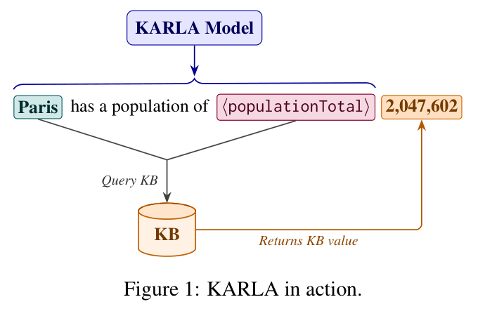
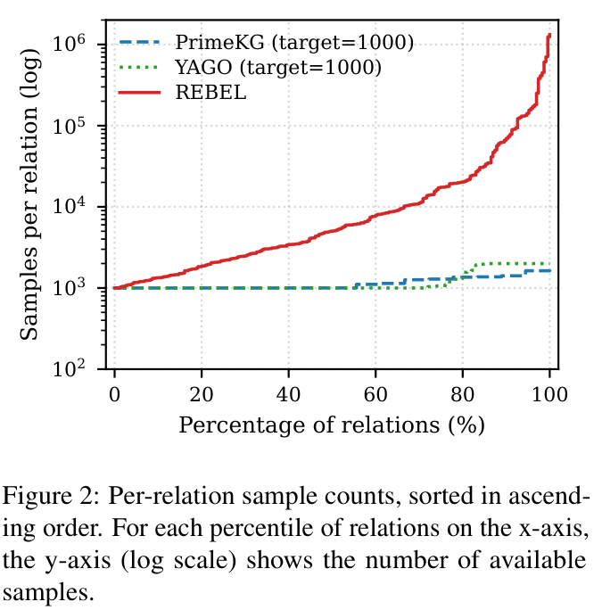
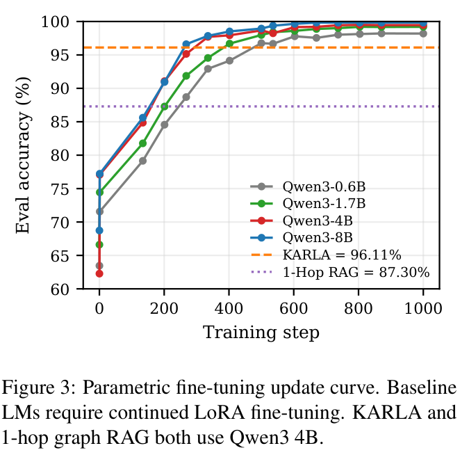

# KARLA: Knowledge-base Augmented Retrieval for Language Models

> [paper] https://arxiv.org/abs/2606.26807

## Summary & Outline

본 논문은 대규모 언어 모델(LLM)의 생성 과정 중에 외부 지식 베이스(Knowledge Base, KB)로부터 원자적 사실 정보(factual knowledge)를 실시간 인라인 쿼리(inline query) 형태로 가져와 주입하는 **KARLA (Knowledge-base Augmented Retrieval for Language Models)** 프레임워크를 제안한다. 기존 LLM은 사실 정보를 모델 파라미터(`θ`)에 암묵적으로 저장하기 때문에 환각(hallucination), 시간적 지식 노후화(temporal misalignment), 최신 사실 갱신 비용(retraining cost), 긴 꼬리(long-tail) 지식에 대한 회상율 저하, 그리고 출처 추적의 어려움이라는 근본적 한계를 지닌다. KARLA는 **"언어적 표현 능력(linguistic competence)"과 "원자적 사실 저장(atomic factual storage)"을 분리**하여, LLM은 문장 구조 생성 및 인라인 쿼리 트리거만을 학습하고 실제 사실 값은 정제된 구조화 KB(YAGO, PrimeKG)에서 즉각 공급받도록 설계되었다.

실험 결과, KARLA는 인라인 쿼리 생성 오버헤드를 패널티로 부여한 정규화 당혹도(`PPL_aug`)를 모든 모델 크기에서 최대 21.0% 낮추었으며, 긴 꼬리 지식 질의응답(PopQA)에서 0.6B 경량 모델만으로 8B 크기의 Graph RAG 베이스라인(78.56% vs 58.68%)을 압도했다. 아울러 새로운 사실 갱신 벤치마크인 **COUNTERFACTUAL YAGO**에서 파라미터 재학습 없이 KB 교체만으로 **96.11%**의 제로샷 갱신 정확도를 달성하며, 인컨텍스트 RAG가 지닌 고질적인 모순 정보 무시 및 파라미터 회귀(parametric override) 문제를 근본적으로 해결함을 입증했다.

```
=== KARLA Report Outline ===
1. Problem & Motivation: 파라미터 기반 지식 저장의 한계와 기존 RAG/Tool 패러다임의 결함
2. Contributions: 핵심 방법론, 알고리즘, 검증 루프, 이론적 보증 및 벤치마크 기여
3. Method: 
   - 인라인 쿼리 문법 및 서술어 특수 토큰(Special Token) 초기화
   - 균형 서브그래프 샘플링 알고리즘 (Proposition 1 증명)
   - 합성 코퍼스 생성 및 2단계 프로그래밍 검증 루프
   - 마스크된 차기 토큰 예측 손실 (Gradient Isolation Loss)
   - 2단계 인퍼런스 파이프라인 (Bi-encoder + LLM Re-ranker)
4. Experiments & Results:
   - 벤치마크 (YAGO, PrimeKG, PopQA, FActScore, COUNTERFACTUAL YAGO)
   - 당혹도(PPL) 및 인라인 쿼리 정확도 분석
   - 단문형(PopQA) 및 장문형(FActScore) 사실성 평가
   - 지식 갱신 및 파라미터 재정의(Factual Overriding) 비교
   - 소거 연구(Ablations) 및 정성적 오류 분석
5. Analysis: 연구적 강점, 구조적 한계점, 미래 확장 방향
```

---

## Problem & Motivation

### 1. 연구 배경: LLM 파라미터 메모리의 근본적 병목
언어 모델은 사전 학습(pre-training) 과정을 통해 방대한 사실 지식을 파라미터 가중치 내에 축적한다. 그러나 지식을 파라미터에 암묵적으로 저장(implicit parametric storage)하는 방식은 다음과 같은 치명적 문제를 유발한다:
- **환각(Hallucination)**: 그럴듯하지만 사실과 다른 허위 정보를 생성.
- **시간적 불일치(Temporal Misalignment)**: 세계 지식이 변할 때 가중치에 고착된 과거 지식으로 인해 최신 정보 반영 불가.
- **파라미터 용량 스케일링 한계**: 모델이 기억해야 할 지식의 양이 증가할수록 모델 파라미터 크기와 학습 비용이 선형 이상으로 폭증 (`O(facts)` in weights).
- **긴 꼬리(Long-tail) 지식 망각**: 대중적 개체(popular entities)에 비해 출현 빈도가 낮은 희귀 개체에 대한 사실 회상 능력이 급격히 저하.

### 2. 풀고자 하는 문제 (Task)
- **Knowledge-Base Augmented Language Generation**: 문장 생성 도중 사실적 주장이 필요한 위치를 모델이 스스로 인지하고, 정확한 주어(subject)와 서술어(predicate) 쿼리를 발행하여 정형 지식을 조회·합성하는 태스크.
- **Long-tail Factual Question Answering & Biography Generation**: 긴 꼬리 엔티티에 대한 단문형 질의응답 및 사실에 기반한 장문형 전기 생성.
- **Continuous Factual Updating / Overriding**: 모델의 가중치를 미세조정(fine-tuning)하지 않고 외부 지식 베이스의 수정(KB edit)만으로 생성 결과의 사실을 즉각 갱신하는 제로샷 지식 오버라이딩.

### 3. 기존 접근법의 한계와 한계 원인

```
[기존 패러다임의 한계 비교]

(1) Standard / Graph RAG (Passive In-Context Injection)
  User Query ──► [Retrieve 1-Hop Subgraph] ──► [Inject into Prompt Context] ──► LLM Generation
  문제점:
  - 컨텍스트에 올바른 사실이 주어져도, 모델이 자신의 내부 사전학습 가중치(Parametric Memory)를 과신하여
    검증되지 않은 과거 사실을 출력하거나(Parametric Override), 문맥을 무시하고 환각 생성(Confident Fabrication).

(2) Prompted Tool-Use / ReAct (Agentic Tool Calling)
  Prompt (Schema Text) ──► Model generates text call: "search(Paris, population)" ──► Execution
  문제점:
  - 긴 텍스트 스키마로 인한 프롬프트 토큰 낭비.
  - 단문형 QA에서는 1회 호출이 가능하나, 복합 사실을 서술하는 장문형 생성(Multi-fact generation)에서는
    초반 1회 호출 후 파라미터 생성 모드로 회귀해 버림.

(3) Large Memory Language Model (LMLM - Zhao et al., 2025)
  문제점:
  - 사전학습을 처음부터 스크래치로 수행하여 기본 언어 구사 능력(linguistic fluency)이 부족.
  - 위키피디아에서 비정형 엔티티를 비구조적으로 추출하여 검색 오류가 전파됨.
```

---

## Contributions

1. **언어 능력과 사실 저장의 완전한 분리 아키텍처 (KARLA Framework)**:
   - 자연어의 문맥 파악 및 문장 계획(Sentence Planning)은 사전학습된 LLM이 전담하고, 원자적 사실 값은 외부 구조화 KB가 실시간 반환하는 인라인 쿼리 메커니즘을 정립.
2. **닫힌 스키마 기반 서술어 특수 토큰(Special Token) 및 임베딩 초기화 기법**:
   - 서술어를 자유 텍스트가 아닌 원자적 특수 토큰 `⟨r⟩`으로 정의하여 유효하지 않은 서술어 생성을 구조적으로 차단하고, 서브토큰 평균 임베딩 초기화를 통해 수렴 속도를 대폭 개선.
3. **이론적 경계가 증명된 서브그래프 샘플링 알고리즘 (Proposition 1)**:
   - KB의 극심한 차수 불균형(degree skew)에도 불구하고 모든 관계의 샘플 빈도가 `T ≤ counts[r] < 2T` 내에 정확히 갇히도록 보장하는 샘플링 알고리즘 설계 및 증명.
4. **기울기 차단 손실 함수 (Masked Next-Token Loss) 및 실패 복구 메커니즘**:
   - KB 반환 토큰 구간에 마스크(`m_t = 0`)를 적용하여 사실 암기를 강제하지 않고 오직 쿼리 트리거와 문맥 생성에만 최적화하며, 10%의 `⟨KB_FAIL⟩` 주입을 통해 KB 미적중 시 파라미터 복구 유연성을 확보.
5. **사실 갱신 벤치마크 (COUNTERFACTUAL YAGO) 구축 및 압도적 실증 성과**:
   - 파라미터 재학습 없이 KB 교체만으로 96.11%의 제로샷 지식 오버라이딩 달성. Graph RAG가 대중적 엔티티에서 겪는 파라미터 회귀(77.8%)를 완벽히 극복.

---

## Method

상세 발췌 → [excerpt](../source/paper/KARLA_Knowledge-base_Augmented_Retrieval_for_Language_Models_2026_Telecom_Paris.md)

### 1. 인라인 쿼리 문법 (Inline Query Syntax)

KARLA는 텍스트를 자동회귀적으로 생성하다가 사실적 진술이 필요한 시점에 인라인 쿼리 시퀀스를 방출한다:

```
⟨r⟩⟨subj⟩s⟨/subj⟩⟨KB⟩o : o_desc⟨/KB⟩
```

```
[KARLA 인라인 쿼리 토큰 구조]

  "Paris has a population of " ──► ⟨populationTotal⟩ ⟨subj⟩ Paris ⟨/subj⟩
                                           │                 │
                                    (관계 특수 토큰)     (주어 엔티티 스팬)
                                           │                 │
                                           └────────┬────────┘
                                                    ▼
                                            [KB Execution Engine]
                                                    │
                                                    ▼
                                   ⟨KB⟩ 2,047,602 : capital of France ⟨/KB⟩
                                                    │
                                           (실시간 주입 및 후속 토큰 생성)
```

- **`⟨r⟩` (Relation Trigger Token)**: 닫힌 관계 집합 `R`의 특정 서술어를 지칭하는 독립 특수 토큰.
- **`⟨subj⟩s⟨/subj⟩` (Subject Span)**: 앞선 문맥으로부터 LLM이 식별한 질의 주어 엔티티.
- **`⟨KB⟩o : o_desc⟨/KB⟩` (Injected Fact & Description)**: KB에서 질의 `⟨s*, r, ?⟩`로 인출된 정답 객체 `o`와 간결한 설명 텍스트 `o_desc`. 모델은 이 결과를 즉시 컨텍스트로 이어받아 후속 문장을 이어나감.
- **`⟨KB_FAIL⟩`**: KB에 일치하는 사실이 없을 경우 방출되는 실패 토큰.



### 2. 서술어 특수 토큰 임베딩 초기화 (Predicate Initialization)
서술어를 일반 텍스트가 아닌 원자적 특수 토큰으로 모델링하면 생성 토큰 수를 절감할 뿐만 아니라 스키마 외부의 엉뚱한 관계를 생성하는 문제를 차단할 수 있다. 초기화 단계에서는 기존 토크나이저 임베딩 행렬 `E ∈ ℝ^(|V| × d)`을 활용하여, 서술어 레이블 `r`을 구성하는 서브토큰 집합 `t(r)`의 평균 벡터로 특수 토큰 임베딩을 초기화한다:

```
E_⟨r⟩ = (1 / |t(r)|) * ∑_{w ∈ t(r)} E_w
```

이 방식은 사전학습된 언어 모델의 의미 공간을 그대로 보존하여 파인튜닝 수렴 속도를 극대화한다.

---

### 3. 균형 서브그래프 샘플링 알고리즘 및 Proposition 1

대규모 지식 베이스는 거듭제곱 법칙(power-law) 형태의 극심한 차수 불균형을 보인다. 일부 관계(예: `rdf:type`)는 수백만 개 존재하지만, 전문적 관계는 수백 개에 불과하다. KARLA는 모든 관계가 균등하게 학습될 수 있도록 목표 샘플 수 `T`와 샘플당 사실 수 `k`를 제어하는 알고리즘을 제안했다.



```
[Algorithm 1: Subgraph Sampling Algorithm]
Input : Knowledge base KB, relation set R, per-relation target T, facts per sample k
Output: Set of entity subgraphs S

1: Initialize counts[r] = 0 for all r in R; S = empty
2: while there exists r in R such that counts[r] < T do:
3:    Sample entity e ~ Entities(KB) uniformly with replacement
4:    F(e) = { ⟨e, r, o⟩ in KB | counts[r] < 2T }
5:    F_valid(e) = deduplicate(F(e))
6:    if F_valid(e) is not empty:
7:       F_sample = sample min(k, |F_valid(e)|) facts from F_valid(e)
8:       S = S union {(e, F_sample)}
9:       for each ⟨e, r, o⟩ in F_sample:
10:         counts[r] = counts[r] + 1
11: return S
```

#### Proposition 1 (관계 샘플 수의 경계성 보증)
알고리즘 1에 의해 추출된 훈련 데이터셋 `S` 내의 모든 관계 `r ∈ R`에 대해 다음 부등식이 성립한다:
```
T ≤ counts[r] < 2T
```
- **하한(Lower bound) 증명**: 루프의 종료 조건이 `∀ r ∈ R, counts[r] ≥ T`이므로, 모든 관계의 카운트는 최소 `T` 이상이다.
- **상한(Upper bound) 증명**: 4행에서 `counts[r] ≥ 2T`인 관계는 후보 풀에서 즉시 제외된다. 카운트는 스텝당 최대 1씩만 증가하므로, 배제 직전의 최대값은 `2T - 1`이다. 따라서 어떤 관계도 `2T`에 도달하거나 초과할 수 없다.

---

### 4. 합성 데이터셋 생성 및 2단계 프로그래밍 검증 루프

추출된 서브그래프는 교사 LLM (GPT-5 mini)에 전달되어 유려한 백과사전식 단락(~250 토큰)으로 변환된다. 교사 LLM은 사실이 언급되는 자리에 마크업 태그 `[REL:relationName|surface_text]`를 부착한다.

```
[2단계 자동 검증 루프 (Verification Loop)]

  Teacher LLM Generation ──► [Check 1: Object Span Exact Match]
                                       │ (일치 여부 확인)
                                       ▼
                             [Check 2: All Sampled Relations Present]
                                       │
                 ┌─────────────────────┴─────────────────────┐
                 ▼ (Pass)                                    ▼ (Fail)
          [Add to Training Set]                     [Structured Feedback]
                                                             │
                                                             ▼ (Max 2 Retries)
                                                    [Discard if >2 failures (<0.5%)]
```

- **검증 1**: 태그 내의 `surface_text`가 제공된 원본 객체 `o`와 정확히 일치해야 함.
- **검증 2**: 서브그래프 내의 모든 `k`개 관계가 문장 내에 빠짐없이 등장해야 함.
- 실패 시 구체적인 누락 관계와 파싱 오류를 포함한 구조화 피드백을 전달하여 최대 2회 재시도(실제 폐기율은 0.5% 미만).

---

### 5. 마스크된 차기 토큰 예측 손실 (Gradient Isolation Loss)

KARLA의 핵심 설계 철학은 모델 가중치가 사실 값 `o`를 외우지 못하도록 차단하는 것이다:

```
L(θ) = - ∑_{t=1}^M m_t · log p_θ (x̃_t | x̃_<t)

m_t = 0  (if x̃_t ∈ span(⟨KB⟩, ..., ⟨/KB⟩))
      1  (otherwise)
```

- **기울기 차단 효과**: KB 반환 구간의 손실을 0으로 마스킹함으로써, 모델은 `o`를 파라미터에 저장하라는 역전파 압박을 받지 않는다. 대신 모델은 올바른 트리거 토큰 `⟨r⟩`을 방출하고 주어 `s`를 식별하며, 주입된 `o`를 바탕으로 자연스러운 후속 문장을 엮어내는 능력에만 온전히 가중치를 업데이트한다.
- **`⟨KB_FAIL⟩` 주입 (10%)**: 훈련 코퍼스의 인라인 쿼리 중 10%를 무작위로 실패 토큰으로 치환하여, KB에 답이 없을 때 모델이 환각에 빠지지 않고 내부 파라미터 지식으로 부드럽게 대체할 수 있도록 훈련한다.

---

### 6. 2단계 인퍼런스 파이프라인 (Two-Stage Inference Pipeline)

```
[KARLA 전체 인퍼런스 워크플로]

1. 프롬프트 전처리 (Entity Canonicalization):
   User Prompt ("Tell me about Paris...") 
   ──► [Bi-Encoder (all-MiniLM-L6-v2 + FAISS Top-10)]
   ──► [Contextual Re-Ranker (Qwen3 1.7B)]
   ──► Formatted Prompt: "Tell me about ⟨KB⟩Paris:capital of France⟨/KB⟩..."

2. 자동회귀 생성 (Autoregressive Generation):
   LLM Generates Tokens ──► Emits "⟨populationTotal⟩⟨subj⟩Paris⟨/subj⟩"
                                     │
                                     ▼ (Generation Pauses)
                           [Query KB: <Paris, populationTotal, ?>]
                                     │
                 ┌───────────────────┴───────────────────┐
                 ▼ (Fact Found)                          ▼ (Not Found)
        Inject: ⟨KB⟩2,047,602⟨/KB⟩                Inject: ⟨KB_FAIL⟩
                 │                                       │
                 └───────────────────┬───────────────────┘
                                     ▼
                      Resume Generation Auto-regressively
```

---

## Experiments & Results

### 1. Benchmark Datasets
- **YAGO (Suchanek et al., 2024)**: 범용 백과사전 지식 베이스. 비의미론적 술어 필터링 후 99개 관계, 36,929개 훈련 단락 생성.
- **PrimeKG (Chandak et al., 2023)**: 정밀 의학 및 생물의학 지식 베이스. 18개 관계, 10,470개 훈련 단락 생성.
- **PopQA (Mallen et al., 2023)**: 긴 꼬리(long-tail) 위키피디아 사실 질의응답 벤치마크.
- **FActScore (Min et al., 2023)**: 인물 전기 장문 생성에 대한 원자적 사실성(Atomic Factuality) 평가.
- **COUNTERFACTUAL YAGO (신규 제안)**: 위키피디아 인기 사분위수(Q1~Q4)에 걸친 400개 엔티티에 대해 사실 전체를 동종 클래스의 다른 엔티티 값으로 스왑한 사실 갱신 벤치마크 (52개 관계, 1,072개 질의).

### 2. Setup
- **백본 모델**: Qwen3-Base (0.6B, 1.7B, 4B, 8B).
- **학습 하이퍼파라미터**: LoRA rank `r = 64`, `α = 128`, Learning Rate `10^-5`, Attention & MLP projection 전체 적용.
- **비교 대상**:
  1. *Base LM*: 사전학습 파라미터만 사용 (Zero-shot).
  2. *Parametric SFT*: 동일 합성 코퍼스를 마크업 없이 LoRA 학습 (지식을 파라미터에 강제 주입).
  3. *1-hop Graph RAG*: 엔티티 링크된 1-hop 서브그래프를 템플릿화하여 프롬프트 컨텍스트에 주입.
  4. *Tool-schema Prompted*: 프롬프트에 99개 관계 스키마를 주고 도구 호출을 유도 (미세조정 없음).
  5. *LMLM (Zhao et al., 2025)*: 스크래치 학습된 외부 메모리 언어 모델.

---

### 3. 정량적 실험 결과

#### (1) 타겟 정규화 당혹도 (Target-Normalized Masked Perplexity, PPL_aug)
쿼리 생성에 소모된 토큰 오버헤드를 패널티로 포함하면서도, 외부 KB 조회로 인한 불확실성 감소가 더 큰지를 측정:

```
PPL_aug(x̃) = exp( - (1/N) * ∑_{j=1}^M m_j · log p_θ(x̃_j | x̃_<j) )
```

| Model | Setup | YAGO (PPL_aug) | PrimeKG (PPL_aug) |
| :--- | :--- | :---: | :---: |
| Qwen 0.6B | **KARLA** | **7.09** | **3.96** |
| Qwen 0.6B | KARLA-empty-KB | 9.27 | 5.61 |
| Qwen 0.6B | Parametric SFT | 8.79 | 5.08 |
| Qwen 1.7B | **KARLA** | **6.05** | **3.36** |
| Qwen 1.7B | Parametric SFT | 7.28 | 4.28 |
| Qwen 4B | **KARLA** | **5.32** | **2.96** |
| Qwen 4B | Parametric SFT | 6.27 | 3.75 |
| Qwen 8B | **KARLA** | **5.08** | **2.84** |
| Qwen 8B | Parametric SFT | 5.77 | 3.51 |

> **주요 시사점**: KARLA는 쿼리 토큰 오버헤드를 전부 부담함에도 불구하고 Parametric SFT 대비 YAGO에서 평균 16.2%, PrimeKG에서 평균 21.0%의 당혹도 감소를 기록했다. 생성된 텍스트 중 YAGO 22%, PrimeKG 13%의 토큰이 KB로부터 직접 공급되었다.

---

#### (2) 인라인 쿼리 정확도 (Inline-Query Exact-Match Accuracy)

| Model | YAGO Subject | YAGO Relation | YAGO Joint (Both) | PrimeKG Subject | PrimeKG Relation | PrimeKG Joint (Both) |
| :--- | :---: | :---: | :---: | :---: | :---: | :---: |
| Qwen 0.6B | 99.4% | 87.2% | 86.7% | 96.9% | 94.7% | 91.8% |
| Qwen 1.7B | 99.6% | 89.9% | 89.5% | 98.1% | 96.6% | 94.9% |
| Qwen 4B | 99.7% | 91.2% | **91.0%** | 99.2% | 97.8% | **97.0%** |
| Qwen 8B | 99.7% | 88.1% | 87.9% | 99.4% | 95.3% | 94.8% |

---

#### (3) 사실성 평가: PopQA (단문형) 및 FActScore (장문형)

| Model | Setup | PopQA Accuracy (%) | FActScore Factuality (%) |
| :--- | :--- | :---: | :---: |
| **Qwen 0.6B** | **KARLA** | **78.56** | 53.0 |
| Qwen 0.6B | Base LM | 16.37 | 22.78 |
| Qwen 0.6B | 1-hop graph RAG | 54.45 | 53.1 |
| Qwen 0.6B | Tool-schema prompt | 15.37 | 24.4 |
| **Qwen 1.7B** | **KARLA** | **78.98** | 53.7 |
| Qwen 1.7B | 1-hop graph RAG | 55.02 | 55.5 |
| **Qwen 4B** | **KARLA** | **80.91** | **58.9** |
| Qwen 4B | Base LM | 23.41 | 24.16 |
| Qwen 4B | 1-hop graph RAG | 56.17 | 56.8 |
| Qwen 4B | Tool-schema prompt | 41.74 | 30.0 |
| **Qwen 8B** | **KARLA** | **80.63** | 57.3 |
| Qwen 8B | 1-hop graph RAG | 58.68 | 58.2 |
| LLAMA2-382M | LMLM | 52.00 | 23.9 |
| GPT2-774M | LMLM | 50.80 | 31.9 |

> **핵심 통찰**: 
> 1. **경량 모델의 거대 모델 추월**: KARLA 0.6B(78.56%)가 1-hop Graph RAG 8B(58.68%)를 20%p 가까이 압도함.
> 2. **보수성 배제**: Graph RAG는 프롬프트 증거에만 기대어 발화 수를 줄이는 보수적 태도를 취하지만, KARLA는 더 많은 원자적 클레임(Atomic Claims)을 적극 생성하면서도 가장 높은 사실 정확도를 달성함.

---

### 4. 사실 갱신 및 파라미터 오버라이딩 (COUNTERFACTUAL YAGO)

KB의 사실을 변경했을 때 시스템이 파라미터의 과거 기억을 버리고 새로운 사실을 얼마나 정확히 출력하는지 평가:



#### 위키피디아 엔티티 인기 사분위수별 갱신 정확도 (Qwen3 4B)
| Setup | Q1 (비인기/희귀) | Q2 | Q3 | Q4 (최다 인기) | 전체 정확도 (Overall) | 비고 |
| :--- | :---: | :---: | :---: | :---: | :---: | :---: |
| **KARLA (Zero-shot KB Swap)** | **97.3%** | **95.9%** | **95.6%** | **95.6%** | **96.11%** | 그래디언트 업데이트 0회 |
| 1-hop graph RAG | 89.1% | 93.2% | 92.3% | 77.8% | 87.30% | Q4에서 성능 붕괴 |
| Parametric LoRA Fine-Tuning | - | - | - | - | <85% | 1,000 스텝 이상 튜닝 필요 |

```
[인컨텍스트 Graph RAG의 2대 치명적 고장 모드]

1. Parametric Override (과거 기억 회귀):
   - 상황: 불가리아의 Demonym이 슬로바키아 값('Slūfākiyyūn')으로 변경되어 프롬프트에 주어짐.
   - 기대 출력: Slūfākiyyūn
   - RAG 모델 출력: "Bulgarians." (프롬프트의 명시적 단서를 무시하고 내부 가중치 출력)

2. Confident Fabrication (자신만만한 날조):
   - 상황: 불가리아의 Date Created가 1993년 1월 1일로 컨텍스트에 주어짐.
   - 기대 출력: 1 January 1993
   - RAG 모델 출력: "1 January 1946." (KB에도 없고 실제 역사와도 무관한 가상 연도 날조)
```

---

### 5. 소거 연구 (Ablation Studies)

1. **특수 토큰 vs 자유 텍스트 서술어**: 특수 토큰 방식은 PopQA에서 자유 텍스트 대비 소폭 우수하면서도, 자유 텍스트 모델이 유발하는 **최대 11%의 스키마 이탈 서술어 생성(out-of-schema hallucination)**을 완전히 제거함.
2. **Empty KB (`⟨KB_FAIL⟩`) 검증**: 빈 KB 설정 시 PPL과 사실성이 일제히 급락하여, 성능 향상이 포맷팅 편향이 아닌 실제 KB 사실 주입에 기인함을 증명.
3. **엔티티 설명문 (`o_desc`)**: 설명문을 제거한 `KARLA-no-desc`는 PopQA에서 13~23%p 급락하여, 원자적 값뿐만 아니라 경량 문맥 설명이 결합되어야 복합 추론이 가능함을 확인.
4. **학습 코퍼스 예산 (`T`)**: 관계당 샘플 수 `T ≤ 100`에서는 정확도가 거의 0에 머물다가 `T = 500`에서 급상승하여 `T = 1000`에서 모든 모델 크기에 걸쳐 수렴(Appendix D, Figure 5).

---

## Analysis

### 1. Strengths & Significance
- **지식 유지보수 비용의 `O(1)`화**: 새로운 사실 반영 및 오류 수정이 LLM 파라미터 파인튜닝 없이 단순 KB 레코드 업데이트로 100% 즉시 반영됨.
- **환각의 구조적 배제와 설명 가능성(Provenance)**: 모델이 생성한 모든 사실 토큰이 `⟨KB⟩ ... ⟨/KB⟩` 태그로 감싸여 있어, 어떤 KB 트리플에 근거했는지 100% 투명하게 추적 가능.
- **파라미터 효율성 극대화**: 0.6B의 극소형 모델이 거대 모델의 지식 검색 및 사실 전달 능력을 완벽히 재현하여 엣지 디바이스 및 온디바이스 에이전트에 최적.

### 2. Limitations
- **닫힌 서술어 어휘집 (Closed Predicate Schema)**: 서술어가 특수 토큰 `⟨r⟩`으로 컴파일되므로, 새로운 관계 유형을 KB에 추가하려면 추가적인 파인튜닝이 요구됨.
- **엔티티 링킹(Disambiguation) 의존성**: 주어 엔티티의 모호성을 해결하기 위해 별도의 Bi-encoder + LLM re-ranker 파이프라인에 의존함.
- **단일 관계 1-hop 쿼리 한계**: 복합 다단계 추론(Multi-hop reasoning)이나 그래프 경로 탐색을 단일 쿼리 내에서 처리하지 못하고 순차적 1-hop 쿼리 체이닝에 의존.

### 3. Future Work / Improvements
- **개방형 서술어 동적 등록**: 어휘집을 고정하지 않고 서술어 온톨로지 임베딩을 동적으로 프로젝션하는 플러그형 아키텍처 확장.
- **에이전트 메모리 시스템과의 통합**: 자율형 에이전트의 Episodic / Semantic Memory (예: Memora, ReflectWorld) 백엔드와 연동하여, 에이전트가 과거 대화 이력과 환경 상태를 인라인 쿼리로 즉시 불러오도록 결합.

---

## References
- François Crespin, Fabian M. Suchanek, Nils Holzenberger. 2026. *KARLA: Knowledge-base Augmented Retrieval for Language Models*. arXiv:2606.26807.
- Alex Mallen et al. 2023. *When Not to Trust Language Models: Investigating Effectiveness of Parametric and Non-Parametric Memories*. ACL 2023.
- Sewon Min et al. 2023. *FActScore: Fine-grained Atomic Evaluation of Factual Precision in Long Form Text Generation*. EMNLP 2023.
- Fabian M. Suchanek et al. 2024. *YAGO 4.5: A Knowledge Base of Real-World Entities*.
- Payal Chandak et al. 2023. *Building a Knowledge Graph to Enable Precision Medicine (PrimeKG)*. Scientific Data.
- Wayne Xin Zhao et al. 2025. *Large Memory Language Models (LMLM)*.
