> [paper] https://arxiv.org/abs/2608.30320

# On the Design of Qwen3.8-Next Architecture: Evaluation, Efficiency, and Training Stability

## Summary & Outline

본 논문은 Alibaba Qwen 팀이 차세대 플래그십 효율형 모델인 **Qwen3.8-Flash-Next**의 전체 아키텍처, 효율성 설계, 학습 안정성 메커니즘 및 하이퍼파라미터 스케일링 법칙을 포괄적으로 정립한 기술 보고서이다. Qwen3.8-Flash-Next는 **총 125B 파라미터(토큰당 활성 6B)**의 희소 전문가 혼합(Sparse MoE) 백본과, 가속기 외부 호스트 CPU 메모리에 오프로드된 **51B N-gram 임베딩 테이블**을 결합한 모델이다. 14개 범용 사전학습 벤치마크 평가 결과, 선행 모델인 397B-A17B 규모의 Qwen3.7-Plus 대비 8개 영역에서 우위를 점하고 나머지 영역에서도 최대 2.6점 이내의 대등한 성능을 기록하였으며, **활성 파라미터 1/3, 학습 토큰 수 1/3, 총 학습 FLOPs 약 1/9(89% 절감)** 수준의 연산량만으로 이를 달성하였다.

본 보고서의 핵심 연구 구성은 다음과 같다:
1. **Token Mixing**: Gated DeltaNet(GDN) 3개 레이어와 Global Attention 1개 레이어를 주기적으로 교차 배치(3:1 비율)하고, 사후 지속 사전학습(CPT) 단계에서 Full Attention을 마이크로 블록 압축 인덱서 기반 **Qwen Sparse Attention (QSA)**으로 치환하여 1M 컨텍스트에서 Prefill 7.6배, Decode 4.9배의 커널 가속 달성.
2. **Gated Residual (GR)**: 단일 레지듀얼 스트림을 4개 브랜치(`nr = 4`)로 확장하고, 브랜치 간 선형 혼합(`H_res`)을 제거하는 대신 원소별 읽기 게이트(GatedNorm)와 스칼라 쓰기 게이트를 결합하여 Layer 0 출력을 심층 어텐션으로 직접 쏘아주는 장거리 고속도로(Long-range Highway) 자동 형성 및 FP8 캐시 절감(50%) 실현.
3. **Off-Accelerator N-gram Embedding**: 51B 파라미터의 N-gram 임베딩을 호스트 메모리에 상주시키고 Layer 2 연산과 비동기 프리페칭을 중첩. 어휘 확장 시 사전학습 손실(Loss)은 단조 감소하나 다운스트림 벤치마크는 포화되는 메트릭 괴리(Metric Disentanglement) 현상 규명.
4. **Optimization & Stability Co-design**: 2D 선형 가중치에 Polar Express 8단계 Newton-Schulz 직교화 기반 **Muon** 옵티마이저를 적용하고, 융합 파라미터 분할, Canzona 비동기 All-to-All 통신 분할, 배치 크기 웜업 제거 및 상향된 학습률/배치 스케일링 법칙 확립. 4배 최적 학습률 스트레스 테스트에서 스파이크 0회를 기록하며 qk-clip/SwiGLU-clip 없이 프로덕션 무결점 학습 달성.

```
+---------------------------------------------------------------------------------------------------+
|                                Qwen3.8-Flash-Next System Outline                                  |
+---------------------------------------------------------------------------------------------------+
|  1. Model Architecture                                                                            |
|     ├── Token Mixing Hybrid (3x GDN + 1x QSA)                                                     |
|     │    ├── Gated DeltaNet (GDN): O(1) Recurrent Memory + Erase/Write Delta Rule                 |
|     │    └── Qwen Sparse Attention (QSA): Micro-Block Compressed Indexer + 2-Stage CPT           |
|     ├── Gated Residual (GR): 4-Branch Stream + Elementwise Read Gate (GatedNorm) + FP8 Cache       |
|     └── Off-Accelerator Capacity: 51B N-gram Tables (Host RAM) + Layer 2 Async Prefetch           |
|                                                                                                   |
|  2. Optimization & Stability                                                                      |
|     ├── Muon Matrix Optimizer: Polar Express 8-step NS + Sub-matrix Parameter Splitting           |
|     ├── Canzona Distributed Runtime: α-balanced Static Partitioner + TP Micro-Group Fused All2All |
|     ├── Hyperparameter Scaling: 25.2M Batch (No Warmup) + High LR Flat Basin                      |
|     └── Stability Stress Test: Multiplicative GatedNorm Activation Rescaling (Zero Spike at 4x LR)|
|                                                                                                   |
|  3. Empirical Validation                                                                          |
|     ├── 14 Pretraining Benchmarks: Leads 397B-A17B on 8 tasks at 1/9 training FLOPs               |
|     ├── Long-Context Retrieval: RULER (93.0 @ >512K) & MRCR (40.53 @ 512K) SOTA                   |
|     └── Multi-Token Prediction (MTP): Speculative Decoding Index Reuse (4.07 mean accepted length)|
+---------------------------------------------------------------------------------------------------+
```

---

## Problem & Motivation

### 1. 연구 배경 및 LLM 스케일링의 근본적 병목
최근 거대 언어 모델(LLM)은 수십조(Tens of Trillions) 토큰 및 수천억 파라미터 규모로 확장되면서 연산 효율성, 컨텍스트 처리 길이, 분산 학습 안정성이라는 세 가지 상호 결합된 병목에 직면해 있다:
1. **Softmax Attention의 이차 복잡도 및 선형 KV Cache 증가**: 컨텍스트 길이가 수십만~수백만 토큰으로 확장됨에 따라 Softmax Attention 연산량은 `O(N²)`로 폭증하며, 디코딩 시 KV Cache 메모리 대역폭 점유는 가속기 HBM 용량과 서빙 처리량을 심각하게 제한한다.
2. **선형 순환 모델(Linear Attention / RNN)의 표현력 한계**: Sliding Window Attention(SWA)은 로컬 윈도우 외부 정보를 심층 레이어를 통한 간접 전파에만 의존하며, 순수 가산적 선형 어텐션은 고정 크기 상태에 과거 토큰을 무한정 누적하여 연관 기억의 정밀한 덮어쓰기(Overwrite) 및 다단계 추론 회상이 불가능하다.
3. **레지듀얼 스트림 대역폭 및 깊이 확장 제약**: 표준 단일 레지듀얼 스트림은 모든 이전 레이어의 정보가 단일 합산 벡터에 뭉개져 감쇠율을 개별 제어할 수 없으며, 기존 Hyper-Connections(HC/mHC) 방식은 브랜치 간 전수 혼합 행렬(`H_res`)로 인해 매 블록마다 엄청난 메모리 트래픽을 유발한다.
4. **호스트 메모리 오프로딩과 평가 지표의 불일치**: N-gram 임베딩과 같은 외부 메모리는 계산 복잡도 없이 파라미터를 확장할 수 있지만, 사전학습 손실(Perplexity) 감소가 실제 다운스트림 추론/수학/코딩 벤치마크 성능 향상으로 직결되지 않는 괴리가 존재한다.
5. **초대규모 분산 학습 시 수치 불안정성**: 학습률(LR)과 배치 크기를 키울수록 활성화 이상치(Activation Outliers)와 그래디언트 노름 스파이크가 빈번하게 발생하여 학습이 붕괴된다. 기존에는 qk-clip, SwiGLU-clip 등 사후 인위적 클리핑에 의존했으나 이는 근본적인 모델 표현력 왜곡을 초래한다.

### 2. 풀고자 하는 핵심 문제 (Target Tasks)
- **Extreme-Scale Efficient Pre-training**: 1/9 FLOPs 수준으로 400B급 SOTA 모델 성능 달성.
- **Long-Horizon Sparse Context Modeling**: 1M 토큰 이상의 초장문 컨텍스트에서 품질 저하 없는 초고속 Prefill/Decode 서빙.
- **Self-Stabilizing Deep Architecture**: 인위적 텐서 클리핑 없이 고학습률(High LR) 및 초대형 배치에서 발산하지 않는 자율 안정화 네트워크 설계.
- **Off-Accelerator Parameter Scaling**: HBM 한계를 넘어 호스트 메모리 테이블을 지연 시간 없이 통합하는 메모리 계층 구조 정립.

---

## Contributions

- **GDN-QSA 레이어별 하이브리드 토큰 믹서 제안**:
  - Gated DeltaNet(GDN) 3개 레이어와 Global Attention 1개 레이어를 3:1 비율로 교차 배치하여 O(1) 순환 상태 압축과 직접적 토큰 인출의 최적 균형을 달성.
  - 마이크로 블록(Micro-block, `r = 4`) 압축 인덱서 기반 **QSA(Qwen Sparse Attention)**를 지속 사전학습(CPT) 2단계 파이프라인으로 구축하여 1M 길이에서 Prefill 7.6배, Decode 4.9배 가속 및 RULER/MRCR 장문 성능 향상 달성.
- **Gated Residual (GR) 아키텍처 및 FP8 메모리 최적화**:
  - 레지듀얼 스트림을 4개 브랜치(`nr = 4`)로 넓히고, 비효율적인 브랜치 혼합기(`H_res`)를 완전 제거하는 대신 GatedNorm 기반 원소별(elementwise) 읽기 게이트와 스칼라 쓰기 게이트를 결합.
  - 경로 분해(Path Decomposition) 분석을 통해 Layer 0 출력을 Layer 10~19의 어텐션으로 직접 전달하는 전용 장거리 고속도로(`b0`)가 자율 형성됨을 입증.
  - 레지듀얼 상태의 값 범위를 엄격히 바운딩하여 손실 없는 **FP8 브랜치 저장(메모리 이동량 50% 절감)** 달성.
- **N-gram 임베딩 테이블 분리 배치 및 Loss-Benchmark 괴리 규명**:
  - 51B 파라미터의 N-gram 테이블을 호스트 RAM에 두고 Layer 2에서 비동기 프리페칭으로 연산과 중첩.
  - 어휘 크기를 20V에서 200V로 확장할 때 손실은 단조 감소하지만 다운스트림 벤치마크는 포화된다는 본질적 특성을 실증 분석.
- **Muon 옵티마이저 & Canzona 분산 런타임 & 안정성 메커니즘 통합**:
  - 2D 선형 변환 가중치에 8단계 Polar Express Newton-Schulz 기반 Muon을 적용하고 Megatron 융합 텐서를 서브 행렬로 분할.
  - DP 랭크 간 NS FLOPs를 균등화하는 Canzona 정적 파티셔너와 비동기 TP All-to-All 통신 파이프라인 구축.
  - 배치 크기 웜업의 불필요성을 규명(상수 25.2M 배치 도입으로 18.8% 스텝 절감)하고, 4배 학습률 스트레스 테스트에서 스파이크 0회를 달성하는 GatedNorm의 자율 스케일링 원리를 수학적으로 규명.

---

## Method

### 1. 전체 시스템 아키텍처 개요

Qwen3.8-Flash-Next는 백본 토큰 믹싱, 다중 브랜치 레지듀얼, 호스트 메모리 N-gram 임베딩, 그리고 분산 Muon 최적화 엔진이 유기적으로 맞물린 고효율 시스템이다.

```
+---------------------------------------------------------------------------------------------------+
|                                 Qwen3.8-Flash-Next Layer Architecture                             |
+---------------------------------------------------------------------------------------------------+
|                                                                                                   |
|   Residual Stream: 4 Parallel Branches R = [R1, R2, R3, R4] ∈ R^{4 x d} (FP8 Stored)              |
|                                                                                                   |
|           ┌─────────────────────────────────────────────────────────────┐                         |
|           │  Gated Residual Read (GatedNorm with d/8 Bottleneck)        │                         |
|           │  R_hat_i = RMSNorm(R_i; γ_i)                                │                         |
|           │  G = unvec(σ(W_u · SiLU((1/4) W_d vec(R_hat)))) ∈ R^{4 x d} │                         |
|           │  x = (1/4) ∑_{i=1}^4 G_i ⊙ R_hat_i                          │                         |
|           └──────────────────────────────┬──────────────────────────────┘                         |
|                                          │                                                        |
|                                          ▼                                                        |
|                       ┌──────────────────────────────────────┐                                    |
|                       │         Token Mixing Module          │                                    |
|                       │  • Layers 0, 1, 2: Gated DeltaNet    │                                    |
|                       │  • Layer 3: QSA (Sparse Attention)   │                                    |
|                       │  (Pattern repeats every 4 layers)    │                                    |
|                       └──────────────────┬───────────────────┘                                    |
|                                          │                                                        |
|           ┌──────────────────────────────┴──────────────────────────────┐                         |
|           │  Gated Residual Write                                       │                         |
|           │  s = 2 · σ((1/4) W_w vec(R_hat)) ∈ R^4                      │                         |
|           │  R_i' = R_i + s_i · y                                       │                         |
|           └──────────────────────────────┬──────────────────────────────┘                         |
|                                          │                                                        |
|                                          ▼                                                        |
|           ┌─────────────────────────────────────────────────────────────┐                         |
|           │  Layer 2 Special: Off-Accelerator N-gram Embedding Inject   │                         |
|           │  (Async Prefetched 51B Host RAM Table via Multi-Head Hash)  │                         |
|           └──────────────────────────────┬──────────────────────────────┘                         |
|                                          │                                                        |
|                                          ▼                                                        |
|                       ┌──────────────────────────────────────┐                                    |
|                       │         MoE Feed-Forward Block       │                                    |
|                       │  • Routed Experts (Top-K) + Shared   │                                    |
|                       │  • Gated Residual Read/Write Loop    │                                    |
|                       └──────────────────────────────────────┘                                    |
+---------------------------------------------------------------------------------------------------+
```

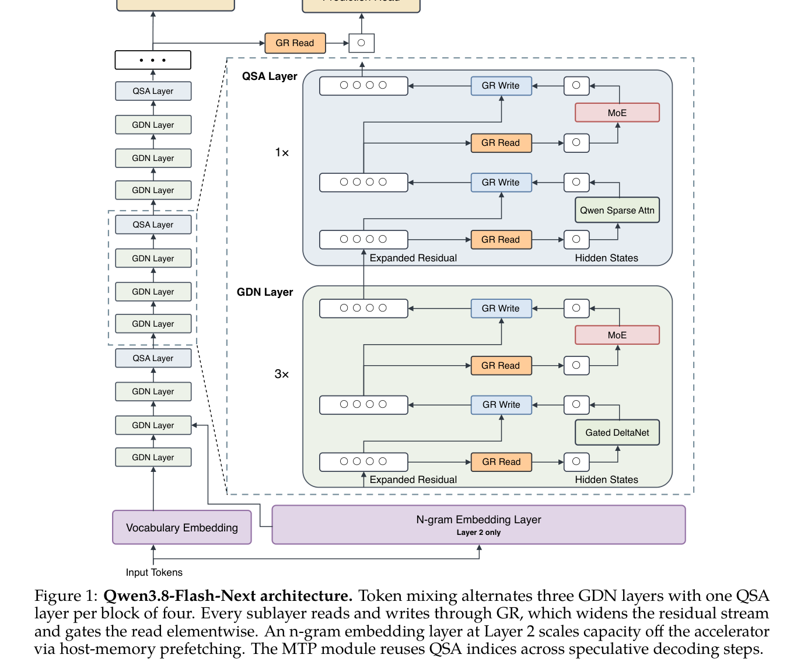

---

### 2. Gated DeltaNet (GDN) 토큰 믹서

GDN은 고정 크기 고속 가중치 순환 메모리(Fast-weight Memory)에 토큰 정보를 점진적으로 저장하며, 단순 가산 누적이 아닌 **표적 소거 및 기록(Targeted Erase-and-Write Delta Rule)**을 수행한다.

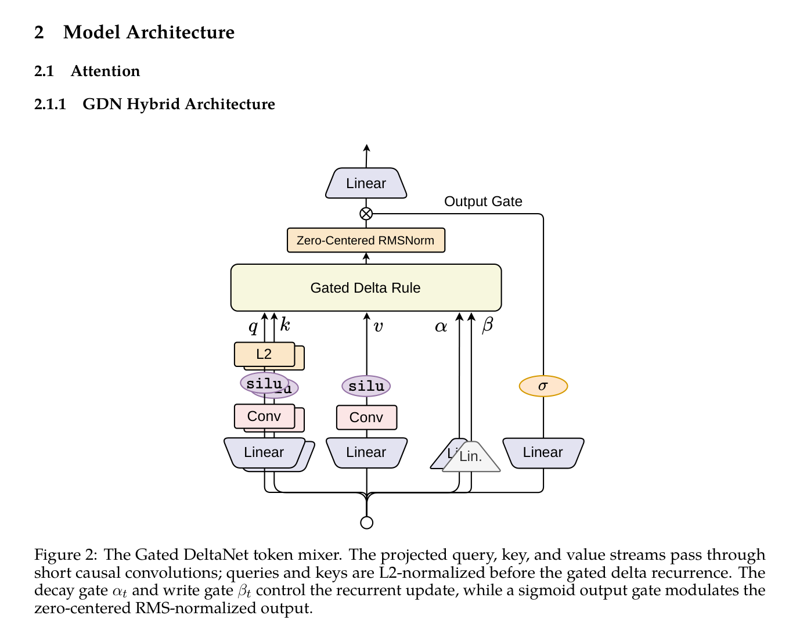

#### 2.1 점화식 및 수학적 정식화
각 어텐션 헤드에서 쿼리 `q_t, k_t ∈ R^{dk}`, 밸류 `v_t ∈ R^{dv}`에 대해 상태 행렬 `S_t ∈ R^{dk × dv}`는 다음과 같이 갱신된다:

```
eS_{t-1} = α_t · S_{t-1}
e_t = v_t - eS_{t-1}^T · k_t
S_t = eS_{t-1} + β_t · k_t · e_t^T
y_t = S_t^T · q_t
```

이를 축약하면 다음과 같은 랭크-1 전이 행렬 수식과 일치한다:
```
S_t = α_t · (I - β_t · k_t · k_t^T) · S_{t-1} + β_t · k_t · v_t^T
```
- **`α_t ∈ (0, 1)` (Data-dependent Decay)**: 이전 상태의 전체적인 수명(Lifetime)을 제어.
- **`β_t ∈ (0, 1)` (Write Gate)**: 델타 갱신 강도를 조절.
- **잔차 오차 `e_t`**: 현재 키 `k_t`가 이전 상태 `eS_{t-1}`에서 이미 유추할 수 있는 밸류 성분을 제외하고, 순수하게 새로운 정보(Residual)만을 직교 방향으로 기록. 동일한 키가 반복 입력되어도 상태가 무한 발산하지 않고 기존 연관성을 정밀 덮어쓰기함.

#### 2.2 파라미터화 및 출력 게이팅
```
q_t = L2Norm(SiLU(ShortConv(W_q · x_t)))
k_t = L2Norm(SiLU(ShortConv(W_k · x_t)))
v_t = SiLU(ShortConv(W_v · x_t))

β_t = σ(W_β · x_t)
α_t = exp[-exp(A) · softplus(W_α · x_t + b_α)]

o_t = W_o · [σ(W_z · x_t) ⊙ RMSNorm(y_t)]
```
- **Short Depthwise Causal Convolution**: 순환 상태 압축 전 국소적인 토큰 순서 및 n-gram 패턴을 먼저 포착하는 귀납 편향 제공.
- **L2 Normalization**: `q_t`와 `k_t`의 벡터 노름을 1로 제한하여 랭크-1 델타 전이의 수치적 안정성 보장.
- **Bounded Sigmoid Output Gate**: 원본 GDN의 SiLU 게이트 대신 바운디드 시그모이드 게이트 `σ(W_z · x_t)`를 적용하여 출력의 비정상적 증폭 억제.
- **Zero-Centered RMSNorm**: 학습 중 RMSNorm 가중치가 임의로 비대해지는 현상을 방지.

---

### 3. Qwen Sparse Attention (QSA) & 2단계 CPT 학습

초장문 컨텍스트에서 Softmax Attention의 `O(N²)` 복잡도를 제거하기 위해, 4레이어마다 1개씩 존재하는 Global Attention 레이어를 CPT 단계에서 경량 인덱서 기반 희소 어텐션(QSA)으로 전환한다.

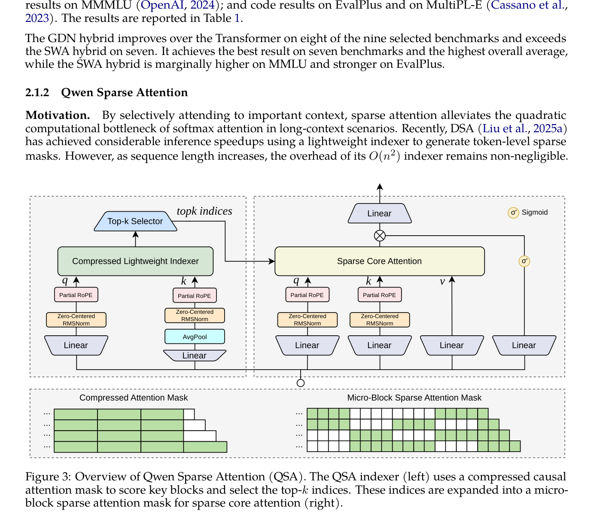

#### 3.1 압축 경량 인덱서 (Compressed Lightweight Indexer)
- 인덱서 구조: Multi-Query Attention (MQA, 4 Query Heads, 1 Shared Key Head).
- 키 시퀀스를 `r = 4` 크기의 비중첩 마이크로 블록으로 그룹화하고 평균 풀링:
```
bq_i^h = RMSNorm(W_Q^h · x_i),    k_i = W_K · x_i

bkb_b = RMSNorm(AvgPool(k_{p_b : p_b + r - 1})),    p_b = b · r

q_i^h = PRoPE(bq_i^h, i)
kb_b = PRoPE(bkb_b, p_b)
```
- **Partial RoPE 적용 순서의 중요성**: 키 풀링(AvgPool)을 먼저 수행하여 블록의 의미론적 요약 벡터를 생성한 후, 블록 시작 위치 `p_b`에 대해 단일 RoPE를 적용한다. 서로 다른 회전 위상을 가진 토큰 벡터들을 풀링하는 위상 왜곡(Phase Cancellation)을 원천 방지한다.

#### 3.2 블록 인과적 스코어링 (Block-Causal Scoring)
```
I_{i,b} =
  ∑_{h=1}^H ReLU(⟨ q_i^h, kb_b ⟩),    if p_b + r - 1 ≤ i
  -∞,                                    otherwise
```
- 토큰 예산 `K = 2048`, 압축비 `r = 4`일 때, 최대 `KB = K / r = 512`개 중요 블록을 선별.
- 최종 어텐션 대상 토큰 집합 `S_i`:
```
S_i = Expand(Top-KB(I_{i, :})) ∪ { r · ⌊(i + 1) / r⌋, ..., i }
```
- 아직 완전히 끝나지 않은 꼬리 토큰(Tail tokens)을 무조건 포함하여 인과성을 엄격히 보장.

#### 3.3 2단계 지속 사전학습 (CPT) 파이프라인
1. **Stage 1: 인덱서 워밍업 (Indexer Warm-up)**: 백본을 동결한 채 인덱서만 학습 (1,000 스텝, 256K 시퀀스 8개/스텝, 약 2B 토큰, LR = `1 × 10^-3`). Dense Attention 교사 확률분포 `hat{a}_{i,b}`와의 KL 발산 손실 최적화:
```
L_KL = (1 / N) · ∑_i D_KL(hat{a}_{i, :} || Softmax(I_{i, :}))
```
2. **Stage 2: 희소 공동 학습 (Sparse Training)**: 백본과 인덱서를 동시에 8,000 스텝 학습 (256K 시퀀스 96개/스텝, 약 200B 토큰, LR = `2.5 × 10^-5`). Top-KB 블록 내에서 재정규화된 교사 분포에 대해 KL 손실을 계산하여 희소 어텐션 패턴에 백본을 완벽히 적응시킴.

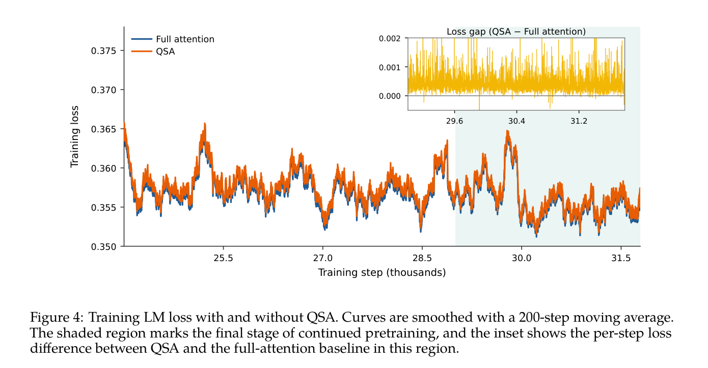

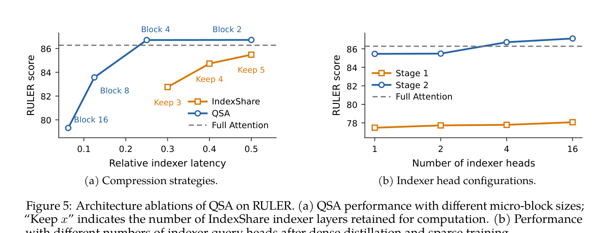

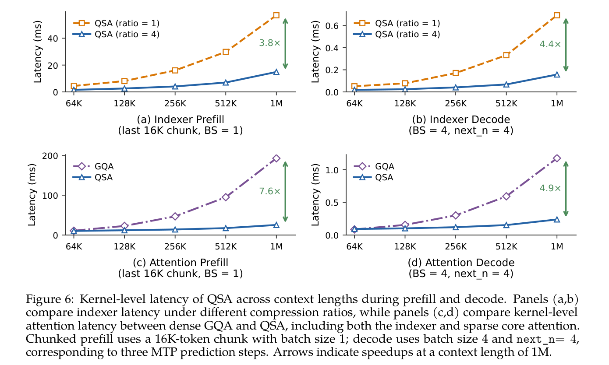

---

### 4. Gated Residual (GR) & 장거리 정보 라우팅 메커니즘

기존 Hyper-Connections(HC/mHC)의 브랜치 간 전수 혼합 행렬(`H_res`)은 매 블록마다 레지듀얼 스트림 전체를 읽고 쓰는 극심한 메모리 트래픽을 유발한다. GR은 `H_res`를 완전 제거하고 GatedNorm 기반의 정밀한 원소별 읽기 게이트를 구축하였다.

```
[독립 브랜치 RMSNorm]
hat{R}_i = RMSNorm(R_i; γ_i),    i = 1, ..., nr  (nr = 4)

[원소별 읽기 게이트 (Elementwise Read Gate)]
G = unvec(σ(W_u · SiLU((1 / nr) · W_d · vec(hat{R})))) ∈ R^{nr × d}

[블록 입력 합성]
x = (1 / nr) · ∑_{i=1}^{nr} G_i ⊙ hat{R}_i

[블록 연산 및 스칼라 쓰기 게이트]
y = F(x)
s = 2 · σ((1 / nr) · W_w · vec(hat{R})) ∈ R^{nr}
R_i' = R_i + s_i · y
```
- 저랭크 바틀넥: `r_rank = d / 8`.
- **FP8 캐시 지원**: 읽기/쓰기 게이트가 레지듀얼 벡터의 크기를 바운딩하므로 브랜치 상태를 FP8로 저장하여 메모리 전송량을 50% 절감.

#### 경로 분해 분석 (Path Decomposition Analysis)
블록 `u`가 블록 `v`의 입력에 기여하는 유효 점유율:
```
a_{u→v} = (1 / nr) · ∑_{c=1}^{nr} G_c^{(v)} ⊙ γ_c ⊙ (s_c^{(u)} · y^{(u)} / rms(R_c^{(v)}))
π_{uv} = ||a_{u→v}|| / (∑_{u' < v} ||a_{u'→v}||)
```

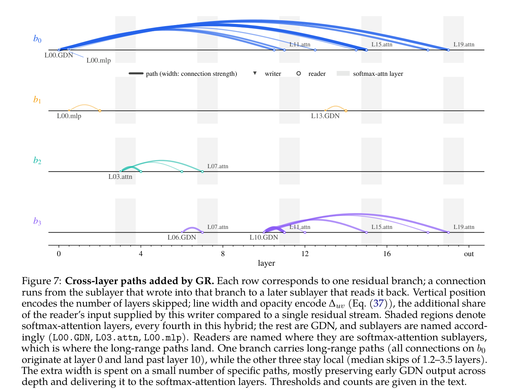

- **장거리 전용 고속도로(`b0`) 발견**: 4개 브랜치 중 1개 브랜치(`b0`)는 Layer 0 GDN/MLP 출력을 집중 보존하여 Layer 10~19의 Softmax Attention 레이어로 직접 전달하는 장거리 전용 통로(평균 스킵 10.9 레이어)로 자율 분화됨.
- **국소 단거리 브랜치(`b1, b2, b3`)**: 나머지 3개 브랜치는 평균 1.2~3.5 레이어의 국소 인접 블록 간 정보 전달을 전담.
- Softmax Attention이 초기 레이어의 원시 컨텍스트를 직접 읽어들이는 핵심 허브(Hub) 역할을 수행함을 규명.

---

### 5. Off-Accelerator N-gram Embedding Layer

- **구조 및 배치**: 멀티헤드 해싱(Multi-head Hashing)을 통해 로컬 N-gram 키로 호스트 RAM 상의 51B 임베딩 테이블을 조회하고 문맥 게이트(Contextual Gate)를 통해 주입.
- **비동기 프리페칭 (Asynchronous Prefetching)**: Layer 2에 단일 임베딩 레이어를 배치함으로써, Layer 0~1 연산이 진행되는 동안 호스트-가속기 PCIe 데이터 전송을 완벽히 은폐(Overlap).
- **손실 vs 벤치마크 괴리 (Metric Disentanglement)**:
  - N-gram 어휘를 20V에서 200V로 확장 시 사전학습 손실은 1.553에서 1.526으로 단조 감소함.
  - 그러나 MATH, GSM8K, BBH 등 고차원 추론 벤치마크는 50V~100V 구간에서 포화되며, 중국어 지식 벤치마크(C-Eval, CMMLU)만 지속적으로 향상됨.
  - 따라서 고정 파라미터 예산 내에서 MoE 전문가를 줄이고 N-gram을 늘리는 것은 부적절하며, 가속기 외부 추가 용량으로 활용하는 것이 최적임을 입증.

---

### 6. Muon 최적화 & Canzona 분산 런타임 & 안정성 메커니즘

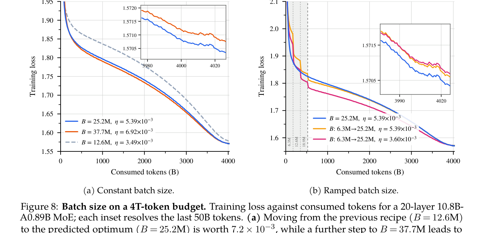

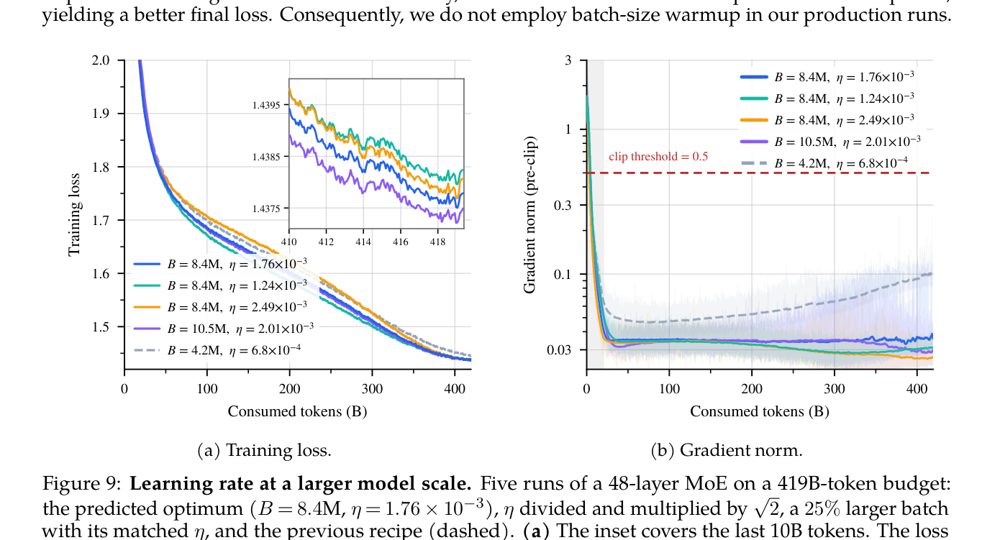

#### 6.1 Muon 옵티마이저 구성 및 융합 파라미터 분할
- **적용 규칙**: 2D 선형 변환 가중치(Attention QKV/O, GDN QKV/O, MoE Experts fc1/fc2, N-gram K/V)에 Polar Express 8단계 Newton-Schulz 직교화 기반 Muon 적용.
- **AdamW 유지**: 1D 벡터, 임베딩, LM 헤드, MoE 라우터, GR 저랭크 투영 행렬.
- **서브 행렬 분할 (Splitting Fused Parameters)**: Megatron의 융합된 QKV, GDN 입력 프로젝션, SwiGLU fc1(Gate+Up)을 직교화 전 헤드/연산자 단위로 분할하여 독립 Newton-Schulz를 수행함으로써 특이값 방향 왜곡 방지.
- **Canzona 분산 시스템**:
  - `α`-balanced static partitioner: DP 랭크 간 NS 연산 FLOPs(`4K · max(A,B) · min(A,B)²`)를 균등 배분하여 낙오자(Straggler) 방지.
  - TP 랭크 간 비동기 All-to-All 통신으로 Muon 소유 행렬을 재구성하고 CUDA Graph로 100+개 커널 런치 오버헤드 제거.

#### 6.2 하이퍼파라미터 스케일링 & 배치 웜업 제거
- **배치 크기 25.2M 확정**: 4T 토큰 예산에서 12.6M 대비 `7.2 × 10^-3` 손실 개선.
- **배치 웜업 불필요**: 점진적 배치 웜업은 상수 배치 대비 최종 손실이 열세(`2.5 × 10^-4` 손해)하며 18.8% 더 많은 스텝을 소모. Muon 환경에서는 초기부터 목표 배치 크기로 학습하는 것이 우수.
- **학습률 평탄 영역 (Flat Bowl)**: 48레이어 156B-A7B MoE에서 최적 학습률이 `1.76 × 10^-3`으로 대폭 상향되며, `1 / √2`에서 `√2` 범위에서 평탄한 최적 영역 유지.

#### 6.3 GatedNorm의 자율 스케일링 및 스트레스 테스트 안정성

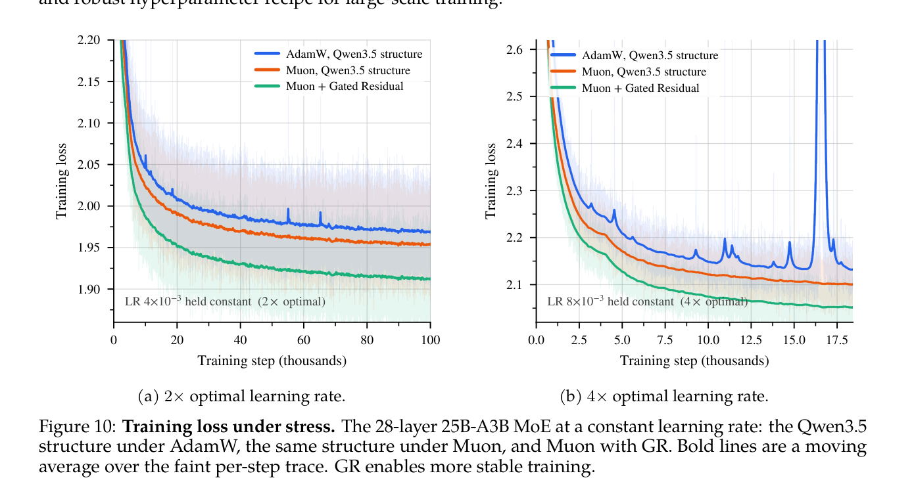

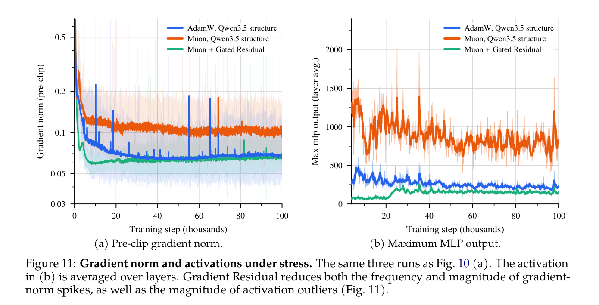

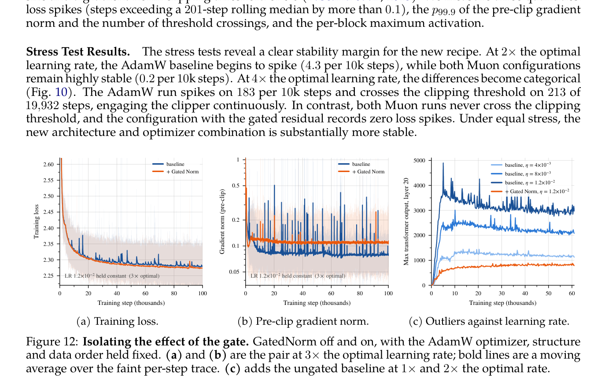

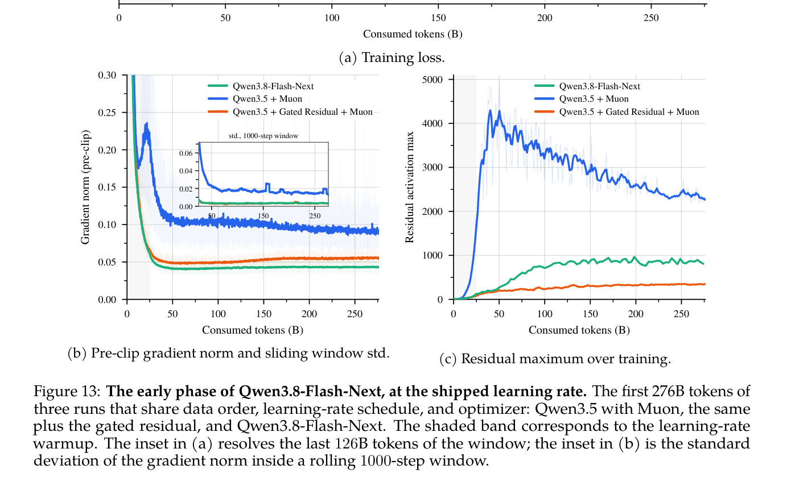

- **4배 최적 학습률 스트레스 테스트 결과**:
  - AdamW + Qwen3.5: 10k 스텝당 183회 손실 스파이크, 213회 클리핑 임계치(0.5) 초과.
  - Muon + Qwen3.8-Flash-Next (GR + GatedNorm): 손실 스파이크 0회, 클리핑 임계치 초과 0회.
- **GatedNorm 작동 원리**:
  - 고학습률 환경에서 미게이팅 네트워크는 스스로 스케일을 맞추기 위해 활성화 이상치(Activation Outliers)를 비정상적으로 키우며 발산함.
  - GatedNorm의 곱셈 게이트(Multiplicative Gate)가 활성화 스케일을 직접적이고 유연하게 재조정하여 이상치 형성을 원천 억제함.
  - 프로덕션 학습 전체에서 qk-clip이나 SwiGLU-clip 등 인위적 클리핑 없이 완전 무결한 학습 달성.

상세 발췌 → [excerpt](../source/paper/On_the_Design_of_Qwen3.8-Next_Architecture_Evaluation_Efficiency_and_Training_Stability_2026_Alibaba.md)

---

## Experiments & Results

### 1. Benchmark Datasets
- **General Tasks**: MMLU (5-shot), MMLU-Redux (5-shot), MMLU-Pro (5-shot, CoT), SuperGPQA (5-shot, CoT), BBH (3-shot, CoT).
- **Math & STEM**: GPQA (5-shot, CoT), GSM8K (4-shot, CoT), MATH (4-shot, CoT).
- **Coding**: EvalPlus (0-shot avg of HumanEval/MBPP/HumanEval+/MBPP+), MultiPL-E (8개 언어 avg), SWEBench-Pretrain.
- **Multilingual**: MGSM (8-shot, CoT), MMMLU (5-shot), INCLUDE (5-shot).
- **Long-Context Retrieval**: RULER (4K ~ 1000K), MRCR (8-needle, 128K ~ 1M).
- **Multi-Token Prediction**: Speculative Decoding Accepted Length (MT-Bench, GSM8K, MATH, HumanEval, MBPP).

### 2. Main Comparison: Qwen3.8-Flash-Next vs Baselines

| 카테고리 | 벤치마크 | Qwen3.8-Flash-Next-Base | Qwen3.8-27B-Base | Qwen3.7-Plus-Base |
|---|---|---|---|---|
| **모델 제원** | **총 파라미터 (# Params)** | **125B** | 27B | 397B |
| | **활성 파라미터 (# Activated)** | **6B** | 27B | 17B |
| | **N-gram 파라미터 (Off-Acc)** | **51B** | – | – |
| **General** | MMLU | 90.36 | 87.51 | **90.43** |
| | MMLU-Redux | 90.68 | 87.26 | **91.47** |
| | MMLU-Pro | **73.23** | 68.60 | 70.90 |
| | SuperGPQA | **51.36** | 44.86 | 48.42 |
| | BBH | **90.87** | 89.56 | 89.41 |
| **Math & STEM** | GPQA | 51.42 | 45.01 | **51.52** |
| | GSM8K | **93.29** | 93.18 | 92.95 |
| | MATH | 72.78 | 60.54 | **74.38** |
| **Code** | EvalPlus | **78.76** | 76.05 | 78.06 |
| | MultiPL-E | 79.09 | 74.50 | **81.68** |
| | SWEBench-Pretrain | **50.99** | 41.66 | 49.24 |
| **Multilingual** | MGSM | **89.33** | 86.37 | 85.42 |
| | MMMLU | **84.86** | 79.74 | 84.53 |
| | INCLUDE | 78.40 | 74.37 | **78.90** |

- **핵심 결과 요약**: Qwen3.8-Flash-Next는 활성 파라미터가 6B에 불과함에도 불구하고, 27B 밀집 모델(Qwen3.8-27B)을 모든 벤치마크에서 압도하였으며, 17B 활성 파라미터의 거대 선행 모델(Qwen3.7-Plus, 397B) 대비 MMLU-Pro(+2.33), SuperGPQA(+2.94), BBH(+1.46), GSM8K(+0.34), EvalPlus(+0.70), SWEBench-Pretrain(+1.75), MGSM(+3.91), MMMLU(+0.33) 등 8개 영역에서 앞서며 1/9 FLOPs로 전방위 SOTA를 달성함.

---

### 3. Long-Context & Inference Ablations

#### 3.1 RULER 및 MRCR 장문 검색 성능
| 방법론 | RULER (≤128K) | RULER (128–256K) | RULER (256–512K) | RULER (512K–1M) | MRCR (512K) | MRCR (1M) | Macro Avg |
|---|---|---|---|---|---|---|---|
| Full Attention | 99.84 | 99.81 | 97.65 | 90.08 | 30.66 | 20.71 | 78.76 |
| **w/ QSA** | **99.89** | 99.62 | **98.95** | **93.00** | **40.53** | **26.44** | **80.93** |

- QSA는 512K~1M 초장문 구간에서 Full Attention 대비 RULER 점수를 90.08에서 93.00으로, MRCR 512K 점수를 30.66에서 40.53으로 대폭 끌어올림.

#### 3.2 레지듀얼 아키텍처 및 GatedNorm 절제 실험 (25B-A3B MoE, 560B 토큰)
| Residual 구조 | Loss | MMLU | MMLU-Pro | MATH | GSM8K | BBH | MultiPL-E | Avg. |
|---|---|---|---|---|---|---|---|---|
| Pre-norm | 1.617 | 64.29 | 38.40 | 53.92 | 77.41 | 64.73 | 37.15 | 50.91 |
| mHC (static) | 1.596 | 64.62 | 43.69 | 55.08 | 78.05 | 65.42 | 40.94 | 52.49 |
| mHC (dynamic) | 1.594 | 66.11 | 45.84 | 59.54 | 78.51 | 66.01 | 41.30 | 54.47 |
| **GR (Gated Residual)** | **1.590** | **66.69** | **46.02** | **61.18** | 78.20 | **66.54** | **42.00** | **54.66** |

---

## Analysis

### 1. Strengths & Significance (강점과 연구적 의의)
1. **아키텍처-최적화-인프라 3자 통합 공동 설계(Co-design)**:
   - 단순히 모델 레이어 구조만 바꾸는 데 그치지 않고, Muon 옵티마이저의 행렬 직교화 특성에 맞춰 텐서 분할을 수행하고, Canzona 런타임으로 통신을 최적화하며, GatedNorm으로 활성화 이상치를 제어하는 전방위 엔지니어링 패러다임을 정립함.
2. **사전학습 효율성의 극단적 도약**:
   - 6B 활성 파라미터 모델이 1/3 학습 토큰과 1/9 FLOPs만으로 400B급 플래그십 모델 성능을 능가할 수 있음을 입증함으로써 파레토 프론티어(Pareto Frontier)를 재정의함.
3. **인위적 클리핑을 배제한 자율 안정화 아키텍처**:
   - qk-clip이나 SwiGLU-clip 같은 강제적 값 자르기 없이, Gated Residual과 GatedNorm의 곱셈 게이팅을 통해 고학습률(4x)에서도 손실 스파이크 0회를 달성하는 근본적 수치 안정화 원리를 규명함.

### 2. Limitations (한계점)
1. **사후 학습(Post-training) 단계에서의 희소 쓰기(Sparse Write) 품질 저하**:
   - 사전학습 시 레지듀얼 브랜치 쓰기를 상위 2개로 제한하는 희소 쓰기는 프리트레인 메트릭에 영향이 없었으나, 포스트 트레이닝(RLHF/SFT) 이후 성능이 급격히 저하되어 최종 채택되지 못함.
2. **N-gram 임베딩의 복합 추론 포화 및 호스트 대역폭 의존성**:
   - N-gram 어휘 확장이 언어 모델링 손실과 단순 지식 회상은 개선하지만 고난도 수학/코딩 추론 능력으로 확장되지 못함. 또한 호스트 메모리 PCIe 프리페칭 대역폭이 제한적인 환경에서는 병목이 발생할 수 있음.
3. **QSA의 2단계 지속 사전학습(CPT) 의존성**:
   - 처음부터 QSA로 스크래치 학습하는 대신, Dense Attention으로 학습된 체크포인트를 기반으로 2단계 CPT(인덱서 워밍업 + 희소 공동 학습)를 거쳐야 안정적인 수렴이 보장됨.

### 3. Future Work / Improvements (향후 과제)
- **사후 학습(Post-training) 품질을 사전에 예측하는 경량 프로브 개발**: 사전학습 단계의 손실 지표만으로는 포스트 트레이닝 붕괴를 감지하기 어려우므로, 이를 빠르게 진단할 수 있는 중간 척도 탐침 기법 연구 필요.
- **적응형 동적 N-gram 캐싱 및 오프로딩**: 추론 난이도에 따라 필요한 N-gram 메모리만 선별적으로 가져오는 동적 대역폭 관리 기법 확장.
- **비선형 행렬 옵티마이저 일반화**: Muon을 1D 벡터 및 라우터 가중치 등 비정형 파라미터로 확장할 수 있는 범용 직교화 최적화 기법 탐색.

---

## References

- Zihan Qiu et al., "On the Design of Qwen3.8-Next Architecture: Evaluation, Efficiency, and Training Stability", arXiv:2608.30320, 2026.
- Songlin Yang et al., "Gated Delta Networks: Improving Mamba2 with Delta Rule", arXiv:2412.06464, 2024.
- Jeremy Jordan et al., "Muon: An Optimizer for Hidden Layers in Neural Networks", 2024.
- Noah Amsel et al., "The Polar Express: Optimal Matrix Sign Methods and Their Application to the Muon Algorithm", arXiv:2505.16932, 2025.
- Xin Cheng et al., "Conditional Memory via Scalable Lookup: A New Axis of Sparsity for Large Language Models", ACL, 2026.
- Qwen Team, "Qwen2.5 Technical Report", arXiv:2412.15115, 2024.
- Kimi Team, "Kimi k1.5: Scaling Reinforcement Learning with LLMs", 2025.
